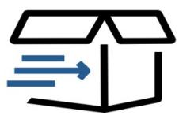
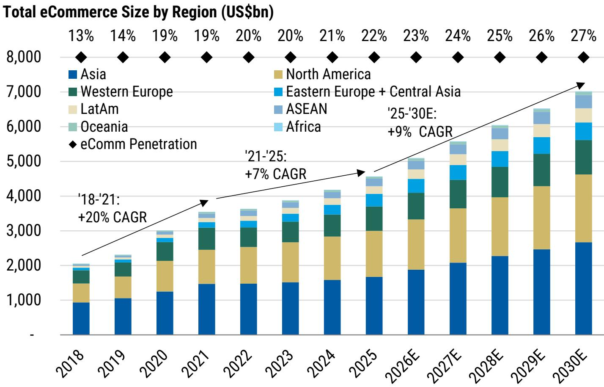
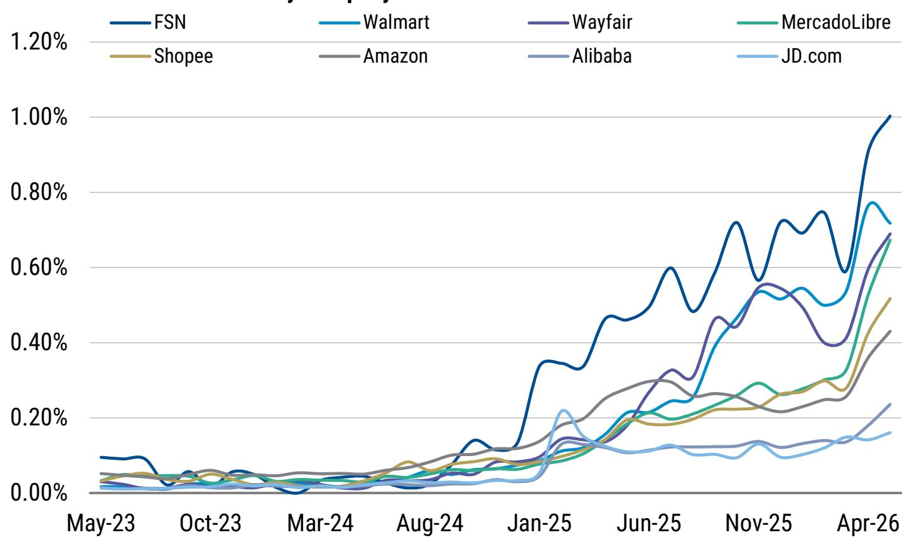
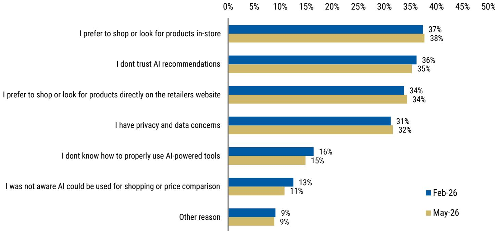

# The Agentic Era: Catalyzing Growth and Innovation

With innovation in discovery & purchase pathways, we see agentic commerce further powering online retail. The sector experienced valuation adjustments amid disruption discussions, but our adoption and incrementality frameworks drive a more constructive view, and we identify platforms positioned to capitalize on the agentic era.

A MS Key Theme of 2026

Agentic commerce can reduce friction and power the secular shift online; our proprietary model shows a US\$7 trillion eCommerce opportunity by 2030, with a +9% CAGR accelerating from +7% 2021-2025 growth. We identified in November that Agentic Shoppers Are Coming: From assisted search to autonomous purchasing, AI-driven commerce agents are increasingly acting as personal digital shoppers, with the ability to research, manage, and ultimately transact online purchases on behalf of consumers. We see this as the next evolution in a three-decade eCommerce path of lower friction, broader supply, faster logistics, and more personalized discovery. What's new inside? We expand our earlier frameworks, now with global agentic sizing & regional developments, incrementality-versus-cost scenarios, and a company scorecard uncovering relative positioning. In our Global eCommerce model (our Industry Model file can be shared upon request), we forecast online gross merchandise value reaching 27% penetration of retail sales in 2030 (22% in 2025). As agentic tools improve the shopping journey, we see scope for higher conversion, greater repeat purchasing, and further penetration gains, particularly as consumers move from AI-assisted discovery toward more automated purchase workflows.

We see >20% of GMV having an agentic influence over the next 5 years, estimating a \~6% TAM uplift as these offerings unlock new eCommerce use cases; company disclosure, AlphaWise data, and incrementality frameworks inform our views. Early adoption is sizable, with 300mn+ customers using Amazon's Rufus (now Alexa for Shopping) and \~140mn for Alibaba's Qwen AI-driven shopping experience (Feb 2026), per company disclosures. AlphaWise survey data show 30% of China consumers used AI to shop for products in the past month, while 24% in Mexico and 12% in Brazil reported past three month usage. In our five-year base case, we see nearly two-thirds of shoppers engaging with agentic commerce, with one-third of their GMV having an AI search & discovery touchpoint, implying >20% of industry GMV is materially agent-influenced. We estimate a smaller subset of \~8% of GMV having a higher level of agent task execution (i.e., basket building, checkout initiation), and \~2% becoming autonomous with agent-to-agent negotiations. Applying different levels of incrementality, higher for more autonomous use cases, we build to a \~6% agentic uplift to the five-year eCommerce TAM, with a \~1.5% to \~15% bear-to-bull range. Our base case annualized impact aligns with our call for +2pp of accelerated industry growth versus 2021-2025 levels, with the industry benefiting from agentic uptake and diffusion of other GenAI initiatives.

We see scaled eCommerce platforms positioned to control much of the agentic journey, contrary to market concerns. Early uplift data and our LLM cost analysis point to an accretive ROI on incremental AI-driven sales. Leading eCommerce platforms have largely favored their own on-site agents and selective discovery partnerships rather than handing over catalogue access, checkout, and customer relationship control to generalized LLMs. We believe this reflects the continued importance of retail fundamentals (i.e., inventory, fulfillment, post-purchase service) in shopping decisions, even in the agentic era. Further, early company disclosures increase our conviction that agentic tools are driving measurable purchase uplifts. Amazon cited Rufus users as 60% more likely to complete a purchase, while Lowe's, Sea, Walmart, Wayfair, and Zalando have each cited higher conversion, order value, or purchase actions from AI-enabled shopping tools. Model expenses are an offsetting consideration, while our cost and uplift analyses show incremental contribution profit covering LLM costs by \~2-3x outside our stress case. This is a favorable setup for platforms that control consumers' AI journeys, while the range of outcomes is wider (with greater downside skew) for those relying more on external traffic.

How to play it? Our scorecard illuminates AMZN, WMT, BABA, MELI, SE, & Allegro as OW calls where multi-factor data plus analyst views indicate favorable positioning for the agentic era... Across our global eCommerce coverage we apply the MS "5 I's" framework (Inventory, Infrastructure, Innovation, Incrementality, Income Statement). Our scorecard blends "5 I's" positioning with metrics across scale, direct engagement, ecosystem assets, agent development, and LLM integration. This provides a data-driven framework mapping agentic positioning and opportunities. Notably, our scorecard shows agentic implementation already taking hold: 17 of 35 screened companies have deployed consumer-facing agents, another 7 are actively working on agents, and catalogue integration with major LLMs is emerging, led by US and Asia-based platforms. Scaled platforms screen favorably, particularly those with direct customer relationships, complementary ecosystem services (i.e., logistics, loyalty), and the ability to spread agent development costs across a broad merchandise base.

… creating opportunity for our favored picks as the eCommerce sector has experienced valuation adjustments in part on agentic disruption discussions. Sector multiples have adjusted near post-pandemic lows. At 2.4x EV/revenue, the eCommerce multiple gap to Nasdaq sits at -2.9x, near historical wide levels as eCommerce multiples compressed -0.5x in the past year. The market is focused on risks including AI model costs, displacement from horizontal agents (i.e., generalized LLMs), and greater uncertainty for smaller and more vertical-specific operators. While early-stage thematic development drives a wider bull-bear skew for companies towards the lower end of our scorecard, we believe scaled platforms face less displacement risk. The top-six companies in our scorecard, ranked by descending market cap and each OW-rated, are Amazon (AMZN), Walmart (WMT), Alibaba (BABA), MercadoLibre (MELI), Sea Limited (SE), and Allegro (ALEP.WA). Across these stocks, we forecast an average +15% GMV CAGR (compared with +12% overall bottom-up GMV growth), +16% revenue CAGR, and +18% EBITDA CAGR from 2025-2028E. The group trades at \~17x 2026E EBITDA and \~13x 2027E EBITDA, with +26% average price target upside. MS analysts highlight five additional OW-rated agentic beneficiaries in the US: Wayfair (W), Shopify (SHOP), Chewy (CHWY), Target (TGT), eBay (EBAY); and six internationally: Meituan (3690.HK), Coupang (CPNG), LY Corp (4689.T), Mercari (4385.T), FSN E-Commerce (FSNE.NS), and Temple & Webster (TPW.AX). We believe further disclosure showing agentic AI-driven uplifts could act as a re-rating catalyst.

Where could we be wrong? Lower direct traffic could weigh on platform economics, and discussions of horizontal agent share gain could prevent multiple re-rating, while the physical aspects of eCommerce are a partial hedge. For eCommerce platforms, a key economic risk is that external agents shift traffic away from direct channels and move retail media dollars into horizontal LLM environments. We find GenAI platforms account for $<0.5\%$ of average eCommerce web traffic today, limiting near-term risk to earnings. However, trading multiple pressure could persist as discussions of horizontal agents inflecting are difficult to disprove. General LLMs' commerce strategies bear monitoring: moves to own the eCommerce stack on-platform risks greater disruption than directing qualified traffic to marketplaces. Yet even if commerce pivots increasingly to horizontal agents, we see the risk more around diluted economics than displacement. Structurally, eCommerce requires the physical movement of goods, including sourcing, fulfillment, delivery, and returns, giving us conviction in the sector's value-add even if the agentic shift proves more disruptive than our base case. While durable pressure to sector trading multiples is a downside risk, we believe the trough starting point drives a favorable skew particularly for our most-preferred names.

Exhibit 1: Key Global eCommerce OW-Rated Calls for the Agentic Era

<table><tr><td rowspan="2">Company</td><td rowspan="2">Ticker</td><td rowspan="2">Last Price</td><td rowspan="2">Price Target</td><td rowspan="2">Upside/Downs.</td><td colspan="2">EV/Revenue</td><td rowspan="2">CAGR 25-28e</td><td colspan="2">EV/EBITDA</td><td rowspan="2">CAGR 25-28e</td></tr><tr><td>2026</td><td>2027</td><td>2026</td><td>2027</td></tr><tr><td colspan="11">Agentic Scorecard Leaders</td></tr><tr><td>Amazon.com Inc</td><td>AMZN.O</td><td>247</td><td>330</td><td>33%</td><td>3.2x</td><td>2.8x</td><td>16%</td><td>11.9x</td><td>8.8x</td><td>30%</td></tr><tr><td>Walmart Inc</td><td>WMT.O</td><td>114</td><td>140</td><td>23%</td><td>1.4x</td><td>1.3x</td><td>5%</td><td>21.4x</td><td>19.8x</td><td>8%</td></tr><tr><td>Alibaba Group Holding</td><td>BABA.N</td><td>112</td><td>180</td><td>60%</td><td>1.5x</td><td>1.4x</td><td>8%</td><td>16.6x</td><td>10.8x</td><td>7%</td></tr><tr><td>Mercadolibre Inc.</td><td>MELI.O</td><td>1,874</td><td>2,450</td><td>31%</td><td>2.2x</td><td>1.8x</td><td>30%</td><td>22.3x</td><td>15.5x</td><td>24%</td></tr><tr><td>Sea Ltd</td><td>SE.N</td><td>109</td><td>130</td><td>19%</td><td>1.9x</td><td>1.6x</td><td>25%</td><td>14.8x</td><td>11.8x</td><td>21%</td></tr><tr><td>Allegro.eu SA</td><td>ALEP.WA</td><td>44</td><td>39</td><td>-12%</td><td>3.7x</td><td>3.2x</td><td>14%</td><td>12.6x</td><td>10.0x</td><td>19%</td></tr><tr><td>Agentic Scorecard Leaders Average</td><td></td><td></td><td></td><td>26%</td><td>2.3x</td><td>2.0x</td><td>16%</td><td>16.6x</td><td>12.8x</td><td>18%</td></tr><tr><td>Agentic Scorecard Leaders Median</td><td></td><td></td><td></td><td>27%</td><td>2.1x</td><td>1.7x</td><td>15%</td><td>15.7x</td><td>11.3x</td><td>20%</td></tr><tr><td colspan="11">US Key Calls</td></tr><tr><td>Shopify Inc</td><td>SHOP.O</td><td>126</td><td>192</td><td>53%</td><td>10.5x</td><td>8.6x</td><td>25%</td><td>73.3x</td><td>56.5x</td><td>34%</td></tr><tr><td>Target Corp</td><td>TGT.N</td><td>134</td><td>150</td><td>12%</td><td>0.7x</td><td>0.6x</td><td>3%</td><td>8.8x</td><td>8.4x</td><td>6%</td></tr><tr><td>eBay Inc</td><td>EBAY.O</td><td>113</td><td>121</td><td>8%</td><td>4.5x</td><td>4.1x</td><td>8%</td><td>18.6x</td><td>15.7x</td><td>13%</td></tr><tr><td>Wayfair Inc</td><td>W.N</td><td>89</td><td>110</td><td>24%</td><td>1.1x</td><td>1.1x</td><td>6%</td><td>29.4x</td><td>23.9x</td><td>23%</td></tr><tr><td>Chewy Inc</td><td>CHWY.N</td><td>20</td><td>42</td><td>106%</td><td>0.6x</td><td>0.5x</td><td>8%</td><td>8.1x</td><td>6.6x</td><td>25%</td></tr><tr><td>US Key Calls Average</td><td></td><td></td><td></td><td>41%</td><td>3.5x</td><td>3.0x</td><td>10%</td><td>27.7x</td><td>22.2x</td><td>20%</td></tr><tr><td>US Key Calls Median</td><td></td><td></td><td></td><td>24%</td><td>1.1x</td><td>1.1x</td><td>8%</td><td>18.6x</td><td>15.7x</td><td>23%</td></tr><tr><td colspan="11">International Key Calls</td></tr><tr><td>Meituan</td><td>3690.HK</td><td>83</td><td>120</td><td>44%</td><td>0.8x</td><td>0.7x</td><td>14%</td><td>NM</td><td>6.8x</td><td>NM</td></tr><tr><td>Coupang Inc</td><td>CPNG.N</td><td>18</td><td>28</td><td>58%</td><td>0.7x</td><td>0.6x</td><td>12%</td><td>NM</td><td>15.1x</td><td>44%</td></tr><tr><td>LY Corporation</td><td>4689.T</td><td>446</td><td>500</td><td>12%</td><td>1.3x</td><td>1.2x</td><td>10%</td><td>6.8x</td><td>6.2x</td><td>7%</td></tr><tr><td>FSN E-Commerce Ventures Ltd</td><td>FSNE.NS</td><td>329</td><td>321</td><td>-2%</td><td>9.4x</td><td>7.4x</td><td>27%</td><td>NM</td><td>NM</td><td>53%</td></tr><tr><td>Mercari</td><td>4385.T</td><td>4,693</td><td>5,000</td><td>7%</td><td>3.3x</td><td>2.9x</td><td>14%</td><td>15.9x</td><td>12.8x</td><td>29%</td></tr><tr><td>Temple &amp; Webster Group Ltd</td><td>TPW.AX</td><td>5</td><td>8</td><td>52%</td><td>0.8x</td><td>0.7x</td><td>11%</td><td>25.7x</td><td>13.4x</td><td>38%</td></tr><tr><td>International Key Calls Average</td><td></td><td></td><td></td><td>24%</td><td>3.1x</td><td>2.5x</td><td>15%</td><td>11.4x</td><td>10.2x</td><td>33%</td></tr><tr><td>International Key Calls Median</td><td></td><td></td><td></td><td>12%</td><td>1.3x</td><td>1.2x</td><td>14%</td><td>11.4x</td><td>9.8x</td><td>36%</td></tr></table>

Source: Factset, Company data, MS estimates.
Note: Pricing as of 7/14/2026

# The Agentic Era: 12 Key Exhibits

Exhibit 2: We see a spectrum of agentic commerce offerings from "agent-influenced" AI search to "agent-executed" proactive basket building. We expect consumer behavior will deepen as comfort increases and technology adoption spreads — with reduced friction further driving the secular shift towards online retail

The Agentic Commerce Spectrum
Agent Roles, Consumer Inputs, and Example Use Cases

  
ASSISTED SEARCH

## RECURRING SUBSCRIPTION

  
ASSEMBLED BASKETS

  
PROACTIVE PURCHASE

  
AUTONOMOUS AGENT

Strictly rules-based

Agent offers advice and suggestions

Agent assembles ready-to-purchase baskets

Agent anticipates needs, executes purchases

Agents negotiate pricing, logistics, and terms with other agents

Consumer sets all guidelines

Consumer leads query, follow-ups, remaining purchase steps

Consumable household products, delivered on a regular interval

Consumer reviews,
authorizes, and executes

Running shoes targeted to the user's needs; replacement parts fitting device specifications

Consumer sets objectives

Outfit and accessories for a special occasion; basket of groceries for a dinner party

Consumer sets aim, budgets, scope

Agent-Executed

Annual birthday gifts for friends/family; regular wardrobe refresh during preferred brand sales

## Agent-Influenced

Bulk office supplies procurement for business; Used goods C2C marketplace purchase

Autonomous

Source: MS

Exhibit 3: Our five-year view implies $>20\%$ of eCommerce volumes are materially influenced by agentic tools. Autonomous uptake is a smaller subset ( $\sim$ LSD% of GMV), but more incremental to the TAM

Agentic Commerce: 5-Year Uptake & Incrementality Scenarios

## 5-Year Uptake

<table><tr><td>% of eCommerce GMV</td><td>Bear</td><td>Base</td><td>Bull</td></tr><tr><td>AI Shopping Penetration</td><td>40%</td><td>65%</td><td>80%</td></tr><tr><td>(x) AI-Influenced Share of Shoppers&#x27; GMV</td><td>25%</td><td>33%</td><td>40%</td></tr><tr><td>Agent-Influenced GMV</td><td>10%</td><td>22%</td><td>32%</td></tr><tr><td>(x) Execution Attach Rate</td><td>20%</td><td>35%</td><td>50%</td></tr><tr><td>Agent-Executed GMV</td><td>2%</td><td>8%</td><td>16%</td></tr><tr><td>(x) Autonomous Attach Rate</td><td>15%</td><td>25%</td><td>30%</td></tr><tr><td>Autonomous GMV</td><td>0.3%</td><td>2%</td><td>5%</td></tr></table>

## Incrementality

% Incrementality
Autonomous
Agent-Executed, but not Autonomous
Agent-Influenced, but not Executed

<table><tr><td>40%</td><td>60%</td><td>80%</td></tr><tr><td>30%</td><td>40%</td><td>50%</td></tr><tr><td>10%</td><td>20%</td><td>30%</td></tr></table>

<table><tr><td>Incrementality to 5-Year TAM</td><td>1.4%</td><td>6.2%</td><td>14.2%</td></tr><tr><td>Annual Growth Impact</td><td>0.3%</td><td>1.2%</td><td>2.7%</td></tr></table>

Source: MS

More consumers will use AI shopping tools over time...
... impacting some, but not all, of their eCommerce purchase journeys.

Of the AI-influenced baskets, a subset will have deeper tool use such as automated basket building, price alert triggers...
... while a further, smaller subset will include autonomous purchases.

Autonomous GMV is most likely to be incremental vs the existing eCommerce TAM...
... and influenced GMV less-so, but still incremental through reduced frictions.

Exhibit 4: We see a \~6% industry 5-year uplift from agentic (>1pp annualized), or \~1.5% to \~15% in our bull-bear range, supporting our call for global eCommerce to accelerate to a +9% '25-'30E CAGR (from +7% in '21-'25) — reaching a \~US\$7.0tn market in 2030  
  
Source: Euromonitor, National Data Sources, MS estimates

Exhibit 5: Companies have begun quantifying uplifts from agentic commerce tools, increasing our conviction that there is measurable traction

<table><tr><td colspan="2">Agentic Commerce Uplift Commentary</td></tr><tr><td>Company</td><td>Commentary</td></tr><tr><td>Amazon</td><td>- 3Q25: “Shoppers using Rufus are 60% more likely to complete a purchase.”- 4Q25: “Rufus helped deliver “nearly $12 billion in incremental annualized sales last year.”</td></tr><tr><td>Lowe&#x27;s</td><td>- 3Q25: “When our customers engage with Mylow online, the conversion rate more than doubles.”- 1Q26: “The conversion rate for online customers who use Mylow is triple that of customers who do not use the tool.”</td></tr><tr><td>Sea</td><td>- 1Q26: “In 1Q26, AI tools supported a 14% uplift in purchase conversion and cut cost per customer service contact by ~30% YoY, with ~80% of queries now handled by chatbots”</td></tr><tr><td>Walmart</td><td>- 1QFY27: “Customers using Sparky have an average order value that’s about 35% higher than non-Sparky customers.”</td></tr><tr><td>Wayfair</td><td>- 3Q25: “Customers who see these designer-quality personalized recommendations are a third more likely to save, add to cart, or order products.”</td></tr><tr><td>Zalando</td><td>- FY25: “Zalando’s precision in matchmaking has already driven a 13% increase in items added to bags.”</td></tr></table>

Source: Company earnings releases & transcripts, MS

Exhibit 6: Balancing incremental gains to sales & conversion, agentic commerce conversations have associated costs (LLM token usage). We see contribution profit uplifts more than covering costs related to LLMs (outside our stress test case), demonstrating the ROI of agentic AI as long as sales are incremental

<table><tr><td colspan="6">Agentic Commerce Cost-Benefit Analysis</td></tr><tr><td rowspan="2"></td><td colspan="3">Interaction Complexity</td><td rowspan="2">Stress Test</td><td rowspan="2"></td></tr><tr><td>Low</td><td>Mid</td><td>High</td></tr><tr><td>Cost per AI-engaged Shopping Session</td><td>$ 0.005</td><td>$ 0.027</td><td>$ 0.240</td><td>$ 0.133</td><td>Each AI-engaged shopping session incurs token cost...</td></tr><tr><td>Conversion %</td><td></td><td></td><td></td><td></td><td></td></tr><tr><td>Baseline Shopping Session</td><td>3.0%</td><td>3.0%</td><td>3.0%</td><td>3.0%</td><td></td></tr><tr><td>AI-Engaged Shopping Session</td><td>4.0%</td><td>5.0%</td><td>10.0%</td><td>5.0%</td><td>... while the agentic uplift likely scales with interaction complexity ...</td></tr><tr><td>Incremental Conversion Uplift</td><td>1.0%</td><td>2.0%</td><td>7.0%</td><td>2.0%</td><td></td></tr><tr><td>LLM Cost Incurred per Incremental Sale Gained</td><td>$ 0.5</td><td>$ 1.3</td><td>$ 3.4</td><td>$ 6.7</td><td></td></tr><tr><td>Average Order Value</td><td>$ 20</td><td>$ 40</td><td>$ 100</td><td>$ 40</td><td>... and correlates with higher-ticket / more-involved purchase decisions.</td></tr><tr><td>x Contribution Margin</td><td>8%</td><td>8%</td><td>8%</td><td>8%</td><td></td></tr><tr><td>Order-Level Contribution Profit (CP)</td><td>$ 1.6</td><td>$ 3.2</td><td>$ 8.0</td><td>$ 3.2</td><td></td></tr><tr><td>Coverage (Incremental CP vs. LLM Cost)</td><td>3.2x</td><td>2.4x</td><td>2.3x</td><td>0.5x</td><td>Outside our stress test, we see CP uplifts well-covering LLM costs.</td></tr></table>

Source: Dynamic Yield, MS

Exhibit 7: A shift towards paid traffic (and an associated loss of retail media dollars) risks weighing on profitability. LLM-driven traffic is ramping, but still represents a small (<0.5% average) share of eCommerce platforms' web traffic today

Gen AI as % of Total Traffic by Company  
  
Source: SimilarWeb, MS

Exhibit 8: For additional agentic risks, trust/privacy concerns plus legacy shopping preferences could drive slower uptake than we forecast

Reasons for Not Using AI-Tools to Shop, Research, Compare Prices (Among Non-Users)  
  
Source: AlphaWise, MS

Exhibit 9: How to play it? Our 5 I's framework, extended globally, highlights relative positioning for the opportunities and risks of the agentic commerce era...

<table><tr><td colspan="7">MS&#x27;s 5 I&#x27;s Agentic Commerce Framework</td></tr><tr><td>Company</td><td>Inventory</td><td>Infrastructure</td><td>Innovation</td><td>Incremental Growth Opp.</td><td>Income Statement / Mg Impact</td><td>Total</td></tr><tr><td colspan="7">North America</td></tr><tr><td>Wayfair</td><td>5</td><td>5</td><td>5</td><td>3</td><td>5</td><td>23</td></tr><tr><td>Walmart</td><td>5</td><td>5</td><td>5</td><td>5</td><td>2</td><td>22</td></tr><tr><td>Amazon</td><td>5</td><td>5</td><td>5</td><td>4</td><td>2</td><td>21</td></tr><tr><td>Shopify</td><td>4</td><td>2</td><td>5</td><td>4</td><td>4</td><td>19</td></tr><tr><td>eBay</td><td>5</td><td>3</td><td>4</td><td>4</td><td>3</td><td>19</td></tr><tr><td>Revolve</td><td>3</td><td>2</td><td>4</td><td>4</td><td>4</td><td>17</td></tr><tr><td>Chewy</td><td>2</td><td>4</td><td>3</td><td>2</td><td>5</td><td>16</td></tr><tr><td>Etsy</td><td>2</td><td>2</td><td>3</td><td>5</td><td>4</td><td>16</td></tr><tr><td>FIGS</td><td>5</td><td>2</td><td>1</td><td>2</td><td>4</td><td>14</td></tr><tr><td>Target</td><td>3</td><td>3</td><td>1</td><td>3</td><td>1</td><td>11</td></tr><tr><td colspan="7">Latam</td></tr><tr><td>MELI</td><td>4</td><td>5</td><td>4</td><td>5</td><td>3</td><td>21</td></tr><tr><td>Magalu</td><td>2</td><td>4</td><td>3</td><td>3</td><td>4</td><td>16</td></tr><tr><td>Walmex</td><td>3</td><td>4</td><td>2</td><td>2</td><td>4</td><td>15</td></tr><tr><td>Casas Bahia</td><td>1</td><td>4</td><td>2</td><td>2</td><td>4</td><td>13</td></tr><tr><td colspan="7">EMEA</td></tr><tr><td>Allegro</td><td>2</td><td>3</td><td>4</td><td>3</td><td>3</td><td>15</td></tr><tr><td>Kaspi</td><td>2</td><td>3</td><td>4</td><td>3</td><td>3</td><td>15</td></tr><tr><td>Zalando</td><td>2</td><td>4</td><td>3</td><td>2</td><td>3</td><td>14</td></tr><tr><td colspan="7">APAC</td></tr><tr><td>Alibaba</td><td>5</td><td>5</td><td>4</td><td>4</td><td>3</td><td>21</td></tr><tr><td>Shopee</td><td>5</td><td>5</td><td>4</td><td>4</td><td>3</td><td>21</td></tr><tr><td>Meituan</td><td>5</td><td>5</td><td>3</td><td>4</td><td>3</td><td>20</td></tr><tr><td>Coupang</td><td>5</td><td>5</td><td>3</td><td>3</td><td>4</td><td>20</td></tr><tr><td>FSN</td><td>5</td><td>3</td><td>4</td><td>4</td><td>4</td><td>20</td></tr><tr><td>MonotaRo</td><td>4</td><td>5</td><td>2</td><td>4</td><td>4</td><td>19</td></tr><tr><td>Meesho</td><td>5</td><td>2</td><td>3</td><td>4</td><td>4</td><td>18</td></tr><tr><td>JD.com</td><td>4</td><td>5</td><td>3</td><td>3</td><td>3</td><td>18</td></tr><tr><td>TPW</td><td>4</td><td>3</td><td>3</td><td>4</td><td>4</td><td>18</td></tr><tr><td>Pinduoduo</td><td>4</td><td>3</td><td>4</td><td>4</td><
