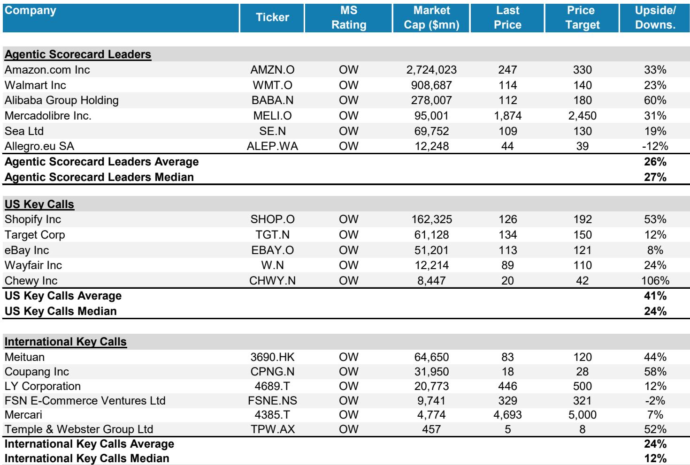
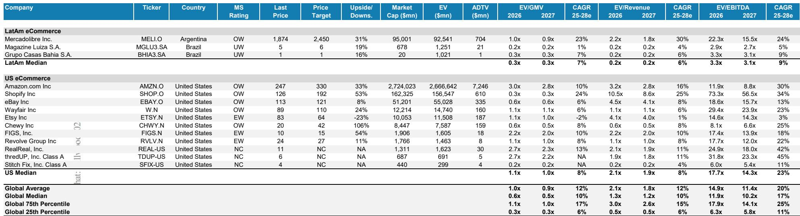
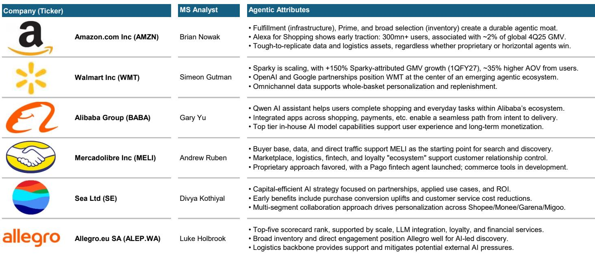

# Agentic Commerce Will Accelerate eCommerce Growth, Not Disrupt It

The eCommerce sector has seen its valuation multiples compress to near post-pandemic lows, with the EV/revenue gap to the Nasdaq reaching -2.9x. This compression reflects a market narrative focused on disruption: that AI-powered shopping agents will displace platforms, commoditize customer relationships, and compress margins under the weight of LLM costs. That narrative is wrong. A new analytical framework built on adoption trajectories, incrementality economics, and platform positioning reveals the opposite: agentic commerce is poised to accelerate the secular shift online, adding roughly 6% to the total addressable market and driving a +9% CAGR in global eCommerce gross merchandise value to US$7 trillion by 2030, up from a +7% CAGR in the prior five-year period.

The core tension is between what the market fears and what the data show. Over 300 million consumers are already using Amazon's Rufus, and roughly 140 million are engaging with Alibaba's Qwen-powered shopping experience. AlphaWise survey data indicate that 30% of Chinese consumers used AI to shop in the past month, with 24% in Mexico and 12% in Brazil doing so in the past three months. These are not experimental figures; they represent a behavioral shift already underway. The market's concern that generalized LLMs will become horizontal shopping agents that bypass platforms overlooks a critical structural reality: eCommerce requires the physical movement of goods. Sourcing, fulfillment, delivery, and returns remain the un-commoditizable foundation of the industry. Agents can recommend, but they cannot ship.

This is not a disruption story. It is an acceleration story, and the companies best positioned to capture it are the scaled platforms that already own the customer relationship, the logistics infrastructure, and the data. The analytical question for observers is not whether agentic commerce will happen, but which platforms will control the agentic journey and whether the economics work.

## Scaled eCommerce Platforms, Not Generalist LLMs, Will Control the Agentic Shopping Journey

The market's default assumption has been that AI agents function as intermediaries, directing consumers to the best deal regardless of platform. This assumption underlies fears of disintermediation and traffic loss. But the early evidence points in the opposite direction. Leading eCommerce platforms have overwhelmingly chosen to build their own on-site agents and pursue selective discovery partnerships rather than hand over catalogue access, checkout control, and customer relationship management to generalized LLMs. This is a strategic choice rooted in the continued importance of retail fundamentals. Even in an agentic world, shopping decisions depend on inventory availability, fulfillment speed, return policies, and post-purchase service. An external agent cannot guarantee delivery times or manage stockouts; a platform can.

The data support this positioning. Company disclosures show that 17 of 35 screened eCommerce companies have already deployed consumer-facing agents, with another seven actively developing them. The platforms that score highest on agentic readiness share three characteristics: direct customer relationships, complementary ecosystem services such as logistics and loyalty programs, and the ability to spread agent development costs across a broad merchandise base. These are not the attributes of generalist LLMs. They are the attributes of Amazon, Walmart, Alibaba, MercadoLibre, Sea Limited, and Allegro. The top six companies in the agentic scorecard, each rated favorably, are precisely those with the scale and infrastructure to make agentic commerce an extension of their existing moats rather than a threat to them.

The implication for observers is clear. The market is pricing disruption risk broadly across the sector, but that risk is not evenly distributed. Scaled platforms face less displacement risk than smaller, vertical-specific operators. The bull-bear skew is wider for companies at the lower end of the scorecard. For the leaders, the agentic era represents an opportunity to deepen engagement and increase wallet share, not a threat to their business model.

## Early Adoption Data and Incrementality Economics Confirm That Agentic Tools Drive Measurable Purchase Uplift

Skepticism about agentic commerce has centered on whether AI tools actually change consumer behavior or merely add a layer of novelty. The early company disclosures answer this question decisively. Amazon reported that Rufus users are 60% more likely to complete a purchase. Lowe's, Sea, Walmart, Wayfair, and Zalando have each cited higher conversion rates, increased order values, or stronger purchase actions from AI-enabled shopping tools. These are not aspirational claims; they are operational metrics from companies with billions of dollars of commerce volume.

The mechanism is intuitive. Agentic tools reduce friction at multiple points in the purchase journey. They accelerate discovery by understanding natural language queries. They reduce search costs by aggregating and comparing options. They facilitate repeat purchasing by learning preferences over time. The result is higher conversion on existing traffic and, critically, the unlocking of new use cases that were previously too cumbersome for manual browsing. This is where the incrementality argument becomes central.

The analytical framework distinguishes three levels of agentic influence. The broadest layer is AI-assisted discovery, where agents help consumers find products but do not execute transactions. The report projects that nearly two-thirds of shoppers will engage with this layer within five years, with one-third of their GMV having an AI touchpoint, implying over 20% of industry GMV becomes materially agent-influenced. A smaller subset, roughly 8% of GMV, will involve agent task execution such as basket building and checkout initiation. The most advanced layer, autonomous agent-to-agent negotiations, remains small at approximately 2% of GMV. Each layer carries a different incrementality factor, with more autonomous use cases generating higher incremental sales. Aggregating these layers produces a roughly 6% uplift to the five-year eCommerce TAM, with a bear-to-bull range of 1.5% to 15%.

The cost side of the equation reinforces the constructive view. LLM inference costs are a real expense, but the incremental contribution profit from agent-driven sales covers those costs by approximately 2-3x outside of stress scenarios. This is a favorable setup for platforms that control the consumer's AI journey. For platforms that rely more heavily on external traffic, the range of outcomes is wider and the downside risk greater.

## A Five-Factor Decision Framework Maps Agentic Positioning Across the Global eCommerce Landscape

To translate these insights into analytical decisions, a structured framework is necessary. The analysis applies a five-factor model that captures the dimensions most relevant to agentic commerce success. The first factor is inventory: platforms with deep, diverse, and well-managed catalogues are better positioned to satisfy agent-driven queries without frustrating consumers. The second is infrastructure: logistics, fulfillment, and returns capabilities determine whether a platform can execute on the promises made by an agent. The third is innovation: the quality of the platform's own agent development, its LLM integration, and its willingness to invest in AI capabilities. The fourth is incrementality: the degree to which agentic tools generate net new sales rather than simply cannibalizing existing channels. The fifth is income statement: the ability to generate positive ROI from agent-driven sales after accounting for LLM costs.

When applied across 35 global eCommerce companies, this framework produces a clear hierarchy. The top scorers are the scaled, diversified platforms with direct consumer relationships. Amazon leads, reflecting its combination of massive catalogue, owned logistics, and early agent deployment. Walmart scores highly on infrastructure and incrementality. Alibaba benefits from its ecosystem breadth and early AI integration in China. MercadoLibre and Sea Limited bring regional leadership with strong logistics and payment ecosystems. Allegro holds a strong position in Central and Eastern Europe.

The framework also identifies a second tier of favorably rated beneficiaries. In the US, these include Wayfair, Shopify, Chewy, Target, and eBay. Internationally, Meituan, Coupang, LY Corporation, Mercari, FSN E-Commerce, and Temple & Webster score as attractive. These companies have varying degrees of scale and agentic readiness, but each possesses specific assets that position them to capture agentic tailwinds within their respective verticals or geographies.

The aggregate picture is compelling. Across the six scorecard leaders, the average projected GMV CAGR from 2025 to 2028 is 16%, compared with 12% for the broader bottom-up eCommerce universe. Revenue growth averages 16%, and EBITDA growth averages 18%. The group trades at roughly 17x 2026 estimated EBITDA and 13x 2027 estimated EBITDA, representing valuations for companies with accelerating growth profiles.

## The Economic Risk Is Not Displacement but Dilution, and the Starting Valuation Creates a Favorable Asymmetry

No analytical framework is complete without a rigorous examination of downside scenarios. The most coherent bear case is not that agentic commerce fails, but that it succeeds in a way that shifts economic value away from platforms. The specific risk is that external agents capture consumer mindshare and direct traffic to the lowest-cost provider, eroding the direct traffic that platforms monetize through retail media and high-margin first-party sales. In this scenario, platforms become commoditized fulfillment utilities while the AI layer captures the economic surplus.

This risk is real but manageable for several reasons. First, the current data show that general LLMs account for less than 0.5% of average eCommerce web traffic. The near-term earnings impact is negligible. Second, even if horizontal agents gain share, the structure of eCommerce economics suggests dilution rather than displacement. Platforms would still earn fulfillment fees, marketplace commissions, and advertising revenue from agent-directed traffic. The margin compression would be real but not existential. Third, the physical aspects of eCommerce remain a structural hedge. No agent can make a delivery or process a return. The value chain has irreducible physical components that platforms control.

The more immediate risk is that trading multiple pressure persists even as fundamentals improve. Fear of horizontal agent inflection is difficult to disprove in real time, and the market may maintain a discount on the sector until clearer evidence of platform resilience emerges. This creates an uncomfortable but potentially constructive dynamic: improving earnings power combined with compressed valuations. The trough starting point drives a favorable skew, particularly for the most preferred names. Further disclosure showing measurable agentic uplift could act as a re-rating catalyst, and the early data from Amazon, Lowe's, and others suggest that such disclosure will continue to accumulate.

The analytical conclusion is that the market has mispriced the agentic transition. It has treated a broad-based acceleration of eCommerce as a narrow threat to platform economics. The data, the frameworks, and the early company disclosures all point in the opposite direction. Agentic commerce will increase the total addressable market, improve conversion rates, and deepen consumer engagement. The platforms that control the customer relationship, the logistics infrastructure, and the agent development will be the primary beneficiaries. The sector's current valuation embeds a disruption premium that the evidence does not support. The asymmetry favors those who can look through the near-term noise and recognize the structural acceleration underway.

*For informational purposes only. Portions may be generated, translated, summarized, or edited with AI assistance based on source materials and may contain omissions or errors. Please verify independently. This is not professional advice.*

For informational purposes only. Portions may be generated, translated, summarized, or edited with AI assistance based on source materials and may contain omissions or errors. Please verify independently. This is not professional advice.

