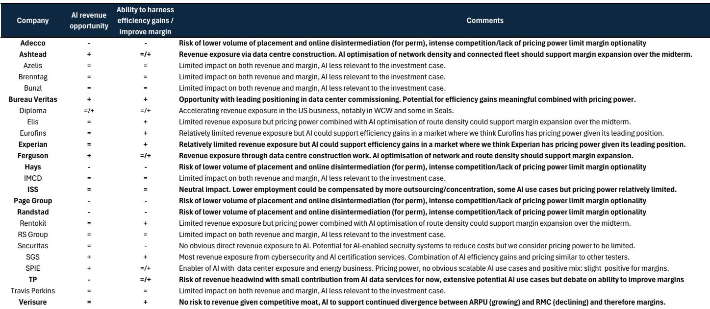
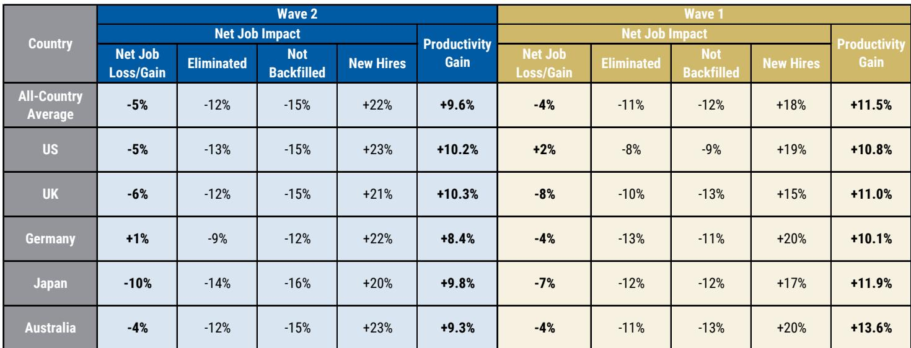
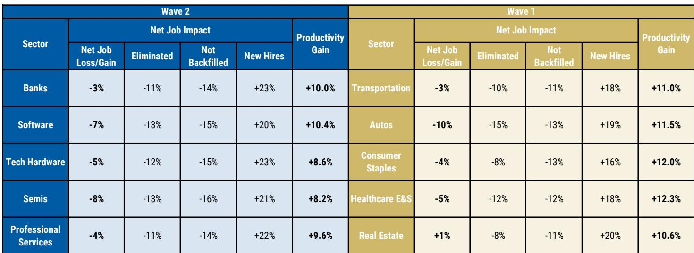

# MS：全球主题-北美AI采用与未来工作行业深度研究

MS在2026年4月完成的第二轮AlphaWise调查覆盖了美国、英国、德国、日本和澳大利亚的银行、软件、科技硬件、半导体和专业服务五个行业，共808家企业。调查的核心发现是：AI在过去12个月驱动了平均5%的净岗位流失，同时带来了9.6%的生产率提升。但更值得关注的不是这些平均数，而是行业之间的结构性分化——银行、科技硬件与半导体成为净受益者，而软件和专业服务则面临更复杂的竞争格局。

这份报告的价值在于，它从“AI是否影响就业”的定性判断，推进到了“哪些业务模式会被重塑、哪些公司能守住定价权”的定量分析。

## 1. 银行与科技硬件是净受益者，软件与专业服务面临分化

调查数据显示，五个行业的净岗位流失率在3%到8%之间，但MS分析师对每个行业的判断并不相同。对于银行，分析师认为实际岗位削减幅度会高于调查显示的4%净流失率——欧洲银行中期可能削减10-20%的员工，调查数据只是早期信号。银行将AI用于IT、财务、客服和运营，而非前台岗位替代，因此AI被视为成本与运营杠杆的机会。

科技硬件与半导体受益于双重逻辑：AI既提升了自身运营效率，又创造了芯片与基础设施的增量需求。欧洲企业已在预测性维护、良率优化和AI辅助设计等领域扩大应用。

软件行业的生产率提升最明显，达到10.4%，但净岗位流失也最高（7%）。分析师认为，能够结合专有数据、嵌入工作流并实现有效AI变现的公司才是最大受益者。专业服务的情况类似，最持久的价值创造来自将AI嵌入核心运营基础设施，而非孤立的任务自动化或裁员。

> **KC评论：** 调查中“净岗位流失”的计算方式是“裁员+不补缺-新招聘”，5%的净流失背后是12%的裁员、15%的不补缺和22%的新招聘同时发生。这意味着企业并非简单裁员，而是在用AI重新配置人才结构——淘汰旧岗位的同时创造新岗位，但总量在调整。

## 2. 2至5年经验员工受冲击最大，离岸岗位首当其冲

调查按工作年限细分了岗位变动情况。2至5年工作经验的员工在裁员（18%）、不补缺（19%）和新招聘（21%）三个指标上都是最高值。6至10年经验的员工紧随其后。而超过30年经验的员工在所有指标上都只有3%的变动幅度。

这一分布揭示了一个关键机制：AI替代的不是最资深的决策者，也不是最基础的执行层，而是中间层——那些从事可编码、可流程化工作的经验型岗位。企业正在用AI工具替代这部分人力，同时将释放的资源重新投向更高级的分析和策略岗位。

离岸和合同制员工受到的影响更大。在银行和软件行业，离岸岗位的冲击指数分别达到2.24（5分制），显著高于永久雇员。这意味着AI替代首先发生在成本敏感、可远程替代的环节。

## 3. 生产率提升集中在IT与客服，未来预期更强

调查显示，IT/软件开发是生产率提升最显著的领域，其次是客户服务和财务运营。这一分布与岗位变动数据高度一致：AI最先替代和增强的正是这些环节。

值得注意的预期变化：企业预计未来12个月的生产率提升将更强，尤其在德国、日本以及半导体和专业服务行业。日本在第二轮调查中净岗位流失达到10%，是所有国家中最高的，但企业仍对AI驱动的效率改进保持乐观。这暗示日本企业可能正在经历更激进的岗位结构调整，以换取长期效率提升。

## 4. 一个可复用的观察框架：专有数据、嵌入工作流与定价权

MS分析师在软件和专业服务两个行业反复强调同一组判断标准：能够结合专有数据、嵌入客户工作流并拥有定价权的公司，在AI转型中处于更有利位置。

这一框架可以推广到其他行业。在银行，拥有客户关系数据和合规流程嵌入能力的机构，AI带来的成本节约更可能转化为利润而非价格战。在科技硬件，芯片设计和制造工艺的专有数据本身就是护城河。在专业服务，审计、测试和咨询公司如果只是将AI用作效率工具，而未能将其嵌入核心服务交付流程，就可能面临客户压价。

调查中有一个容易被忽略的信号：标普500公司中讨论AI对劳动力影响的占比，从一年前的约6%上升到2026年第二季度的约10%，而在MS定义的“AI采用者”样本中这一比例达到18%。讨论内容正从“自动化”转向“收入与员工数脱钩”——企业开始明确追求人均产出的提升而非单纯裁员。这一转变意味着，AI对就业的影响将从“数量减少”进入“结构重塑”阶段。

For informational purposes only. Portions may be generated,translated,summarized,or edited with AI assistance based on source materials and may contain omissions or errors. Please verify independently. This is not investment,legal,tax,accounting,or other professional advice.

For informational purposes only. Portions may be generated,translated,summarized,or edited with AI assistance based on source materials and may contain omissions or errors. Please verify independently. This is not investment,legal,tax,accounting,or other professional advice.

