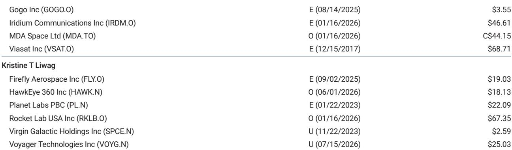
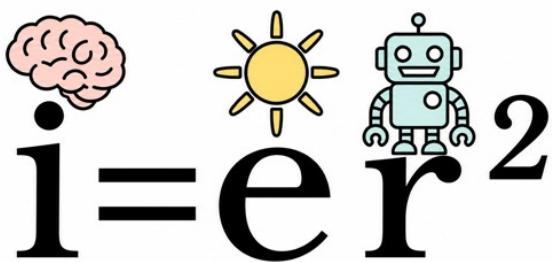

# SpaceX Is Not a Rocket Company: It Is an Intelligence Conversion Machine

The most thought-provoking idea in a recent research report on SpaceX is not about Starship's payload capacity or Starlink's subscriber count. It is a single equation: $i = er^{2}$, where intelligence equals energy multiplied by robots squared. This formula reframes SpaceX's entire business model as a process of converting energy into intelligence at maximum density, minimum capital cost, and minimum time. The report assigns a value of $300 per share, implying a total equity value that allocates $152—over half—to enterprise AI alone, with connectivity contributing $128 and space operations a mere $8. That allocation is the core thesis. The market has been debating whether SpaceX is overvalued as a launch provider or undervalued as a telecom. The correct framing is that SpaceX is neither. It is an intelligence infrastructure company whose competitive advantage can be measured by three nested quotients that no competitor has yet matched in combination.

The report's framework begins with a universal observation: all life, organic and inorganic, converts energy into intelligence. A microprocessor does it. A data center does it. A rocket does it. The human brain runs on 20 watts. The difference between companies is not whether they perform this conversion but how efficiently they do it. SpaceX's distinction lies in its application of first-principles engineering to three specific ratios: intelligence per watt, intelligence per watt per dollar, and intelligence per watt per dollar per second. These are not abstract metrics. They are the operating system for evaluating whether SpaceX can sustain its valuation premium.

---

## SpaceX's Vertical Integration Creates an Unmatched Intelligence-per-Watt Advantage That No Launch Competitor Can Duplicate

The first quotient, intelligence per watt, measures the energy density of intelligence. For SpaceX, this is not merely about building more efficient rockets. It is about controlling the entire stack from chip design to orbital infrastructure. The report identifies specific drivers: access to more efficient chip architecture, optimized gateways and routing software, and an architecture that compresses the distance between data center and edge terminal. Elon Musk's manufacturing mantra—"the best part is no part"—translates directly into compute efficiency. If the best token is no token, then the most intelligent system is the one that generates the required output with the least energy consumption.

SpaceX's advantage here is structural. Traditional aerospace companies source chips from suppliers, integrate them into payloads built by subcontractors, and launch on vehicles they do not fully control. SpaceX designs its own chips, builds its own satellites, operates its own launch vehicles, and runs its own ground network. Each layer of the stack can be optimized for the others. A Starlink satellite can be redesigned to reduce power draw because the launch cost is internal. The routing software can be rewritten to minimize latency because the satellite constellation is proprietary. No competitor can replicate this integration without rebuilding the entire company from scratch. The intelligence-per-watt gap is not a temporary lead. It is a moat.

---

## The Intelligence-per-Watt-per-Dollar Quotient Reveals Why SpaceX's Capital Efficiency Drives a Self-Reinforcing Data Loop

The second quotient layers capital efficiency onto energy efficiency. Two companies with identical intelligence per watt will create very different value if one requires twice the capital to achieve it. SpaceX's advantage here comes from design simplification, manufacturing scale, and most critically, the ability to capture operational data and feed it back into the production process. The report describes this as a recursive loop: data informs software, software informs hardware, hardware informs the manufacturing plant, and the plant generates new data.

This is not theoretical. SpaceX has demonstrated the ability to iterate rapidly on Starlink satellite design, reducing cost per unit with each generation while improving performance. The same pattern applies to Starship. Each test flight generates terabytes of telemetry that inform the next design iteration. The company does not need to wait for a five-year development cycle. It can test, learn, and rebuild in months. The capital efficiency comes from compressing the feedback loop. A competitor that launches once a year generates one data point. SpaceX generates dozens. Over time, the cumulative advantage in learning rate translates into a cumulative advantage in cost per unit of intelligence. The report's $152 enterprise AI valuation depends on this dynamic scaling beyond connectivity into general-purpose AI infrastructure.

---

## Time-to-Intelligence Is the Most Underappreciated Competitive Dimension, and SpaceX's Vertical Integration Compresses It to an Industry-Minimum

The third quotient adds time to the equation. Two companies with identical intelligence per watt per dollar will create different value if one can deliver the same output in half the time. The report introduces the concept of "time-of-flight computing"—not just how fast the processor runs, but how quickly the entire system can convert energy into useful intelligence at the right place and time.

SpaceX's vertical integration is the key enabler. When the company decides to deploy a new AI capability at the edge, it does not need to negotiate with a satellite manufacturer, a launch provider, and a ground station operator. It controls every step. The report notes that as traditional compute moves toward quantum architectures, each second of improvement in time to power will separate winning companies from losing ones. SpaceX's ability to launch its own infrastructure on its own timeline gives it a temporal advantage that competitors cannot match. A rival that needs to book a launch slot on a third-party rocket faces a queue measured in years. SpaceX can manifest a payload on the next flight.

This temporal density of intelligence has direct implications for enterprise AI. If AI workloads increasingly move to the edge—autonomous vehicles, industrial robotics, defense systems—then the company that can deploy the most capable compute infrastructure fastest wins the customer. SpaceX's Starlink constellation is not just a communications network. It is a distributed compute platform that can be upgraded in orbit. The report's enterprise AI valuation of $152 assumes that this capability will be monetized not just through connectivity subscriptions but through higher-margin AI services delivered at the edge.

---

## Company Trajectory Update

The report's sum-of-the-parts valuation breaks down as follows: space operations at $8, connectivity at $128, X and Grok at $12, and enterprise AI at $152. The implied total of $300 against a current share price of $135 suggests roughly 120 percent upside. But the distribution of value tells the real story. The space segment—launch services—is valued at essentially zero relative to the total. The connectivity segment, Starlink, is valued at roughly 40 percent of the total. Enterprise AI is valued at over 50 percent.

Three assumptions underpin this valuation. First, that Starlink will achieve sufficient scale and pricing power to generate the cash flows implied by a $128 valuation. The report assumes a terminal growth rate of 4.5 percent for connectivity, which requires sustained subscriber growth and enterprise adoption. Second, that SpaceX's enterprise AI business will overcome a 50 percent execution risk discount applied by the analyst. This discount acknowledges that the company has not yet proven it can monetize AI at scale outside of its own infrastructure. Third, that the X and Grok segment—Musk's social media and AI chatbot ventures—will contribute meaningfully but not dominantly to the total.

The most aggressive assumption is the enterprise AI valuation. It implies that SpaceX will become a significant player in the AI infrastructure market, competing with cloud providers and data center operators. The report's logic is that SpaceX's unique combination of compute, connectivity, and launch capability creates a platform that no cloud provider can replicate. Whether this thesis holds depends on execution. The risks are clearly stated: slower Starship reuse cadence, weaker enterprise AI monetization, higher capital costs per watt of compute, and longer time to power. Each of these risks could compress the valuation multiple significantly.

---

## A Decision Framework for Observers: Evaluate SpaceX Along Three Axes of Intelligence Conversion Efficiency

For those evaluating SpaceX as a potential holding, the report provides a structured framework. The three quotients—intelligence per watt, intelligence per watt per dollar, and intelligence per watt per dollar per second—can be used to benchmark the company against competitors and to identify the leading indicators that will determine whether the thesis plays out.

On intelligence per watt, the key metric to track is the power consumption of Starlink terminals and satellites relative to throughput. If SpaceX can demonstrate declining watts per bit over time, the energy density advantage is real. On capital efficiency, the metric is cost per satellite and cost per launch. If Starship achieves rapid reusability, the capital cost per unit of deployed intelligence will collapse. On time efficiency, the metric is launch cadence and satellite production rate. If SpaceX can sustain a launch tempo that competitors cannot match, the temporal advantage compounds.

The report's terminal growth rate assumptions—4.0 percent for space, 4.5 percent for connectivity, 3.0 percent for X and Grok, and 5.0 percent for enterprise AI—provide a baseline for sensitivity analysis. An observer who believes enterprise AI will grow faster than 5 percent should assign a higher valuation. An observer who believes the execution risk discount should be larger should assign a lower one. The framework does not dictate an answer. It provides the structure for asking the right questions.

The most important insight is that SpaceX's value cannot be understood by analyzing launch costs or subscriber numbers in isolation. The company is optimizing for a single objective: converting energy into intelligence faster, cheaper, and more efficiently than any organization on Earth. If that objective is the correct one, the upside is significant. If it is not, the downside is equally large. The equation $i = er^{2}$ is a metaphor. But the strategy it represents is real, and it is the only framework that makes sense of SpaceX's valuation.

*For informational purposes only. Portions may be generated, translated, summarized, or edited with AI assistance based on source materials and may contain omissions or errors. Please verify independently. This is not professional advice.*

For informational purposes only. Portions may be generated, translated, summarized, or edited with AI assistance based on source materials and may contain omissions or errors. Please verify independently. This is not professional advice.

