# 宏观环境周报：市场结构持续扩散，指数区间整理

我们的市场结构扩散观点持续得到验证，指数在前期领涨板块调整的背景下呈现区间整理特征。这种领涨板块的切换趋势可能延续，并可能导致主要指数在后续阶段进一步整固。建议关注企业盈利质量层面的因子表现。

- **市场结构扩散观点持续验证...** 等权重标普500指数持续跑赢市值加权标普500指数，而可选消费品和交通运输板块在过去两个月内均跑赢标普500指数12个百分点。我们持续观察到来自中位数股票盈利增长加速、人工智能应用范围扩大、原油价格预期走低以及美联储维持当前政策立场的支撑。

- **...半导体板块表现相对偏弱...** 一个月前，我们曾指出动量交易及半导体板块可能面临回调，原因是盈利修正广度达到历史极端水平、价格行为呈现大宗商品类波动特征，且持仓日益集中并受杠杆驱动。尽管考虑到半导体板块已出现超过20%的调整，我们不排除其出现技术性反弹的可能性，但我们仍预计下半年市场领涨格局将扩散至该板块之外，覆盖更广泛的行业领域。换言之，动量交易的平仓正在推动资金流向盈利修正强劲但尚未被充分定价的领域——尤其是可选消费品和交通运输板块。

- **未来数月我们仍偏好超大规模企业而非半导体...** 尽管如此，我们承认在短短三周内相对表现已接近30%的背景下，当前的风险回报比吸引力有所下降。虽然我们的因子研究显示市场正重新关注资本支出纪律，但我们认为超大规模企业已提前反映了这一转变以及市场对资本支出增速见顶的关注。此外，这些企业通过其强大的核心业务、在代理应用层的领导潜力以及尚未被充分认识的成本效率杠杆，仍保有引人注目的人工智能期权价值。随着人工智能周期的演进，我们预计不同人工智能受益者之间的相对表现将持续轮动，这与过去几年观察到的模式一致。

---

## 市场结构扩散持续，指数区间整理

自5月发布年中展望以来，我们一直主张市场结构扩散趋势将重新显现，其驱动力来自持续的强劲盈利表现，以及我们对油价将下跌并进而缓解市场对美联储加息担忧的预期。此后，尽管近期出现波动，但油价已从4月高点显著回落。与此同时，我们偏好的周期性行业——可选消费品和交通运输——的平均股价表现再次领先。以下是过去两个月支撑我们市场结构扩散观点的关键驱动因素：

1. 自疫情后复苏以来，中位数股票盈利增长出现了最为显著的加速（中等两位数增长），这得益于正经营杠杆的回归。
2. 半导体板块表现相对偏弱，因其盈利修正广度达到了上行极端水平。
3. 尽管近期有所反弹，但我们预计未来数月油价将走低。我们最早在4月该大宗商品见顶时讨论了这一观点。
4. 人工智能应用带来的顺风正在获得动力，但其影响尚未被充分认识。标普500指数中有25%的公司正从人工智能应用中看到可量化的收益，而一年前这一比例为14%。
5. 美联储今年维持政策不变，这与债券市场对加息的预期形成对比。

我们观点在短期内面临的主要风险是，动量交易的平仓演变为更显著的去杠杆化，从而导致整体避险环境。此外，任何去杠杆化都可能因当前流动性仅处于"充足"而非"充裕"水平而加剧。这带来了风险，因为对流动性的需求正以快速速度增长，这源于创纪录的股权和债务（主权和企业信贷）发行，这些资金正被用于资本支出——即资本不再仅仅流入金融资产，也流入实体经济。最终，我们认为美联储和财政部将对流动性短缺带来的任何压力做出回应，但这可能以更具反应性而非主动性的方式出现。

图表1：市场结构扩散在暂停后已恢复。我们认为这一趋势将持续。
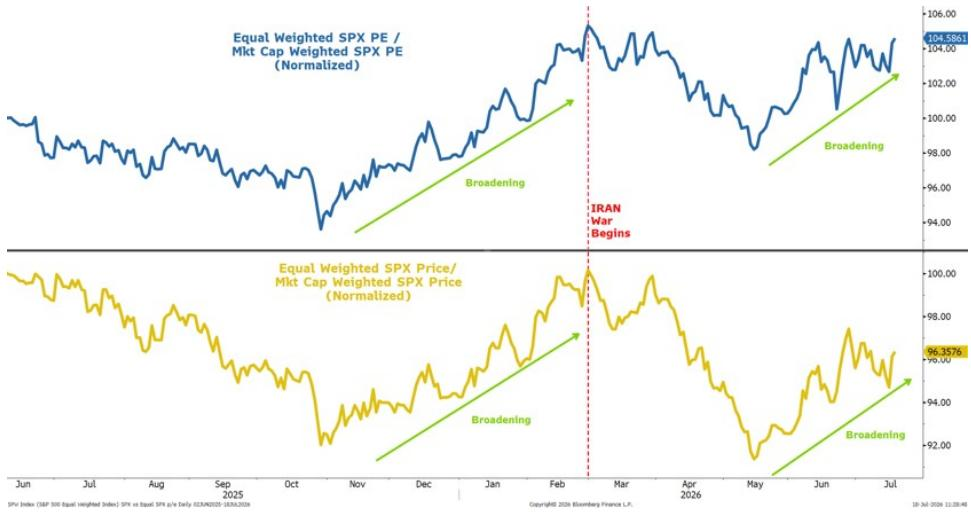
来源：彭博，MS

上文讨论的第二点——半导体板块近期的相对偏弱表现——是近期读者讨论最多的话题。6月初，我们首次阐述了为何动量交易及存储芯片股尤其可能出现有意义的调整（《一次健康的调整》）。我们随后指出，半导体板块的盈利修正广度已达到历史极端水平，并可能出现均值回归。我们现在可以确认，半导体板块的盈利修正广度正开始从这些极端水平回落（图表2）。除了过去一个月我们关于此话题的笔记外，请参阅上周Shawn Kim（Shawn是我们亚洲和欧洲科技硬件及半导体领域的首席分析师）关于存储芯片股的笔记，该笔记支持我们的观点（见下文图表4，摘自其笔记）。此外，我们强调了存储芯片的大宗商品类特征及其与白银股的价格类比，两者似乎相当接近。6月，我们的量化策略团队强调了做多动量及全球半导体交易中的显著杠杆，这也起到了一定作用。

时至今日，半导体板块的盈利修正广度已如我们所述开始从历史极端水平放缓，价格表现继续与白银股类比紧密吻合（图表3）。这一类比暗示半导体板块在短期内可能还有约15%的下行空间。我们认为，一旦低点确立，半导体板块出现可交易性反弹是合理的，但我们并不确信它们能在今年下半年重拾领涨地位。相反，我们认为市场结构扩散仍有空间，一旦本轮调整结束，更广泛的行业群体将在年底前引领市场走高。就标普500指数而言，自市场结构扩散趋势重新显现以来的两个月里，该指数一直在进行区间整理。这与我们的想法一致，即轮动将在市场下跌或整理的过程中发生。如果动量交易的平仓蔓延至其他领域，和/或中东冲突升级，标普500指数可能在牛市行情于年底前真正恢复之前，进一步向7000点附近整固，我们认为该点位存在坚实的技术支撑。我们仍认为年底目标点位8000点是可以实现的。

图表2：半导体板块盈利修正广度开始从上行极端水平放缓...
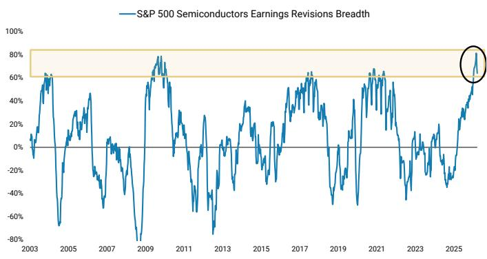
来源：FactSet，MS。

图表3：半导体板块与白银股的类比正在发挥作用；它暗示短期内仍有进一步下行空间；这也应有助于推动市场结构扩散
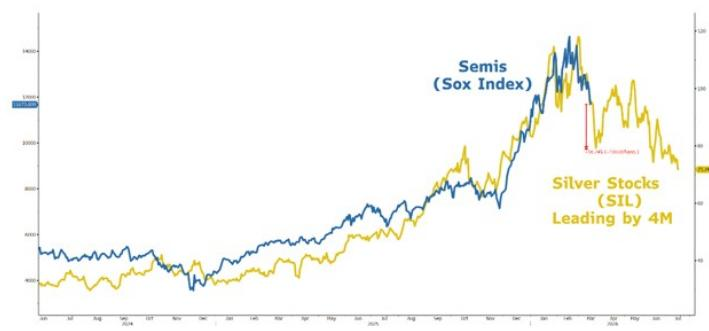
来源：彭博，MS。

图表4：
根据我们的同事Shawn Kim的研究，存储芯片价格预计将在2026年第四季度左右见顶
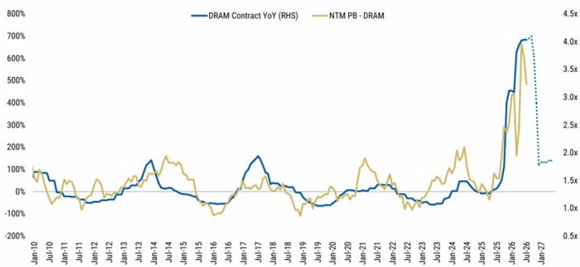
来源：TrendForce，FactSet，MS。注：虚线为MS预测。

在科技板块内部，过去几周我们一直建议超配超大规模企业而非半导体。如前所述，我们认为超大规模企业已提前反映了市场对资本支出纪律的重新关注（图表5和图表6），并且已经历了其表现相对偏弱的时期。这增强了该群体的相对价值，因为META、AMZN、GOOGL和MSFT的等权重估值倍数降至21倍（与3月低点持平）。我们还认为，超大规模企业在人工智能生态系统中拥有吸引人的期权价值：强大的核心业务、参与/引领代理应用层开发和实施的能力，以及一个尚未被充分认识的成本削减杠杆。虽然这一相对交易的风险回报比不如几周前那么吸引人，但我们仍认为，就目前而言，超配超大规模企业而非半导体是合理的，特别是考虑到上文所示的半导体与白银股的价格类比，该类比表明半导体板块在出现可交易性低点之前，可能仍有约15%的下行空间。虽然我们绝不认为人工智能资本支出周期已经结束，但随着超大规模企业可能认识到资本支出/销售因子不再获得市场奖励，而某些公司的信贷和CDS利差已有所扩大，半导体板块的盈利修正变化率可能会出现温和放缓。

图表5：高资本支出与低资本支出销售因子表现暂停
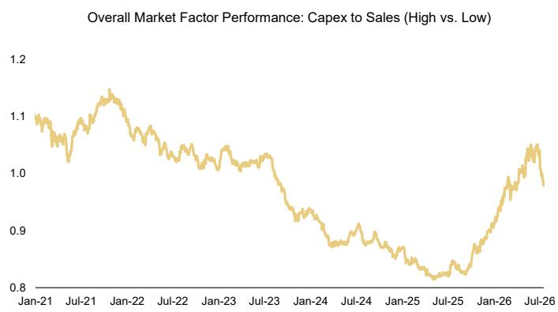
来源：Compustat，MS

图表6：高资本支出板块开始跑输整体市场（按市值排名前1000）
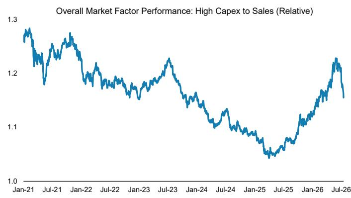
来源：Compustat，MS

我们高资本支出/销售因子近期的相对偏弱表现确实引发了一个问题：市场是否正在像2021年那样转向更高质量偏好的风格。有趣的是，高毛利率和高销售稳定性因子（图表7和图表8；显然属于质量范畴）正显示出强劲的盈利修正广度，预示着其表现将迎头赶上。我们认为，市场正缓慢地向更高质量的领涨基础轮动这一说法有一定道理，但质量因子可能需要几个月的时间才能切实成为领涨因子。重要的是，标普500指数本身就是一个高质量指数，尤其是与国际同行相比。这应会继续在未来数月吸引资金流入美国市场，这一趋势近期已有所加强。换言之，随着市场转向更高质量的领涨股，市场结构扩散可以持续。图表9通过显示标普500指数中位数股票的现金转换率实际上正在超越并与市值加权标普500指数分化，有助于强化这一动态。

图表7：高毛利率盈利修正强劲，且与表现出现分化...
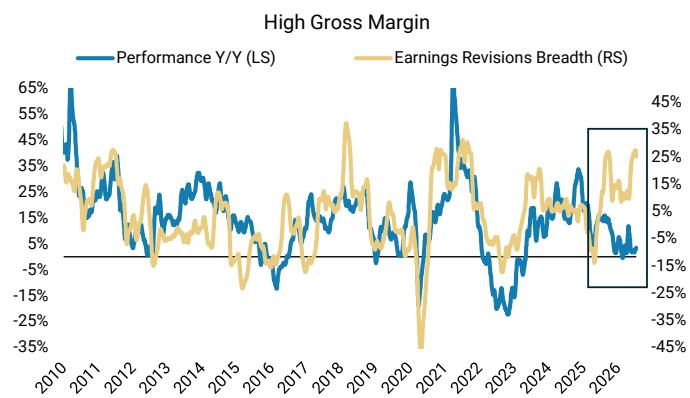
来源：Compustat，MS。

图表8：...高销售增长稳定性方面也有类似情况——市场可能在2025年下半年开始转向更高质量立场
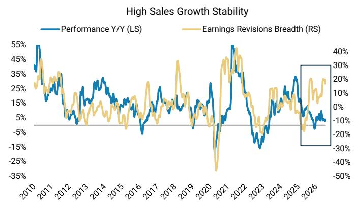
来源：Compustat，MS。

图表9：
指数和中位数股票的现金转换率持续分化
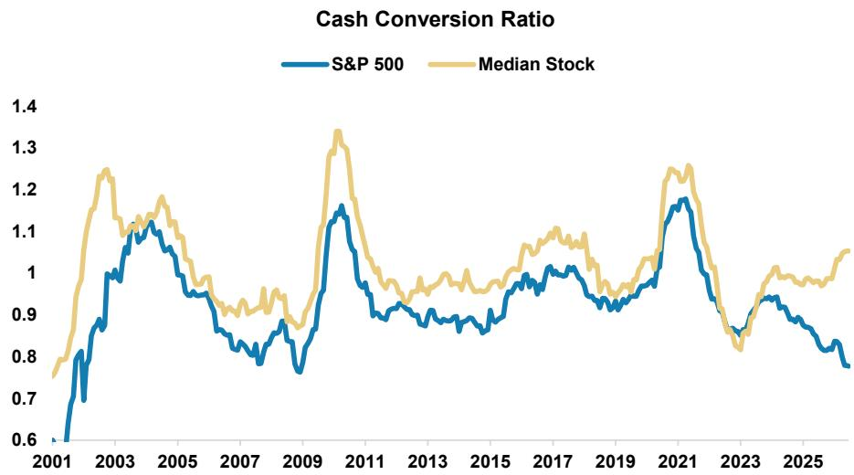
注：现金转换率定义为自由现金流与净利润之比。来源：Compustat，MS

图表10：中位数股票的交易价格与现金转换率一致...
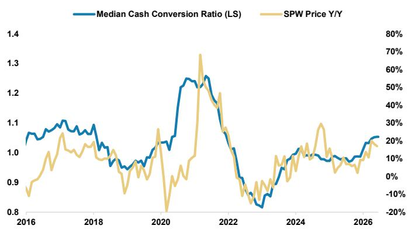
来源：Compustat，MS

图表11：...而标普500指数市值加权估值因较低的现金转换率而承压
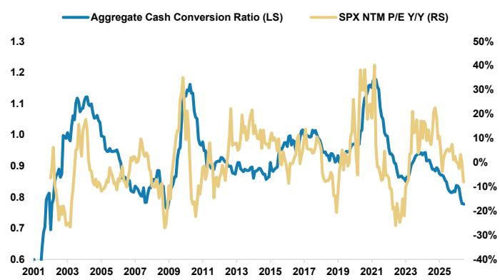
来源：Compustat，MS

如上所述，我们仍对可选消费品和交通运输板块持建设性看法，这两个板块在表现和盈利修正方面均持续显示出相对强势。事实上，交通运输板块的盈利修正广度是我们自2021年以来看到的较强水平（约50%）。如图表12所示，交通运输板块的盈利修正广度与ISM制造业调查密切相关，并预示着ISM将向约60的水平回升。图表13中的回归分析有助于说明这一点。

图表12：交通运输板块盈利修正广度的强势...
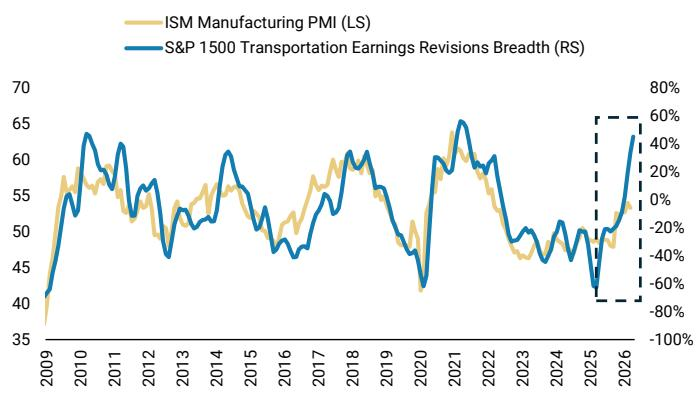
来源：彭博，FactSet，MS。

图表13：...预示着ISM的回升 交通运输板块盈利修正广度 vs. ISM制造业
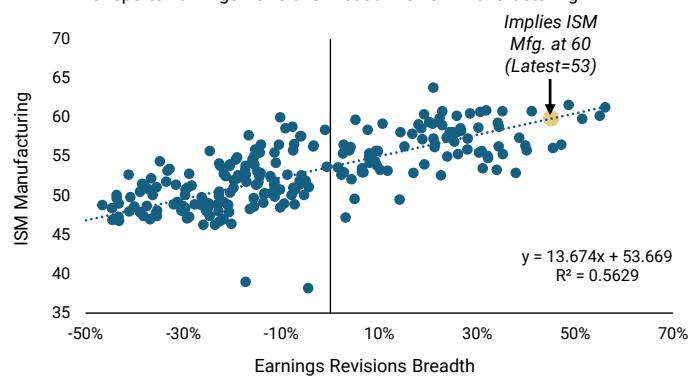
来源：彭博，FactSet，MS。

总结而言，我们仍认为人工智能资本支出周期保持完好且远未结束；然而，半导体板块盈利修正的加速在现阶段已达到峰值变化率，同时其股价在短期内被高估，需要进行一次适当的调整。这是我们在人工智能资本支出周期受益股中第四次看到这样的调整，我们认为半导体板块的调整尚未结束。这种动量交易的平仓正在推动资金轮动至其他板块和盈利修正强劲但尚未被充分定价的股票，从而促进市场表现的扩散。最后，除了盈利修正为正的公司外，市场对高质量盈利公司的兴趣也在增长。超大规模企业是首批因这一关注点而被重新定价并提前反映的公司；在我们看来，它们的相对价值仍然具有吸引力。

最后，6月核心CPI环比增长0.0%，远低于市场共识。这支持了我们的内部观点，即核心通胀可以保持足够温和，使美联储今年能够维持当前政策不变，而非市场共识所预期的加息。

---

# 权力博弈：人工智能、数据中心与地方反弹

Michelle Weaver，美国主题策略师

以下内容摘自我们近期关于数据中心反弹及拟议暂停令的深度研究报告。请参阅完整报告以获取我们的互动式暂停令追踪器。

政治因素正变得与数据中心建设密不可分：我们将"能源政治"列为2026年值得关注的10大主题预测之一，特别指出数据中心增长引发的反弹加剧可能成为中期选举前的关键分歧问题。事实上，这一情况已经显现：随着该问题在选民中的关注度上升，第三方报告称2025年约有价值1560亿美元的项目被取消或延迟，而2026年第一季度已有1300亿美元的项目被取消或延迟。这些地方反对的声音在各州日益高涨，联邦层面的立法者现在也开始引入相关法案。如果这些法案得以实施——或者即使地方反对情绪持续增长，即便仅限于州层面——那么我们认为实际人工智能资本支出低于我们2026年8770亿美元预估的风险将会加大，这将对股票板块和宏观环境产生多重影响。

数据中心暂停令有先例可循，并且正在州和地方层面扩大。事实上，越来越多的地区已通过或提出了针对数据中心项目的护栏和限制措施：引入的护栏措施包括基础设施成本分摊要求、纳税人保护倡议、环境披露规则和分区变更。限制措施大多以临时暂停令的形式出现，影响未来项目或尚未获得既定状态的项目。此外，尽管明确的公众反对倾向于集中在蓝州和倾向民主党的选民中，但我们看到全州范围的数据中心暂停令提案在民主党三连胜州、共和党三连胜州和分裂政府中出现的频率大致相当。

重要的是，大多数努力旨在减缓——而非逆转——建设进程，因为许多这些政策举措都是临时性的。

图表14：拟议的州级人工智能数据中心暂停令法案及政治格局细分

<table><tr><td>州</td><td>法案</td><td>状态</td><td>描述</td><td>州长</td><td>参议院</td><td>众议院</td><td>党派格局</td></tr><tr><td>特拉华州</td><td>SB 353</td><td>已提出</td><td>对能够使用100兆瓦或以上的数据中心的申请和许可实施暂停，直至2027年1月31日。</td><td>Matt Meyer (D)</td><td>D</td><td>D</td><td>一致</td></tr><tr><td>佐治亚州</td><td>HB 1059</td><td>已提出</td><td>禁止地方政府在2028年12月31日前许可数据中心。</td><td>Brian Kemp (R)</td><td>R</td><td>R</td><td>一致</td></tr><tr><td>缅因州</td><td>LD 307 / HP 207</td><td>被否决</td><td>创建缅因州数据中心协调委员会，并临时限制某些超过20兆瓦的数据中心，直至2027年11月。</td><td>Janet Mills (D)</td><td>D</td><td>D</td><td>一致</td></tr><tr><td>马里兰州</td><td>HB 120</td><td>未通过</td><td>在规定的共址/发电条件下，禁止新建数据中心的建设或许可。</td><td>Wes Moore (D)</td><td>D</td><td>D</td><td>一致</td></tr><tr><td>密歇根州</td><td>HB 5594 / HB 5595</td><td>已提出</td><td>地方政府和州机构在2027年4月1日前不得许可/批准某些新建数据中心。</td><td>Gretchen Whitmer (D)</td><td>D</td><td>R</td><td>分裂</td></tr><tr><td>明尼苏达州</td><td>HF 4888 / SF 4298</td><td>未通过</td><td>在公用事业委员会报告发布前（不早于2027年7月），禁止颁发新的数据中心许可。</td><td>Tim Walz (D)</td><td>D</td><td>NP</td><td>分裂</td></tr><tr><td>新罕布什尔州</td><td>HB 1265</td><td>未通过</td><td>设立为期一年的数据中心建设暂停令。</td><td>Kelly Ayotte (R)</td><td>R</td><td>R</td><td>一致</td></tr><tr><td>纽约州</td><td>A11560 / S10642</td><td>州议会通过</td><td>对大型数据中心许可实施一年暂停，并增加服务分类、能效和东道社区条款。</td><td>Kathy Hochul (D)</td><td>D</td><td>D</td><td>一致</td></tr><tr><td>俄克拉荷马州</td><td>SB 1488</td><td>未通过</td><td>设立数据中心建设暂停令，直至2029年11月，并要求进行研究。</td><td>Kevin Stitt (R)</td><td>R</td><td>R</td><td>一致</td></tr><tr><td>宾夕法尼亚州</td><td>SB 1359 / HB 2533</td><td>已提出</td><td>创建全州范围的超大规模数据中心三年暂停令及影响研究，或授权市政暂停令。</td><td>Josh Shapiro (D)</td><td>R</td><td>D</td><td>分裂</td></tr><tr><td>南卡罗来纳州</td><td>H 5526</td><td>已提出</td><td>在全面的监督框架颁布之前，阻止州/地方接受或处理数据中心申请。</td><td>Henry McMaster (R)</td><td>R</td><td>R</td><td>一致</td></tr><tr><td>南达科他州</td><td>SB 232</td><td>未通过</td><td>对超大规模数据中心的建设或扩建实施一年暂停令。</td><td>Larry Rhoden (R)</td><td>R</td><td>R</td><td>一致</td></tr><tr><td>佛蒙特州</td><td>S.205</td><td>已提出</td><td>创建人工智能数据中心暂停令，直至2030年，并要求提交影响报告。</td><td>Phil Scott (R)</td><td>D</td><td>D</td><td>分裂</td></tr><tr><td>弗吉尼亚州</td><td>HB 1515</td><td>继续审议</td><td>禁止地方政府对新建数据中心进行最终批准，直至并网请求得到满足或2028年7月1日。</td><td>Abigail Spanberger (D)</td><td>D</td><td>D</td><td>一致</td></tr><tr><td>威斯康星州</td><td>SB 1061 / AB 1099</td><td>未通过</td><td>在14项列出的条件得到满足之前，禁止数据中心运营。</td><td>Tony Evers (D)</td><td>R</td><td>R</td><td>分裂</td></tr></table>

来源：NCSL，MultiState，MS

对数据中心建设的限制。在Morning Consult最近的一项调查中，约一半的受访者认为人工智能数据中心对电价和电网产生负面影响，而对水价和环境的担忧紧随其后，约为45%。自2025年10月以来，认为人工智能数据中心在大多数维度上产生负面影响的消费者比例有所上升，其中与水价和环境相关的担忧增幅最大。2026年5月，自2025年10月以来首次有更多受访者（约45%）支持停止数据中心建设，而非在扩大能源供应的同时继续建设（约38%）。选择"不知道/无意见"的比例基本保持稳定。

图表15：按维度划分的人工智能数据中心影响（2026年5月）
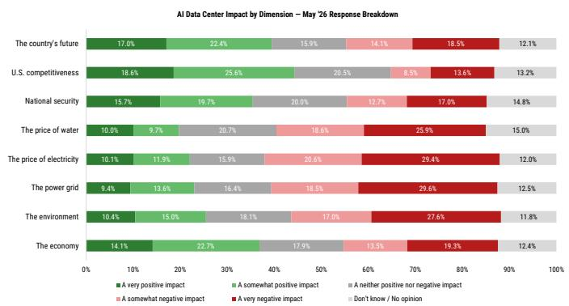
来源：Morning Consult，AlphaWise Web Intelligence

图表16：按维度划分的人工智能数据中心净影响（2026年5月）
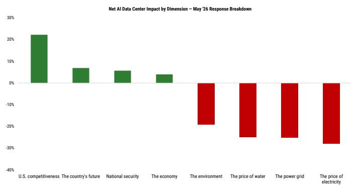
来源：Morning Consult，AlphaWise Web Intelligence

图表17：
数据中心政策：停止 vs. 继续建设人工智能数据中心
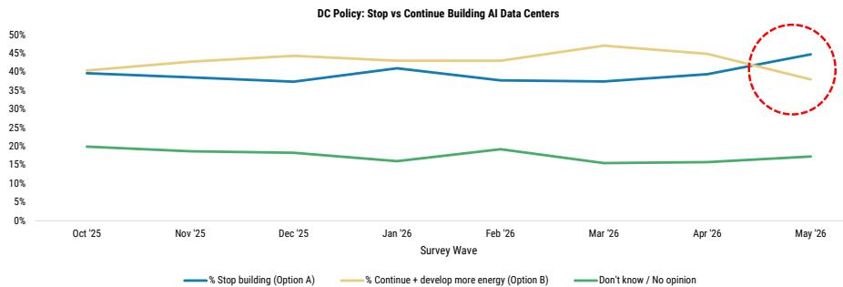
来源：Morning Consult，AlphaWise Web Intelligence

这些风险是否会因此危及美国在全球人工智能竞赛中的地位？如果地方政策努力要么1）成为永久性并继续扩大，和/或2）在联邦层面得到体现，那么我们认为美国在全球人工智能竞争格局中与中国的竞争将面临风险。然而，在我们看来，地缘政治现实难以忽视，因此联邦政府实质性阻碍美国数据中心建设的可能性较小。因此，我们认为有条件的建设是更可能的结果：鉴于数据中心已融入人工智能竞争的物理层面，我们认为项目可能会受到严格审查、延迟，或取决于某些环境或社区相关的让步。

在此背景下，我们认为社区利益和地方经济权衡正变得越来越重要。我们认为，提高数据中心效率和解决社区关切的三项关键杠杆是：

1. 利用率：提高现有数据中心容量的利用率是提高效率最直接的方法之一，尤其是在许多设施尽管资本密集度高，但利用率仅为30-40%的情况下。更好地利用现有基础设施可以减少对增量容量增加的需求，并提高已部署资本的整体回报。

2. 电力：数据中心可以通过现场发电、需求响应和电网支持服务来解决电力约束问题。通过结合可再生能源和储能、转移非关键工作负载以及使用UPS电池支持电网频率，运营商可以提高韧性、减轻电网压力，并可能创造新的收入来源。

3. 水：水效率正成为日益增长的社区和运营优先事项，政策正从直接限制转向数据中心用水标准、披露、激励和绩效基准。这为液体冷却、水回收、废水处理、海水淡化和超纯水回收技术等推动者创造了机会，所有这些都可以减少消耗并帮助运营商满足日益严格的可持续性要求。

## 经济与市场影响

全国性的电价冲击，但更持久和区域性的电力通胀脉冲。全国电力CPI仍高于疫情前趋势，我们预计中期内将稳定在4-5%的同比增长水平，因为数据中心需求增加了潜在压力。最有力的证据来自区域层面：数据中心密集的市场，特别是南大西洋/北弗吉尼亚地区，正经历更快的居民用电通胀和更高的批发电价。对消费者的影响可能是不均衡和累退的，在数据中心负荷增长与已高企的电力负担、输电约束和电网扩张缓慢相叠加的地区，可负担性压力最为严重。

股票市场影响：我们认为，升高的政治风险环境正在将成本分配转向大负荷客户，并在并网和劳动力方面造成瓶颈。考虑到到2028年估计约有38吉瓦的潜在电力缺口，我们认为数据中心正趋向于将现场发电作为解决长周期（某些地区超过5年）问题的有吸引力方案，这对SEI、INIO和BE（均给予超配评级）应是利好。我们认为，上市托管数据中心REITs（超配EQIX，标配DLR）在很大程度上不受政治反弹的影响，因为它们比超大规模/人工智能训练数据中心小得多，且被视为关键基础设施。

反对意见分为三大类：

## 地方反弹已导致约2860亿美元的数据中心项目被延迟或取消——并对以下方面产生影响...

电力与公用事业

数据中心REITs

信贷与融资

经济增长

中美人工智能竞赛

## 为何出现反弹？

对电费影响的担忧

环境担忧——用水与废热

地方生活质量——噪音、灰尘与交通

## 暂停，而非禁止。

大多数活动发生在地方层面，尽管州级提案正在增加。建设进展迅速，大多数社区希望有更多时间来权衡影响——大多数努力旨在减缓而非逆转发展。

2025年被取消或延迟的项目

2026年第一季度已被取消或延迟

## 数据中心遇上市政厅——关键数据

2026年人工智能资本支出预估现在面临低于预期的风险

已提出全州范围暂停令的州

## 按维度划分的消费者对人工智能数据中心的净情绪（%）

美国竞争力

国家未来

国家安全

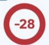

经济

提及的股票：Innio N.V (INIO.O)，27.72美元；Equinix Inc. (EQIX.O)，1,020.00美元；Digital Realty Trust Inc. (DLR.N)，173.88美元；Solaris Energy Infrastructure (SEI.N)，60.28美元

---

## 财报季图表手册

- 金融板块以强劲表现开启了财报季，这得益于股票交易激增、投行业务反弹以及稳定的净利息收入。市场反应积极，T+1日股价反应均值和中位数均平均上涨约1%。
- 第二季度每股收益预计同比增长20%，销售额同比增长10%。实现中等个位数到高个位数的超预期率是可以实现的。
- 第二季度每股收益预估在本季度内被上调了2%，这与通常预估会小幅下调的季节性模式相反。因此，本季度的门槛略高。
- 标普500指数盈利修正广度在财报季前出现季节性暂停，但在历史背景下仍保持强劲，为+19%。在银行首批财报公布后，我们看到盈利修正广度出现积极迹象。
- 2026日历年度盈利预估已上调至同比增长24%。盈利增长的贡献大致平均来自营收增长和利润率扩张。
- 七大科技公司2026年盈利预计增长38%，而标普493指数为16%。我们开始看到标普493指数盈利预估被上调的早期迹象。
- 进入本季度，价格和盈利的离散度均处于高位，我们预计这种情况将在财报季期间持续，为个股价格走势留出空间。

## 关键图表

图表18：按市值划分的第二季度财报季
按市值划分的标普500指数第二季度盈利报告
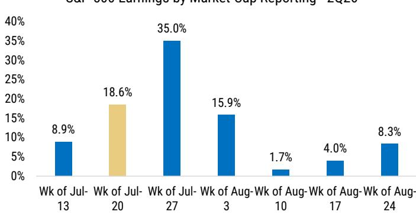
注：包括451家标普500指数公司，占标普500指数市值的95%，报告期从7月10日至8月30日
来源：彭博，MS

图表19：按公司数量划分的第二季度财报季
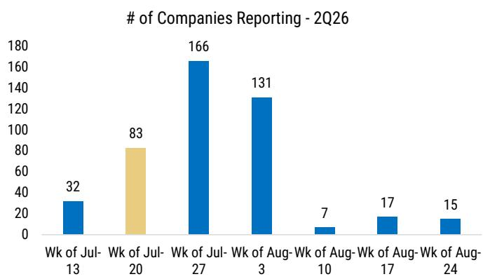
注：包括451家标普500指数公司，占标普500指数市值的95%，报告期从7月10日至8月30日
来源：彭博，MS

图表20：远期每股销售额和每股收益预期
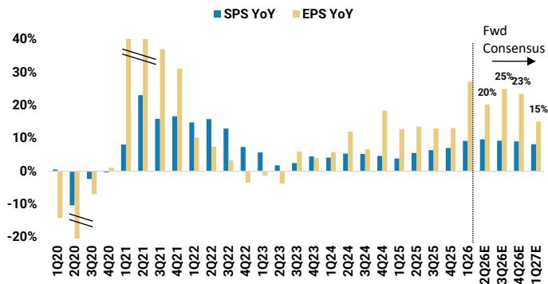
来源：FactSet，MS

图表21：经营杠杆预计将在2026年扩大
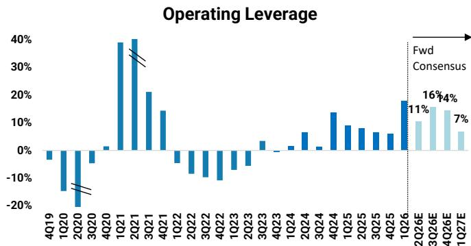
来源：FactSet，MS

图表22：第二季度预估在财报季前走高
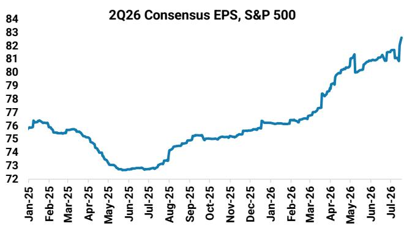
来源：FactSet，MS

图表23：每股收益增长来自营收增长和利润率扩张
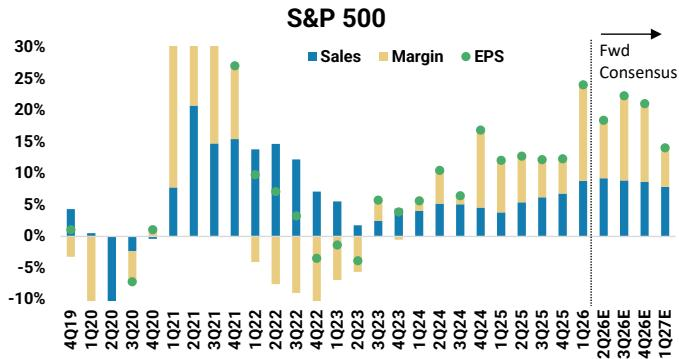
来源：Refinitiv，MS

图表24：混合未来12个月盈利进一步上升
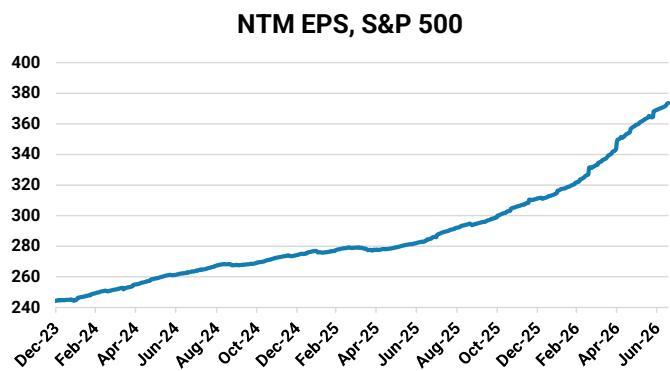
来源：FactSet，MS

图表25：2026/2027年每股收益预估持续上调
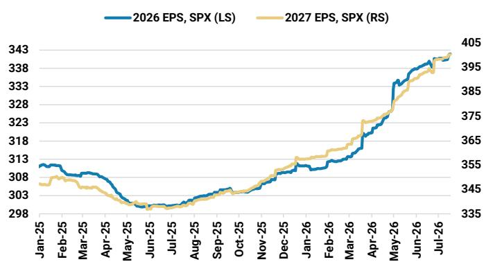
来源：FactSet，MS

图表26：标普500指数中人工智能相关与非人工智能相关名称
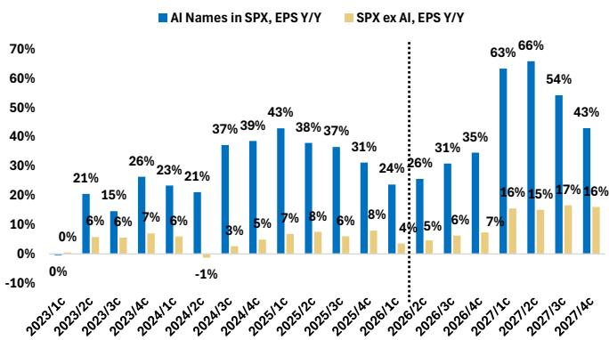
来源：FactSet，MS

图表27：七大科技公司 vs. 标普493指数 - 标普493指数预计盈利增长高达20%，但七大科技公司仍保持领先（除2027年第一季度因基数效应外）
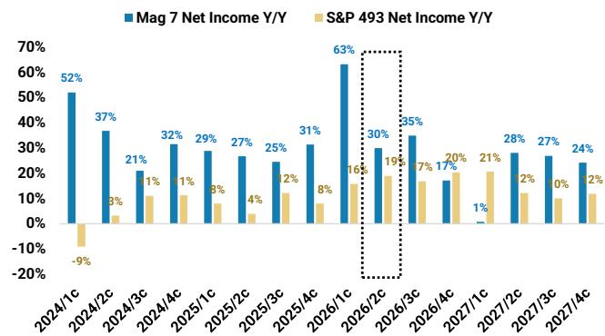
来源：FactSet，MS

图表28：七大科技公司 vs. 标普493指数 - 2027年预估现已持平
■ 七大科技公司净利润同比 ■ 标普493指数净利润同比
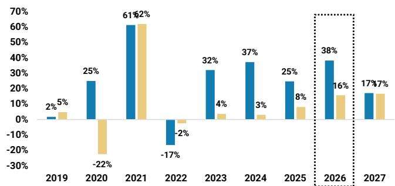
来源：FactSet，MS

图表29：对标普500指数盈利增长的贡献
净利润增长百分比
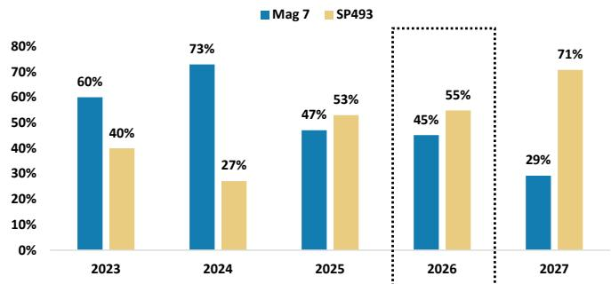
来源：FactSet，MS

图表30：2026年净利润修正
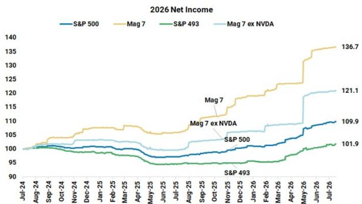
来源：FactSet，MS

图表31：2027年净利润修正
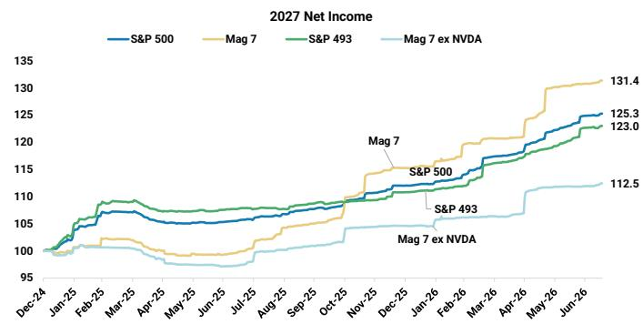
来源：FactSet，MS

## 价格反应（2026年第一季度）

- 第一季度，相对基础上T+1日价格反应中位数为+0.0%，相对于大盘指数为-0.2%。
- 必需消费品、可选消费品和原材料板块在2026年第一季度T+1日价格反应较强。
- 科技和工业板块在2026年第一季度T+1日价格反应为负。

图表32：按销售额/每股收益超预期划分的第一季度价格反应

2026年第一季度财报季

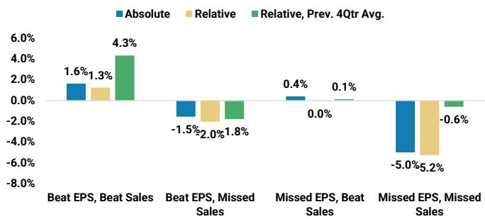
来源：Factset，MS

图表33：T+1日价格反应
