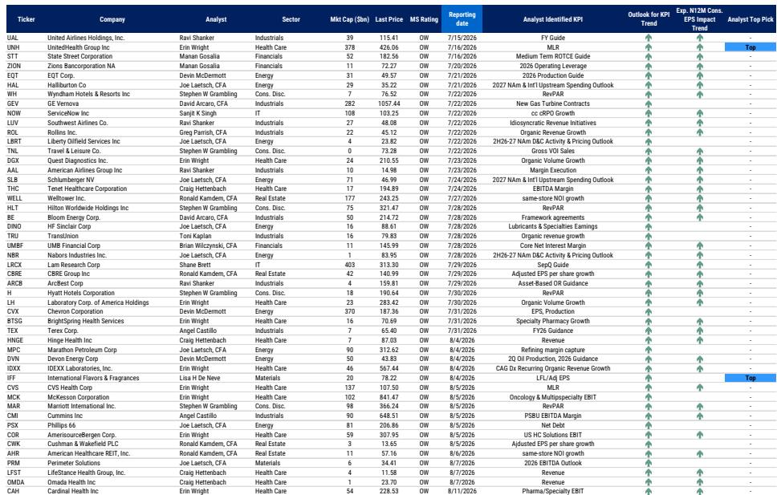
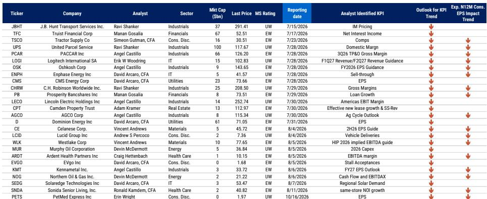
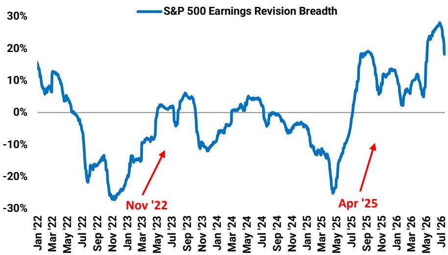

# MS：美国公司策略-北美周度预热-指数震荡中市场领导力扩散

这份MS策略团队发布的周度报告，核心判断是美市场场的领导力正在从半导体和大型科技股向更广泛的行业扩散。报告认为，这一轮扩散尚未结束，指数层面的震荡整理可能持续，但市场整体仍处于观察框架内。报告同时提出一个值得关注的变量：美国地方机构对数据中心建设的反对声音正在上升，可能对AI资本开支的实际落地构成约束。

报告基于五个支撑因素来论证扩散的持续性：标普500等权重指数持续跑赢市值加权指数；中位数公司的盈利增速出现疫情以来最显著的加速；半导体板块的盈利修正广度已从历史极端高位回落；油价预期走低有助于缓解通胀担忧；美联储年内按兵不动。报告特别强调，半导体板块的调整是扩散的催化剂而非终结。

## 1. 半导体板块的修正尚未结束，银价走势提供参考

报告指出，半导体板块自6月初以来已回调超过20%，但策略团队认为这一修正尚未完成。报告引入了一个值得关注的参照系：半导体板块的价格走势与银矿股的历史走势高度相似。根据这一类比，半导体板块短期内可能还有约15%的节奏变化空间。报告同时确认，半导体板块的盈利修正广度已开始从极端高位回落，这是该板块难以在年内重获领导地位的核心原因。

> **KC评论：** 报告用银矿股走势作为半导体板块的参照，并非随意类比。两者的共同点在于：都经历了极端集中的资金涌入、杠杆驱动的投机性持仓，以及盈利修正广度达到历史极值后的均值回归。这种类比的价值在于提供了一个可量化的节奏变化空间参考，而非模糊的方向判断。

## 2. 超大规模云厂商相对价值优于半导体，但不确定性回报已不如前

报告认为，超大规模云厂商（META、AMZN、GOOGL、MSFT）在AI研究周期中具备独特的防御性。这些公司已经提前经历了市场对资本开支纪律的重新定价，其等权重估值已回落至21倍，与3月低点持平。报告认为，这些公司拥有强劲的核心业务、在AI代理应用层的潜在领导力，以及被低估的成本效率杠杆。但报告也坦诚指出，这一相对交易的不确定性回报已不如几周前——超大规模云厂商相对半导体板块的领先幅度在3周内已达到约30%。

## 3. 市场正缓慢向高质量盈利方向迁移

报告观察到，高毛利率和高销售稳定性这两个质量因子正在出现强劲的盈利修正广度，且与当前表现形成背离。报告认为，市场正在缓慢地向高质量盈利方向迁移，但这一过程可能需要数月才能成为明确的领导因子。值得注意的是，标普500指数本身就是一个高质量指数，尤其是相对于国际同行，这将继续吸引资金流入美国市场。

报告还提供了一个有趣的证据：标普500指数中位数公司的现金转换率（自由现金流与净利润之比）正在加速改善，且与市值加权指数的现金转换率形成背离。这意味着中位数公司的盈利质量实际上在改善，而市值加权指数被少数大型公司的低现金转换率所影响。

## 4. 交通运输板块盈利修正广度创2021年以来新高

报告特别看好交通运输和可选消费商品两个板块。交通运输板块的盈利修正广度已达到约50%，为2021年以来较强水平。报告通过回归分析指出，这一广度指标与ISM制造业调查高度相关，暗示ISM制造业指数有望向60水平回升。这一判断与报告对油价走低的预期形成逻辑闭环：油价下降有助于降低运输成本，改善交通运输企业的盈利前景。

## 5. 数据中心建设的地方政治阻力正在上升

报告的另一条主线来自主题策略团队的研究：美国地方机构对数据中心建设的反对声音正在上升。报告统计显示，2025年约有1560亿美元的数据中心项目被取消或延迟，2026年一季度已有1300亿美元。目前已有多个州提出或通过了数据中心建设暂停法案，包括特拉华州、佐治亚州、纽约州等。这些限制措施多数是临时性的，旨在节奏变化而非逆转建设进程，但如果反对声音持续扩大，可能使2026年8770亿美元的AI资本开支预测面临节奏变化不确定性。

> **KC评论：** 数据中心建设的政治阻力是一个容易被低估的变量。市场目前对AI资本开支的预期高度乐观，但地方机构层面的审批延迟、基础设施成本分摊争议、以及选民对能源消耗和环境影响的不满，都可能成为实际资本开支低于预期的现实约束。这一变量对电力设备、建筑、以及依赖数据中心需求的半导体公司都有潜在影响。

报告的最终判断是：AI资本开支周期远未结束，但半导体板块的盈利修正加速度已阶段性见顶，其报价在短期内被过度定价，需要一次适当的修正。这一修正正在为更广泛的市场扩散提供资金，而高质量盈利的公司正在成为新的关注焦点。指数层面，标普500可能在7000点附近找到技术支撑，然后重新进入上升轨道，年底8000点的目标仍然可行。

For informational purposes only. Portions may be generated,translated,summarized,or edited with AI assistance based on source materials and may contain omissions or errors. Please verify independently. This is not investment,legal,tax,accounting,or other professional advice.

