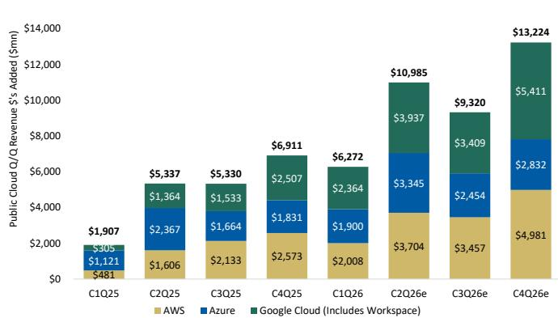
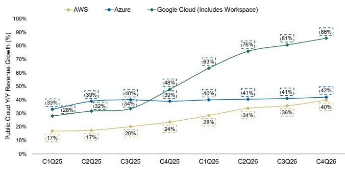

Software | United States of America

July 21, 2026 04:54 AM GMT

Microsoft

# 关于AI技术栈的观察：从基础设施到知识工作者——Azure与Copilot正迎来关键变化

<table><tr><td colspan="3">变化摘要</td></tr><tr><td>Microsoft (MSFT.O)</td><td>此前</td><td>当前</td></tr><tr><td>目标价</td><td>$650.00</td><td>$600.00</td></tr></table>

由产能驱动的Azure增长加速以及Copilot的商业化，支撑了高十几位数的收入增长。毛利率面临一定压力，但被运营杠杆所抵消，从而实现了超过20%的息税前利润及每股收益增长。基于此，16倍FY28 GAAP每股收益的估值显得偏低。维持超配评级，目标价$600。

## 核心要点

Azure和Copilot是公司价值的关键，两者均将迎来重要变化。市场对变化的时机（短期）和程度尚未充分反映。

随着新增的中短期供应满足强劲需求，Azure的市场情绪将改善，推动Azure增长超预期且更持久。

Copilot正在推动每用户平均收入增长，形成三重驱动：Copilot席位、E7套餐和按用量消费，这创造了微软历史上最大的每用户平均收入增长机会之一。

资本支出支撑了可持续的高十几位数收入增长；尽管毛利率承压，但规模效应带来的运营杠杆和运营支出纪律使得运营利润率得以扩张。

16倍FY28 GAAP每股收益对于超过20%的盈利增长而言偏低。保守采用1.2倍市盈率相对增长率/25倍市盈率，相对于同行有所折价，对应新目标价$600，有50%的上行空间。

自本报告起，Adam Wood开始覆盖微软，给予超配评级，目标价$600。

## Azure和Copilot是公司价值的关键，两者均将迎来重要变化。Azure、

Copilot以及毛利率的走势正成为最清晰的指标，表明微软在AI领域的投入正在转化为持久的价值创造。Azure反映了基础设施需求变现，而Copilot则体现了AI在应用层的变现。催化剂路径：随着两项业务持续向好，Azure增长在2026年下半年加速，Copilot在企业中的采用持续扩大，我们认为未来几个季度Azure和Copilot的超预期表现可能成为估值重估的催化剂。同时，毛利率的走势将是决定微软AI投入长期盈利能力和回报率的关键，其中Azure AI的毛利率

MS & CO. LLC

<table><tr><td colspan="2">Adam Wood</td></tr><tr><td>股票分析师</td><td></td></tr><tr><td>Adam.Wood@morganstanley.com</td><td>+1 212 761-3656</td></tr></table>

<table><tr><td colspan="2">Josh Baer, CFA</td></tr><tr><td colspan="2">股票分析师</td></tr><tr><td>Josh.Baer@morganstanley.com</td><td>+1 212 761-4223</td></tr><tr><td colspan="2">Jonathan Eisenson</td></tr><tr><td colspan="2">研究助理</td></tr><tr><td>Jonathan.Eisenson@morganstanley.com</td><td>+1 212 761-2808</td></tr></table>

<table><tr><td>股票评级</td><td>超配</td></tr><tr><td>行业观点</td><td>有吸引力</td></tr><tr><td>目标价</td><td>$600.00</td></tr><tr><td>股价，收盘价 (2026年7月20日)</td><td>$402.29</td></tr><tr><td>市值，当前 (百万)</td><td>$2,995,049</td></tr><tr><td>52周范围</td><td>$555.45-349.20</td></tr></table>

<table><tr><td>财年截止</td><td>06/25</td><td>06/26e</td><td>06/27e</td><td>06/28e</td></tr><tr><td>每股收益 ($)**</td><td>13.64</td><td>17.35</td><td>19.62</td><td>23.86</td></tr><tr><td>此前每股收益 ($)**</td><td>-</td><td>-</td><td>-</td><td>-</td></tr><tr><td>市盈率</td><td>36.5</td><td>21.5</td><td>20.5</td><td>16.9</td></tr><tr><td>每股收益 ($)§</td><td>-</td><td>16.78</td><td>19.40</td><td>22.78</td></tr><tr><td>股息率 (%)</td><td>0.7</td><td>1.0</td><td>1.0</td><td>1.1</td></tr></table>

除非另有说明，所有指标均基于MS ModelWare框架
\*\* = 基于共识方法论
§ = 共识数据由Refinitiv Estimates提供
e = MS估计

## 季度每股收益 (\$)

<table><tr><td>季度</td><td>2025</td><td>2026e 此前</td><td>2026e 当前</td><td>2027e 此前</td><td>2027e 当前</td></tr><tr><td>Q1</td><td>3.30</td><td>-</td><td>3.72a</td><td>-</td><td>4.71</td></tr><tr><td>Q2</td><td>3.23</td><td>-</td><td>5.16a</td><td>-</td><td>4.86</td></tr><tr><td>Q3</td><td>3.46</td><td>-</td><td>4.27a</td><td>-</td><td>4.92</td></tr><tr><td>Q4</td><td>3.65</td><td>-</td><td>4.21</td><td>-</td><td>5.13</td></tr></table>

e = MS估计, a = 公司实际报告数据

MS会并寻求与报告中所覆盖的公司开展业务。因此，读者应注意，该公司可能存在利益冲突，可能影响MS的客观性。读者应将MS视为其决策的单一因素。

有关分析师认证和其他重要披露，请参阅本报告末尾的披露部分。

随着时间推移，AI毛利率的改善，结合显著的规模效应和运营杠杆，将维持运营利润率扩张和超过20%的盈利增长。我们在本报告中分析了微软的几个关键讨论点：

\- Azure——微软不断增加的AI基础设施投入的回报如何，特别是考虑到产能分布在Azure AI、Copilot、通用云、其他第一方应用、研发和训练中？在本报告中，我们上调了Azure的预期，预计Azure增长将再加速三年，实现持久的超过40%的同比增长，在FY28/FY29分别比共识高出5%/8%，这得到了我们新的MS Azure AI变现模型的支持（图表7）。市场忽略了什么：我们的分析表明，市场错误地将Azure AI视为裸金属提供商；更高级别的AI服务和平台拉动效应将带来每兆瓦收入和每兆瓦息税前利润的上行空间。

\- Copilot——面向知识工作者的新生成式AI竞争格局是否会威胁到微软的M365/Office业务？……还是Copilot能够遵循微软的历史先例，最终在重要领域取得成功，从而推动显著的每用户平均收入贡献和持久的M365商业云增长？在本报告中，我们上调了Copilot和M365商业云的预期，这反映了我们更新的M365 P x Q模型和我们专有的MS CIO调查数据（微软：2026年第二季度CIO调查要点——生成式AI领导地位依然清晰（2026年7月16日））。市场忽略了什么：Copilot和更广泛的E7机会有可能成为微软历史上最重要的每用户平均收入增长机会之一。

\- 毛利率——微软能否在资本支出上展现出有吸引力的回报，通过利用率、定价、运营效率、软件优化和自研芯片来推动AI毛利率的显著改善，从而保护20%的息税前利润增长？在本报告中，我们下调了毛利率预期，这是基于对Azure AI、Azure、云毛利率的详细分析，以及对微软每个业务毛利率的自下而上审视。我们还1）将毛利率与类似的AI基础设施业务进行对标，2）深入研究了微软云毛利率改善的长期历史，3）列出了AI相关毛利率扩张的主要驱动因素。

图表1：MS Azure AI变现模型摘要

<table><tr><td>FY28E 指标</td><td>情景 #1</td><td>情景 #2</td><td>情景 #3</td></tr><tr><td>Azure AI 产能 (GW)</td><td>8.71</td><td>8.71</td><td>8.71</td></tr><tr><td>Azure AI 收入 ($M)</td><td>$86,203</td><td>$117,941</td><td>$198,255</td></tr><tr><td>相对于当前MSe (总Azure) 的下行/上行</td><td>-3.0%</td><td>11.7%</td><td>49.1%</td></tr><tr><td>Azure AI 每兆瓦收入 ($M)</td><td>$9.90</td><td>$13.54</td><td>$22.77</td></tr><tr><td>毛利率 % (扣除收入分成前)</td><td>25.0%</td><td>30.0%</td><td>35.0%</td></tr><tr><td>每兆瓦息税前利润 (扣除收入分成前)</td><td>$1.39</td><td>$2.57</td><td>$5.46</td></tr></table>

来源：公司数据，MS

在软件护城河与旅程框架中领先——整体排名第一，估值具有吸引力，使我们坚定维持超配评级。作为我们更广泛的软件覆盖报告的一部分（参见《护城河与旅程——在AI时代评估软件的持久性与增长》），微软在我们软件领域的公司中排名最高。我们认为，微软结合了软件领域较强的竞争护城河之一和极具吸引力的AI机会，这得益于其无与伦比的企业分销网络、广泛的产品组合以及在AI技术栈应用层和基础设施层的布局。微软处于企业工作流程的中心，加上其将AI能力嵌入包括Microsoft 365、Azure、安全等产品的能力，使其在AI采用持续扩大时处于有利位置。重要的是，尽管处于领先地位，我们仍认为微软的估值相对于其增长的持久性和战略性的AI定位具有吸引力，这使我们坚定维持超配。

以超配评级和$600目标价开始覆盖。16倍FY28 GAAP每股收益对于超过20%的盈利增长而言偏低。我们保守地对FY28每股收益$23.86应用1.2倍市盈率相对增长率/25倍市盈率，相对于大型软件同行（1.4倍市盈率相对增长率）有所折价，对应新目标价$600，有50%的上行空间。上行风险 - $795牛市情景：Azure AI的经济效益在每兆瓦收入和利润率方面类似于核心Azure，市场认识到这一上行空间（参见图表7中的情景2和3）。Copilot推动M365显著加速，运营利润率在FY28扩大至约49%，推动每股收益超过$27。下行风险 - $250熊市情景：Azure AI像裸金属提供商一样变现（参见图表7中的情景1），限制了上行空间和利润率改善；Copilot因竞争而采用停滞，M365增长放缓。

模型变更摘要。我们适度上调了收入预期，主要受更强的Azure AI和Microsoft 365/Copilot假设驱动，部分被更个人计算（主要是游戏）的较低预期所抵消。同时，我们下调了未来几年的毛利率假设，以反映Azure AI和M365 Copilot收入占比增加以及AI相关折旧费用上升。然而，持续的运营支出纪律抵消了这些压力，导致运营收入和每股收益预期相对于收入预期持平或略有上调。更新后的盈利展望推动运营现金流和自由现金流适度增加。我们还在FY28纳入了额外的$450亿债务发行，并下调了未来几年的股票回购假设，这反映了微软在AI相关研究线索增加的情况下，更愿意保持资产负债表的灵活性。总体而言，这些变化导致期末现金和短期投资余额相对于我们之前的模型有所增加。有关模型变更的更详细摘要，请参见图表22。

图表2：模型变更摘要（Azure收入）——上调未来几年Azure收入预期，得到我们MS Azure AI变现分析的支持

<table><tr><td>($mns)</td><td>FY26</td><td>FY27</td><td>FY28</td><td>FY29</td></tr><tr><td>此前MSe - Azure及其他云服务收入</td><td>$105,605</td><td>$149,423</td><td>$209,338</td><td>$291,186</td></tr><tr><td>同比增长 %</td><td>66%</td><td>41%</td><td>40%</td><td>39%</td></tr><tr><td>当前MSe - Azure及其他云服务收入</td><td>$105,605</td><td>$150,299</td><td>$214,928</td><td>$305,942</td></tr><tr><td>同比增长 %</td><td>40%</td><td>42%</td><td>43%</td><td>42%</td></tr><tr><td>差异 %</td><td>0.0%</td><td>0.6%</td><td>2.7%</td><td>5.1%</td></tr></table>

来源：MS，公司数据

图表3：MS估计与共识对比摘要

<table><tr><td>($mns)</td><td>FY26</td><td>FY27</td><td>FY28</td><td>FY29</td></tr><tr><td>Microsoft 365 商业云总收入 (共识)</td><td>$89,884</td><td>$102,005</td><td>$115,065</td><td>$131,758</td></tr><tr><td>Microsoft 365 商业云总收入 (MSe)</td><td>$89,256</td><td>$102,312</td><td>$118,531</td><td>$136,979</td></tr><tr><td>差异 %</td><td>-0.7%</td><td>0.3%</td><td>3.0%</td><td>4.0%</td></tr><tr><td>Azure及其他云服务总收入 (共识)</td><td>$105,862</td><td>$148,930</td><td>$204,617</td><td>$283,735</td></tr><tr><td>Azure及其他云服务总收入 (MSe)</td><td>$105,605</td><td>$150,299</td><td>$214,928</td><td>$305,942</td></tr><tr><td>差异 %</td><td>-0.2%</td><td>0.9%</td><td>5.0%</td><td>7.8%</td></tr><tr><td>总收入 (共识)</td><td>$329,554</td><td>$385,309</td><td>$455,397</td><td>$549,998</td></tr><tr><td>总收入 (MSe)</td><td>$329,533</td><td>$389,310</td><td>$474,072</td><td>$587,510</td></tr><tr><td>差异 %</td><td>0.0%</td><td>1.0%</td><td>4.1%</td><td>6.8%</td></tr><tr><td>毛利润 (共识)</td><td>$223,538</td><td>$256,575</td><td>$297,800</td><td>$351,688</td></tr><tr><td>毛利润 (MSe)</td><td>$223,142</td><td>$255,792</td><td>$305,440</td><td>$372,606</td></tr><tr><td>差异 %</td><td>-0.2%</td><td>-0.3%</td><td>2.6%</td><td>5.9%</td></tr><tr><td>毛利率 (共识)</td><td>67.8%</td><td>66.6%</td><td>65.4%</td><td>63.9%</td></tr><tr><td>毛利率 (MSe)</td><td>67.7%</td><td>65.7%</td><td>64.4%</td><td>63.4%</td></tr><tr><td>差异 %</td><td>-11.6bps</td><td>-88.5bps</td><td>-96.4bps</td><td>-52.2bps</td></tr><tr><td>运营支出 (共识)</td><td>$69,730</td><td>$76,502</td><td>$85,343</td><td>$96,385</td></tr><tr><td>运营支出 (MSe)</td><td>$69,717</td><td>$74,604</td><td>$84,114</td><td>$95,156</td></tr><tr><td>差异 %</td><td>0.0%</td><td>-2.5%</td><td>-1.4%</td><td>-1.3%</td></tr><tr><td>运营收入 (共识)</td><td>$153,632</td><td>$179,022</td><td>$211,544</td><td>$257,457</td></tr><tr><td>运营收入 (MSe)</td><td>$153,426</td><td>$181,188</td><td>$221,326</td><td>$277,450</td></tr><tr><td>差异 %</td><td>-0.1%</td><td>1.2%</td><td>4.6%</td><td>7.8%</td></tr><tr><td>运营利润率 (共识)</td><td>46.6%</td><td>46.5%</td><td>46.5%</td><td>46.8%</td></tr><tr><td>运营利润率 (MSe)</td><td>46.6%</td><td>46.5%</td><td>46.7%</td><td>47.2%</td></tr><tr><td>差异 %</td><td>-6.0bps</td><td>7.9bps</td><td>23.4bps</td><td>41.4bps</td></tr><tr><td>每股收益 (共识)</td><td>$16.93</td><td>$19.47</td><td>$23.12</td><td>$28.41</td></tr><tr><td>每股收益 (MSe)</td><td>$17.35</td><td>$19.62</td><td>$23.86</td><td>$29.83</td></tr><tr><td>差异 %</td><td>2.5%</td><td>0.8%</td><td>3.2%</td><td>5.0%</td></tr></table>

来源：公司数据，MS，Visible Alpha

## 执行摘要

## Azure洞察：

尽管Azure具有强劲的长期地位和增长适度加速，但鉴于资本支出大幅增加而投资资本回报率尚未得到证实，读者情绪偏向负面。我们认为，随着近/中期供应推动Azure增长超预期且更持久，这种情绪将改善。过去一年，Azure增长受到产能供应而非需求的限制。尽管微软已逐步增加基础设施，但管理层一直强调需求继续超过可用供应，同时指出需要平衡Azure、第一方应用和内部研发计划之间的可用产能。在此背景下，管理层指引F4Q26 Azure在固定汇率下同比增长39-40%，同时有足够的信心和可见度指引2026年下半年相对于上半年适度加速，这表明新部署的产能开始大规模转化为收入。重要的是，这发生在微软在读者中相对不受青睐的时期，至少部分原因是Azure最新的增长轨迹相对于资本支出修正的步伐以及其他超大规模企业正在实现的加速收入轨迹。

重要的是，读者可能低估了即将到来的Azure加速的幅度和持久性——这得到了我们资本支出隐含的AI收入和每兆瓦收入分析的支持。从历史上看，Azure增长受到可用产能而非客户需求的限制，造成了等待部署的工作负载积压。随着新增产能上线，微软不再仅仅是满足当前需求，还要处理之前被推迟的需求，这为Azure增长加速并在更长时间内保持较高水平创造了可能性，这超出了许多读者的预期。鉴于管理层对近期加速和2026年下半年更强增长前景的指引，我们可能看到Azure增长超过45%的路径变得越来越可行，特别是考虑到更广泛的云迁移保持健康，AI工作负载继续扩大。因此，我们相应地上调了F2H27 / FY28 / FY29的Azure收入预期（更多细节见图表22）。

什么会让我们出错：由于资本密集度和更高级别服务附加率较低，AI利润率上限较低，导致更显著的毛利率压力，难以通过规模和运营杠杆抵消，从而导致运营利润率下降。

图表4：三大超大规模企业云净收入季度环比增加额

来源：MS，公司数据

图表5：三大超大规模企业同比增长率

来源：MS，公司数据

## Copilot / M365洞察：

Copilot驱动的每用户平均收入正变成三重驱动：Copilot席位、E7和按用量消费。同时，我们认为读者越来越低估Copilot的潜在贡献。过去一年，微软的主要目标是证明产品与市场的契合度，同时展示客户愿意在企业规模上部署AI助手，并改进Copilot的能力。现在的讨论正转向变现、采用速度和长期收入机会。新的付费Copilot席位披露提供了衡量M365 Copilot商业进展的透明度，而管理层的评论继续指向部署活动加速、使用强度增加以及大型企业客户的采用增长。重要的是，微软现在看到客户从最初的试点/部署转向更广泛的企业级推广，这支持了我们的观点，即Copilot的采用正进入一个新阶段。同样，像Copilot Cowork这样的新产品公告进一步改善了产品的价值主张，并支持更广泛的企业部署。Copilot驱动的每用户平均收入正日益成为三重增长驱动：(1) 直接Copilot席位采用，(2) 向更高价值的M365 E7订阅迁移，以及(3) 与代理、编排和工作流自动化相关的基于消费的变现。请参见下面Copilot部分中我们最新的MS CIO调查的图表10-17，这些图表进一步指向Copilot采用率的提高。

改进的Copilot产品，被低估的混合定价模式。从历史上看，微软主要通过席位扩展和许可升级来变现生产力软件。有了Copilot，微软现在有机会同时变现用户和使用量，随着时间的推移创造出一个可能更广泛的收入模式。我们认为，最近推出的M365 E7 SKU进一步强化了这一演变。在我们看来，E7代表了微软AI变现策略的下一阶段，将焦点从单个Copilot席位转向更广泛的AI平台采用和M365安装基础的更高每用户平均收入。随着AI采用在组织中扩大，客户越来越多地利用代理、推理能力和工作流自动化，Copilot和更广泛的E7机会有可能成为微软历史上最重要的每用户平均收入增长机会之一。类似于从E3到E5的过渡，E7有潜力创造一个新的多年升级周期，AI作为催化剂推动更高价值的M365采用，而不仅仅是一个增量软件功能。

什么会让我们出错：Copilot席位增长放缓，且由于竞争性生产力解决方案，基于消费的定价贡献未能实现。

## 利润率洞察：

预期毛利率承压，毛利润/盈利有支撑。我们下调了FY27 / FY28 / FY29的毛利率预期，分别至65.7%（较此前下降50个基点）/ 64.4%（下降120个基点）/ 63.4%（下降220个基点），原因是近期AI基础设施投资加速、Azure AI和Copilot收入组合增加以及折旧费用上升带来的压力。这些动态将在未来几年对毛利率构成压力，这是微软AI投资周期的自然产物。尽管如此，我们看到了AI利润率扩张的清晰路径。类似于早期的云转型，我们认为今天的利润率压力在很大程度上反映了前期基础设施投资与收入实现之间的时间错配。随着AI产能利用率提高，微软受益于软件优化、自研芯片、更高价值的平台服务以及基于消费的变现组合增加，我们看到Azure AI利润率随着时间的推移有显著改善的路径。因此，我们仍然看好微软的长期盈利能力和AI投资资本回报率，并认为读者过度关注短期利润率压力，而忽视了长期价值创造机会（更多细节见图表18-21）。

什么会让我们出错：该毛利率框架的主要风险是利用率低于预期、GPU过时速度加快、电力和供应链成本上升、AI基础设施定价压缩，以及固定价格AI产品中用量增长快于变现。

# 评估微软的基础设施投资

微软的数据中心产能实际上用在了哪里？继我们最近的报告《基础设施变现——AI周期仍处于早期阶段》（2026年5月27日）之后，我们更深入地研究了微软的数据中心产能分配。微软正在进行科技史上最大的基础设施建设项目之一，超大规模产能预计将在未来几年大幅扩张。然而，并非所有AI基础设施都服务于同一目的，产能支持各种用例。具体来说，管理层已明确表示，公司需要“平衡Azure收入增长与第一方应用和AI解决方案（即Copilot）日益增长的需求、我们自身的研发工作以及服务器生命周期结束的更换”。在下面的图表中，我们利用对微软总装机容量的最新估计，尝试将潜在产能组合分解为四个主要类别：1) 核心Azure，包括传统云工作负载，如计算、存储、数据库、分析和网络；2) Azure AI，包括AI基础设施服务、模型托管、训练、推理、AI开发平台和AI原生客户工作负载；3) 第一方应用（内部应用），包括微软不断增长的AI赋能产品组合，如M365 Copilot、GitHub Copilot、Dynamics、安全和其他第一方AI解决方案；以及4) 内部研发，包括专有模型开发、前沿AI研究、实验和未来平台能力。我们认为这个框架很重要，因为每个工作负载类别都有明显不同的变现特征。核心Azure仍然是最成熟和可预测的基础设施业务，而Azure AI主要通过基础设施和平台消费变现。相比之下，微软的第一方应用代表了技术栈中价值最高的层级，微软可以利用其现有的分销网络、安装基础（超过4.5亿用户）和软件生态系统，从每兆瓦部署的计算中产生更高的收入和利润。虽然需求显然很重要，但我们认为读者应越来越关注供应（或产能）最终被分配到哪里。如果越来越多的增量产能被导向Azure AI和微软自身的AI赋能应用，那么公司的基础设施变现特征应逐渐从纯基础设施经济学（即裸金属Neocloud）转向更高价值的平台/软件经济学，从而支持更强的每兆瓦收入、每兆瓦毛利润和长期总回报（见图表6）。

评估微软的每兆瓦收入框架。我们估计，Azure AI工作负载将在未来几年成为微软装机数据中心产能的最大消费者，从FY24的大约11%增长到FY28的约43%，因为对AI训练、推理和平台服务的需求持续加速。我们估计，到FY28，第一方应用将占装机容量的约21%（或超过4GW的产能），这反映了与Microsoft 365、Dynamics、安全、GitHub等相关的计算需求，以及不断扩大的AI赋能软件产品组合。虽然这些工作负载的资本密集度低于Azure AI，但它们支撑了微软云收入的更大一部分，从而带来更高的每兆瓦部署基础设施收入。在我们看来，这突显了微软AI战略中的一个重要区别——尽管Azure和Azure AI推动了公司大部分基础设施投资，但很大一部分价值最终在软件和应用层实现。这一动态明显影响了最近两次财报发布后的市场反应，因为Azure增长超预期因素（相对于管理层指引）已从大约高于指引上限2个百分点以上（历史上）下降到大约高于或持平于指引上限1个百分点，这是由于供应受限的环境以及每个季度新增产能的上线。例如，在F2Q26财报电话会议上，CFO Amy Hood澄清说：“如果我将在Q1和Q2刚刚上线的GPU全部分配给Azure，那么关键绩效指标将超过40（更符合当时买方预期，而报告的是固定汇率下同比增长38%）。我认为最重要的是要认识到，这是对技术栈所有层级的投资，这些层级都使客户受益。”底线是，与主要变现计算能力的传统AI基础设施提供商不同，Azure AI日益成为更广泛Azure（和微软）生态系统的入口，推动了对数据库、存储、开发者工具、Azure AI Foundry和其他平台服务的拉动需求。随着AI工作负载变得更加复杂，企业部署规模扩大，我们预计微软AI收入的增长部分将来自这些更高价值的平台能力，而不仅仅是基础设施消费。重要的是，这种拉动效应应使微软能够捕捉技术栈多个层级的价值，使Azure AI能够以比裸金属AI基础设施业务更有意义的方式变现，这最终应推动更好的收入变现和长期更具吸引力的利润率特征。

如图表6所示，我们估计Azure AI将随着时间的推移成为微软装机计算能力的最大消费者，这反映了支持AI训练、推理和平台服务所需的基础设施。然而，尽管消耗的产能份额较小，我们估计微软的第一方应用组合继续从每兆瓦部署基础设施中产生显著更高的收入。这反映了通过软件订阅、工作流自动化、生产力提升和不断演变的商业模式（即Copilot结合SaaS + 消费）来变现AI的能力，而不仅仅是通过基础设施消费。因此，我们认为微软在AI上的长期回报特征不仅取决于Azure AI的增长，还取决于公司成功地将AI能力嵌入Microsoft 365（即Copilot）、安全、Dynamics、GitHub和其他第一方产品的能力。

对于我们的第一方应用收入估计，我们假设管理层更广泛地指的是微软的云交付产品组合，这些产品与Azure相关的工作负载一起消耗基础设施产能。这包括一系列产品，如更广泛的Microsoft 365、Dynamics、安全、GitHub等，以及嵌入在这些产品中的不断增长的AI赋能功能组合（即Copilot）。在此框架下，第一方应用代表了数据中心产能的一个重要且不断增长的分配，这反映了微软现有核心软件业务的规模以及在整个产品组合中提供AI增强体验所需的计算需求的增加。

\*如果您希望查看我们MS产能组合分析的交互式模型，请联系我们\*

图表6：装机数据中心MS产能组合分析——隐含的Azure AI每兆瓦收入长期来看可能被证明过低

<table><tr><td></td><td>FY23</td><td>FY24</td><td>FY25</td><td>FY26E</td><td>FY27E</td><td>FY28E</td></tr><tr><td>微软云收入 ($mn)</td><td>$111,600</td><td>$137,700</td><td>$168,900</td><td>$214,061</td><td>$273,874</td><td>$356,770</td></tr><tr><td>总GW (装机容量)</td><td>4.50</td><td>5.00</td><td>7.50</td><td>10.25</td><td>14.50</td><td>20.25</td></tr><tr><td colspan="7">计算分配 (产能组合 %)</td></tr><tr><td>总Azure</td><td>42%</td><td>48%</td><td>57%</td><td>63%</td><td>69%</td><td>74%</td></tr><tr><td>核心Azure</td><td>40%</td><td>37%</td><td>35%</td><td>33%</td><td>32%</td><td>31%</td></tr><tr><td>Azure AI</td><td>2%</td><td>11%</td><td>22%</td><td>30%</td><td>37%</td><td>43%</td></tr><tr><td>第一方应用</td><td>55%</td><td>49%</td><td>39%</td><td>32%</td><td>26%</td><td>21%</td></tr><tr><td>M365 Copilot</td><td>0%</td><td>1%</td><td>2%</td><td>2%</td><td>3%</td><td>4%</td></tr><tr><td>内部研发 / 训练</td><td>3%</td><td>3%</td><td>4%</td><td>5%</td><td>5%</td><td>5%</td></tr><tr><td colspan="7">每类产能 (GW)</td></tr><tr><td>总Azure</td><td>1.89</td><td>2.40</td><td>4.28</td><td>6.46</td><td>10.01</td><td>14.99</td></tr><tr><td>核心Azure</td><td>1.80</td><td>1.85</td><td>2.63</td><td>3.38</td><td>4.64</td><td>6.28</td></tr><tr><td>Azure AI</td><td>0.09</td><td>0.55</td><td>1.65</td><td>3.08</td><td>5.37</td><td>8.71</td></tr><tr><td>第一方应用</td><td>2.48</td><td>2.45</td><td>2.93</td><td>3.28</td><td>3.77</td><td>4.25</td></tr><tr><td>M365 Copilot</td><td>-</td><td>0.04</td><td>0.12</td><td>0.23</td><td>0.44</td><td>0.74</td></tr><tr><td>内部研发 / 训练</td><td>0.14</td><td>0.15</td><td>0.30</td><td>0.51</td><td>0.73</td><td>1.01</td></tr><tr><td colspan="7">收入假设 ($mn)</td></tr><tr><td>总Azure</td><td>$42,085</td><td>$56,140</td><td>$75,428</td><td>$105,605</td><td>$150,299</td><td>$214,928</td></tr><tr><td>核心Azure</td><td>$41,961</td><td>$52,268</td><td>$63,331</td><td>$79,936</td><td>$100,004</td><td>$122,236</td></tr><tr><td>Azure AI</td><td>$124</td><td>$3,872</td><td>$12,097</td><td>$25,669</td><td>$50,295</td><td>$92,692</td></tr><tr><td>第一方应用</td><td>$61,015</td><td>$72,243</td><td>$83,505</td><td>$97,339</td><td>$111,122</td><td>$128,021</td></tr><tr><td>M365 Copilot</td><td>-</td><td>$794</td><td>$2,227</td><td>$4,431</td><td>$8,648</td><td>$14,886</td></tr><tr><td colspan="7">每兆瓦收入 ($mn)</td></tr><tr><td>总Azure</td><td>$22.27</td><td>$23.39</td><td>$17.64</td><td>$16.35</td><td>$15.02</td><td>$14.34</td></tr><tr><td>核心Azure</td><td>$23.31</td><td>$28.25</td><td>$24.13</td><td>$23.63</td><td>$21.55</td><td>$19.47</td></tr><tr><td>Azure AI</td><td>$1.38
