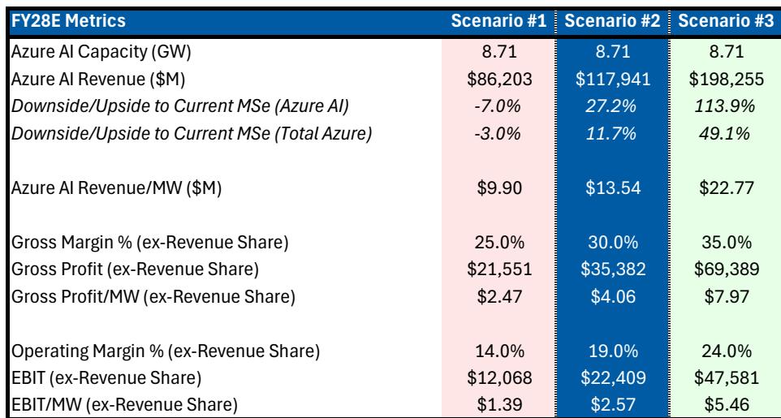
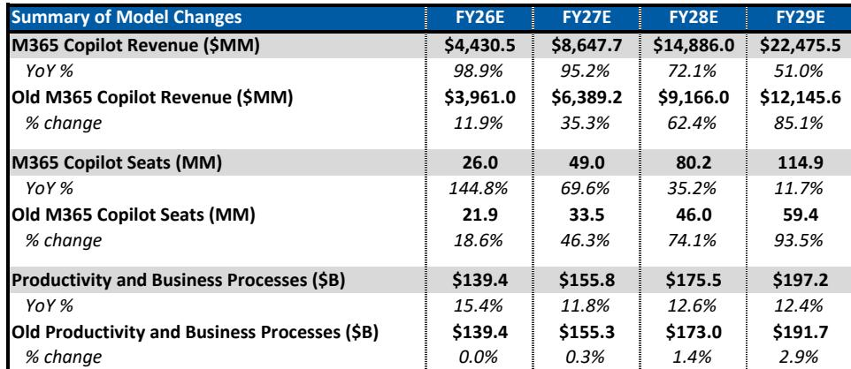
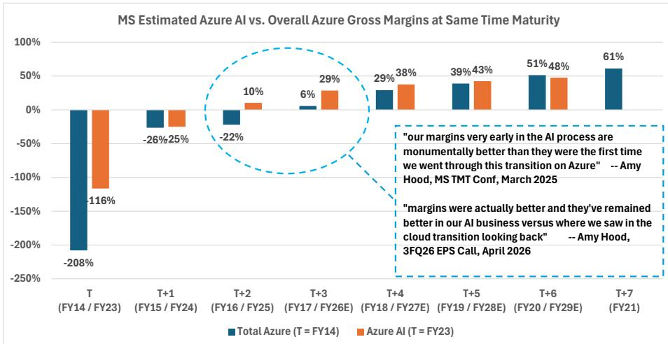

# MS：AI技术与行业应用观察

这份由MS分析师Adam Wood团队在2026年7月21日发布的报告，核心判断是：微软的AI基础设施研究正在从“容量约束”转向“收入兑现”，Azure与Copilot两条业务线将在未来数个季度同时出现增速拐点。报告认为市场目前对这一拐点的幅度和持续性存在不同看法。

报告上调了Azure在FY28和FY29的收入预期，分别高于市场共识5%和7.8%。支撑这一判断的，是MS新建的Azure AI货币化模型。该模型将Azure AI的容量（以GW计）与收入、毛利率和EBIT/MW做了三种情景拆解。在最保守的情景下，Azure AI的Rev/MW仅为990万美元，毛利率25%；在乐观情景下，Rev/MW可达2277万美元，毛利率35%。报告认为市场目前按“基础资源供应商”定价Azure AI，忽略了更高层AI服务和平台拉动的收入乘数。

Copilot的货币化路径也被重新定义。报告不再将其视为单一席位产品，而是“三引擎”结构：Copilot席位、E7套件升级和消费型AI服务。报告引用了其CIO调查数据，认为Copilot正从试点阶段进入企业级大规模部署。这一转变意味着M365商业云的增长可能在未来三年持续加速，而非市场预期的节奏变化。

报告的核心价值在于它构建的“容量-收入-毛利率”分析框架。市场此前对微软AI研究的ROI存在分歧，核心争议在于：高额资本开支能否转化为可持续的收入增长和利润率。这份报告用三种情景给出了一个可验证的答案——即使最保守情景，Azure AI也能贡献可观的收入增量，而乐观情景下其宏观环境性接近核心Azure。

毛利率是另一个关键变量。报告下调了远期毛利率预期，以反映Azure AI和Copilot收入占比上升带来的折旧不确定性。但报告同时指出，规模效应和运营费用纪律可以抵消这一不确定性，使营业利润率在FY28仍能维持在47%左右。这意味着，即使毛利率承压，微软仍能通过运营杠杆实现超过20%的每股收益增长。

报告还对比了三大超大规模云厂商的季度收入增量变化。微软在过去几个季度中，云收入增量落后于部分同行，但报告认为这主要是容量限制而非需求问题。随着新部署的容量开始转化为收入，微软的云收入增速可能在2026年下半年超过市场预期。

对于关注AI基础设施回报表现的产业决策者而言，这份报告提供了一个可复用的观察框架：将AI基础设施的货币化拆解为容量、收入密度（Rev/MW）和毛利率三个维度，而非仅关注资本开支总额。不同情景下的Rev/MW差异，本质上取决于微软能否将AI服务从底层算力租赁升级为更高附加值的平台服务。

For informational purposes only. Portions may be generated,translated,summarized,or edited with AI assistance based on source materials and may contain omissions or errors. Please verify independently. This is not investment,legal,tax,accounting,or other professional advice.

For informational purposes only. Portions may be generated,translated,summarized,or edited with AI assistance based on source materials and may contain omissions or errors. Please verify independently. This is not investment,legal,tax,accounting,or other professional advice.

