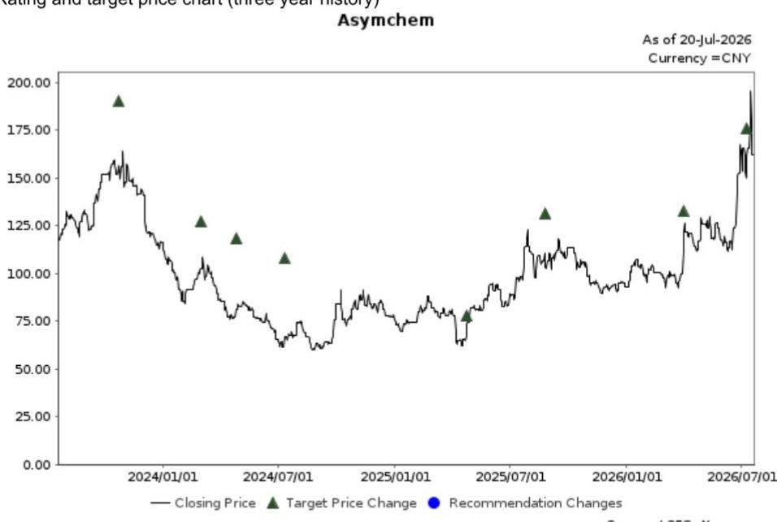
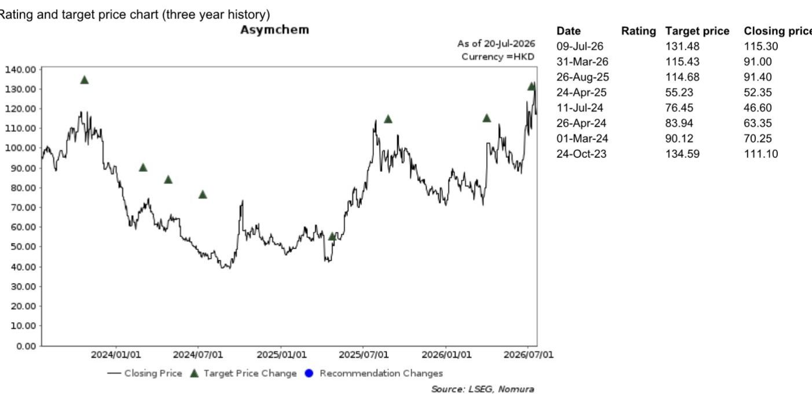

# 行业观察：医疗健康与制药领域

## 三星生物收购PolyPeptide要约的关联分析

**反映多肽CDMO业务的吸引力，但短期内对相关企业影响有限**

7月20日上午（当地时间），三星生物（207940 KS）宣布收购PolyPeptide Group AG（PPGN SW）100%股权，进入多肽CDMO领域。韩国研究团队已就此发布相关报告。

我们认为，这一交易反映了多肽CDMO的吸引力，正如我们在前期报告中所分析的：全球GLP-1受体激动剂的强劲需求为亚洲参与者带来机遇，而多肽CDMO正是其主要应用领域。全球多肽CDMO市场也在快速增长。

据我们了解，多肽CDMO的进入门槛相对较高，因为从零开始需要大量投入，更重要的是，生产能力至关重要。这解释了为何相关企业近年来持续加大资本支出，也说明了三星生物为何选择收购PolyPeptide——尽管后者在过去三年连续亏损。

根据PolyPeptide的数据，其2025财年销售额为3.89亿欧元，2023-2025年复合年增长率为10%；而相关企业的TIDES业务在2025年销售额达到110亿元人民币（按我们计算约14亿欧元），同期复合年增长率为49%。

正如我们在前期报告中所述，我们认为亚洲CDMO的优势在于效率，三星生物的短期目标可能是获取多肽CDMO技术并整合PolyPeptide，而非大规模扩张。

在此背景下，我们预计短期内PolyPeptide不会出现大规模产能扩张，从而对现有企业的市场地位构成挑战。

关于海外CDMO设施的运营，过去几年我们观察到部分企业在收购海外设施后出现利润率波动，因此三星生物能否有效实现PolyPeptide的扭亏为盈，值得持续关注。

---

**研究分析师**

中国医疗健康与制药  
张嘉琳，CFA，CPA - NIHK  
jialin.zhang@NOM.com  
+852 2252 6134

---

## 附录A-1

本报告由NOM International (Hong Kong) Ltd. (NIHK) 编制。免责声明详见NOM集团实体详情。

## 分析师认证

本人张嘉琳特此证明：(1) 本研究报告中所表达的观点准确反映了我个人对所涉及证券或发行人的看法；(2) 我的薪酬中没有任何部分直接或间接与本研究报告中提出的具体建议或观点相关；(3) 我的薪酬中没有任何部分与NOM Securities International, Inc.、NOM International plc或任何其他NOM集团公司进行的特定投资银行业务挂钩。

## 发行人特定监管披露

本文中使用的"NOM"和"NOM集团"指NOM Holdings, Inc.及其关联公司和子公司，包括NOM Securities International, Inc. ('NSI') 和Instinet, LLC ('ILLC')，均为美国注册经纪交易商及SIPC成员。

## 主要提及的发行人

<table><tr><td>发行人</td><td>代码</td><td>价格</td><td>价格日期</td><td>评级</td><td>行业评级</td><td>披露</td></tr><tr><td>Asymchem</td><td>002821 CH</td><td>CNY 162.51</td><td>2026年7月20日</td><td>正面</td><td>不适用</td><td></td></tr><tr><td>Samsung Biologics</td><td>207940 KS</td><td>KRW 1,345,000</td><td>2026年7月20日</td><td>正面</td><td>不适用</td><td></td></tr><tr><td>Wuxi Apptec</td><td>2359 HK</td><td>HKD 157.20</td><td>2026年7月20日</td><td>正面</td><td>不适用</td><td></td></tr><tr><td>Wuxi Apptec</td><td>603259 CH</td><td>CNY 124.22</td><td>2026年7月20日</td><td>正面</td><td>不适用</td><td></td></tr><tr><td>Asymchem</td><td>6821 HK</td><td>HKD 121.00</td><td>2026年7月20日</td><td>正面</td><td>不适用</td><td></td></tr></table>

## Asymchem (002821 CH)

评级与目标价图表（三年历史）

CNY 162.51 (2026年7月20日) 正面 (行业评级: 不适用)

<table><tr><td>日期</td><td>评级</td><td>目标价</td><td>收盘价</td></tr><tr><td>2026年7月9日</td><td></td><td>175.98</td><td>161.23</td></tr><tr><td>2026年3月31日</td><td></td><td>132.37</td><td>110.77</td></tr><tr><td>2025年8月26日</td><td></td><td>131.51</td><td>103.30</td></tr><tr><td>2025年4月24日</td><td></td><td>77.96</td><td>73.77</td></tr><tr><td>2024年7月11日</td><td></td><td>107.91</td><td>66.52</td></tr><tr><td>2024年4月26日</td><td></td><td>118.48</td><td>80.99</td></tr><tr><td>2024年3月1日</td><td></td><td>127.21</td><td>102.24</td></tr><tr><td>2023年10月24日</td><td></td><td>189.98</td><td>156.46</td></tr></table>

评级说明请参见图表后的评级标准

估值方法 我们基于DCF模型得出目标价CNY175.98，假设加权平均资本成本为10.0%，终值增长率为4.0%。该公司的基准指数为沪深300。可能影响目标价实现的风险包括：(1) 因潜在产能过剩导致订单不及预期；(2) 未能获得新项目；(3) 海外业务亏损扩大

<table><tr><td>日期</td><td>评级</td><td>目标价</td><td>收盘价</td></tr><tr><td>2026年4月22日</td><td></td><td>2,200,000.00</td><td>1,561,000.00</td></tr><tr><td>2026年1月21日</td><td></td><td>2,600,000.00</td><td>1,873,000.00</td></tr><tr><td>2025年11月27日</td><td></td><td>2,200,000.00</td><td>1,646,000.00</td></tr><tr><td>2025年3月14日</td><td>正面</td><td></td><td>1,006,028.00</td></tr><tr><td>2025年3月14日</td><td></td><td>1,400,000.00</td><td>1,006,028.00</td></tr><tr><td>2024年7月24日</td><td></td><td>840,000.00</td><td>845,216.00</td></tr><tr><td>2024年4月11日</td><td></td><td>780,000.00</td><td>760,982.00</td></tr><tr><td>2024年1月24日</td><td></td><td>750,000.00</td><td>754,281.00</td></tr><tr><td>2023年10月25日</td><td></td><td>720,000.00</td><td>692,063.00</td></tr></table>

<table><tr><td>日期</td><td>评级</td><td>目标价</td><td>收盘价</td></tr><tr><td>2026年7月9日</td><td></td><td>180.22</td><td>149.00</td></tr><tr><td>2026年2月11日</td><td></td><td>157.07</td><td>123.90</td></tr><tr><td>2025年11月28日</td><td></td><td>132.80</td><td>101.20</td></tr><tr><td>2025年10月27日</td><td></td><td>130.63</td><td>115.00</td></tr><tr><td>2025年7月10日</td><td></td><td>102.77</td><td>79.80</td></tr><tr><td>2025年3月18日</td><td></td><td>84.59</td><td>71.93</td></tr><tr><td>2025年2月19日</td><td></td><td>81.70</td><td>63.73</td></tr><tr><td>2024年10月24日</td><td></td><td>63.12</td><td>49.66</td></tr><tr><td>2024年7月23日</td><td></td><td>43.45</td><td>28.78</td></tr><tr><td>2024年3月19日</td><td></td><td>54.56</td><td>39.32</td></tr><tr><td>2024年3月4日</td><td></td><td>86.23</td><td>56.22</td></tr><tr><td>2023年10月12日</td><td></td><td>121.70</td><td>99.91</td></tr></table>

KRW 1,345,000 (2026年7月20日) 正面 (行业评级: 不适用)  
  
评级说明请参见图表后的评级标准

估值方法 我们的目标价KRW2,200,000基于DCF估值，假设：1) CMO业务收入在2026-2035年期间年增长10%，2) 2026-2035年平均营业利润率为47%，3) 加权平均资本成本为6.8%，终值增长率为3.0%。该公司的基准指数为KOSPI200。可能影响目标价实现的风险包括工厂建设延迟。

HKD 157.20 (2026年7月20日) 正面 (行业评级: 不适用)  
  
评级说明请参见图表后的评级标准

估值方法 我们基于DCF模型得出目标价HKD180.22，假设加权平均资本成本为10.1%，终值增长率为3.5%。该公司的基准指数为恒生指数。可能影响目标价实现的风险包括：(1) 因潜在竞争加剧或需求变化导致增长放缓；(2) 地缘政治因素：该公司被列入美国国防部更新的1260H清单，已就此提起诉讼

评级与目标价图表（三年历史）

HKD 121.00 (2026年7月20日) 正面 (行业评级: 不适用)

<table><tr><td>日期</td><td>评级</td><td>目标价</td><td>收盘价</td></tr><tr><td>2026年7月9日</td><td></td><td>131.48</td><td>115.30</td></tr><tr><td>2026年3月31日</td><td></td><td>115.43</td><td>91.00</td></tr><tr><td>2025年8月26日</td><td></td><td>114.68</td><td>91.40</td></tr><tr><td>2025年4月24日</td><td></td><td>55.23</td><td>52.35</td></tr><tr><td>2024年7月11日</td><td></td><td>76.45</td><td>46.60</td></tr><tr><td>2024年4月26日</td><td></td><td>83.94</td><td>63.35</td></tr><tr><td>2024年3月1日</td><td></td><td>90.12</td><td>70.25</td></tr><tr><td>2023年10月24日</td><td></td><td>134.59</td><td>111.10</td></tr></table>

CNY 124.22 (2026年7月20日) 正面 (行业评级: 不适用)  
  
评级说明请参见图表后的评级标准

<table><tr><td>日期</td><td>评级</td><td>目标价</td><td>收盘价</td></tr><tr><td>2026年7月9日</td><td></td><td>164.00</td><td>121.07</td></tr><tr><td>2026年2月11日</td><td></td><td>142.93</td><td>102.14</td></tr><tr><td>2025年11月28日</td><td></td><td>120.85</td><td>91.19</td></tr><tr><td>2025年10月27日</td><td></td><td>118.83</td><td>106.64</td></tr><tr><td>2025年7月11日</td><td></td><td>93.49</td><td>77.15</td></tr><tr><td>2025年3月18日</td><td></td><td>86.89</td><td>69.68</td></tr><tr><td>2025年2月19日</td><td></td><td>83.93</td><td>62.50</td></tr><tr><td>2024年10月24日</td><td></td><td>64.84</td><td>50.14</td></tr><tr><td>2024年7月23日</td><td></td><td>58.65</td><td>39.20</td></tr><tr><td>2024年3月19日</td><td></td><td>63.75</td><td>50.81</td></tr><tr><td>2024年3月4日</td><td></td><td>100.74</td><td>60.00</td></tr><tr><td>2023年10月12日</td><td></td><td>142.19</td><td>89.30</td></tr></table>

估值方法 我们基于DCF模型得出目标价CNY164.00，假设加权平均资本成本为10.1%，终值增长率为3.5%。该公司的基准指数为沪深300。可能影响目标价实现的风险包括：(1) 因潜在竞争加剧或需求变化导致增长放缓；(2) 地缘政治因素：该公司被列入美国国防部更新的1260H清单，已就此提起诉讼

## Asymchem (6821 HK)

  
评级说明请参见图表后的评级标准

估值方法 我们基于DCF模型得出目标价HKD131.48，假设加权平均资本成本为10.0%，终值增长率为4.0%。该公司的基准指数为恒生指数。可能影响目标价实现的风险包括：(1) 因潜在产能过剩导致订单不及预期；(2) 未能获得新项目；(3) 海外业务亏损扩大

## 重要披露

## 研究报告在线获取及利益冲突披露

NOM集团研究报告可在www.NOMnow.com/research、Bloomberg、Capital IQ、Factset、LSEG获取。

重要披露信息可访问 http://go.NOMnow.com/research/m/Disclosures 或向NOM Securities International, Inc.索取。如网站访问遇到问题，请发送邮件至grpsupport@NOM.com寻求帮助。

编制本报告的分析师的薪酬基于多种因素，包括公司总收入，其中一部分来自投资银行业务。除非另有说明，本报告封面列出的非美国分析师未在FINRA规则下注册/具备研究分析师资格，可能不是NSI的关联人员，且可能不受FINRA Rule 2241关于与受覆盖公司沟通、公开露面及研究分析师账户持有证券交易等限制的约束。

NOM Global Financial Products Inc. (NGFP)、NOM Derivative Products Inc. (NDP) 和 NOM International plc. (NIplc) 已在美国商品期货交易委员会和美国期货协会注册为掉期交易商。NGFP、NDPI和NIplc主要从事掉期及其他衍生品交易，其中部分可能为本报告的主题。

## 评级分布（NOM集团）

NOM集团全球股票研究发布的所有评级分布如下：

58%被授予正面评级，根据强制性披露要求，归类为报告评级；其中33%的公司为NOM集团的投资银行客户*。0%的公司（在EEA受监管市场上市）曾接受NOM集团提供的实质性服务**。

39%被授予中性评级，根据强制性披露要求，归类为持有评级；其中57%的公司为NOM集团的投资银行客户*。0%的公司（在EEA受监管市场上市）曾接受NOM集团提供的实质性服务。

3%被授予负面评级，根据强制性披露要求，归类为报告评级；其中15%的公司为NOM集团的投资银行客户*。0%的公司（在EEA受监管市场上市）曾接受NOM集团提供的实质性服务。

*NOM集团定义见本报告末尾的免责声明部分。
**根据欧盟市场滥用监管法规的定义。

## NOM集团股票研究评级体系及行业定义

评级体系为相对体系，表示相对于为每只股票确定的特定基准的预期表现，受有限的管理裁量权约束。分析师的目标价是基于适当的估值方法对股票当前内在公允价值的评估。估值方法包括但不限于贴现现金流分析、预期净资产回报表现和倍数分析。分析师也可能指出相对于所述目标价的预期相对上涨/下跌空间，定义为（目标价 - 当前价格）/当前价格。

## 股票

"正面"评级表示分析师预期该股票在未来12个月内将跑赢基准。"中性"评级表示分析师预期该股票在未来12个月内将与基准表现一致。"负面"评级表示分析师预期该股票在未来12个月内将跑输基准。"暂停"评级表示评级、目标价和预估已暂时暂停，以遵守适用法规和/或公司政策。标记为"未评级"或显示为"无评级"的证券和/或公司不在常规研究覆盖范围内。读者不应期望NOM就此类证券和/或公司提供持续或额外的信息。基准如下：美国/欧洲/亚洲（除日本）：请参阅估值方法中关于股票相关基准的解释，可访问：http://go.NOMnow.com/research/m/Disclosures；全球新兴市场（除亚洲）：MSCI新兴市场除亚洲指数，除非估值方法中另有说明；日本：Russell/NOM大盘指数。

## 行业

"看好"立场表示分析师预期该行业在未来12个月内将跑赢基准。"中性"立场表示分析师预期该行业在未来12个月内将与基准表现一致。"看淡"立场表示分析师预期该行业在未来12个月内将跑输基准。标记为"未评级"或显示为"不适用"的行业不分配评级。基准如下：美国：标普500指数；欧洲：道琼斯STOXX 600指数；全球新兴市场（除亚洲）：MSCI新兴市场除亚洲指数。日本/亚洲（除日本）：不分配行业评级。

## 目标价

目标价（如有讨论）表示分析师对未来12个月股价的预测，部分反映了分析师对公司盈利的预估。任何目标价的实现可能受到整体市场和宏观经济趋势、与公司或市场相关的其他风险的阻碍，如果公司盈利与预估不符，则可能无法实现。

## 免责声明

本出版物包含由第1页确定的NOM集团实体编制的内容，并可能包含一个或多个NOM集团实体的贡献，其员工及其各自隶属关系在第1页或本出版物其他地方指定。本文中使用的"NOM集团"指NOM Holdings, Inc.及其关联公司和子公司，包括：(a) NOM Securities Co., Ltd. ('NSC') 东京，日本；(b) NOM Financial Products Europe GmbH ('NFPE')，德国；(c) NOM International plc ('NIplc')，英国；(d) NOM Securities International, Inc. ('NSI')，纽约，美国；(e) NOM International (Hong Kong) Ltd. ('NIHK')，香港；(f) NOM Financial Investment (Korea) Co., Ltd. ('NFIK')，韩国（在韩国金融投资协会注册的NOM分析师信息可在KOFIA内联网http://dis.kofia.or.kr获取）；(g) NOM Singapore Ltd. ('NSL')，新加坡（注册号197201440E，受新加坡金融管理局监管）；(h) NOM Australia Ltd. ('NAL')，澳大利亚（ABN 48 003 032 513），受澳大利亚证券和投资委员会监管，持有澳大利亚金融服务牌照号246412；(i) NOM Securities Malaysia Sdn. Bhd. ('NSM')，马来西亚；(j) NIHK, Taipei Branch ('NITB')，台湾；(k) NOM Financial Advisory and Securities (India) Private Limited ('NFASL')，孟买，印度；(l) NOM Fiduciary Research & Consulting Co., Ltd. ('NFRC') 东京，日本；(m) NOM Orient International Securities Co., Ltd ("NOI")，是NOM集团、东方国际（集团）有限公司和上海黄浦投资控股（集团）有限公司共同控股的合资企业。

本材料：(I) 仅供您私人参考，我们不据此征求任何行动；(II) 不构成在任何司法管辖区出售或购买任何证券的要约或要约邀请；(III) 除与NOM集团相关的披露外，基于我们认为可靠的来源信息，但未经NOM集团独立核实。

除与NOM集团相关的披露外，NOM集团不保证、陈述或承诺（明示或暗示）本文件的公平性、准确性、完整性、正确性、可靠性或适用于任何特定目的或适销性，并且在适用法律/法规允许的最大范围内，不对因使用本文件及相关数据而产生的任何行为（或不作为决定）承担责任。在适用法律/法规允许的最大范围内，NOM集团的所有保证和其他保证特此排除，NOM集团不对因使用、滥用或分发本材料或其中包含的信息或以其他方式与之相关的任何损失承担责任。

所表达的意见或估计为原始出版日期时的当前意见，本材料中的信息（包括其中包含的意见和估计）如有变更，恕不另行通知。但NOM集团明确声明没有义务更新或修订本文件。本文中的任何评论或陈述均为作者本人的观点，可能与NOM集团内部其他方的观点不同。客户应考虑本报告中的任何建议或推荐是否适合其特定情况，并在适当时寻求专业建议，包括税务建议。NOM集团不提供税务建议。

在适用法律/法规允许的范围内，NOM集团及其高级职员、董事、员工和关联方可能作为委托人、代理人或其他身份，或持有发行人证券、商品或工具或基于其的期权或其他衍生工具的多头或空头头寸，或买卖这些工具。NOM集团公司也可能担任发行人金融工具的市场做市商或流动性提供者。如果市场做市商活动符合美国或其他司法管辖区特定法律法规的定义，将在特定发行人披露中单独说明。

本文件可能包含从第三方获得的信息，包括但不限于信用评级机构的评级。NOM集团特此明确否认对本材料中包含的或与之相关的任何从第三方获得的信息的原创性、公平性、准确性、完整性、正确性、适销性或适用于特定目的的所有陈述、保证或承诺，并且不对因使用或滥用本材料中包含的或与之相关的任何从第三方获得的信息而产生的任何直接、间接、附带、示范性、补偿性、惩罚性、特殊或后果性损害、成本、费用、法律费用或损失承担责任。禁止以任何形式复制和分发第三方内容，除非事先获得相关第三方的书面许可。第三方内容提供者不保证（明示或暗示）任何信息（包括评级）的公平性、准确性、完整性、正确性、及时性或可用性，并且不对因使用或滥用此类内容而产生的任何错误或遗漏（无论原因如何）或结果负责。第三方内容提供者不提供任何明示或暗示的保证，包括但不限于适销性或适用于特定目的或用途的任何保证。第三方内容提供者不对因使用或滥用其内容（包括评级）而产生的任何直接、间接、附带、示范性、补偿性、惩罚性、特殊或后果性损害、成本、费用、法律费用或损失承担责任。信用评级是意见陈述，不是购买、持有或出售证券的事实陈述或建议。它们不涉及证券的适合性或证券用于投资目的的适合性，不应作为研究交流依赖。

本文件中的任何MSCI来源信息均为MSCI Inc.的专有财产。未经MSCI事先书面许可，不得为任何目的复制、转载、重新分发或使用此信息及任何其他MSCI知识产权，包括创建任何金融产品和任何指数。此信息按"现状"提供。用户承担使用此信息的全部风险。MSCI、其关联方及任何参与计算或编制信息的第三方特此明确否认对本材料或其中包含的信息或与之相关的任何原创性、公平性、准确性、完整性、正确性、适销性或适用于特定目的的所有陈述、保证或承诺。在不限制前述规定的情况下，MSCI、其任何关联方或任何参与计算或编制信息的第三方在任何情况下均不对任何类型的任何损害承担责任。MSCI和MSCI指数是MSCI及其关联方的服务标志。

Russell/NOM日本股票指数的知识产权和其他权利属于NOM Fiduciary Research & Consulting Co., Ltd. ("NFRC") 和FTSE Russell ("Russell")。NFRC和Russell不保证指数的公平性、准确性、完整性、正确性、可靠性、有用性、适销性、适销性或适用于特定目的，并且不对任何指数用户和/或其关联方使用指数进行的业务活动或服务负责。

读者应将本文件视为做出投资决策的单一因素，因此，本报告不应被视为识别或建议与任何投资决策相关的所有直接或间接风险。NOM集团制作多种不同类型的研究产品，包括基本面分析和定量分析等；一种研究产品中包含的建议可能因时间跨度、方法论或其他原因而与其他类型研究产品中的建议不同。NOM集团以多种不同方式发布研究产品，包括在NOM集团门户网站上发布和/或直接分发给客户。不同客户群体可能根据其个人需求从研究部门获得不同的产品和服务。

本文中呈现的数字可能涉及过去表现或基于过去表现的模拟，这些不是未来或可能表现的可靠指标。如果信息包含对未来表现和业务前景的预期、预测或指示，此类预测可能不是未来或可能表现的可靠指标。此外，模拟基于模型和简化假设，可能过度简化且不能反映未来的回报分布。本文件中为说明目的创建和发布的任何数字、策略或指数不旨在作为欧洲基准监管法规定义的"基准"使用。某些证券受汇率波动影响，可能对投资的价值、价格或收入产生不利影响。

关于固定收益研究：建议分为两类：战术性建议（通常持续最多三个月）或战略性建议（通常持续6-12个月）。然而，交易建议可能随时根据情况变化进行审查。交易还提供"止损"水平，一旦触及，将自动关闭交易建议。建议中显示的价格和回报表现是在提交发布时获取的，基于当时Bloomberg、LSEG或NOM的指示性价格和回报表现。显示的价格和回报表现不一定是交易建议可以实施的价格和回报表现。

本文所述的证券可能未根据美国1933年证券法注册，在这种情况下，除非已根据1933年证券法注册或符合注册要求的豁免条件，否则不得在美国或向美国人发行或出售。除非适用法律允许，任何交易应通过您所在司法管辖区的NOM实体执行。

本文件已获批准在英国由NIplc作为投资研究分发。NIplc由审慎监管局授权，受金融行为监管局和审慎监管局监管。NIplc是伦敦证券交易所成员。本文件不构成英国适用法规意义上的个人推荐，也未考虑个别读者的特定投资目标、财务状况或需求。本文件仅面向符合英国适用法规目的的"合格交易对手"或"专业客户"，因此不得重新分发给"零售客户"。

本文件已获批准在欧洲经济区由NOM Financial Products Europe GmbH ("NFPE")作为投资研究分发。NFPE是一家根据德国法律注册成立的有限责任公司，在法兰克福/美因法院商业登记处注册，注册号HRB 110223。NFPE由德国联邦金融监管局授权和监管。

本文件已由NIHK批准，NIHK受香港证券及期货事务监察委员会监管，可在香港分发。本文件仅面向符合香港适用法规目的的"专业读者"，因此不得重新分发给非"专业读者"。

本文件已获批准在澳大利亚由NAL分发，NAL由澳大利亚证券和投资委员会授权和监管。

本文件也已获批准在马来西亚由NSM分发。

在新加坡，本文件由NSL分发，NSL是根据金融顾问法定义的豁免金融顾问，受新加坡金融管理局监管。NSL可根据金融顾问条例第32C条安排分发其外国关联公司制作的此文件。本文件面向根据证券和期货法定义的认可、专家或机构读者。如果本文件的接收者不是认可、专家或机构读者，NSL仅在法律要求的范围内对此类接收者承担本文件内容的法律责任。新加坡的接收者应就本文件引起或与之相关的事项联系NSL。本文件旨在广泛分发。它未考虑任何特定个人的具体投资目标、财务状况或特殊需求。接收者在做出购买任何证券的承诺之前，应考虑其具体的投资目标、财务状况或特殊需求，包括根据其认为合适的方式，通过单独约定寻求独立财务顾问关于投资适合性的建议。

除非1933年证券法S条例的规定禁止，本材料在美国由NSI（美国注册经纪交易商）分发，NSI根据1934年美国证券交易法Rule 15a-6的规定对其内容承担责任。编制本文件的实体允许NOM集团内独立运营的关联公司向其客户提供此类文件的副本。

本文件未获批准分发给沙特阿拉伯王国中除"授权人士"、"豁免人士"或"机构"（由资本市场管理局定义）以外的人士，或阿拉伯联合酋长国中除"市场交易对手"或"专业客户"（由迪拜金融服务局定义）以外的人士，或卡塔尔国中除"市场交易对手"或"商业客户"（由卡塔尔金融中心监管局定义）以外的人士。未经授权的人士不得将本文件或其任何副本带入、传输或分发到沙特阿拉伯、阿联酋或卡塔尔，或分发给沙特阿拉伯境内的除"授权人士"、"豁免人士"或"机构"以外的任何人，或阿联酋境内的除"市场交易对手"或"专业客户"以外的任何人，或卡塔尔境内的除"市场交易对手"或"商业客户"以外的任何人。未能遵守这些限制可能构成违反阿联酋、沙特阿拉伯或卡塔尔法律的行为。

对于涉及台湾上市公司或由台湾研究分析师撰写的报告：

本文件仅供参考。您应独立评估投资风险，并对您的投资决策全权负责。未经NOM集团书面授权，任何媒体或个人不得复制或引用本报告的任何部分。根据台湾《证券商受托买卖有价证券管理规则》或其他适用法律法规，您不得将报告提供给他人（包括但不限于关联方、关联公司和任何其他第三方）或从事可能与报告产生利益冲突的任何活动。关于NOM International (Hong Kong) Ltd., Taipei Branch不可执行的证券/工具的信息仅供参考，不构成对此类证券/工具的交易推荐或要约邀请。

本材料不得在印度尼西亚境内分发，也不得以构成印度尼西亚共和国法律规定的公开发售的方式传递给印度尼西亚共和国境内的人士或印度尼西亚公民（无论其居住地或所在地）或印度尼西亚的实体或居民。本文件中提及的证券不得在印度尼西亚或向印度尼西亚公民（无论其居住地或所在地）或印度尼西亚的实体或居民以构成印度尼西亚共和国法律规定的公开发售的方式发行或出售。

研究报告封面上的NOI旁边的个人姓名表示本文件是NOI在中国发布的研究报告的翻译版本。在所有其他情况下，本文件由未在中国获得提供证券研究许可的NOM集团或其子公司或关联公司编制。本研究报告未获批准或旨在在中国境内分发。其中的A股相关分析（如有）并非为位于或注册在中国的任何人制作。接收者不应依赖本研究报告中包含的任何信息做出投资决策，NOM集团对此不承担任何责任。未经NOM集团成员事先书面同意，不得以任何形式或任何方式复制、影印、复制或复印本材料的任何部分，或重新分发、重新发布或重新分发。

如果本文件通过电子传输方式分发，例如电子邮件，则无法保证此类传输安全无误，因为信息可能被拦截、篡改、丢失、破坏、延迟到达或不完整，或包含病毒。因此，发送方不对因电子传输可能产生的本文件内容中的任何错误或遗漏承担责任。

NOM集团通过其合规政策和程序（包括但不限于利益冲突、中国墙和保密政策）以及维护中国墙和员工培训来管理与研究制作相关的利益冲突。

关于本文件中包含的任何研究交流的制作中使用的方法论或模型的更多信息，可联系封面列出的NOM研究分析师索取。披露信息可应要求提供，披露信息可在NOM披露网页获取：

http://go.NOMnow.com/research/m/Disclosures

版权所有 © 2026 NOM International (Hong Kong) Ltd.，香港。保留所有权利。
