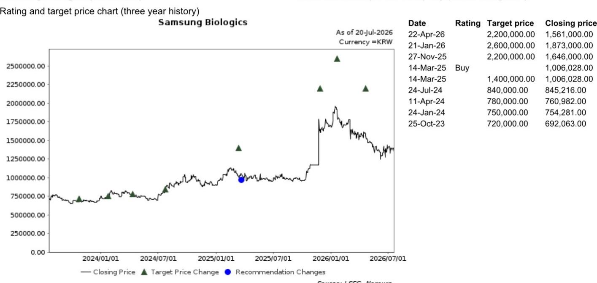
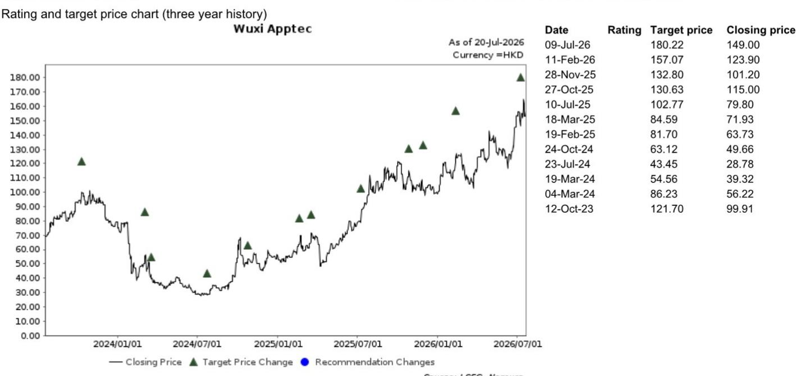
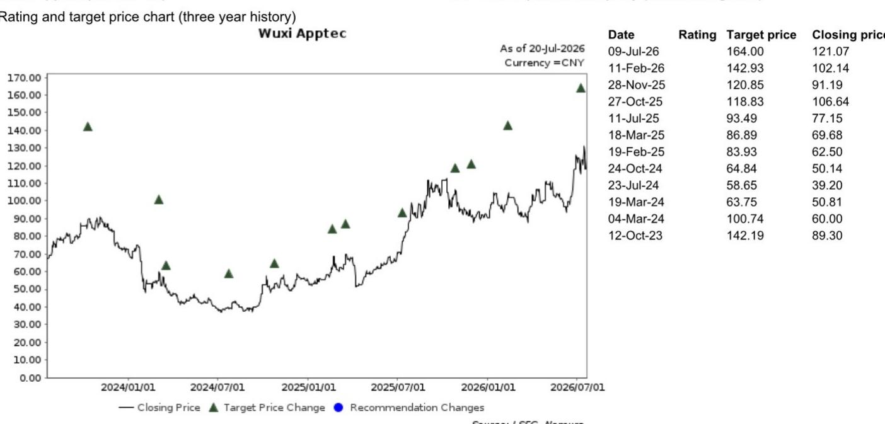

# 行业观察：三星生物收购多肽CDMO的启示

2026年7月20日，三星生物宣布收购欧洲多肽CDMO企业PolyPeptide Group全部股权，正式进入多肽CDMO领域。相关研究团队在当天发布的报告中认为，这笔交易反映了多肽CDMO业务的吸引力，但短期内不会对国内CDMO企业构成实质性影响。

报告的核心判断建立在一个关键对比上：PolyPeptide 2025财年销售额为3.89亿欧元，2023-2025年复合增长率约10%；而药明康德TIDES业务同期收入达到约110亿元人民币（估算约14亿欧元），复合增长率高达49%。两者规模差距超过3倍，增速差距接近5倍。

> **观察评论：** 这个增速差是理解整份报告的关键。三星生物买下的是一家年增长10%的欧洲企业，而国内头部CDMO的多肽业务正以接近50%的速度扩张。两者不在同一量级。

## 1. 多肽CDMO的进入壁垒决定了收购而非自建

报告指出，多肽CDMO的进入壁垒相对较高。从零开始建立产能需要大量投入，而制造能力本身是竞争的核心要素。这解释了为何药明康德和康龙化成在过去几年持续进行大规模资本开支，也解释了为何三星生物选择收购一家连续三年亏损的企业——获取现成的技术能力和产能体系，而非从零开始建设。

报告认为，三星生物的短期目标应是获得多肽CDMO的技术know-how并完成整合，而非立即进行大规模产能扩张。

## 2. 亚洲CDMO的核心竞争力在于效率而非规模

在更早发布的锚定报告中已提出一个判断框架：亚洲CDMO的竞争优势在于效率。这一框架同样适用于理解本次收购。

三星生物在抗体CDMO领域已建立规模优势，但多肽CDMO的技术路径、工艺要求和客户关系与抗体CDMO存在差异。报告认为，三星生物短期内不太可能对PolyPeptide进行大规模产能扩张，这意味着国内CDMO企业的产能优势和客户粘性不会受到直接冲击。

## 3. 海外运营的历史经验提供了观察窗口

报告提供了一个值得关注的观察维度：过去几年，多家国内CDMO企业在运营海外收购设施时，都经历了利润率被影响的阶段。报告认为，三星生物能否高效完成PolyPeptide的扭亏，需要持续跟踪。

这一判断隐含了一个可复用的观察框架：对于CDMO企业而言，收购海外资产的真正考验不在于交易本身，而在于整合后的运营效率。如果三星生物在整合过程中出现利润率下滑或客户流失，反而可能为国内CDMO企业争取更多时间窗口。

## 4. 全球GLP-1需求是多肽CDMO增长的底层驱动力

在锚定报告中已明确指出，全球GLP-1受体激动剂的强劲需求是多肽CDMO市场快速增长的主要驱动力。三星生物的收购行为，从侧面验证了这一判断。

对于国内CDMO企业而言，当前的市场格局并未因这笔交易而发生根本性变化。药明康德和康龙化成在多肽CDMO领域已建立的产能规模、客户基础和增长速度，构成了短期内难以被挑战的竞争壁垒。

For informational purposes only. Portions may be generated,translated,summarized,or edited with AI assistance based on source materials and may contain omissions or errors. Please verify independently. This is not investment,legal,tax,accounting,or other professional advice.

For informational purposes only. Portions may be generated,translated,summarized,or edited with AI assistance based on source materials and may contain omissions or errors. Please verify independently. This is not investment,legal,tax,accounting,or other professional advice.

