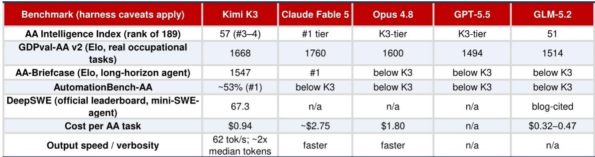
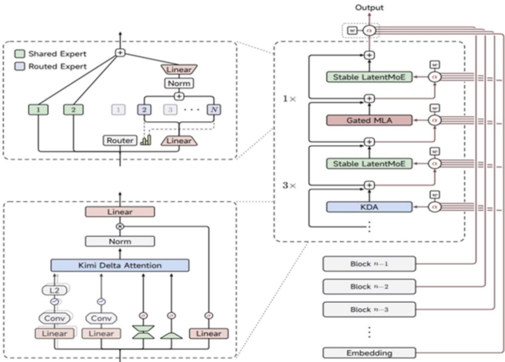

# NOM：KimiK3发布后全球AI供应链竞争与需求逻辑

2026年7月16日，世界人工智能大会开幕前一天，月之暗面发布了Kimi K3——一个2.8万亿参数的开源大语言模型。在Artificial Analysis的独立评测中，K3的智能指数排名第三，仅次于Claude Fable 5和GPT-5.6 Sol，与Claude Opus 4.8和GPT-5.5处于同一梯队。但更值得关注的不是排名本身，而是K3的定价策略：每任务成本约0.94美元，约为Opus 4.8的一半、Fable 5的三分之一，但却是其前代旗舰模型K2.6的四倍。NOM认为，这标志着月之暗面从低价路线转向“高性价比”定位，而这一转变对全球AI供应链的影响，可能比模型排名本身更具结构性意义。

## 1. 中国开源模型在全球开发者中的token用量已超过45%

K3并非孤立事件。根据Open Router的统计，中国模型在全球开发者token用量中的占比，已从一年前的不到2%升至超过45%。NOM认为，中国大模型厂商（包括闭源和开源）正在全球市场持续获得份额，其提供的低成本高效模型能够满足广泛的IT工作负载需求。与此同时，高质量全球大模型可能会加速创新，专注于最复杂的科学类工作负载，以维持技术和定价溢价。由于地缘政治不确定性和脱钩趋势，主权AI趋势将更加普遍——多数国家或企业难以接受仅依赖少数精英俱乐部提供所有生成式AI工作负载。因此，只要保持技术领先，中美两国的头部大模型厂商都有增长空间。

> **KC评论：** 45%的token占比是一个容易被低估的数字。它说明中国模型已经从“跟随者”变成了全球开发者生态中的主要供给方，而不仅仅是国内市场的替代品。这一变化对云平台、芯片采购和模型定价都会产生连锁影响。

## 2. K3的核心突破在于长周期智能体工作，而非对话能力

K3的关键技术特征包括原生视觉支持、100万token上下文窗口和持续推理能力。其架构基于Kimi Delta Attention和Attention Residuals，配合扩展的混合专家模型，整体扩展效率相比K2提升了约2.5倍。在应用层面，月之暗面展示了多个长周期智能体工作案例：一个48小时无人值守的芯片设计流程（基于开源EDA，在45nm工艺上实现了100MHz时序收敛、146万单元）；一个交互式42年ASIC行业研究网站，经过120多轮递归自我改进；以及一个391事件引力波分析，协调了20多个并发子智能体。这些案例表明，K3被设计用于执行需要持续数小时甚至数天的复杂任务，而非简单的对话问答。

## 3. 计算需求：预训练和后训练规模法则仍然有效

NOM认为，K3的成功并未削弱对LLM训练的需求，反而强化了规模法则——更多计算能力可能带来更好的性能。由于大模型尚未达到性能极限，对先进计算能力的需求仍将保持强劲。具体而言，头部大模型厂商将加速向最先进的GPU或ASIC平台迁移，以区分其前沿模型的性能。随着K3等模型扩展业务边界，推理工作负载将获得动力，ASIC供应链可能继续受益。NOM在近期报告中指出，AI周期尚未达到峰值，超大规模云厂商的支出仍有上行空间至2027年。全球新建数据中心跟踪数据显示进一步上行。

## 4. 网络与IDC：大规模AI工厂和超级节点驱动结构性需求

K3展示的长周期编码、智能体工作以及多模态应用（视觉设计、游戏开发、数字创作）都是高token消耗的工作负载。NOM认为，大规模AI工厂的普及将支撑对先进网络技术和解决方案的强劲需求。在中国AI供应链中，超级节点已成为一个重要趋势，它有助于弥补中国计算芯片性能与全球同行之间的差距，为网络解决方案提供商带来结构性增长机会。在IDC和云平台方面，AI云平台可从三个方向受益：模型即服务需求、更强的议价能力（托管多种先进开源模型）、以及更高的利润率扩展潜力（提供从基础设施到应用层的完整生态）。

## 5. 软件与应用：LLM颠覆带来不确定性，垂直领导者将脱颖而出

软件和应用市场仍面临LLM颠覆的不确定性。NOM认为，前沿大模型的进步可能通过提供编码和智能体解决方案，降低小型AI初创企业或企业开发自有AI应用的门槛，从而削弱许多通用软件公司的竞争优势。但能够适应生成式AI市场的垂直领导者最终将脱颖而出。NOM看好金蝶和金山办公在中国软件板块的表现。

Kimi K3的发布再次引发市场对计算需求是否会被削弱的讨论。NOM的判断是：竞争不会停止，规模法则仍在生效，而这一竞争对AI基础设施价值链是积极的。问题不在于“是否需要更多计算”，而在于“谁的计算能支撑下一代智能体工作负载”。

For informational purposes only. Portions may be generated,translated,summarized,or edited with AI assistance based on source materials and may contain omissions or errors. Please verify independently. This is not investment,legal,tax,accounting,or other professional advice.

