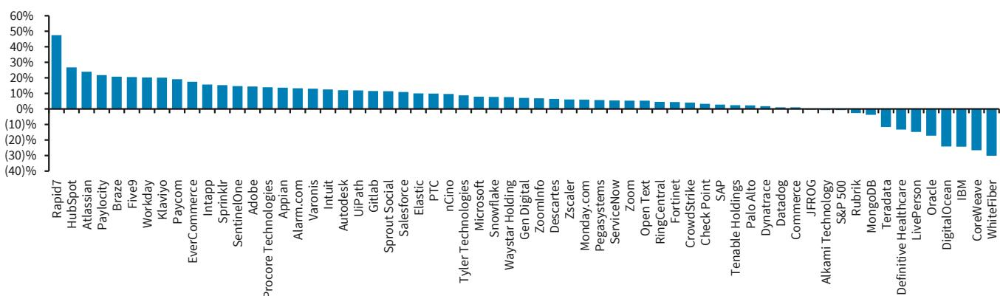
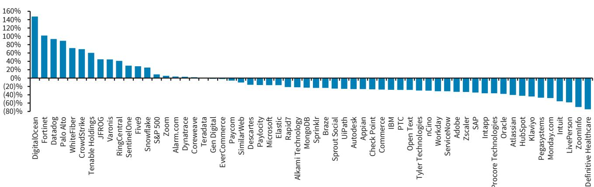

# U.S. Software

## The Q2 On-Cycle Earnings Guide – A Measured Perspective

We view Q2 earnings as a continuation of trends observed in Q1. It remains early for SaaS names (NOW, HUBS etc.) to demonstrate significant AI-related upside, which suggests limited potential for a major shift in sentiment at this stage. Infrastructure names like DDOG are expected to show ongoing momentum. We maintain a constructive view on MSFT.

**Raimo's Read on Q2:** We anticipate another period of notable movement in software results. Overall spending patterns remain steady, though there is a potential crowding-out effect, as highlighted by the recent IBM pre-announcement. However, that appeared more related to capital expenditure than operating expenditure. The broader consideration is that we are still in the early stages of AI monetization for many of the names we cover. This means the core question for our space remains: how do you demonstrate AI success when overall numbers are not moving higher? We expect steady results for SaaS names like NOW or HUBS, but that may not be sufficient to shift sentiment on these names, as the AI component is still too small to trigger significant estimate revisions. Investors are looking for acceleration stories (see SNOW last quarter). Here, we think DDOG remains well-positioned as growing AI momentum drives the need for more DDOG observability (and hence higher estimates). Microsoft could also show a modest acceleration in Azure growth and may attract renewed attention. Lastly, we believe the payroll names have a favorable setup.

**MSFT – Modest Acceleration and Measured Expectations:** We have a constructive view on MSFT for Q2 results. The name has not been a primary focus for investors in recent quarters. We do not anticipate a major change in this dynamic, but acknowledge that Azure growth could show a modest acceleration in the low 40% range (guidance is 39-40% YoY). Management will likely discuss the usage of its own LLMs, which demonstrates growing independence from frontier model providers. Lastly, buy-side capital expenditure expectations seem to be in the $250-270bn range already, which should limit negative surprises. In other words, there does not appear to be a strong catalyst, but solid numbers against a backdrop of very measured expectations.

**HCM/Payroll Software – Healthy Beat & Raise Potential Against Measured Expectations:** We see constructive setups for Paycom and Paylocity with muted sentiment for back-office HCM/payroll peers pairing well with potential for solid beat & raise quarters. For PAYC, consensus is modeling ~7% recurring revenue ex-float growth and muted adj. EBITDA margin expansion, which leaves room for a modest 1-1.5% beat and a slight raise to FY26 total revenue and adj. EBITDA guidance. Paylocity also has a relatively undemanding setup with consensus expecting growth to decelerate ~200bps to 9.6% y/y and Q2 adj. EBITDA to contract ~200bps y/y (~135bps ex-float). Further, PCTY is reporting its fiscal Q4 2026 quarter where it is expected to give initial FY27 guidance, where we see bias for in-line to slight upside to consensus expectations that call for recurring revenue ex-float growth to decelerate to ~8% exiting FY27.

**AI Infrastructure Peers – Best Setup for DOCN Following Recent Performance, CRWV/WYFI More 2H Story:** We see a more favorable sentiment backdrop for the AI infrastructure pure-play names entering Q2 after the space has seen elevated concerns on component costs, competition and customer concentration risk (CRWV -37%, DOCN -30%, WYFI -30% last month vs. IGV +5%). However, we see these risks skewed more towards large players in the space (e.g. CRWV, ORCL) and hence, see the recent weakness creating an interesting entry point for DOCN that positively pre-announced earlier this month with ~29% Q2 total revenue growth, +$550mn in Q/Q RPO and increased FY27/FY28 capacity expansion expectations (see DigitalOcean: Positive Pre-Announcement Corroborates Capacity-Driven Acceleration Story, 7/7/26). For CRWV and WYFI, we see a better setup in 2H26 as Q2 is expected to be the trough in terms of profitability and revenue growth for the two companies respectively, that are both seeing short-term noise from large capacity deployments that are coming online (see within for details).

**Summary of Rating, Price Target, Model Changes 6**
**Recent Price Performance and Current Short Interest 7**
**Earnings Calendar 10**
**Valuation Table 11**
**Must See Charts For Q2 12**
**FX Fluctuations 12**
**Business & Employment Charts Indicate Improving Trends Exiting Q2 12**
**Developer Job Posts Highlight Positive Growth Trends Exiting Q2 14**
**Company Setups 16**
**Appian (UW/POS, PT $23) – Conservative Expectations and Potential for Better Momentum to Continue Sentiment Rebound 16**
**Atlassian (OW/POS, PT $112) – Expecting FY27 Guide to Be a Clearing Event Ahead of a Difficult Data Center Comp 18**
**CoreWeave (EW/POS, PT $90) – Sentiment More Balanced but 2H Profitability Ramp May Be Needed to Drive Upside Amid Industry Overhang 20**
**Datadog (OW/POS, PT $290) – AI and Core Momentum Should Continue to Power Acceleration Story 22**
**DigitalOcean (OW/POS, PT $160) – Limited Surprises Post Pre-Announcement but More Balanced Sentiment Creates Entry Point 24**
**Dynatrace (OW/POS, PT $48) – Stable Quarter, Though Likely Not Enough to Drive Share Inflection 25**
**HubSpot (OW/POS, PT $270) – Core Growth Drivers Intact, Though Slow Start Potentially Limits Q2 Beat Upside, Q3 Guide 26**
**IBM (OW/POS, PT $288) – Waiting for Answers 26**
**JFrog (OW/POS, PT $88) – Expecting a Q2 Cloud Accel and Healthy FY26 Guidance Raise 28**
**Klaviyo (OW/POS, PT $25) – Awaiting Growth Stabilization: Solid Execution May Not Be Enough to Shift Sentiment 29**
**Microsoft (OW/POS, PT $545) – Small Acceleration Could Be Enough 30**
**monday.com (OW/POS, PT $100) – AI Momentum Partially Offsetting Pricing Headwinds, but Growth Stabilization Remains the Key Debate 31**
**OpenText (EW/POS, PT $27) – Too Early to Get Excited 32**
**Paycom (EW/POS, PT $154) – Small Beat Against Low Expectations Could Continue Rebounding HCM/Payroll Sentiment 33**
**Paylocity (EW/POS, PT $128) – Small Beat Potential and Limited Surprises for FY27 Guidance Create Opportunity for Small Sentiment Improvement 35**
**Pegasystems (OW/POS, PT $48) – Steady Q2 and Expected 2H Ramp Creates Better Set-up in Q3/Q4 36**
**SAP (OW, $255 PT) – Q2 Should Be Solid but Unlikely to Be a Turning Point for the Shares 36**
**ServiceNow (OW, PT $134) - Q2 to Highlight AI Traction and Best-in-Class SaaS Metrics but More Excitement in 2H 38**
**Teradata (UW/POS, PT $28) – Tough Comp Could See Q2 ARR Growth Below 2-4% FY26 Guidance Range, Likely Not Enough Given Uncertain Backdrop 40**
**WhiteFiber (EW, $29 PT) - Focus on CapEx, Pipeline Build and NC-1 Progress to Determine Potential Binary Outcome 41**
**Company Snapshots 41**
**Appendix – Software Engineering Job Postings Methodology 53**

**Summary of our Ratings, Price Targets and Earnings Changes in this Report (all changes are shown in bold)**

<table><tr><td></td><td colspan="2">Rating</td><td>Price</td><td colspan="3">Price Target</td><td colspan="3">EPS FY1 (E)</td><td colspan="3">EPS FY2 (E)</td></tr><tr><td>Company</td><td>Old</td><td>New</td><td>20-Jul-26</td><td>Old</td><td>New</td><td>%Chg</td><td>Old</td><td>New</td><td>%Chg</td><td>Old</td><td>New</td><td>%Chg</td></tr><tr><td>U.S. Software</td><td>Pos</td><td>Pos</td><td></td><td></td><td></td><td></td><td></td><td></td><td></td><td></td><td></td><td></td></tr><tr><td>Atlassian (TEAM)</td><td>OW</td><td>OW</td><td>96.43</td><td>112.00</td><td>112.00</td><td>-</td><td>5.45</td><td>5.45</td><td>-</td><td>6.64</td><td>6.46</td><td>-3</td></tr><tr><td>CoreWeave, Inc (CRWV)</td><td>EW</td><td>EW</td><td>73.06</td><td>120.00</td><td>90.00</td><td>-25</td><td>-3.76</td><td>-4.13</td><td>-10</td><td>-3.70</td><td>-3.32</td><td>10</td></tr><tr><td>Datadog, Inc. (DDOG)</td><td>OW</td><td>OW</td><td>263.20</td><td>260.00</td><td>290.00</td><td>12</td><td>2.39</td><td>2.39</td><td>-</td><td>2.80</td><td>2.80</td><td>-</td></tr><tr><td>DigitalOcean (DOCN)</td><td>OW</td><td>OW</td><td>119.09</td><td>184.00</td><td>160.00</td><td>-13</td><td>1.32</td><td>1.44</td><td>9</td><td>1.18</td><td>1.02</td><td>-14</td></tr><tr><td>Dynatrace, Inc. (DT)</td><td>OW</td><td>OW</td><td>44.71</td><td>44.00</td><td>48.00</td><td>9</td><td>1.95</td><td>1.95</td><td>-</td><td>2.22</td><td>2.22</td><td>-</td></tr><tr><td>IBM Corp. (IBM)</td><td>OW</td><td>OW</td><td>213.00</td><td>350.00</td><td>288.00</td><td>-18</td><td>12.36</td><td>12.36</td><td>-</td><td>13.12</td><td>13.12</td><td>-</td></tr><tr><td>OpenText Corp. (OTEX)</td><td>EW</td><td>EW</td><td>23.33</td><td>27.00</td><td>27.00</td><td>-</td><td>4.19</td><td>4.18</td><td>-</td><td>4.42</td><td>4.40</td><td>-</td></tr><tr><td>Paycom (PAYC)</td><td>EW</td><td>EW</td><td>149.71</td><td>148.00</td><td>154.00</td><td>4</td><td>10.73</td><td>10.71</td><td>-</td><td>12.65</td><td>12.65</td><td>-</td></tr><tr><td>Paylocity Holding Corp (PCTY)</td><td>EW</td><td>EW</td><td>127.29</td><td>128.00</td><td>128.00</td><td>-</td><td>8.08</td><td>8.12</td><td>-</td><td>8.83</td><td>8.84</td><td>-</td></tr><tr><td>SAP SE (SAP)</td><td>OW</td><td>OW</td><td>158.35</td><td>257.00</td><td>255.00</td><td>-1</td><td>8.54</td><td>8.49</td><td>-1</td><td>10.11</td><td>10.01</td><td>-1</td></tr><tr><td>ServiceNow, Inc. (NOW)</td><td>OW</td><td>OW</td><td>104.70</td><td>134.00</td><td>134.00</td><td>-</td><td>4.01</td><td>4.01</td><td>-</td><td>5.02</td><td>5.02</td><td>-</td></tr><tr><td>WhiteFiber, Inc. (WYFI)</td><td>EW</td><td>EW</td><td>27.13</td><td>27.00</td><td>29.00</td><td>7</td><td>-0.74</td><td>-0.84</td><td>-14</td><td>-0.29</td><td>-0.33</td><td>-14</td></tr></table>

Source: BARC. Share prices and target prices are shown in the primary listing currency and EPS estimates are shown in the reporting currency. FY1(E): Current fiscal year estimates by BARC. FY2(E): Next fiscal year estimates by BARC. Stock Rating: OW: Overweight; EW: Equal Weight; UW: Underweight; RS: Rating Suspended Industry View: Pos: Positive; Neu: Neutral; Neg: Negative.

## Summary of Rating, Price Target, Model Changes

- **Atlassian:** We maintain our Overweight rating and our PT of $112. This valuation is now based on ~15x EV/CY27E FCF (unchanged) and CY27E FCF of ~$2.1 bil (prior: ~$2.12 bil). We updated some of our revenue estimates for TEAM (more below) to better reflect our expectations for its upcoming FY27 guide.
- **CoreWeave:** We maintain our Equal Weight rating and lower our price target to $90 (from $120) based on 36x CY27E EV/CY27E adj. EBIT (from 43x) and CY27E adj. EBIT of $3.61bn (unchanged). We lower our valuation multiple to reflect lower valuation levels for AI infrastructure peers.
- **Datadog:** We maintain our Overweight rating, and raise our PT to $290 (from $260) to reflect our stronger expectations for DDOG's near-term growth algorithm. Our PT is now based on ~75x CY27E FCF (prior: ~67x CY27E FCF) on our CY27 FCF estimate of ~$1,357mn (unchanged).
- **DigitalOcean:** We maintain our Overweight rating and lower our PT to $160 (from $184) based on 36x CY30E EPS of $6.20 discounted back to CY27E (implying $4.66, from $6.04 implying $4.60) to reflect lower peer group valuation levels. We updated our model slightly to better account for adj. EBITDA seasonality expectations in 2H26/1H27.
- **Dynatrace:** We maintain our Overweight rating, and raise our price target to $48 (from $44) to reflect our slightly more optimistic expectations for FY27 upside. Our PT is based on ~20x CY27E EV/FCF (prior: ~18x CY27E EV/FCF), and our CY27E FCF estimate of ~$677mn (unchanged).
- **IBM:** We maintain our Overweight rating and lower our price target to $288 (from $350) based on 18x EV/CY27E uFCF (from 21x) and CY27E uFCF of $18.4bn (unchanged). We lower our price target to account for IBM's weaker than expected pre-announcement and lower peer group valuation levels.
- **Paycom:** We maintain our Equal Weight rating and raise our price target to $154 (from $148) based on 13x EV/CY27E adj. FCF and CY27E FCF of $617mn (from $610mn) and update our model primarily to better reflect our expectations for Q3/Q4 revenue and cash flow seasonality.
- **OpenText:** We maintain our Equal Weight rating and our price target of $27. This valuation is based on ~10x CY27 uFCF (unchanged) and FCF of $1.20bn (from $1.21bn). We updated our model slightly to better reflect our expectations for its upcoming FY27 guide.
- **ServiceNow:** We maintain our Overweight rating and price target of $134 based on 20x EV/ CY27E FCF of $6.91bn (both unchanged). We update our model primarily to account for updated FX impacts.
- **WhiteFiber:** We maintain our Equal Weight rating and raise our price target to $29 (from $27) based on 15x (from 14x) CY29E adj. EPS of $2.56 discounted back to CY27E (implying $1.97). We update our model to better account for our expectations of the NC-1 capacity ramp and raise our multiple slightly to account for higher peer group valuation levels for AI infrastructure names relative to our last model update.

## Recent Price Performance and Current Short Interest

**FIGURE 1. Month-to-Date Price Performance**

Prices as of 7/20/2026
Source: Bloomberg, BARC

**FIGURE 2. Year to Date Price Performance**

Source: Bloomberg, BARC
Prices as of 7/20/2026

**FIGURE 3. WYFI / PEGA / KVYO short interest has increased the most since April 15. Most companies saw an increase in short interest in the last 3 months, though SPT / PAYC short interest decreased by greater than 200bps.**

<table><tr><td colspan="4">Short Interest % of Float</td></tr><tr><td>Company</td><td>7/15/2026</td><td>4/15/2026</td><td>BPS Change</td></tr><tr><td>SPT</td><td>9.4%</td><td>11.6%</td><td>-218bps</td></tr><tr><td>PAYC</td><td>9.5%</td><td>11.6%</td><td>-214bps</td></tr><tr><td>DOCN</td><td>13.7%</td><td>15.3%</td><td>-159bps</td></tr><tr><td>OTEX</td><td>5.1%</td><td>5.9%</td><td>-77bps</td></tr><tr><td>SMWB</td><td>1.3%</td><td>1.6%</td><td>-22bps</td></tr><tr><td>MSFT</td><td>1.2%</td><td>1.1%</td><td>8bps</td></tr><tr><td>DT</td><td>3.6%</td><td>3.3%</td><td>28bps</td></tr><tr><td>DDOG</td><td>4.5%</td><td>3.9%</td><td>59bps</td></tr><tr><td>CMRC</td><td>9.7%</td><td>9.0%</td><td>63bps</td></tr><tr><td>PCTY</td><td>6.4%</td><td>5.6%</td><td>88bps</td></tr><tr><td>APPN</td><td>16.9%</td><td>15.5%</td><td>131bps</td></tr><tr><td>IBM</td><td>3.7%</td><td>2.4%</td><td>131bps</td></tr><tr><td>GTM</td><td>19.8%</td><td>17.6%</td><td>222bps</td></tr><tr><td>NOW</td><td>6.0%</td><td>3.8%</td><td>227bps</td></tr><tr><td>CRWV</td><td>21.5%</td><td>18.8%</td><td>268bps</td></tr><tr><td>TEAM</td><td>10.8%</td><td>8.0%</td><td>275bps</td></tr><tr><td>FIVN</td><td>11.7%</td><td>8.6%</td><td>311bps</td></tr><tr><td>TDC</td><td>18.3%</td><td>14.4%</td><td>392bps</td></tr><tr><td>FROG</td><td>10.2%</td><td>5.8%</td><td>434bps</td></tr><tr><td>HUBS</td><td>12.4%</td><td>7.1%</td><td>525bps</td></tr><tr><td>MNDY</td><td>20.2%</td><td>14.8%</td><td>539bps</td></tr><tr><td>KVYO</td><td>16.6%</td><td>8.9%</td><td>765bps</td></tr><tr><td>PEGA</td><td>18.1%</td><td>9.2%</td><td>885bps</td></tr><tr><td>WYFI</td><td>36.2%</td><td>23.7%</td><td>1249bps</td></tr><tr><td>Median</td><td>10.5%</td><td>8.8%</td><td>177bps</td></tr></table>

Source: Bloomberg

**FIGURE 4. Median short interest for our on-cycle coverage increased ~180bps since April 15**

<table><tr><td colspan="3">Short Interest % of Float</td></tr><tr><td>Company</td><td>7/15/2026</td><td>4/15/2026</td></tr><tr><td>WYFI</td><td>36.2%</td><td>23.7%</td></tr><tr><td>CRWV</td><td>21.5%</td><td>18.8%</td></tr><tr><td>MNDY</td><td>20.2%</td><td>14.8%</td></tr><tr><td>GTM</td><td>19.8%</td><td>17.6%</td></tr><tr><td>TDC</td><td>18.3%</td><td>14.4%</td></tr><tr><td>PEGA</td><td>18.1%</td><td>9.2%</td></tr><tr><td>APPN</td><td>16.9%</td><td>15.5%</td></tr><tr><td>KVYO</td><td>16.6%</td><td>8.9%</td></tr><tr><td>DOCN</td><td>13.7%</td><td>15.3%</td></tr><tr><td>HUBS</td><td>12.4%</td><td>7.1%</td></tr><tr><td>FIVN</td><td>11.7%</td><td>8.6%</td></tr><tr><td>TEAM</td><td>10.8%</td><td>8.0%</td></tr><tr><td>FROG</td><td>10.2%</td><td>5.8%</td></tr><tr><td>CMRC</td><td>9.7%</td><td>9.0%</td></tr><tr><td>PAYC</td><td>9.5%</td><td>11.6%</td></tr><tr><td>SPT</td><td>9.4%</td><td>11.6%</td></tr><tr><td>PCTY</td><td>6.4%</td><td>5.6%</td></tr><tr><td>NOW</td><td>6.0%</td><td>3.8%</td></tr><tr><td>OTEX</td><td>5.1%</td><td>5.9%</td></tr><tr><td>DDOG</td><td>4.5%</td><td>3.9%</td></tr><tr><td>IBM</td><td>3.7%</td><td>2.4%</td></tr><tr><td>DT</td><td>3.6%</td><td>3.3%</td></tr><tr><td>SMWB</td><td>1.3%</td><td>1.6%</td></tr><tr><td>MSFT</td><td>1.2%</td><td>1.1%</td></tr><tr><td>Median</td><td>10.5%</td><td>8.8%</td></tr></table>

Source: Bloomberg

## Earnings Calendar

**FIGURE 5. Upcoming Earnings Calendar**

<table><tr><td>Monday</td><td>Tuesday</td><td>Wednesday</td><td>Thursday</td><td>Friday</td></tr><tr><td>20-Jul</td><td>21-Jul</td><td>22-Jul</td><td>23-Jul</td><td>24-Jul</td></tr><tr><td></td><td>PEGA</td><td>IBM NOW</td><td>SAP</td><td></td></tr><tr><td>27-Jul</td><td>28-Jul</td><td>29-Jul</td><td>30-Jul</td><td>31-Jul</td></tr><tr><td></td><td></td><td>MSFT</td><td>FIVN</td><td></td></tr><tr><td>3-Aug</td><td>4-Aug</td><td>5-Aug</td><td>6-Aug</td><td>7-Aug</td></tr><tr><td></td><td></td><td></td><td>APPN</td><td></td></tr><tr><td></td><td></td><td></td><td>CMRC</td><td></td></tr><tr><td></td><td></td><td></td><td>DDOG</td><td></td></tr><tr><td></td><td></td><td>GTM</td><td>DT*</td><td></td></tr><tr><td></td><td>TDC</td><td>DOCN*</td><td>FROG</td><td></td></tr><tr><td></td><td></td><td>KVYO</td><td>HUBS*</td><td></td></tr><tr><td></td><td></td><td>PCTY</td><td>OTEX</td><td></td></tr><tr><td></td><td></td><td></td><td>PAYC</td><td></td></tr><tr><td></td><td></td><td></td><td>SPT</td><td></td></tr><tr><td></td><td></td><td></td><td>TEAM</td><td></td></tr><tr><td>10-Aug</td><td>11-Aug</td><td>12-Aug</td><td>13-Aug</td><td>14-Aug</td></tr><tr><td>MNDY</td><td></td><td>CRWV*</td><td>WYFI*</td><td></td></tr><tr><td></td><td></td><td>SMWB*</td><td></td><td></td></tr></table>

Source: Company data, Bloomberg, StreetAccount.
* Denotes Bloomberg estimate

## Valuation Table

**FIGURE 6. BARC Valuation Table**

<table><tr><td rowspan="2">Category</td><td rowspan="2">Company</td><td rowspan="2">Ticker</td><td rowspan="2">Rating</td><td rowspan="2">Current price</td><td rowspan="2">Price target</td><td rowspan="2">Market Cap USD ($,mn)</td><td colspan="2">P/E</td><td colspan="2">EV/Sales</td><td colspan="2">EV/FCF</td></tr><tr><td>2026E</td><td>2027E</td><td>2026E</td><td>2027E</td><td>2026E</td><td>2027E</td></tr><tr><td rowspan="7">Mega Cap</td><td>IBM</td><td>IBM</td><td>OW</td><td>213.00</td><td>288</td><td>199,475</td><td>17.2x</td><td>16.2x</td><td>3.5x</td><td>3.4x</td><td>16.2x</td><td>15.3x</td></tr><tr><td>Intuit</td><td>INTU</td><td>OW</td><td>293.82</td><td>443</td><td>83,901</td><td>11.6x</td><td>10.1x</td><td>3.7x</td><td>3.3x</td><td>10.2x</td><td>9.1x</td></tr><tr><td>Microsoft</td><td>MSFT</td><td>OW</td><td>402.29</td><td>545</td><td>2,995,049</td><td>22.0x</td><td>18.3x</td><td>8.2x</td><td>6.9x</td><td>60.4x</td><td>56.9x</td></tr><tr><td>Oracle</td><td>ORCL</td><td>OW</td><td>121.38</td><td>250</td><td>353,823</td><td>15.4x</td><td>12.7x</td><td>5.6x</td><td>4.1x</td><td>nm</td><td>nm</td></tr><tr><td>Salesforce</td><td>CRM</td><td>OW</td><td>173.79</td><td>236</td><td>155,494</td><td>12.4x</td><td>10.6x</td><td>4.0x</td><td>3.6x</td><td>12.2x</td><td>11.0x</td></tr><tr><td>SAP</td><td>SAP</td><td>OW</td><td>158.35</td><td>255</td><td>183,644</td><td>18.6x</td><td>15.8x</td><td>4.4x</td><td>4.0x</td><td>17.4x</td><td>15.6x</td></tr><tr><td>ServiceNow</td><td></td><td>OW</td><td>104.70</td><td>134</td><td>111,160</td><td>25.1x</td><td>20.9x</td><td>6.6x</td><td>5.6x</td><td>19.0x</td><td>15.6x</td></tr><tr><td rowspan="8">Front Office</td><td>Commerce</td><td>CMRC</td><td>UW</td><td>2.99</td><td>3</td><td>287</td><td>6.4x</td><td>5.9x</td><td>1.1x</td><td>1.0x</td><td>18.9x</td><td>15.8x</td></tr><tr><td>Braze</td><td>BRZE</td><td>OW</td><td>26.19</td><td>31</td><td>3,245</td><td>42.8x</td><td>33.2x</td><td>3.5x</td><td>3.0x</td><td>35.2x</td><td>26.3x</td></tr><tr><td>HubSpot</td><td>HUBS</td><td>OW</td><td>231.21</td><td>270</td><td>12,454</td><td>17.7x</td><td>14.2x</td><td>3.1x</td><td>2.7x</td><td>15.3x</td><td>12.7x</td></tr><tr><td>Klaviyo</td><td>KVYO</td><td>OW</td><td>18.15</td><td>25</td><td>5,329</td><td>20.9x</td><td>16.5x</td><td>2.9x</td><td>2.4x</td><td>18.3x</td><td>14.2x</td></tr><tr><td>Similarweb</td><td>SMWB</td><td>OW</td><td>6.69</td><td>5</td><td>652</td><td>45.7x</td><td>33.9x</td><td>2.0x</td><td>1.8x</td><td>32.9x</td><td>22.7x</td></tr><tr><td>Sprinklr</td><td>CXM</td><td>UW</td><td>5.95</td><td>6</td><td>1,562</td><td>12.2x</td><td>11.7x</td><td>1.3x</td><td>1.3x</td><td>7.5x</td><td>7.3x</td></tr><tr><td>Sprout Social</td><td>SPT</td><td>OW
