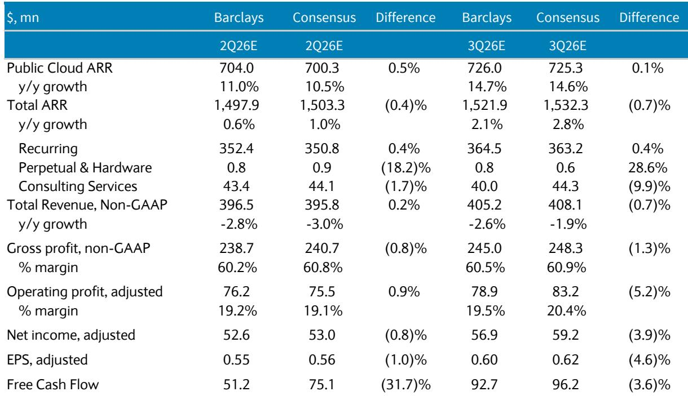
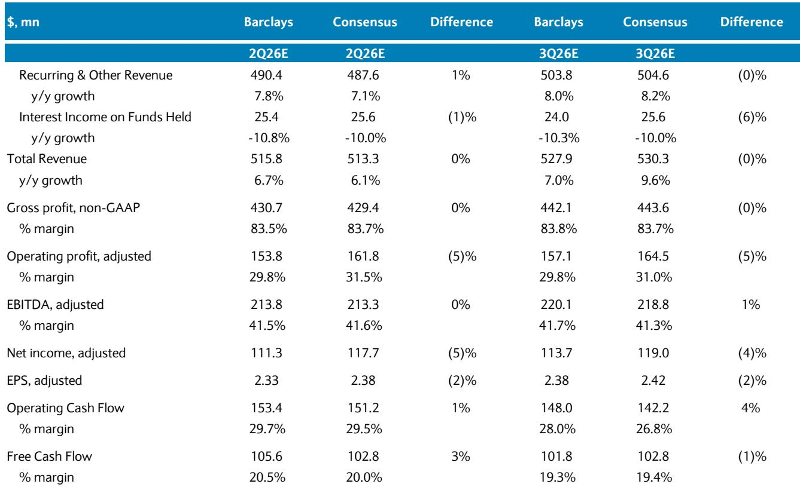
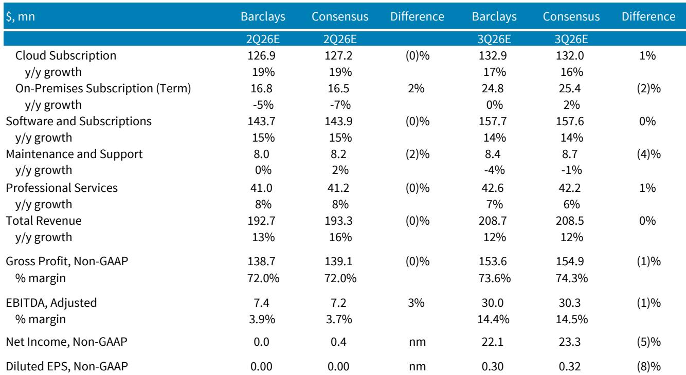

# 第二季度软件行业观察：AI变现为时尚早，基础设施与应用的分化正在扩大

第二季度美国软件行业的核心关注点，并非AI是否真实存在，而是AI是否“足够”真实，以至于能为那些过去18个月将自己置于叙事中心的公司带来实质性改变。根据覆盖范围内的数据和市场格局，答案对于大多数SaaS应用类公司而言是否定的——而对于那些已经受益于可观察到的算力部署模式的基础设施公司，答案是肯定的。

一份全球研究机构的报告，对第二季度财报季进行了明确分析。该分析并不认为会出现广泛的业绩超预期周期，但明确指出了不对称性所在。报告揭示了一个关键动态：整体软件支出趋势稳定，但一种“挤出效应”——从近期传统企业级公司的利润预警中可见一斑——正在将预算优先级从通用应用软件转向AI基础设施。这不是需求问题，而是资源分配问题。

对于期望软件板块广泛重估的长期观察者而言，这一结论并不令人舒适。第二季度财报可能会显示ServiceNow和HubSpot等SaaS领导者的稳定执行，但这些结果不会催化盈利预期的上调，因为AI收入贡献仍然太小。市场在寻找增长加速的故事，但本季度在应用层并未看到。

相反，最具可操作性的机会集中在三个不同的领域：算力部署推动收入增长可见的AI基础设施公司、低预期下存在超预期空间的薪酬与HCM软件公司，以及微软——在读者关注度极低的情况下，Azure的温和增长加速可能带来正面惊喜。

报告明确指出，这不是一个适合广泛押注的季度，而是一个需要基于具体市场格局进行选择性布局的季度。

## AI基础设施公司提供最清晰的增长加速叙事，但节奏因公司而异

AI基础设施公司中，短期格局最清晰的是Datadog。报告维持其积极评级。逻辑很直接：AI势头增长推动了对可观测性工具的增量需求，这转化为更高的盈利预期。Datadog已经是一个增长加速的故事，报告预计这一趋势将在第二季度延续。

DigitalOcean则呈现不同情况。该股近期表现显著落后——在报告发布前一个月内下跌了30%——但公司提前公布了第二季度业绩，总收入增长约29%，新增RPO超过5.5亿美元，并提高了FY27和FY28的产能扩张预期。报告将这一弱势视为入场机会，认为组件成本和客户集中度相关的风险对行业内的更大玩家更为相关。DigitalOcean近期的提前公告证实了一个产能驱动的增长加速故事，市场可能低估了这一点。

对于CoreWeave和WhiteFiber，报告短期内更为谨慎。两者预计第二季度将是一个低谷季度——CoreWeave在盈利能力方面，WhiteFiber在收入增长方面。报告将2026年下半年视为这些公司更具吸引力的窗口，因为目前正在上线的大规模产能部署造成了短期噪音，这些噪音应在第三或第四季度消散。等权评级反映了在这些部署转化为可见财务结果之前，风险回报比是平衡的。

这里的关键洞察是，AI基础设施并非铁板一块。市场因对组件成本、竞争和客户集中度的担忧而惩罚了整个板块——该板块中的三家大型公司过去一个月下跌了30-37%，而更广泛的软件指数上涨了5%。但不同公司之间的基本面驱动因素存在实质性差异。将抛售视为统一风险的观察者，可能会错失业务质量和短期可见性方面的分化。

## 薪酬与HCM软件：低预期下的超预期机会

薪酬与HCM板块是本季度最具趣味的反向布局之一。报告指出Paycom和Paylocity是情绪低迷、存在正面惊喜空间的公司。市场对Paycom的共识预期是，不包括浮存金在内的经常性收入增长约7%，利润率扩张有限。这为温和的1-1.5%超预期以及FY26指引的小幅上调留出了空间。鉴于自4月中旬以来，Paycom的空头头寸已减少超过200个基点，部分悲观情绪可能已被定价，但预期仍然足够低，一个干净的季度表现可能改变市场情绪。

Paylocity的格局同样要求不高。市场共识预期其增长将放缓约200个基点至同比9.6%，第二季度调整后EBITDA也将以类似幅度收缩。该公司还将报告其2026财年第四季度业绩，这意味着它将提供初步的FY27指引。报告认为，相对于市场共识预期（预计经常性收入增长在FY27末放缓至约8%），结果偏向于符合预期或略有上行。

这一机会背后的结构性逻辑值得审视。薪酬与HCM软件历来被视为后台类别，AI带来的增长动力有限。这种看法使其估值倍数受到压制，读者关注度较低。但报告的分析表明，稳定的需求加上低预期，创造了比许多增长导向的软件公司更有利的不对称性——后者的AI叙事已将其预期推高至短期业绩难以支撑的水平。

该板块的业绩超预期并上调指引，不会改变这些公司的研究逻辑。然而，它将证明看空观点可能过度了。对于在不确定的财报季中寻找低风险、高概率布局的观察者而言，薪酬类公司提供了一个清晰的思路。

## 微软：温和的Azure增长加速与极低的读者关注度

微软在报告中脱颖而出，其格局之所以有利，恰恰是因为没有人在关注。报告指出，微软近几个季度并未成为读者的焦点。Azure增长指引在同比39-40%的水平，但报告认为存在小幅加速至40%出头的潜力。这并非戏剧性的超预期，但在极低预期的背景下，可能足以推动正面反应。

报告还指出了两个支持这一判断的结构性发展。首先，微软管理层预计将讨论其自身大语言模型使用量的增长，这标志着对前沿模型提供商的独立性日益增强。其次，市场对资本支出的预期似乎已在2500-2700亿美元范围内，如果微软自身的资本支出数据符合预期，这应能限制负面惊喜。

更广泛的启示在于预期与结果之间的关系。微软并非高增长故事，也不需要是。报告的论点是，在读者漠不关心的背景下实现稳健执行，创造了一个不对称的机会。当没有人预期催化剂时，一个温和的正面惊喜可能产生超乎寻常的影响。

这是一个适用于整个财报季的有用框架。报告并非预测一波业绩超预期，而是在识别预期与现实之间差距足够大的特定领域。

## 第二季度软件行业观察决策框架：三个问题决定布局

报告的分析可以提炼为一个决策框架，帮助观察者系统性地应对第二季度财报季。该框架对任何特定软件公司提出三个问题。

第一，该公司是AI基础设施受益者还是应用层公司？像Datadog和DigitalOcean这样的基础设施公司，有来自产能部署的可观察需求信号，并能展示与AI相关的收入增长加速。像ServiceNow和HubSpot这样的应用公司有AI产品路线图，但收入贡献仍然太小，不足以推动盈利预期修正。市场将奖励前者，并对后者感到失望。

第二，预期是否足够低，使得业绩超预期并上调指引能够产生影响？Paycom和Paylocity通过了这一测试，因为市场共识已经包含了增长放缓和利润率压缩。微软通过了测试，因为读者注意力在其他地方。预期较高的公司——市场已经将AI收益计入价格——即使业绩稳健，也更有可能令人失望。

第三，公司是否面临来自产能部署或其他过渡性因素的短期噪音？CoreWeave和WhiteFiber是例子，当前的弱势反映了运营摩擦，这些摩擦应在今年下半年得到解决。报告不建议在第二季度关注这些公司，但将其标记为愿意耐心的观察者在后半年的潜在机会。

这个框架并非详尽无遗，但具有诊断性。它解释了为什么报告对Datadog、微软、DigitalOcean和薪酬类公司持建设性态度，同时对许多SaaS应用公司保持谨慎。共同点并非板块敞口或增长率，而是业务在第二季度能够交付的成果与市场已经预期的成果之间的一致性。

## 挤出效应：应用软件被低估的风险

报告引入了一个在财报评论中通常未得到足够关注的概念：挤出效应。近期一家传统企业级科技公司的利润预警——报告将其更多归因于资本支出而非运营支出动态——说明了AI基础设施投资如何消耗了原本可能流向应用软件的预算。

这不是周期性放缓，而是结构性重新分配。企业正在对AI计算能力进行长期押注，这些押注规模足够大，以至于挤出了其他类别的支出。对于那些无法证明其产品与AI成果之间存在直接联系的应用软件公司，风险在于预算会被重新分配至其他方向。

报告并未量化这一效应在整个覆盖范围内的规模，但方向性启示是明确的。与可观测性、云基础设施和AI赋能平台相关的公司，从这种重新分配中获得了自然增长动力。与CRM、营销自动化和项目管理软件相关的公司则没有。第二季度财报季可能会提供这一分化的进一步证据。

这就是为什么报告的标题——“为时尚早”——如此精确。围绕AI在软件领域的兴奋并非错位，只是对许多公司而言为时过早。基础设施层已经显示出收益。应用层最终会达到那里。但第二季度并非两者交汇的季度。

*仅供参考。部分内容可能基于源材料通过AI辅助生成、翻译、总结或编辑，可能存在遗漏或错误。请独立核实。本文不构成专业建议。*

仅供参考。部分内容可能基于源材料通过AI辅助生成、翻译、总结或编辑，可能存在遗漏或错误。请独立核实。本文不构成专业建议。

