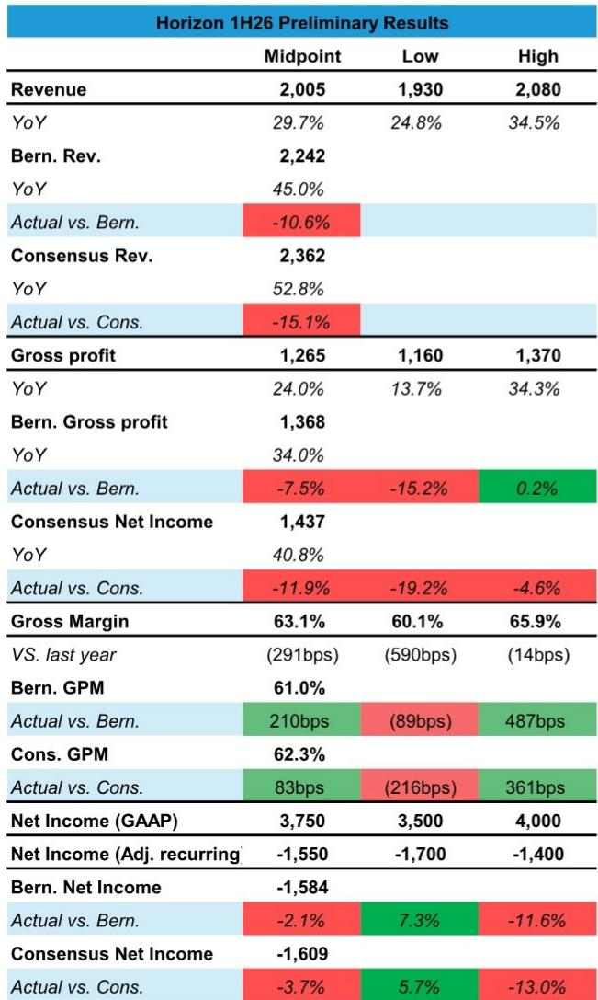
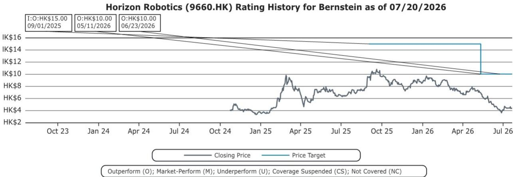
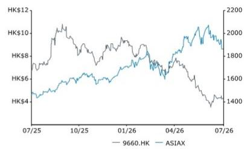

# Horizon Robotics 上半年营收未达预期背后的结构性转变：定价能力与比亚迪催化剂才是关键

Horizon Robotics 发布的2026年上半年初步业绩呈现出一个明显的张力：营收比分析师预期低10.6%，比市场一致预期低15.1%，但公司股价在业绩发布后小幅上涨。市场对营收未达预期的温和反应表明，观察者正在关注短期周期性波动之外的两个结构性现实，而这些是单纯业绩数据无法体现的。首先，毛利率维持在63.1%，并未受到竞争市场中营收未达预期时通常伴随的定价压力影响。其次，公司与比亚迪的合作进展快于市场预期，首款联合开发产品即将推出。这两个事实——定价韧性与战略客户突破——构成了比营收数据本身更重要的研究框架。

营收未达预期本身并不神秘。2026年上半年，中国乘用车市场出现明显收缩，而高级驾驶辅助系统的新设计中标周期转化为实际出货量的时间比观察者预期的更长。Horizon 管理层此前已就这一压力进行过沟通，并维持了全年出货目标，表明营收缺口更多是时间节奏问题，而非竞争地位丧失。公司非GAAP经常性净亏损14-17亿元人民币，接近预期，证实运营费用控制抵消了营收方面的不利影响。GAAP净利润35-40亿元人民币，主要得益于可转换债券的非现金公允价值收益——这是股价下跌的机械效应，而非运营改善。

现在关键的问题是，下半年复苏能否实现，以及 Horizon 能否将其技术优势转化为持久的竞争壁垒。上半年业绩和比亚迪合作提供的证据表明，这是可能的。公司股价年初至今下跌48.6%，已经反映了宏观环境的不利因素以及对整车厂自研芯片的担忧。对于以12个月为周期的观察者而言，风险回报的格局已从投机性转向非对称性。

## 毛利率在63.1%保持韧性，证明 Horizon 的软硬件一体化架构创造了真正的定价能力，而不仅仅是产品差异化

初步业绩中最具分析意义的数据不是营收未达预期，而是毛利率。以63.1%的中位数计算，尽管营收低于预期10.6%，且来自第三方供应商和整车厂自研芯片团队的竞争加剧，Horizon 的毛利率同比仅下降291个基点。在周期性下行中，毛利率通常会更为剧烈地压缩，因为芯片设计和制造费用的固定成本分摊在更低的出货量上。Horizon 的毛利率表现优于营收趋势所预示的水平。

这种韧性并非偶然。Horizon 的架构将专有神经网络处理单元与软件工具链相结合，使整车厂能够高效部署和更新驾驶算法。提供独立芯片但缺乏集成软件层的竞争对手必须在价格上竞争，因为它们缺乏 Horizon 工具链所创造的转换成本。一旦整车厂围绕 Horizon 芯片投入软件栈，转向替代供应商就需要重新设计整个感知和规划流程。这种锁定效应使 Horizon 即使在出货量疲软时也能维持定价。

与彭博一致预期的62.3%毛利率相比，Horizon 的实际中位数高出83个基点。在一个营收低于预期15%的季度中，任何幅度的毛利率超预期都是不寻常的。这表明 Horizon 并未通过降价来维持出货量。公司宁愿接受较低的出货量，也不愿牺牲其毛利率结构，这种自律在需求下行期的半导体行业中实属罕见。

对于长期观察者而言，这种毛利率行为是一个领先指标。在周期低谷中保持定价能力的公司，往往在出货量恢复时能够不成比例地扩大利润率，因为增量营收以最低的额外成本转化为毛利润。如果 Horizon 下半年的复苏如管理层预期的那样实现，毛利率可能重新向65%区间扩张，从而提供当前估值尚未反映的回报表现杠杆。

## 比亚迪 GodEye B 的推出消除了市场的最坏情景：整车厂自研对 Horizon 并非零和威胁

对 Horizon 中期前景影响最大的单一事件，是首款搭载其 J6H 芯片的 GodEye B 车型即将推出。比亚迪作为中国最大的整车厂，一直在发展自研半导体能力，市场此前持续反映比亚迪可能完全淘汰第三方芯片供应商的风险。GodEye B 的合作直接反驳了这一叙事。

Horizon 管理层现在预计，其在 GodEye C 解决方案中的份额将从2025年的40%上升到2027年的90%以上。GodEye C 是出货量更大的中端驾驶辅助层级，90%的份额意味着 Horizon 将成为该产品线近乎独占的外部供应商。即使 GodEye B 的份额仍不确定，方向性信号是明确的：比亚迪并未采取单一来源的自研策略。它在大部分外部采购中使用 Horizon 的芯片，且合作关系正在深化而非收窄。

这一点的重要性超越了比亚迪带来的营收。GodEye 合作对于每一个正在评估是自研芯片还是从 Horizon 采购的中国整车厂而言，都是一个参考案例。如果比亚迪——中国垂直整合程度最高的整车厂——选择在相当一部分 ADAS 计算中依赖 Horizon，那么自研将取代第三方供应商的论点就失去了可信度。Horizon 成为第三方供应商生态中英伟达的可信替代方案，而比亚迪的背书提供了产品可规模化应用的实证。

市场此前对 Horizon 的估值折扣恰恰反映了相反的情景。公司股价从52周高点11.32港元跌至3.60港元，反映了市场对整车厂将芯片设计内部化、留给 Horizon 的只有低端低利润市场的担忧。比亚迪 GodEye B 的推出，加上 GodEye C 中份额的进展，推翻了这一假设。风险并非为零——部分整车厂将继续为旗舰车型发展自研能力——但第三方供应商的可触达市场比悲观假设所认为的更大、更持久。

## 下半年复苏并非希望，而是由设计中标转化和产量爬坡驱动的结构性转折

尽管上半年营收未达预期，Horizon 管理层仍维持了全年出货目标，这意味着下半年必须实现约40%或更高的环比加速。怀疑是合理的，但背后的驱动因素是具体的。上半年的疲软集中在两个领域：中国乘用车销售的广泛下滑影响了所有汽车半导体供应商，以及设计中标转化为生产订单的速度慢于预期。两者都是周期性和时间节奏问题，而非结构性问题。

随着政府刺激措施生效和新车型推出加速，中国乘用车市场预计将在下半年复苏。更重要的是，Horizon 的设计中标管道集中在下半年。仅比亚迪 GodEye B 的推出就将从第三季度开始贡献可观的出货量。2025年底和2026年初签署的其他整车厂设计中标，正在进入生产样品和初始出货量爬坡阶段。

营收未达预期本身提供了一个有用的校准点。Horizon 上半年营收约20亿元人民币，意味着下半年需要实现约40亿元人民币才能达到隐含的全年目标。这是一个陡峭的爬坡，但与公司历史季节性一致，通常下半年与上半年的营收比例为60:40。今年的不同之处在于上半年异常疲弱，因此下半年的权重将更加显著。

对于观察者而言，关键问题是下半年的爬坡是否已被定价。公司股价年初至今下跌48.6%，相对 ASIAX 指数表现落后63.1%，表明市场已经反映了相当程度的不利预期。即使 Horizon 实现部分复苏，当前估值也存在显著上行空间。企业价值/销售额倍数已压缩至2026年预估的6.2倍和2027年预估的3.7倍——这些水平要么意味着商业模式的永久性受损，要么意味着周期性低谷。毛利率和比亚迪合作提供的证据支持后一种解读。

## 观察者的决策框架：区分周期性逆风与结构性侵蚀

今天评估 Horizon 的挑战在于区分周期性与结构性因素。上半年营收未达预期是由周期性因素驱动的：汽车需求疲软、设计中标转化延迟以及宏观环境的不确定性。毛利率韧性和比亚迪合作是结构性积极因素：定价能力和战略客户深度。公司估值反映的市场正在将两者混为一谈。

一个有用的框架是从三个维度评估 Horizon：竞争地位、客户集中度和财务可持续性。在竞争地位方面，毛利率数据和比亚迪份额指引表明，Horizon 的软硬件一体化栈创造了可防御的优势。竞争对手可以匹配单个芯片规格，但无法在没有多年投入的情况下复制工具链锁定效应。在客户集中度方面，比亚迪关系重要但并非排他性。Horizon 的设计中标管道包括多家整车厂，比亚迪的参考案例将加速其他整车厂的采用。在财务可持续性方面，公司仍在产生非GAAP亏损，但运营费用控制正在改善，2025年IPO带来的现金状况提供了多年的运营空间。

市场已反映的下行风险——整车厂自研和ADAS渗透率放缓——是真实但非对称的。最坏情景中，Horizon 被挤出市场，需要同时在三个维度上失败：定价能力丧失、比亚迪业务流失以及设计中标无法转化。上半年业绩显示，这些情况均未发生。营收未达预期令人失望，但并未伴随利润率侵蚀、客户流失或设计中标损失。

对于长期观察者而言，当前估值提供了对于 Horizon 这样技术地位的公司而言罕见的容错空间。公司股价交易在不到4倍远期销售额的水平，这一倍数通常反映的是业务下滑或终端增长率低于资金成本。Horizon 两者都不是。它是一家营收同比增长30%、毛利率63%、与全球最大汽车市场最大整车厂建立战略合作的公司。仔细解读上半年业绩，并不会削弱这一论点。它反而强化了这一论点，前提是观察者有耐心等待下半年复苏的展开。

*仅供参考。部分内容可能基于源材料通过AI辅助生成、翻译、总结或编辑，可能存在遗漏或错误。请独立核实。本文不构成任何专业建议。*

仅供参考。部分内容可能基于源材料通过AI辅助生成、翻译、总结或编辑，可能存在遗漏或错误。请独立核实。本文不构成任何专业建议。

