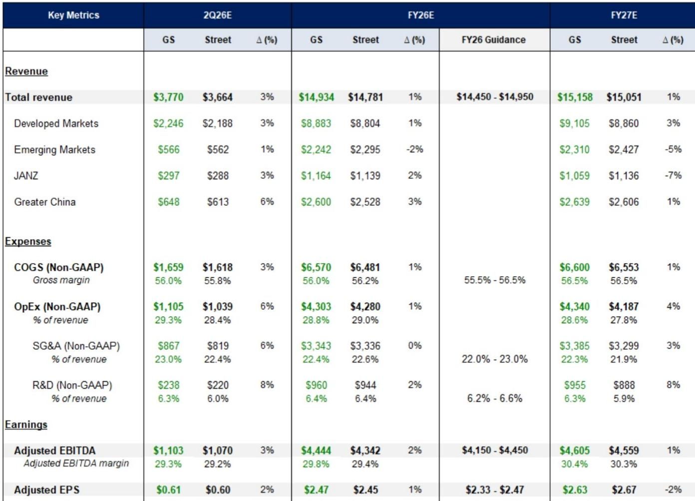
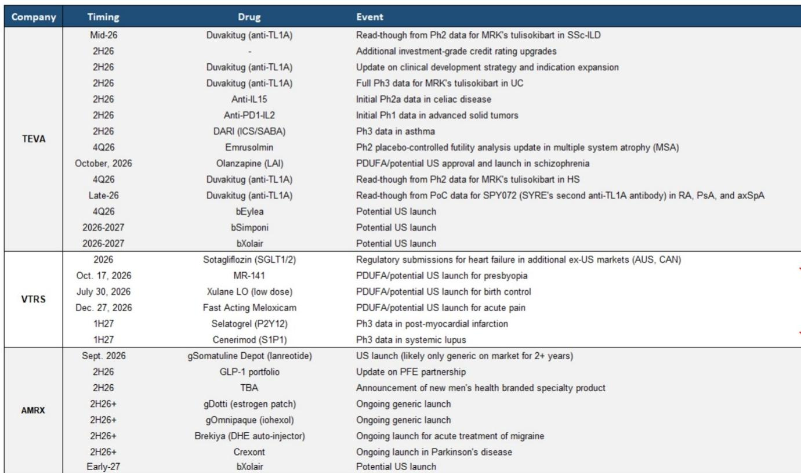
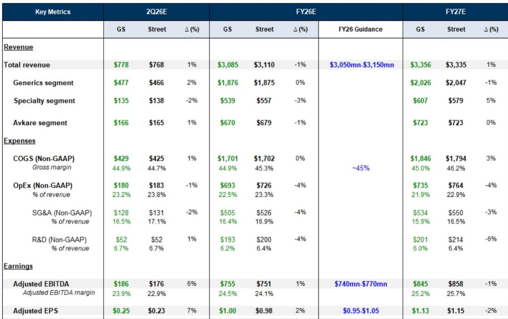

# 仿制药行业下半年的看点：不只是业绩，更是管线潜力的兑现

近期，仿制药板块整体表现优于医疗保健行业及更广泛的市场指数。这一走势背后有两个主要驱动力：一是企业基本面的改善，包括业绩执行和管线进展；二是市场资金从部分高增长领域向价值型治疗领域的轮动。这并非简单的防御性配置，而是对一批历经多年重组、降杠杆并重建品牌管线的公司的结构性重新定价。2026年下半年，将是该行业多年来催化剂最为密集的时期。即将发布的梯瓦、晖致和阿姆尼尔等公司的财报，预计将与市场预期大体一致。但真正值得关注的问题，并非这些公司是否达到季度数字，而是其管线催化剂、资本配置决策和商业动能，能否支撑其估值在2027年及以后持续提升。

该板块内部的分化态势较为明显。梯瓦年初至今表现相对落后，尽管其基本面设置较为有利。晖致则因商业前景改善和临床催化剂推动，年初至今表现领先，但其估值相比更广泛的生物制药板块仍有明显折价。阿姆尼尔凭借商业动能和新兴的GLP-1合作，年初至今涨幅显著。这些不同的走势不仅反映了各公司运营状况的差异，也体现了其管线成熟度的不同阶段。共同点是，每家公司如今都有一条超越传统仿制药业务的可见增长路径，而2026年下半年将检验这条路径是否真实可靠。

对于关注基本面的观察者而言，即将到来的财报季是一个检查点，而非终点。真正重要的决策——业务拓展、股份回购、管线优先级和资本配置——将体现在管理层评论和指引更新中，而非季度营收数字本身。以下内容将分析每家公司需要展现哪些关键点，以支撑其当前估值，并为进入催化剂密集的2027年做好准备。

## 梯瓦：相对表现落后或为关注点，管线拐点即将到来

2026年大部分时间，梯瓦的股价在特定区间内波动。上半年事件路径相对平静、与其以色列基地相关的地缘因素，以及相比自身历史估值处于较高水平但相比更广泛生物制药板块仍有折价的估值，是其主要背景。该股年初至今在板块整体上涨的背景下表现相对落后，这一分化并非由基本面因素解释。其对Emalex的收购获得了市场积极反馈，近期IL-15的积极数据也标志着从2026年底到2028年这段催化剂密集期的开始。

预计第二季度财报将符合预期，盈利预测调整幅度较小。2026财年164亿至168亿美元的营收指引保持不变，市场共识似乎尚未完全计入Emalex收购带来的费用影响。真正的关注点应放在四个将定义梯瓦未来18个月增长叙事的管线里程碑上。首先，长效奥氮平的上市，其PDUFA日期在10月，是最直接的催化剂。其次，ecopipam的监管申报和策略更新，将明确针对一种罕见儿科神经系统疾病的药物的开发路径。第三，DARI项目，可能在年底前读出2期数据，有望开辟一个新的治疗类别。第四，TL1A项目，两项概念验证研究已启动，且竞争对手的数据读出预计在今年晚些时候，这使梯瓦处于免疫学领域最受关注的靶点之一。

资本配置是第二个关键维度。在Emalex交易之后，观察者需要明确梯瓦是会进行额外的补强型收购、启动股份回购计划，还是继续优先降杠杆。答案将反映管理层对自研管线的信心，以及其利用资产负债表能力驱动回报的意愿。由Austedo、Ajovy和Uzedy驱动的品牌业务收入增长，为梯瓦提供了稳定的商业基础，但使其估值与更广泛生物制药板块看齐所需的估值倍数提升，完全取决于管线的执行情况。该股当前的折价，反映的是市场对管线潜力将转化为实际收入的预期，而未来六个月将是验证这一预期的首次重要考验。

## 晖致：需证明商业复苏与管线催化剂能支撑已有所改善的估值

晖致是年初至今该板块中表现较强的公司，这得益于其商业前景的改善、2026年下半年的临床催化剂，以及使其成为市场轮动中自然受益者的有吸引力的估值指标。该股目前相比更广泛的板块仍有明显折价，但这一折价已有所收窄。即将发布的财报需要确认其商业动能是真实的，且管线时间表仍在正轨上。

预计第二季度业绩将符合预期，2026财年营收指引为144.5亿至149.5亿美元。关键的商业动态包括新产品上市的节奏（这些产品主要集中在后半年），以及大中华区业务的表现——该区域在强劲表现后已成为重要的增长驱动力。Nashik生产基地恢复满负荷运营是另一个可能影响全年指引的运营变量。外汇趋势，作为第一季度的重要利好因素，其可持续性也需关注。

晖致的管线故事比梯瓦更为集中，但同样重要。速效美洛昔康、selatogrel和cenerimod是其三个关键品牌项目，关于其时间表和前景的更新将决定下半年的临床催化剂能否如期实现。资本配置也是一个现实问题，尤其是在近期板块内交易活动的背景下。观察者希望了解晖致是计划利用其资产负债表进行业务拓展还是股份回购，以及管理层表示将提供有限更新的企业范围评估，究竟是无足轻重的事件，还是结构性变革的前奏。

晖致的风险在于，其近期的优异表现可能已经反映了商业改善和临床催化剂的预期，留给超预期的空间有限。财报及随附的评论必须证明其基础业务不仅是在稳定，而是在加速，且管线里程碑正在按计划推进。如果商业动能减弱或管线时间表延迟，该股当前的估值折价，尽管仍有吸引力，可能不足以提供充分的下行保护。

## 阿姆尼尔：增长故事最具吸引力，但执行风险集中于少数关键产品

阿姆尼尔年初至今表现强劲，这得益于积极的商业评论、关键的即将上市产品，以及对Kashiv Biosciences的收购——该收购垂直整合了其生物类似药业务。该股同样受益于提振整个板块的宏观环境，但阿姆尼尔的增长故事更具独特性，且更依赖于在少数高价值产品上的执行。

第二季度财报有可能因利润率改善而实现盈利超预期，即使营收结果与市场预期大体一致。2026财年30.5亿至31.5亿美元的营收指引提供了基准，但真正的上行驱动力集中在三个领域。首先，兰瑞肽的上市，预计在第三季度或更早，阿姆尼尔预计未来两年内竞争有限。其次，碘海醇的获批，近期已有额外剂量获批，阿姆尼尔预计在可预见的未来将是市场上相对少见的仿制药。第三，与辉瑞合作的减肥产品组合，管理层在近期ADA数据更新后信心增强，并将该合作视为未包含在长期指引中的重要增长杠杆。

Kashiv Biosciences的整合增加了另一层复杂性。该收购垂直整合了阿姆尼尔的生物类似药业务，可能改善利润率并加速管线开发，但整合风险是真实存在的。交易后的资本配置策略，包括降杠杆的步伐和进一步补强型收购的意愿，将是财报电话会议上的重要话题。

阿姆尼尔的主要风险在于，其估值已经反映了对兰瑞肽、碘海醇上市以及GLP-1合作的显著乐观预期。如果这些上市面临延迟、竞争比预期更早出现，或合作更新令人失望，该股近期的强劲表现可能迅速逆转。第二季度潜在的利润率超预期提供了一些短期缓冲，但长期研究逻辑取决于在少数高风险产品上的执行情况。

## 仿制药板块的观察框架

梯瓦、晖致和阿姆尼尔年初至今表现的分化，为基于风险偏好、时间跨度和对管线潜力信心的不同观察角度，提供了一个自然的框架。

对于寻求在催化剂密集期前寻找关注点、且具有显著上行潜力的观察者而言，梯瓦提供了值得关注的潜在机会。该股在基本面展望改善的背景下表现相对落后，而2026年下半年及2027年的管线催化剂为其估值提升提供了清晰路径。主要风险在于地缘因素或执行失误可能延迟这一过程，但当前估值已反映了相当程度的不确定性。财报应被用来确认其品牌商业业务是否保持正轨，以及资本配置重点是否与价值创造目标一致。

对于偏好更均衡的风险回报、上行空间相对有限但下行风险也较小的观察者而言，晖致提供了一个已展现商业改善、且估值折价提供了一定安全边际的案例。主要风险在于该股的优异表现可能已反映了利好消息，留给超预期的空间有限。财报必须确认商业动能是可持续的，且管线时间表是完整的。如果大中华区业务继续表现良好，且Nashik工厂恢复满负荷运营，该股可能继续稳步上行。如果任何一项出现波折，估值折价可能不足以防止回调。

对于风险承受能力较高、关注独特增长故事的观察者而言，阿姆尼尔提供了最具不对称上行潜力的案例，其驱动力来自兰瑞肽、碘海醇的上市以及GLP-1合作。主要风险在于集中度：整个研究逻辑依赖于少数产品和合作。财报提供了一个评估商业动能是否正在积聚的机会，以及预计在未来几个月内公布的辉瑞合作更新是否会成为积极催化剂。第二季度潜在的利润率超预期提供了一个短期关注点，但长期研究逻辑取决于2027年及以后的执行情况。

贯穿这三家公司的共同点是，2026年下半年将是仿制药行业多年来最重要的时期。多年开发的管线催化剂将开始产生数据、实现上市并贡献收入。提振该板块的宏观环境，只要市场轮动趋势持续，可能仍将存在。但每家公司的根本问题在于，其管线潜力能否转化为实际的盈利增长，从而支撑更高的估值。即将发布的财报不会最终回答这个问题，但它们将提供第一批数据点，这些数据点将决定估值重估是继续还是停滞。

---

*仅供参考。部分内容可能基于源材料通过AI辅助生成、翻译、总结或编辑，可能存在遗漏或错误。请独立核实。本文不构成任何专业建议。*
