Japan Autos & Auto Parts

# Japan Autos & Auto Parts: FY3/27 Q1 Preview - Honda, Suzuki, and Toyota Tsusho poised for strong results

  
Masahiro Akita  
+81 3 6777 6998

masahiro.akita@bernsteinsg.com

Tomohiro Kashimoto

+81 3 6777 6975

tomohiro.kashimoto@bernsteinsg.com

Seunghyeok Kim

+81 3 6777 6974

seunghyeok.kim@bernsteinsg.com

Ahead of the upcoming earnings season, we review Q1 (April–June) volume trends across our coverage universe and present our outlook for each company's Q1 earnings results.

Honda, Suzuki, and Toyota Tsusho poised for strong results: Key areas of focus for the Japan Autos & Auto Parts sector's Q1 (April–June) earnings are likely to include the earnings benefit from lower US import tariffs, which have declined to 15% this quarter from 27.5% a year ago, as well as headwinds from Middle East-related volume disruptions and higher raw material and logistics costs. Within our coverage, we see Honda, Suzuki, and Toyota Tsusho as the most likely positive standouts this earnings season. Meanwhile, although we forecast YoY profit declines for Subaru and Toyota, both companies are still expected to deliver broadly favorable results, driven by earnings that should exceed consensus expectations and healthy progress toward their initial full-year guidance.

Suzuki and Honda likely to stand out in Q1 sales performance: Aggregate Q1 sales across our coverage are estimated to rise 3.9% YoY. Suzuki is expected to post the strongest growth, driven by robust demand in India, while Honda should benefit from strong HEV sales in the US and improving demand in Japan. Subaru's sales trend also remains solid. By contrast, Nissan, Mazda, and Toyota are likely to see modest sales declines. However, Toyota's latest production plan points to a return to YoY growth from Q2 onward, suggesting sales momentum should improve in the coming quarters.

Particularly bullish on Honda and Suzuki into Q1 results: Honda and Suzuki stand out as the most compelling Q1 earnings stories within our coverage. We expect both companies to deliver solid YoY profit growth and outperform current consensus expectations. Honda should benefit from strong US HEV demand, lower tariff costs, and the absence of last year's sizable EV-related charges, potentially resulting in exceptionally strong progress against full-year guidance. Suzuki is also well positioned, supported by robust volume growth in India and resilient earnings momentum. While Subaru and Toyota are expected to report YoY declines in operating profit, both are still likely to deliver favorable results relative to market expectations. By contrast, Nissan and Mazda are likely to be relative laggards, reflecting weaker earnings momentum and limited progress against their initial full-year guidance.

Toyota Tsusho likely to stand out among Toyota affiliates: While Denso and Aisin are unlikely to deliver significant earnings surprises, we expect Toyota Tsusho's Q1 net profit to exceed expectations, primarily driven by strong Toyota Land Cruiser sales in Africa. Although lower Toyota production volumes remain a headwind for Denso and Aisin, favorable FX and tariff pass-through measures should support broadly stable earnings, making a significant earnings surprise unlikely. By contrast, Toyota Tsusho appears well positioned to outperform expectations. Our analysis shows that Land Cruiser sales in Africa and EUR/JPY are both highly correlated with earnings in Toyota Tsusho's Africa business net profit. With IHS forecasting African Land Cruiser sales to increase 28.4% YoY in Q1 and EUR/JPY remaining supportive, we expect robust earnings growth in the Africa business, increasing the likelihood of a meaningful upside surprise in Q1 earnings.

## BERNSTEIN TICKER TABLE

<table><tr><td rowspan="2"></td><td colspan="4">17 Jul 2026</td><td>TTM</td><td colspan="4">Reported EPS</td><td colspan="3">Reported P/E (x)</td></tr><tr><td></td><td></td><td rowspan="2">Closing Price</td><td rowspan="2">Price Target</td><td rowspan="2">Rel. Perf.</td><td></td><td></td><td></td><td></td><td></td><td></td><td></td></tr><tr><td>Ticker</td><td>Rating</td><td>Cur</td><td>Cur</td><td>2025A</td><td>2026E</td><td>2027E</td><td>2025A</td><td>2026E</td><td>2027E</td></tr><tr><td>7203.JP (Toyota)</td><td>O</td><td>JPY</td><td>2,899.50</td><td>4,200.00</td><td>(25.1)%</td><td>JPY</td><td>295.25</td><td>308.93</td><td>367.29</td><td>9.8</td><td>9.4</td><td>7.9</td></tr><tr><td>7269.JP (Suzuki)</td><td>O</td><td>JPY</td><td>2,050.50</td><td>2,550.00</td><td>(13.9)%</td><td>JPY</td><td>227.69</td><td>234.71</td><td>255.99</td><td>9.0</td><td>8.7</td><td>8.0</td></tr><tr><td>7267.JP (Honda)</td><td>M</td><td>JPY</td><td>1,535.50</td><td>1,300.00</td><td>(37.1)%</td><td>JPY</td><td>(106.06)</td><td>161.84</td><td>147.24</td><td>(14.5)</td><td>9.5</td><td>10.4</td></tr><tr><td>7201.JP (Nissan)</td><td>U</td><td>JPY</td><td>329.30</td><td>350.00</td><td>(32.5)%</td><td>JPY</td><td>(152.58)</td><td>4.78</td><td>53.06</td><td>(2.2)</td><td>68.8</td><td>6.2</td></tr><tr><td>7261.JP (Mazda)</td><td>U</td><td>JPY</td><td>1,137.00</td><td>1,000.00</td><td>(5.9)%</td><td>JPY</td><td>55.64</td><td>116.61</td><td>142.17</td><td>20.4</td><td>9.8</td><td>8.0</td></tr><tr><td>7270.JP (Subaru)</td><td>U</td><td>JPY</td><td>2,534.00</td><td>2,350.00</td><td>(39.8)%</td><td>JPY</td><td>125.50</td><td>222.96</td><td>249.75</td><td>20.2</td><td>11.4</td><td>10.1</td></tr><tr><td>8015.JP (Toyota Tsusho)</td><td>O</td><td>JPY</td><td>6,076.00</td><td>8,150.00</td><td>46.2%</td><td>JPY</td><td>350.95</td><td>451.35</td><td>489.20</td><td>17.3</td><td>13.5</td><td>12.4</td></tr><tr><td>6902.JP (Denso)</td><td>M</td><td>JPY</td><td>1,964.00</td><td>2,050.00</td><td>(39.9)%</td><td>JPY</td><td>162.96</td><td>169.90</td><td>190.05</td><td>12.1</td><td>11.6</td><td>10.3</td></tr><tr><td>7259.JP (Aisin)</td><td>M</td><td>JPY</td><td>2,256.00</td><td>2,450.00</td><td>(20.4)%</td><td>JPY</td><td>232.64</td><td>248.13</td><td>236.66</td><td>9.7</td><td>9.1</td><td>9.5</td></tr><tr><td>JPL</td><td></td><td></td><td>2,545.21</td><td></td><td></td><td></td><td></td><td></td><td></td><td></td><td></td><td></td></tr></table>

O - Outperform, M - Market-Perform, U - Underperform, NR - Not Rated, CS - Coverage Suspended

Source: Bloomberg, Bernstein estimates and analysis.

## INVESTMENT IMPLICATIONS

We rate Toyota as Outperform with a price target of JPY 4,200.

We rate Suzuki as Outperform with a price target of JPY 2,550.

We rate Honda as Market-Perform with a price target of JPY 1,300.

We rate Nissan as Underperform with a price target of JPY 350.

We rate Mazda as Underperform with a price target of JPY 1,000.

We rate Subaru as Underperform with a price target of JPY 2,350.

We rate Toyota Tsusho as Outperform with a price target of JPY 8,150.

We rate Denso as Market-Perform with a price target of JPY 2,050.

We rate Aisin as Market-Perform with a price target of JPY 2,450.

## DETAILS

## SUZUKI AND HONDA LIKELY TO STAND OUT IN Q1 SALES PERFORMANCE

Based on our estimates of vehicle sales in key markets excluding China, which do not directly impact the consolidated revenues and operating profits of the six Japanese automakers under our coverage, aggregate Q1 (April–June) sales are likely to increase by 3.9% YoY on average (Exhibit 1). That said, performance is expected to vary considerably across automakers.

Suzuki is likely to deliver the strongest growth, with global sales estimated to rise 18.4% YoY (Exhibit 2). The key driver remains India, where sales are projected to increase 33% YoY, benefiting significantly from the GST rate cuts implemented last year. With the Kharkhoda plant commencing operations in May, we expect this momentum to continue in the near term. In Japan, Suzuki also appears to have maintained resilient performance, with sales estimated to decline only 0.7% YoY, despite a temporary shift in demand from mini vehicles toward registered vehicles following the April tax changes.

Honda is expected to post the second-strongest performance, with global sales estimated to increase 5.9% YoY (Exhibit 3). Growth is likely to be led by the US, where sales are projected to rise 8.4% YoY, supported by record HEV sales, particularly of the CR-V. Japanese sales are also estimated to increase 8.2% YoY, benefiting from stronger demand for registered vehicles following the tax changes, as well as continued ramp up of the recently launched CR-V.

Subaru is also expected to deliver solid results, with sales estimated to increase 2.1% YoY (Exhibit 4). The US should remain the key contributor, supported by growing demand for the HEV versions of the Forester and Crosstrek. In contrast, Nissan's sales are estimated to decline 0.8% YoY (Exhibit 5). While US sales are projected to increase 9.6% YoY, supported by locally produced models such as the Rogue, Pathfinder, and Frontier, weakness in Europe and Asia is likely to offset these gains.

Mazda's sales are estimated to decline 1.0% YoY (Exhibit 6). The newly launched CX-5, a key focus for the market, had already been introduced in Europe and was rolled out in North America and Japan during the quarter. Europe continues to show positive momentum, while the new CX-5 also appears to be contributing to stronger sales in Japan. North American sales are likewise expected to return to growth. However, while Mazda3 and CX-50 HEV sales have been expanding in the US, sales of the CX-5 have been declining, warranting further evaluation. Overall, gains in Europe, Japan, and North America are likely to be more than offset by weakness in other markets, resulting in a modest YoY decline.

Toyota's sales are estimated to decline 1.4% YoY (Exhibit 7). Relative to peers, Q1 may appear somewhat soft, although sales remain healthy in key markets such as the US and Japan. The primary headwind appears to be a sharp decline in exports and sales to the Middle East, where Toyota has the greatest exposure among Japanese automakers. In the US, HEV models such as the Camry and RAV4 continue to post robust sales growth. In Japan, strong demand for the new RAV4, Corolla Cross, and Lexus NX is likely providing support. While Q1 global sales are expected to be slightly down YoY, Toyota's latest July to September production plan implies 3.4% YoY growth globally, suggesting sales momentum should recover from Q2 onward.

EXHIBIT 1: Suzuki and Honda likely to stand out in Q1 sales performance  
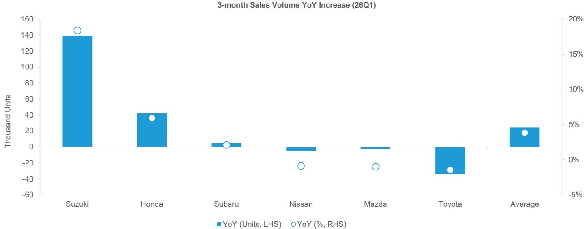  
Note: Apr-May 2026 figures are based on officially disclosed company data, while Jun figures are based on publicly available country-level data where available, and estimates derived from country-level data for markets where June data have not yet been released
Source: Company reports, Marklines, Autodata, JADA, Zenkeijikyo, ACEA, SMMT, PFA, KBA, FADA, Gaikindo, Bernstein analysis and estimates

EXHIBIT 2: Suzuki's estimated FY3/27 Q1 sales volume reached 893k units (+18.4% YoY)  
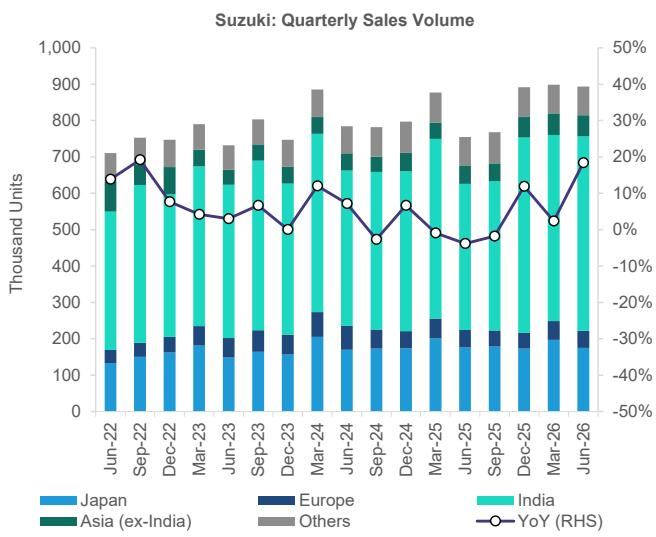  
Note: Apr-May 2026 figures are based on officially disclosed company data, while Jun figures are based on publicly available country-level data where available, and estimates derived from country-level data for markets where June data have not yet been released  
Source: Company reports, Marklines, Autodata, JADA, Zenkeijikyo, ACEA, SMMT, PFA, KBA, FADA, Gaikindo, Bernstein analysis and estimates

EXHIBIT 3: Honda's estimated FY3/27 Q1 sales volume (excluding China) reached 756k units (+5.9% YoY)  
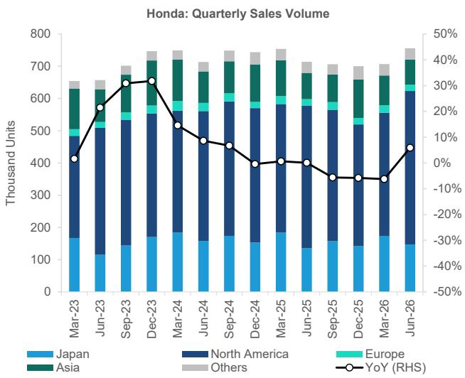  
Note: Apr-May 2026 figures are based on officially disclosed company data, while Jun figures are based on publicly available country-level data where available, and estimates derived from country-level data for markets where June data have not yet been released  
Source: Company reports, Marklines, Autodata, JADA, Zenkeijikyo, ACEA, SMMT, PFA, KBA, FADA, Gaikindo, Bernstein analysis and estimates

EXHIBIT 4: Subaru's estimated FY3/27 Q1 sales volume reached 229k units (+18.4% YoY)  
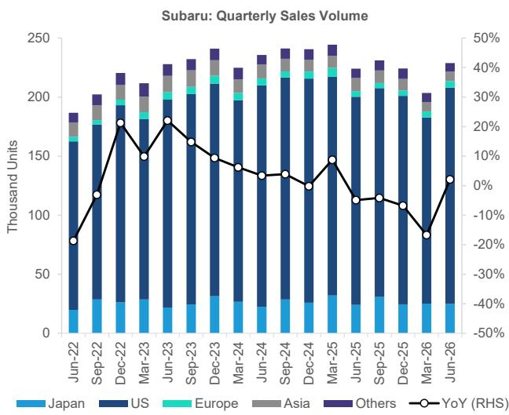  
Note: Apr-May 2026 figures are based on officially disclosed company data, while Jun figures are based on publicly available country-level data where available, and estimates derived from country-level data for markets where June data have not yet been released  
Source: Company reports, Marklines, Autodata, JADA, Zenkeijikyo, ACEA, SMMT, PFA, KBA, FADA, Gaikindo, Bernstein analysis and estimates

EXHIBIT 5: Nissan's estimated FY3/27 Q1 sales volume (excluding China) reached 581k units (-0.8% YoY)  
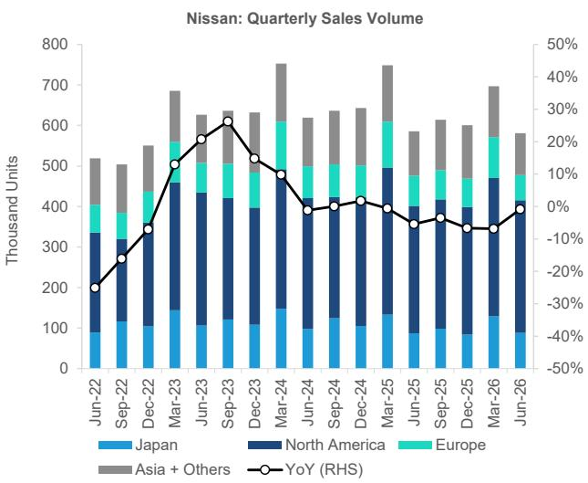  
Note: Apr-May 2026 figures are based on officially disclosed company data, while Jun figures are based on publicly available country-level data where available, and estimates derived from country-level data for markets where June data have not yet been released  
Source: Company reports, Marklines, Autodata, JADA, Zenkeijikyo, ACEA, SMMT, PFA, KBA, FADA, Gaikindo, Bernstein analysis and estimates

EXHIBIT 6: Mazda's estimated FY3/27 Q1 sales volume (excluding China) reached 280k units (-1.0% YoY)  
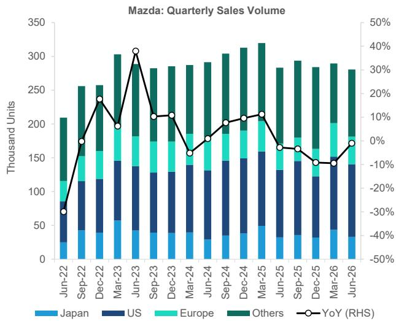  
Note: Apr-May 2026 figures are based on officially disclosed company data, while Jun figures are based on publicly available country-level data where available, and estimates derived from country-level data for markets where June data have not yet been released  
Source: Company reports, Marklines, Autodata, JADA, Zenkeijikyo, ACEA, SMMT, PFA, KBA, FADA, Gaikindo, Bernstein analysis and estimates

EXHIBIT 7: Toyota's estimated FY3/27 Q1 sales volume (excluding China) reached 2,327k units (-1.4% YoY)  
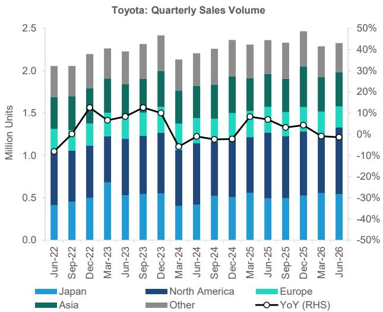  
Note: Apr-May 2026 figures are based on officially disclosed company data, while Jun figures are based on publicly available country-level data where available, and estimates derived from country-level data for markets where June data have not yet been released  
Source: Company reports, Marklines, Autodata, JADA, Zenkeijikyo, ACEA, SMMT, PFA, KBA, FADA, Gaikindo, Bernstein analysis and estimates

## PARTICULARLY BULLISH ON HONDA AND SUZUKI INTO Q1 RESULTS

Key areas of focus for the Japanese auto sector's Q1 (April–June) earnings are likely to include the earnings benefit from lower US import tariffs, which have declined to 15% this quarter from 27.5% a year ago, as well as headwinds from Middle East-related volume disruptions and higher raw material and logistics costs.

Based on our estimates derived from Q1 sales trends across our coverage universe, we expect automakers' operating profit to increase by an average of 6.5% YoY (Exhibit 8). Among OEMs, we forecast Honda, Suzuki, Nissan, and Mazda to deliver YoY profit growth, while Subaru and Toyota are likely to post YoY declines. Relative to current consensus expectations, we see upside potential for Subaru, Honda, Suzuki, and Toyota, while Mazda appears at risk of missing expectations (Exhibit 9). Although consensus forecasts for Nissan remain widely dispersed, suggesting limited market visibility, we believe earnings are likely to exceed the current median estimate of JPY 4.4bn.

We also expect investors to focus on Q1 progress against full-year operating profit guidance as a gauge of how conservative or aggressive initial company assumptions were. On this measure, Honda, Subaru, Toyota, and Suzuki should show strong progress rates, whereas Nissan and Mazda are likely to lag (Exhibit 10). Overall, we believe Honda, followed by Suzuki, Subaru, and Toyota, is best positioned to be positively received during the upcoming earnings season. By contrast, expectations for Nissan and Mazda could come under increasing pressure.

We expect Honda's Q1 operating profit to be driven primarily by higher vehicle sales, particularly HEVs in the US market, coupled with a significantly lower tariff burden relative to the prior year and the absence of the one-off EV-related expenses recorded in the year-ago quarter (JPY 122bn). A key variable, however, will be the timing and magnitude of the projected FY3/27 EV-related one-off costs of approximately JPY 50bn and how much is recognized in Q1. Should operating profit come in around our estimate, Honda would achieve an exceptionally high level of progress against its full-year guidance, increasing the likelihood of a guidance upgrade at the Q1 earnings release.

We expect Suzuki's Q1 operating profit to benefit mainly from volume growth in India. Key swing factors include provisions related to the recent engine component recall, fixed-cost trends, and the timing of unrealized profit adjustments. For Subaru, we anticipate earnings support from stronger sales volumes, particularly in the US, favorable FX effects from yen depreciation, and a lower US tariff burden versus the prior year. These positives are likely to be partially offset by the absence of approximately JPY 10bn in environmental credit sale gains booked in the year-ago quarter.

For Toyota, while sales momentum in the US and Japan remains solid, we expect Q1 operating profit to be weighed down by lower global volumes, reflecting weaker exports to and sales in the Middle East, where the company has relatively high exposure. Given its scale, Toyota is also likely to face the largest headwind from higher raw material costs. These pressures should be partially offset by yen depreciation and a lower US tariff burden relative to the prior year. Potential downside factors include the reversal of approximately JPY 200bn of year-ago unrealized profit benefits and the impact associated with the cancellation of the Lexus LF-ZC EV development program. Overall, while we forecast a YoY decline in Q1 operating profit, we continue to view Toyota's initial FY26 guidance as highly conservative. Strong progress against full-year guidance could refocus investor attention on the resilience of the company's core earnings power.

We expect Nissan's ongoing volume weakness in Europe and Asia, together with the absence of the approximately JPY 28.9bn benefit from accounting changes to warranty provisions recorded in the prior year. However, lower US tariff costs and expanding benefits from the Re:Nissan cost-reduction program should provide meaningful support. On balance, we forecast Nissan to return to an operating profit in Q1, compared with an operating loss in the year-ago quarter. For Mazda, Q1 operating profit is likely to face pressure from lower sales volumes in other overseas markets. Offsetting factors include reduced US tariff costs relative to last year and favorable FX effects from yen depreciation. In addition, the pace and timing of advertising and promotional spending could provide upside to earnings. However, if Q1 results come in line with our estimates, both Nissan and Mazda would post very low progress rates against their initial full-year guidance, potentially leading investors to question the achievability of their current earnings targets.

EXHIBIT 8: We forecast Honda, Suzuki, Nissan, and Mazda to deliver YoY profit growth, while Toyota and Subaru are likely to post YoY declines  
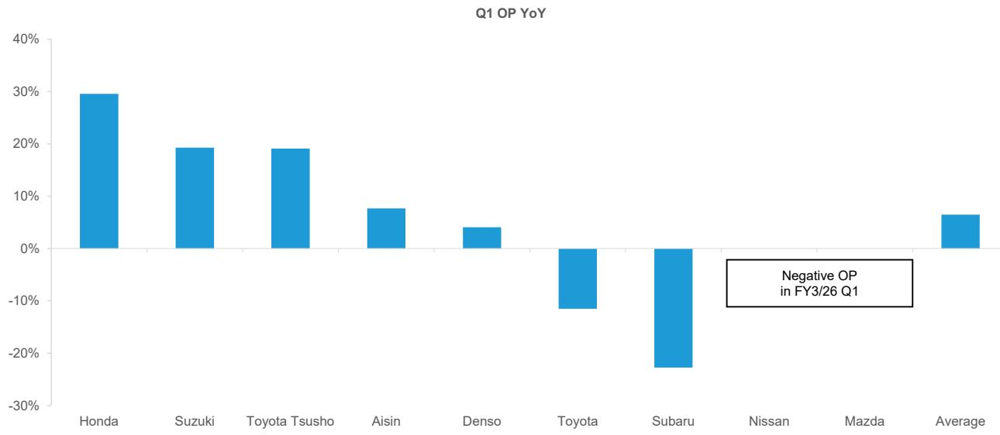  
Note: Toyota Tsusho on a net profit basis  
Source: Company reports, Bernstein analysis and estimates

EXHIBIT 9: We see upside potential for Subaru, Honda, Suzuki, and Toyota, while Mazda appears at risk of missing expectations  
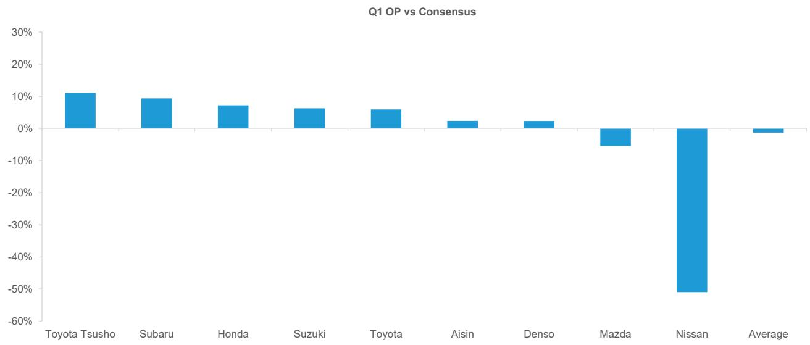  
Note: Toyota Tsusho on a net profit basis  
Source: Company reports, Bernstein analysis and estimates

EXHIBIT 10: Honda, Subaru, Toyota, and Suzuki should show strong progress rates, whereas Nissan and Mazda are likely to lag  
  
Note: Toyota Tsusho on a net profit basis  
Source: Company reports, Bernstein analysis and estimates

## DENSO AND AISIN UNLIKELY TO DELIVER SIGNIFICANT SURPRISES

Toyota's global production trend has remained somewhat soft since late last year and, consistent with recent sales trends, we estimate Q1 (April–June) global production to decline 2.3% YoY, primarily due to lower overseas output (Exhibit 11, Exhibit 12). While this is naturally a headwind for key group suppliers Denso and Aisin, we nevertheless forecast modest YoY growth in operating profit for both companies, supported by factors such as favorable FX movements. That said, we see limited upside to current consensus estimates, while progress against initial full-year guidance is likely to remain at a relatively reasonable level. As a result, we do not expect either company to deliver a major earnings surprise this quarter. For both companies, earnings should also be supported by pricing actions taken to offset the impact of US import tariffs. At Denso, the absence of significant quality-related issues could provide further upside to earnings. Meanwhile, Aisin may also have upside potential depending on the pace of its operational improvement initiatives and the realization of benefits from ongoing structural reforms.

EXHIBIT 11: Toyota's global production volumes have softened since late last year

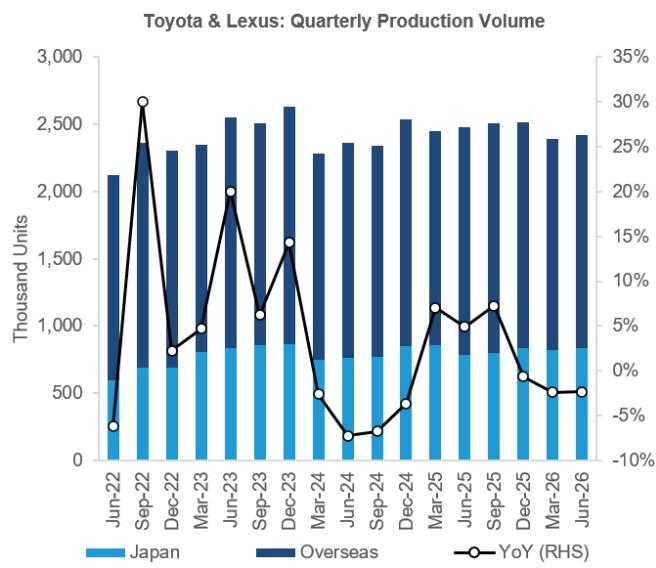  
Source: Company reports, Bernstein analysis and estimates

EXHIBIT 12: Toyota's Q1 global production is expected to fall 2.3% YoY, due to lower overseas production  
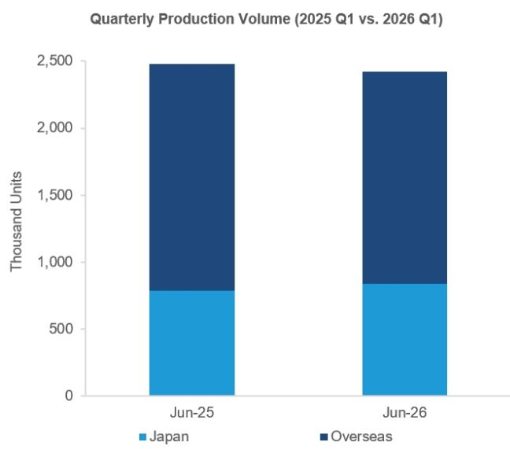  
Source: Company reports, Bernstein analysis and estimates

## TOYOTA TSUSHO POISED TO BENEFIT FROM STRONG LAND CRUISER SALES IN AFRICA

Toyota Tsusho's Q1 (April–June) net profit is likely to surprise meaningfully to the upside, primarily supported by strong Toyota Land Cruiser sales in Africa. We forecast YoY growth in Q1 net profit and believe earnings could come in well above current consensus expectations. As a result, the company's progress rate against its initial full-year net profit guidance could also be stronger than expected, potentially prompting the market to raise its earnings expectations further. In our view, a solid Q1 performance would reinforce confidence in the sustainability of Toyota Tsusho's earnings momentum and could serve as a positive catalyst for the shares.

Our analysis is based on a regression framework using African Land Cruiser sales volumes from IHS and the EUR/JPY exchange rate to forecast net profit in the Africa business, a key driver of Toyota Tsusho's earnings. We then use the historical relationship between Africa business net profit and consolidated net profit to estimate Toyota Tsusho's consolidated earnings.

Looking at the relationship between quarterly net profit in the Africa business and Land Cruiser sales volumes in Africa through FY3/26 Q4, we observe a very strong correlation (Exhibit 13). In a multiple regression model using quarterly Africa business net profit as the dependent variable and African Land Cruiser sales volumes together with EUR/JPY as explanatory variables, the model achieves an R $^{2}$ of 0.85, while the Significance F is effectively zero (0.00...), indicating a highly statistically significant relationship (Exhibit 14). IHS forecasts African Land Cruiser sales of 3,429 units in FY3/27 Q1, representing growth of 28.4% YoY. In addition, South Africa, which has accounted for roughly 80-90% of the Land Cruiser sales in Africa over the past three years, recorded sales growth of 21.8% YoY in April-May, pointing to continued strength in underlying demand. EUR/JPY also moved from 164 in FY3/26 Q1 to 185 in FY3/27 Q1, providing an additional tailwind for earnings.

We then conducted a simple regression analysis using Africa business net profit as the explanatory variable and consolidated net profit as the dependent variable. The model produces an $R^{2}$ of 0.84, indicating a very strong historical relationship between the two variables. Based on this regression framework, we believe Q1 consolidated net profit could come in above consensus.

EXHIBIT 13: Toyota Tsusho's Africa business net profit appears to be highly correlated with sales volumes of the Toyota Land Cruiser series in Africa  
  
Note: FY3/27 Q1 (Jun-26) net profit is estimated based on the regression relationship between Land Cruiser sales volumes and net profit  
Source: Bloomberg, IHS, Company reports, Bernstein analysis and estimates

EXHIBIT 14: Our multiple regression analysis indicates that Land Cruiser sales volumes in Africa and EUR/JPY have strong explanatory power for the Africa business's net profit

<table><tr><td colspan="2">Regression Statistics</td></tr><tr><td>Multiple R</td><td>0.92</td></tr><tr><td>R Square</td><td>0.85</td></tr><tr><td>Adjusted R Square</td><td>0.84</td></tr><tr><td>Standard Error</td><td>3,271.63</td></tr><tr><td>Observations</td><td>32.00</td></tr></table>

## ANOVA

<table><tr><td></td><td>df</td><td>SS</td><td>MS</td><td>F</td><td>Significance F</td></tr><tr><td>Regression</td><td>2</td><td>1,830,293,315</td><td>915,146,658</td><td>85.50</td><td>0.00</td></tr><tr><td>Residual</td><td>29</td><td>310,403,296</td><td>10,703,562</td><td></td><td></td></tr><tr><td>Total</td><td>31</td><td>2,140,696,612</td><td></td><td></td><td></td></tr></table>

Source: Bloomberg, IHS, Bernstein analysis

## I. REQUIRED DISCLOSURES

References to "Bernstein" or the "Firm" in these disclosures relate to the following entities: Bernstein Institutional Services LLC (April 1, 2024 onwards), Bernstein & Co., LLC (pre April 1, 2024), Bernstein Autonomous LLP, BSG France S.A. (April 1, 2024 onwards), Bernstein (Hong Kong) Limited 盛博香港有限公司, Bernstein (Canada) Limited, Bernstein (India) Private Limited (SEBI registration no. INH000006378), Bernstein (Singapore) Private Limited, Bernstein Japan KK (サンフォード・C・バーンスタイン株式会社) and analysts employed by SG Africa Technologies & Services to produce Bernstein under a Global Services Agreement in place between Bernstein and SG.

Bernstein is part of a joint venture between SG (SG) and AllianceBernstein, L.P. (AB). Unless specifically noted otherwise, for purposes of these disclosures, references to Bernstein's “affiliates” relate to both SG and AB and their respective affiliates.

## VALUATION METHODOLOGY

This research publication covers six or more companies. For valuation methodology and other company disclosures: Please visit: https://bernstein-autonomous.bluematrix.com/sellside/Disclosures.action.

Or, you can also write to the Director of Compliance, Bernstein Institutional Services LLC, 245 Park Avenue, New York, NY 10167.

## RISKS

This research publication covers six or more companies. For risks and other company disclosures:

Please visit: https://bernstein-autonomous.bluematrix.com/sellside/Disclosures.action.

Or, you can also write to the Director of Compliance, Bernstein Institutional Services LLC, 245 Park Avenue, New York, NY 10167.

RATINGS DEFINITIONS, BENCHMARKS AND DISTRIBUTION

## EQUITY RATINGS DEFINITIONS

## Bernstein brand

The Bernstein brand rates stocks based on forecasts of relative performance for the next 12 months versus the S&P 500 for stocks listed on the U.S. and Canadian exchanges, versus the Bloomberg Europe Developed Markets Large and Mid Cap Price Return Index EUR (EDME) for stocks listed on the European exchanges and emerging markets exchanges outside of the Asia Pacific region, versus the Bloomberg Japan Large and Mid Cap Price Return Index USD (JPL) for stocks listed on the Japanese exchanges, and versus the Bloomberg Asia ex-Japan Large and Mid Cap Price Return Index (ASIAX) for stocks listed on the Asian (ex-Japan) exchanges -unless otherwise specified.

The Bernstein brand has three categories of ratings:

\- Outperform: Stock will outpace the market index by more than 15 pp

• Market-Perform: Stock will perform in line with the market index to within +/-15 pp

• Underperform: Stock will trail the performance of the market index by more than 15 pp

Coverage Suspended: Coverage of a company under the Bernstein brand has been suspended. Ratings and price targets are suspended temporarily, are no longer current, and should therefore not be relied upon.

Not Rated: A rating assigned when the stock cannot be accurately valued, or the performance of the company accurately predicted, at the present time. The covering analyst may continue to publish research reports on the company to update investors on events and developments.

Not Covered (NC) denotes companies that are not under coverage.

Bernstein brand stock ratings are based on a 12-month time horizon.

Autonomous brand – common stocks

The Autonomous brand rates common stocks as indicated below. As our benchmarks we use the Bloomberg Europe 600 Financials Price Return Index (E600BK) and Bloomberg Europe Dev Mkt Financials Large and Mid Cap Price Ret Index EUR (EDMFI) index for developed European banks and Payments, the Bloomberg Europe 600 Insurance Price Return Index (E600IN) for European insurers, the S&P 500 and S&P Financials for US banks and Payments coverage, S5LIFE for US Insurance, the S&P Insurance Select Industry (SPSIINS) for US Non-Life Insurers coverage, the Bloomberg Emerging Markets Financials Large, Mid and Small Cap Price Return Index (EMLSF) for emerging market banks and insurers and Payments, and the Bloomberg Japan Financials Large & Mid Cap Price Return Index (JPFILM) for Japanese Financials. Ratings are stated relative to the sector (not the market).

The Autonomous brand has three categories of common stock ratings:

\- Outperform (OP): Stock will outpace the relevant index by more than 10 pp

\- Neutral (N): Stock will perform in line with the market index to within +/-10 pp

• Underperform (UP): Stock will trail the performance of the relevant index by more than 10 pp

Coverage Suspended: Coverage of a company under the Autonomous research brand has been suspended. Ratings and price targets are suspended temporarily, are no longer current, and should therefore not be relied upon.

Not Rated: A rating assigned when the stock cannot be accurately valued, or the performance of the company accurately predicted, at the present time. The covering analyst may continue to publish research reports on the company to update investors on events and developments.

Those denoted as ‘Feature’ (e.g., Feature Outperform FOP, Feature Under Outperform FUP) are our core ideas.

Not Covered (NC) denotes companies that are not under coverage.

Autonomous brand common stock ratings are based on a 12-month time horizon.

## Autonomous brand – preferred stocks

The Autonomous brand has three categories of preferred stock ratings:

\- Outperform (OP): The
