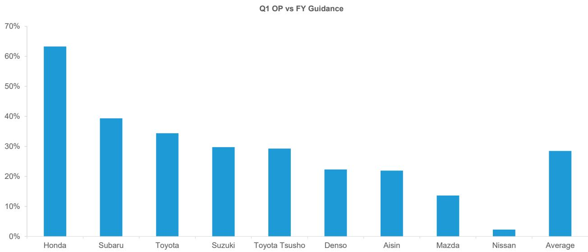
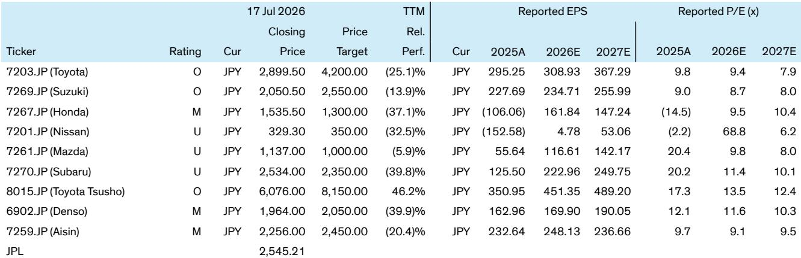
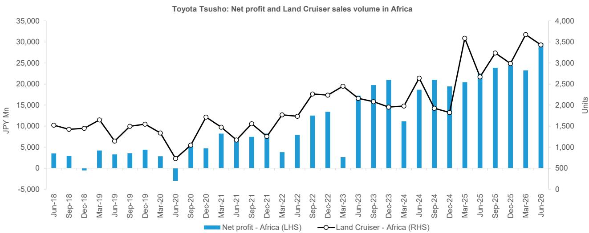

# Bernstein：日本汽车零部件——本田、铃木、丰田通商业绩前瞻

日本汽车制造商即将进入2026财年第一季度的业绩发布期。Bernstein在最新研究报告中梳理了覆盖范围内各公司的销量与利润趋势，核心判断是：本田、铃木和丰田通商有望成为本季度的业绩亮点，而日产和马自达则可能面临相对不确定性。

报告覆盖的六家日本车企在2026年4月至6月的合计销量预计同比增长3.9%，但内部表现差异明显。铃木以18.4%的同比增速领跑，主要受益于印度市场在商品及服务税下调后的需求变化，以及新投产的Kharkhoda工厂带来的增量。本田紧随其后，全球销量预计增长5.9%，美国市场HEV车型（尤其是CR-V）创下销售纪录，日本本土也因税制调整后的注册车辆需求回升而获得支撑。斯巴鲁销量预计增长2.1%，美国市场对Forester和Crosstrek的HEV版本需求持续向好。

相比之下，丰田、日产和马自达的季度销量预计出现同比下滑。丰田的影响主要来自中东市场的出口和销售缩减，该公司在该地区的业务敞口在日本车企中最大。不过，丰田最新公布的7月至9月生产计划显示全球产量将同比增长3.4%，这意味着销量动能有望从第二季度起恢复。日产虽然美国市场表现尚可，但欧洲和亚洲的销量变化抵消了增长。马自达的新款CX-5在欧洲和日本有正面贡献，但其他市场的表现有所差异。

> **KC评论：** Bernstein的销量估算排除了中国市场，因为中国业务的收入和利润对日本车企合并报表的直接影响有限。这一处理方式值得关注——它意味着报告对“业绩”的判断主要基于非中国市场的表现，而中国市场的结构性变化（如本土品牌崛起、电动化竞争）并未被纳入本季度的核心评估框架。

利润层面，报告预计覆盖范围内车企的营业利润平均同比增长6.5%。本田和铃木被明确列为最值得关注的标的。本田的利润驱动因素包括美国HEV销量增长、美国进口关税从去年同期的27.5%降至15%带来的成本变化，以及去年同期约1220亿日元EV相关一次性费用的消失。报告特别指出，如果本田Q1营业利润达到预期，其全年指引的完成进度将异常高，这增加了在Q1财报发布时上调全年指引的可能性。

铃木的利润增长主要依赖印度市场的销量扩张，但需关注近期发动机部件召回相关的拨备、固定成本趋势以及未实现利润调整的时点。斯巴鲁和丰田虽然预计营业利润同比下滑，但报告认为两者仍可能交出优于市场预期的成绩，主要得益于美元贬值的汇率效应和较低的关税负担。丰田的全年指引被认为非常保守，如果Q1进度良好，市场可能重新聚焦其核心盈利能力的韧性。

日产和马自达则被列为相对落后的公司。日产面临欧洲和亚洲的持续销量变化，且去年同期因会计变更获得的约289亿日元一次性收益不再重现。马自达的利润预期面临共识下修不确定性。

在丰田系零部件和贸易公司中，报告对丰田通商最为看好。其Q1净利润有望超出预期，核心驱动力是非洲市场的丰田Land Cruiser销量增长。报告分析显示，非洲Land Cruiser销量和欧元兑日元汇率与丰田通商非洲业务的净利润高度相关。IHS预测非洲Land Cruiser销量在Q1同比增长28.4%，叠加有利的汇率环境，该业务有望实现利润增长，带来明显的业绩惊喜。相比之下，电装和爱信因丰田产量变化而承压，但汇率和关税转嫁措施可能使利润保持基本稳定，出现重大意外的可能性较低。

> **KC评论：** 丰田通商的分析提供了一个可复用的观察框架——对于业务结构多元的贸易公司，找到与利润高度相关的单一变量（如特定车型销量、特定汇率对）是拆解业绩的关键。报告明确指出Land Cruiser非洲销量和EUR/JPY是核心变量，这种归因方式比笼统看“整体销量”或“汇率影响”更具操作性。

整体而言，Bernstein认为本田、铃木、斯巴鲁和丰田在即将到来的财报季中最有可能获得市场正面反馈，而日产和马自达的预期可能面临更大不确定性。读者关注的焦点之一将是各公司Q1利润对全年指引的完成进度，以此判断管理层最初假设的保守或激进程度。

For informational purposes only. Portions may be generated,translated,summarized,or edited with AI assistance based on source materials and may contain omissions or errors. Please verify independently. This is not investment,legal,tax,accounting,or other professional advice.

For informational purposes only. Portions may be generated,translated,summarized,or edited with AI assistance based on source materials and may contain omissions or errors. Please verify independently. This is not investment,legal,tax,accounting,or other professional advice.

