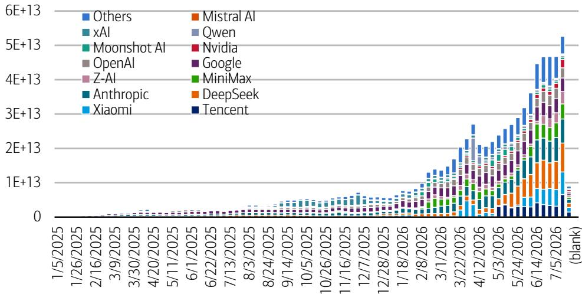
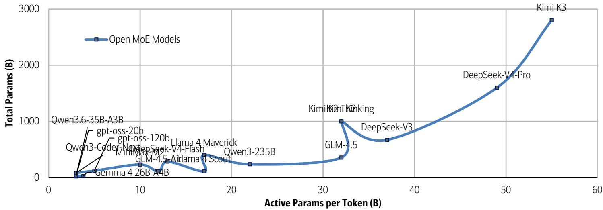
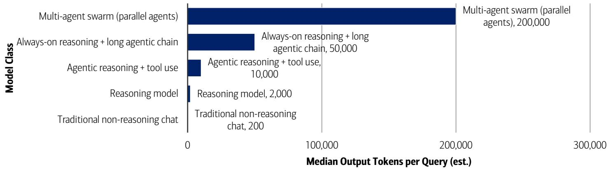

US Semiconductors

# The Case for Memory, and why "open-source" expands TAM

Industry Overview

## Chinese Open LLMs are no threat to memory demand

Latest releases in open-source models, including China's Kimi K3 launched July 16, reinforce our observations on memory/MU. From a high level, we view the aggressive Chinese open-model API pricing (up to 5-350x cheaper than Western models) as reflective of business-model choices, not necessarily reflective of hardware costs. Importantly, these models, using various efficiency techniques (more below), are able to reduce compute/GPU intensity, but require the same or more memory as their model weights and active parameters increase. We also flag that every open-weight download also creates a new customer-side memory socket that wouldn't exist in a closed-model setting.

## Chinese models charge less, but still require same memory

Chinese open-model API pricing is aggressive, with Tencent Hunyuan at \$0.06/mn input vs. Claude Opus 4.8 at \$15/mn, and even Moonshot AI's latest Kimi K3 charging only \$3/mn despite 'similar' performance. However, we flag API price is a business-model choice, not necessarily a hardware-cost read-through. For instance, Kimi K3 still requires \~1.4 TB of HBM per serving instance to run. This is similar to OpenAI's 'oss-120b' open model with the same MXFP4 native precision (for like-for-like compression) with 120B total parameters (23x smaller than Kimi K3) requiring \~63GB of weight memory to run (22x smaller). In other words, often times API pricing actually scales with total memory weight and active parameters, even for open Chinese LLMs. "Open" refers to weight distribution, not deployment cost, and customers still need to purchase HBM, DRAM, NAND to run the model on their own hardware.

## Efficiency techniques, subsidies likely help lower pricing

Where Chinese models do have pricing/cost advantage is often not hardware-related. We estimate Chinese cost advantage in architectural efficiency (MoE sparsity, MLA/hybrid attention, native FP8/MXFP4 quantization, as well as up to 1.5-2x advantage in physical infra efficiency (lower Chinese electricity, labor, and land costs). Rest of the pricing differential could come from state-linked capital subsidies and cloud revenue/FCF at Chinese CSPs (Alibaba, Tencent, Baidu). Interestingly, Moonshot's Kimi K3 paused new subscriptions within just 48 hours of K3's launch, likely as GPU capacity ran out (or to cut costs/losses), and Xiaomi in May 2026 cut its MiMo model pricing by $99\%$ (likely unprofitable), likely as an effort to grab market share.

## CXMT not a threat, reit. MU Buy ahead of buyback resume

We reiterate Buy on MU with \$1,550 PO. While China-based CXMT is aggressively expanding capacity (now low-10% of global wafer capacity), we view limited competition in AI memory. CXMT primarily addresses the underserved consumer/commodity DRAM segment, not HBM3E/HBM4. It also remains unclear whether US OEMs will receive gov't approval to source from CXMT any time soon. Critically, MU's CHIPS Act buyback restrictions expire around Dec-26 (two years after the first funding tranche received Dec-24), opening the door to large-scale repurchases – given its \$120-130bn/yr+ FCF outlook over the next few years. A 40% payout policy would result in \~\$50-60bn/yr of buybacks, or \~5-6% of its \~\$1Tn market cap per year.

## 20 July 2026

Equity
United States
Semiconductors

Vivek Arya
Research Analyst
BofAS
vivek.arya@bofa.com

Duksan Jang
Research Analyst
BofAS
duksan.jang@bofa.com

Michael Mani
Research Analyst
BofAS
michael.mani@bofa.com

Liam Pharr
Research Analyst
BofAS
liam.pharr@bofa.com

CXMT: ChangXin Memory Technologies

## Contents

Memory is still critical in open models 3
Chinese models charge less, but may not cost much less 3
Open models continue to grow in weight size 4
Open models expand memory endpoints vs. closed 5
Scaling gains much faster than efficiency gains 6
China models create disruption but also expand market, beneficial for semis 8
Glossary: 9

## Memory is still critical in open models

## Chinese models charge less, but may not cost much less

Chinese open-model API pricing is very competitive. Latest Kimi K3 charges \$3/M input and \$15/M output vs. Claude Opus 4.8 and GPT-5.6 at roughly 5x that.

However, we flag API price is a business-model choice, not necessarily a hardware-cost readout. Kimi K3 still requires a 64+ accelerator super-node with \~1.4 TB of HBM per serving instance to run – that memory content is required whether Moonshot charges \$3 or \$30 per million tokens.

OpenAI's similar open model with MXFP4 native precision (for like-for-like compression) with 120B total parameters (23x smaller than Kimi K3) requires \~63GB of weight memory to run (22x smaller), in-line with the memory requirements of K3 if model sizes were the same.

Exhibit 1: Global token usage increased on average by +6% per week since 2025, or +9% per week since 2026, with China models accounting for \~70% of the tokens in July 2026
Weekly Token Usage by Major Models (API) via OpenRouter

  
Source: BofA Global Research, OpenRouter  
BofA GLOBAL RESEARCH

## Cost advantage often comes from non-hardware efficiency

We suspect much of Chinese LLM cost advantages (up to 5-50x vs. western) actually come from non-hardware efficiencies.

## Architectural efficiency (2-3x)

\- Extreme MoE sparsity: Qwen3-Coder-Next activates just 3B of 80B total parameters (\~3.75%); Kimi K3 activates \~1.8%. Compute per decoded token in Chinese LLMs is a fraction of what a comparable dense model would need.

\- MLA/hybrid attention: DeepSeek's MLA and Kimi's KDA compress KV cache 10-90x vs. standard attention, so batch density is also much higher — more concurrent users per GPU.

\- Native low-bit quantization: Kimi K2 Thinking ships W4A16, K3 ships MXFP4, DeepSeek trains natively in FP8. That's another 2x throughput vs. FP16 of Meta Llama 4 or Google Gemma 4 open models.

Combined, net architectural efficiency could reach 2-3x per token vs. an equivalently sized Western model that ships in BF16/FP8 native, without these efficiency gains.

Input-side infrastructure cost (\~1.5-2x)

\- Chinese electricity: \~\$0.05-0.08/kWh vs. \~\$0.10-0.15/kWh in US hyperscaler zones

\- Chinese labor: Engineering salaries 40-60% lower than US equivalents

\- Land/real estate: Data center capex and related land/shell/power spend meaningfully lower in interior China (Ningxia, Guizhou)

Combined, net input-cost advantage could also reach 1.5-2x per token, depending on the underlying compute bill.

Competition, subsidies for market share

Lastly, we flag Moonshot AI paused new subscriptions within just 48 hours of K3's launch, because GPU capacity ran out or potentially just to cut costs/losses.

If K3's low price genuinely reflected proportional hardware savings, we expect Moonshot to have provisioned enough capacity. As such, actual hardware cost per query at Kimi K3 could be higher than the much cheaper API price implies, and Moonshot may be subsidizing to grab market share.

There are similar cases, such as Xiaomi cutting its MiMo model pricing by 99% in May 2026, likely as an effort to grab market share.

Exhibit 2: Open models continue to grow in weight size (i.e. memory), with their API input/output cost generally also increasing with the weight Key Open Models Pricing and Weight Memory

<table><tr><td>Model</td><td>Input $/M tokens</td><td>Output $/M tokens</td><td>Weight Memory (GB)</td><td>Input $/B tokens / Weight Memory (GB)</td><td>Access</td></tr><tr><td>Kimi K3</td><td>3</td><td>15</td><td>1400</td><td>$2.14</td><td>Open Weight</td></tr><tr><td>DeepSeek-V3.2</td><td>0.28</td><td>0.42</td><td>336</td><td>$0.83</td><td>Open Weight</td></tr><tr><td>DeepSeek-V4-Flash</td><td>0.14</td><td>0.28</td><td>142</td><td>$0.99</td><td>Open Weight</td></tr><tr><td>Qwen3-235B (Alibaba API)</td><td>0.5</td><td>1.5</td><td>118</td><td>$4.24</td><td>Open Weight</td></tr><tr><td>GLM-4.5 (Z.ai API)</td><td>0.6</td><td>2.2</td><td>178</td><td>$3.37</td><td>Open Weight</td></tr><tr><td>gpt-oss-120b (via provider)</td><td>0.15</td><td>0.6</td><td>63</td><td>$2.38</td><td>Open Weight</td></tr><tr><td>GPT-5.6 Sol</td><td>1.25</td><td>10</td><td>N/A - closed</td><td></td><td>Closed</td></tr><tr><td>Claude Opus 4.8</td><td>15</td><td>75</td><td>N/A - closed</td><td></td><td>Closed</td></tr><tr><td>Claude Sonnet 5</td><td>3</td><td>15</td><td>N/A - closed</td><td></td><td>Closed</td></tr><tr><td>Gemini 3 Pro</td><td>1.25</td><td>10</td><td>N/A - closed</td><td></td><td>Closed</td></tr><tr><td>Grok 4</td><td>3</td><td>15</td><td>N/A - closed</td><td></td><td>Closed</td></tr></table>

Source: BofA Global Research estimates  
BofA GLOBAL RESEARCH

## Open models continue to grow in weight size

Frontier open-weight model size continues to increase sharply (closed models often do not publish model weight data):

\- DeepSeek-V3 at 671B (Dec 2024)

\- Kimi K2 at 1T (mid-2025)

\- DeepSeek-V4-Pro at 1.6T (Apr 2026)

\- Kimi K3 at 2.8T parameters (Jul 16, 2026) — the largest open-weight model ever released

## Larger weights flow directly to memory demand.

In fact, the MIT Data Provenance audit documents a 17x increase in average open model size from 2019-2025. Even in native MXFP4 (4-bit), Kimi K3's weights now occupy \~1.4 TB and Moonshot's own guidance requires 64+ accelerators per serving instance.

Weight memory scales with total parameters (such as K3's 2.8T parameters), not active parameters.

Even with industry compression/quantization from FP8 to MXFP4 delivering a 2x saving, model sizes have grown \~4x more in parameter growth, more than offsetting the

efficiency gains from compression. For instance, Kimi K3 (July 2026) in native MXFP4 requires 2x the memory of DeepSeek-V3 in FP8 (December 2024).

## Active parameters reduce compute, not memory

With the use of MoE (i.e. using just active parameters), Kimi K3 activates only 16 of 896 experts at a time, i.e. it only activates 50B of its total 2.8T parameters per token. This greatly reduces the total compute requirement during the inference process.

However, the model still needs to keep nearly the entire expert pool (i.e. the entire model weight) resident in nearby memory. In fact, HBM capacity scales much more closely with total parameters, than with active parameters.

This is because MoE routers select experts dynamically per token, so every expert (i.e. total weight) must remain resident in fast memory regardless of activation sparsity. As a result, doubling total parameters requires double HBM per instance, which is why K3 needs 64+ accelerators while V3 needed just 8.

## Larger model weight drives multi-tier memory

Lastly, larger weights force multi-tier memory hierarchies: hot experts in HBM, inactive experts spilled to CPU LPDDR5X/DDR5, cold KV cache to enterprise NAND. Every tier gets more content per deployment.

Exhibit 3: Open MoE model total parameters and active parameters per token continue to scale upward, resulting in larger weight for memory storage
Open MoE models total parameters (bn) vs. active parameters per token (bn)  
  
Source: BofA Global Research estimates  
BofA GLOBAL RESEARCH

## Open models expand memory endpoints vs. closed

The mechanism is simple: a closed model has one deployment footprint; an open model has as many footprints as it has downloads.

For instance when OpenAI serves GPT-5.6 (closed model), the model weights live in a small number of Microsoft Azure data centers. Every user in the world — millions of them — hits that same shared HBM pool. Total memory content is set by peak concurrent demand across all users combined, and can be amortized because usage patterns diversify across time zones and workloads.

But when Moonshot releases Kimi K3 weights (open model), or DeepSeek releases V3, or OpenAI releases gpt-oss-120b, the weights get downloaded and loaded into memory on every buyer's own hardware. An enterprise running gpt-oss-120b needs its own 80 GB of HBM3E. A sovereign cloud running DeepSeek-V3 provisions its own 8× H200 cluster (\~1.1 TB of HBM). Moonshot's own guidance for K3 calls for 64+

accelerators per serving instance — and that footprint gets replicated by every enterprise, government, and cloud that downloads the weights. None of that memory would have been purchased if the same intelligence were only available through a closed API, because the customer would have rented compute cycles rather than owned the hardware.

As a result for open models, both model weights and KV cache must be resident in fast memory to serve inference — they cannot be shared across separately owned clusters. Unlike a shared API where 10,000 users effectively share one copy of the weights in HBM, 10,000 enterprises self-hosting the same open model means 10,000 copies of the weights loaded into 10,000 separate HBM pools. Each deployment also needs its own KV cache capacity scaled to its own user base — and at the 128K–1M context windows common in 2026, KV cache per active user session can exceed 40 GB, so this scales with concurrency on every endpoint independently.

## Memory endpoints benefit from cheaper API pricing

Open models having separate memory endpoints also benefit end memory deployment, as Chinese LLM labs charge cheaper API pricing and thus drive overall demand up. In other words:

\- Cheaper Chinese API pricing = more inference workload volume + more open-weight enterprise self-hosting + more memory sockets deployed globally.

While frontier model labs are spending capital to grab share, the market is likely expanding its aggregate compute and memory capacity in the process; and every enterprise that downloads Qwen, GLM, Hunyuan, or MiMo instead of paying for Claude Opus creates a new customer-side memory footprint that wouldn't exist in a pure closed-API world.

Overall, closed models consolidate memory demand; open models multiply it — and the compression from efficiency innovations doesn't offset multiplication by endpoint count.

## Scaling gains much faster than efficiency gains

Lastly, we highlight workload intensity and overall demand gained by Jevons Paradox are far greater than the efficiency gains from MoE, quantization, KV cache compression techniques.

Exhibit 4: Latest multi-agent workloads generate up to 200,000x more output tokens per query than traditional non-reasoning chat workloads (GPT-4o)
Tokens per query by different model workloads

  
Source: BofA Global Research estimates  
BofA GLOBAL RESEARCH

Exhibit 5: Newer releases of open models generally feature much larger total parameters, context windows, and weight memory gen-over-gen
List of key LLMs and their model weights

<table><tr><td>Model</td><td>Developer</td><td>Origin</td><td>Release</td><td>Openness Category</td><td>Architecture</td><td>Total Params</td><td>Context Window</td><td>Native Precision</td><td>Weight Memory (FP8, GB)</td><td>Weight Memory (4-bit, GB)</td></tr><tr><td>DeepSeek-V3.2</td><td>DeepSeek AI</td><td>China</td><td>Late 2025</td><td>Open Weight (permissive)</td><td>MoE</td><td>671B</td><td>128K</td><td>FP8</td><td>671</td><td>336</td></tr><tr><td>DeepSeek-V4-Pro</td><td>DeepSeek AI</td><td>China</td><td>Apr-26</td><td>Open Weight (permissive)</td><td>MoE</td><td>1.6T</td><td>1M</td><td>FP8</td><td>1600</td><td>800</td></tr><tr><td>Qwen3.6-35B-A3B</td><td>Alibaba</td><td>China</td><td>Apr-26</td><td>Open Weight (permissive)</td><td>MoE</td><td>35B</td><td>128K</td><td>BF16</td><td>35</td><td>16</td></tr><tr><td>Kimi K2</td><td>Moonshot AI</td><td>China</td><td>Mid 2025</td><td>Open Weight (permissive)</td><td>MoE</td><td>1T</td><td>128K</td><td>BF16</td><td>1000</td><td>500</td></tr><tr><td>Kimi K3</td><td>Moonshot AI</td><td>China</td><td>16-Jul-26</td><td>Open Weight (permissive)</td><td>MoE</td><td>2.8T</td><td>1M</td><td>MXFP4</td><td>2800</td><td>1400</td></tr><tr><td>GLM-4.5</td><td>Zhipu AI (Z.ai)</td><td>China</td><td>Jul-25</td><td>Open Weight (permissive)</td><td>MoE + MTP</td><td>355B</td><td>128K</td><td>BF16 / FP8</td><td>355</td><td>178</td></tr><tr><td>GLM-4.7</td><td>Zhipu AI (Z.ai)</td><td>China</td><td>2026</td><td>Open Weight (permissive)</td><td>MoE</td><td>~360B</td><td>~204K</td><td>BF16 / FP8</td><td>360</td><td>180</td></tr><tr><td>MiniMax-M2</td><td>MiniMax</td><td>China</td><td>Oct-25</td><td>Open Weight (permissive)</td><td>MoE</td><td>230B</td><td>~200K</td><td>FP8</td><td>230</td><td>115</td></tr><tr><td>gpt-oss-120b</td><td>OpenAI</td><td>US</td><td>Aug-25</td><td>Open Weight (permissive)</td><td>MoE</td><td>120B</td><td>128K</td><td>MXFP4</td><td>120</td><td>63</td></tr><tr><td>gpt-oss-20b</td><td>OpenAI</td><td>US</td><td>Aug-25</td><td>Open Weight (permissive)</td><td>MoE</td><td>20B</td><td>128K</td><td>MXFP4</td><td>20</td><td>12</td></tr><tr><td>Llama 4 Scout</td><td>Meta</td><td>US</td><td>2025</td><td>Open Weight (restricted)</td><td>MoE</td><td>109B</td><td>10M</td><td>BF16</td><td>109</td><td>55</td></tr><tr><td>Llama 4 Maverick</td><td>Meta</td><td>US</td><td>2025</td><td>Open Weight (restricted)</td><td>MoE</td><td>400B</td><td>1M+</td><td>BF16</td><td>400</td><td>200</td></tr><tr><td>Llama 4 Behemoth</td><td>Meta</td><td>US</td><td>Paused May 2026</td><td>Open Weight (restricted)</td><td>MoE (teacher)</td><td>~2T</td><td>N/A</td><td>BF16</td><td>2000</td><td>1000</td></tr><tr><td>Mistral Large 3</td><td>Mistral AI</td><td>France/EU</td><td>2025-2026</td><td>Open Weight (restricted)</td><td>Dense/MoE</td><td>~123B</td><td>128K</td><td>BF16</td><td>123</td><td>62</td></tr><tr><td>Gemma 4 26B-A4B</td><td>Google</td><td>US</td><td>Apr-26</td><td>Open Weight (restricted)</td><td>MoE</td><td>26B</td><td>128K</td><td>BF16</td><td>26</td><td>13</td></tr><tr><td>GPT-5.6 Sol</td><td>OpenAI</td><td>US</td><td>9-Jul-26</td><td>Closed</td><td>Undisclosed</td><td>Not disclosed</td><td>1.05M (128K output)</td><td>Not disclosed</td><td>N/A</td><td>N/A</td></tr><tr><td>GPT-5.5 / 5.5 Pro</td><td>OpenAI</td><td>US</td><td>23-Apr-26</td><td>Closed</td><td>Undisclosed</td><td>Not disclosed</td><td>1M</td><td>Not disclosed</td><td>N/A</td><td>N/A</td></tr><tr><td>Claude Fable 5</td><td>Anthropic</td><td>US</td><td>9-Jun-26</td><td>Closed</td><td>Undisclosed</td><td>Not disclosed</td><td>1M</td><td>Not disclosed</td><td>N/A</td><td>N/A</td></tr><tr><td>Claude Mythos 5</td><td>Anthropic</td><td>US</td><td>9-Jun-26</td><td>Closed</td><td>Undisclosed</td><td>Not disclosed</td><td>1M</td><td>Not disclosed</td><td>N/A</td><td>N/A</td></tr><tr><td>Claude Opus 4.8</td><td>Anthropic</td><td>US</td><td>28-May-26</td><td>Closed</td><td>Undisclosed</td><td>Not disclosed</td><td>1M / 128K output</td><td>Not disclosed</td><td>N/A</td><td>N/A</td></tr><tr><td>Claude Sonnet 5</td><td>Anthropic</td><td>US</td><td>30-Jun-26</td><td>Closed</td><td>Undisclosed</td><td>Not disclosed</td><td>1M / 128K output</td><td>Not disclosed</td><td>N/A</td><td>N/A</td></tr><tr><td>Gemini 3 Pro</td><td>Google DeepMind</td><td>US</td><td>Nov-25</td><td>Closed</td><td>Sparse MoE (multimodal)</td><td>Not disclosed</td><td>1M / 64K output</td><td>Not disclosed</td><td>N/A</td><td>N/A</td></tr><tr><td>Gemini 3.1 Pro</td><td>Google DeepMind</td><td>US</td><td>2026 (Preview)</td><td>Closed</td><td>Sparse MoE</td><td>Not disclosed</td><td>1M</td><td>Not disclosed</td><td>N/A</td><td>N/A</td></tr><tr><td>Gemini 3.5 Flash</td><td>Google DeepMind</td><td>US</td><td>2026</td><td>Closed</td><td>Sparse MoE</td><td>Not disclosed</td><td>1M</td><td>Not disclosed</td><td>N/A</td><td>N/A</td></tr><tr><td>Grok 4</td><td>xAI</td><td>US</td><td>9-Jul-25</td><td>Closed</td><td>MoE (undisclosed)</td><td>Not disclosed</td><td>256K (2M in fast-reasoning)</td><td>Not disclosed</td><td>N/A</td><td>N/A</td></tr><tr><td>Grok 4.20</td><td>xAI</td><td>US</td><td>10-Mar-26</td><td>Closed</td><td>MoE (4-agent)</td><td>~3T (est.)</td><td>2M</td><td>Not disclosed</td><td>N/A</td><td>N/A</td></tr><tr><td>Grok 4.3</td><td>xAI</td><td>US</td><td>2026</td><td>Closed</td><td>MoE (reasoning)</td><td>Not disclosed</td><td>Undisclosed</td><td>Not disclosed</td><td>N/A</td><td>N/A</td></tr></table>

Source: BofA Global Research estimates  
BofA GLOBAL RESEARCH

## China models create disruption but also expand market, beneficial for semis

While there is no perfect way to rank models, we rely on third party benchmarks that rank models along various AI, coding and agentic scores.

The most recent ranking (as of Jul-4) suggests that per the AI index:

1. US frontier models from Anthropic and OpenAI retain the lead, especially after the approval given to Anthropic's Fable 5 model;

2. China-based models now occupy 8 of the top 16 spots. The highest spot is occupied by GLM 5.2, a 750 Billion parameter/1mn context window open weight model delivered by Zhipu or Z.ai. The success of Chinese models indicates that last year's shock waves created by the success of China's DeepSeek was a sign of things to come, and not just a one off. It's debatable how much western model distillation was used in training the China models, per media reports, but the fact is China's models are likely only months and not years behind US technology despite China not having access to the latest in compute, networking and memory chips;

3. NVDA is also becoming a major contributor to the open source community. We believe NVDA's efforts not only help it improve its hardware, but they also help to expand the medium/smaller size AI adopters who lack resources in engaging with frontier labs.

As reference in Open-Source Models - the model's weights, code, and training methodology are broadly available, allowing developers to inspect, modify, fine-tune, and self-host the model. Open-source models typically maximize transparency, innovation, and ecosystem adoption, but offer less direct control to the creator.

Open-Weight Models - the trained model weights are released for download and deployment, but parts of the training data, code, or methodology may remain proprietary. Open-weight models strike a balance between openness and commercialization by enabling self-hosting while preserving some intellectual property.

Proprietary (Closed) Models - Neither the model weights nor training details are publicly available; customers access the model only through APIs or cloud services. Proprietary models typically offer the strongest monetization and control, but may face greater pricing pressure as open-source and open-weight alternatives improve.

Exhibit 6: AI ranking between top proprietary, open source and open weight models
Models shaded in red are from China, the green shaded model ifs from Nvidia

<table><tr><td>Model Name</td><td>Lab</td><td>Intelligence Score (Rank)</td></tr><tr><td>Claude Fable 5</td><td>Anthropic</td><td>60 (1)</td></tr><tr><td>Claude Opus 4.8</td><td>Anthropic</td><td>56 (2)</td></tr><tr><td>GPT 5.5</td><td>Open AI</td><td>55 (3)</td></tr><tr><td>Claude Sonnet</td><td>Anthropic</td><td>53 (4)</td></tr><tr><td>GLM 5.2</td><td>Zhipu.ai (China)</td><td>51 (5)</td></tr><tr><td>Gemini 3.5</td><td>Google</td><td>50 (6)</td></tr><tr><td>Gemini 3.1</td><td>Google</td><td>46 (7)</td></tr><tr><td>Qwen 3.7</td><td>Alibaba (China)</td><td>46 (8)</td></tr><tr><td>MiniMax M3</td><td>MiniMax (China)</td><td>44 (9)</td></tr><tr><td>DeepSeek V4 Pro</td><td>DeepSeek (China)</td><td>44 (10)</td></tr><tr><td>Muse Spark</td><td>Meta</td><td>43 (11)</td></tr><tr><td>Kimi K2.6</td><td>Moonshot (China)</td><td>43 (12)</td></tr><tr><td>MiMo V2.5</td><td>Xiaomi (China)</td><td>42 (13)</td></tr><tr><td>DepSeek V4 Flash</td><td>DeepSeek (China)</td><td>40 (14)</td></tr><tr><td>GPT 5.4</td><td>Open AI</td><td>40 (15)</td></tr><tr><td>Nemotron 3 Ultra</td><td>Nvidia</td><td>38 (16)</td></tr></table>

Source: Artificial Intelligence Index, BofA Global Research  
BofA GLOBAL RESEARCH

## Glossary:

AIME – American Invitational Mathematics Examination

BF16 – Brain Float 16-bit

CHIPS Act – Creating Helpful Incentives to Produce Semiconductors Act

CPU – Central Processing Unit

CSA – Compressed Sparse Attention (DeepSeek)

CSP – Cloud Service Provider

CXL – Compute Express Link

CXMT – ChangXin Memory Technologies

DDR5 – Double Data Rate 5th generation

DRAM – Dynamic Random Access Memory

EECS – Electrical Engineering and Computer Science (UC Berkeley)

FP4 / FP8 / FP16 – Floating Point 4-bit / 8-bit / 16-bit

GLM – General Language Model (Zhipu / Z.ai)

GPQA – Graduate-level Google-Proof Q&A

GPU – Graphics Processing Unit

GQA – Grouped-Query Attention

HBM – High Bandwidth Memory

HBM3E / HBM4 – High Bandwidth Memory, 3rd-gen Extended / 4th generation

HCA – Heavily Compressed Attention (DeepSeek)

HLE – Humanity's Last Exam

INT4 – Integer 4-bit

KDA – Kimi Delta Attention (Moonshot)

KV cache – Key-Value cache

LLM – Large Language Model

LPDDR5X – Low-Power DDR5 Extended

MHA – Multi-Head Attention

MIT – Massachusetts Institute of Technology (also open-source software license)

MLA – Multi-head Latent Attention (DeepSeek)

MMLU – Massive Multitask Language Understanding

MoE – Mixture of Experts

MQA – Multi-Query Attention

MTP – Multi-Token Prediction

MU – Micron Technology

MXFP4 – Microscaling FP4 (OCP standard)

NAND – Not-AND flash memory

NVFP4 – NVIDIA FP4

NVLink-C2C – NVIDIA Link Chip-to-Chip

OEM – Original Equipment Manufacturer

oss – open-source software (e.g., gpt-oss)

PO – Price Objective

PTQ – Post-Training Quantization

QAD – Quantization-Aware Distillation

QAT – Quantization-Aware Training

SMIC – Semiconductor Manufacturing International Corporation

SSD – Solid State Drive

SWE-Bench – Software Engineering Benchmark

TSMC – Taiwan Semiconductor Manufacturing Company

W4A16 – 4-bit Weights, 16-bit Activations

WFE – Wafer Fab Equipment

YMTC – Yangtze Memory Technologies Corporation

<table><tr><td colspan="5">Exhibit 7: Stocks mentioned</td></tr><tr><td colspan="5">Prices and ratings for stocks mentioned in this report</td></tr><tr><td>BofA Ticker</td><td>Bloomberg ticker</td><td>Company name</td><td>Price</td><td>Rating</td></tr><tr><td>MU</td><td>MU US</td><td>Micron</td><td>US$ 865.46</td><td>C-1-7</td></tr><tr><td colspan="5">Source: BofA Global Research</td></tr></table>

## Price objective basis & risk

## Micron Technology, Inc (MU)

Our \$1550 PO is based on a sum-of-parts valuation
