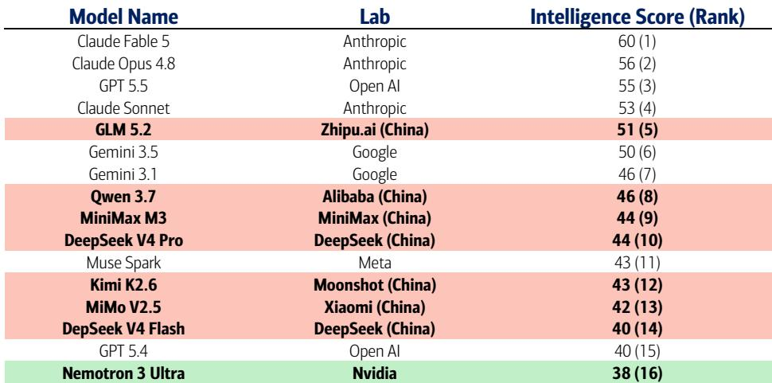
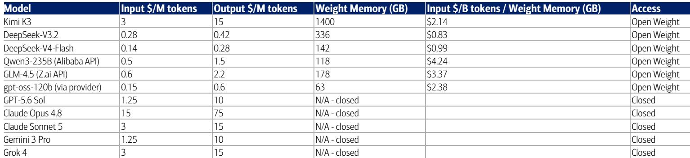

# 开源模型对存储需求的影响：是倍增而非威胁

有一种观点认为，中国开源大语言模型的低价策略意味着对存储半导体的需求正在减弱。这种看法可能颠倒了实际情况。近期发布的开源模型——包括2026年7月16日上线的Moonshot AI的Kimi K3，拥有2.8万亿参数，每次服务实例需要约1.4TB的高带宽存储——反而强化了存储需求增长的逻辑。造成混淆的原因在于，API定价是一种商业模式选择，而非硬件成本的直接反映；开源模型的传播结构会创造更多的存储节点，而非更少。

以下三个机制解释了为何开源AI会扩大存储的总体市场空间。第一，模型权重的增长速度远超效率技术的压缩能力。第二，开源权重传播会倍增存储需求，因为每一次下载都意味着一个独立的部署环境。第三，中国实验室的激进定价加速了整体推理量，进而推动了对高带宽存储、DRAM和NAND的广泛需求。将低价视为存储需求疲软信号的做法，实际上是混淆了定价策略与硬件现实。

这对存储供应商的影响是显著的。尽管像中国长鑫存储这样的竞争者已将全球晶圆产能份额提升至10%左右，但其重点仍是通用DRAM，而非支撑前沿AI推理的HBM3E和HBM4。与此同时，一家美国主要存储制造商面临2026年12月《芯片法案》回购限制的到期，结合其预计每年1200-1300亿美元的自由现金流，若按40%的派息政策，可能释放每年500-600亿美元的股票回购。根本的需求驱动力并未被削弱，而是在被放大。

## 开源模型规模的增长速度超过了效率提升的抵消能力

前沿开源模型的参数量增长速度已超过了行业内所有压缩技术的应对能力。从2024年12月DeepSeek-V3的6710亿参数，到2025年中Kimi K2的1万亿参数，再到2026年4月DeepSeek-V4-Pro的1.6万亿参数，直至如今Kimi K3的2.8万亿参数。MIT数据溯源审计显示，从2019年到2025年，平均开源模型规模增长了17倍，且这一趋势此后仍在加剧。

混合专家模型稀疏性、多头潜在注意力机制和原生低位量化等架构创新，确实大幅降低了每个token的计算量。Kimi K3通过其MoE路由器动态选择896个专家中的16个，每个token仅激活其2.8万亿总参数中的500亿——约1.8%。但这种计算节省并未转化为存储节省。高带宽存储容量与总参数规模成正比，而非活跃参数规模，因为每个专家都必须常驻于高速存储中，以供路由器动态选择。一个仅激活1.8%权重的模型，仍需要100%的权重驻留在高带宽存储中。

最终结果是，效率提升被参数增长所抵消。采用原生MXFP4（4位精度）的Kimi K3，其存储需求是2024年12月采用FP8（8位精度）的DeepSeek-V3的两倍，尽管从FP8到MXFP4的压缩带来了2倍的节省。同期参数量增长了约4倍，这一算术结果是决定性的。更大的模型权重还迫使采用多层存储架构：活跃专家驻留高带宽存储，非活跃专家溢出至CPU的LPDDR5X或DDR5，冷KV缓存则使用企业级NAND。每一次部署都会使每一层存储的内容更加丰富。

## 开源权重传播倍增存储节点，而非整合它们

闭源与开源模型的结构性差异不在于模型质量或推理成本，而在于部署的几何形态。像GPT-5.6这样的闭源模型存在于少数微软Azure数据中心内。数百万用户访问的是同一个共享的高带宽存储池，总存储内容由所有用户合并后的峰值并发需求决定。由于用户的使用模式在不同时区和负载间分散，存储成本得以在整个用户群中摊销。

开源模型则完全颠覆了这种几何形态。当Moonshot发布Kimi K3权重、DeepSeek发布V3、或OpenAI发布gpt-oss-120b时，这些权重会被下载并加载到每个购买者自己的硬件上。运行gpt-oss-120b的企业需要自己的80GB HBM3E。运行DeepSeek-V3的主权云需要配置自己的8x H200集群，约1.1TB的高带宽存储。Moonshot对K3的官方指引是每个服务实例需要64个以上的加速器——而这个配置会被每一个下载权重的企业、政府和云服务商复制。

这种倍增效应不容小觑。与共享API中1万用户有效共享一份高带宽存储中的权重不同，1万个自托管同一开源模型的企业意味着1万份权重被加载到1万个独立的高带宽存储池中。每次部署还需要根据其用户规模配置自己的KV缓存容量。在2026年常见的128K到1M上下文窗口下，每个活跃用户会话的KV缓存可能超过40GB。这会在每个终端上独立地随并发量扩展。如果同样的智能仅通过闭源API提供，这些存储需求将不会产生，因为客户只会租用计算周期，而非拥有硬件。

## 中国API激进定价加速推理量，但不降低单实例存储需求

中国开源模型的API定价确实激进。腾讯混元每百万输入token收费0.06美元，而Claude Opus 4.8为15美元。Kimi K3每百万输入token收费3美元，尽管其每次服务实例需要1.4TB的高带宽存储。但API价格是商业模式选择，而非硬件成本的直接反映。无论Moonshot收费3美元还是30美元每百万token，所需的存储内容是一样的。

中国实验室实现的成本优势来自非硬件领域。极端MoE稀疏性、MLA混合注意力机制和原生低位量化等架构效率，使得每个token的处理效率比同等规模、未采用这些技术且原生采用BF16或FP8的西方模型高出约2-3倍。输入侧基础设施优势又增加了1.5-2倍：中国电价约为0.05-0.08美元/千瓦时，而美国超大规模数据中心区域为0.10-0.15美元/千瓦时；工程薪资低40-60%；中国内陆地区的数据中心资本支出也显著更低。其余的价格差异可能来自国家相关的资本补贴，以及阿里巴巴、腾讯和百度等公司的云收入交叉补贴。

这些价格并未反映可持续硬件经济的证据，可以从运营数据中看到。Moonshot在K3发布后48小时内暂停了新订阅，很可能是因为GPU容量耗尽或为了减少亏损。小米在2026年5月将其MiMo模型定价降低了99%，这几乎肯定是一次不盈利的市场份额争夺。如果低价真的反映了相应的硬件节省，这些供应商本应配置足够的容量。在这些价格下，每次查询的实际硬件成本可能高于API价格所暗示的水平，补贴正在加速推理量，而非反映高效的硬件利用率。

其战略含义是，更便宜的中国API定价推动了更高的推理工作负载量、更多的开源企业自托管，以及全球范围内更多的存储节点部署。每一个下载千问、GLM、混元或MiMo而非付费使用Claude Opus的企业，都会创建一个新的客户侧存储足迹，这在纯闭源API的世界中是不存在的。即使个别实验室在价格上竞争，整个市场也在扩大其总计算和存储容量。

## 决策框架：如何在开源权重世界中评估存储需求

在评估开源AI背景下的存储需求时，应运用一个三因素框架，而非仅依赖API定价趋势。

第一，追踪前沿开源模型的总参数量增长，而非活跃参数量。总参数与活跃参数的比率决定了每个实例的高带宽存储内容，随着MoE模型变得更宽而非更深，这一比率正在上升。Kimi K3的2.8万亿总参数中仅有500亿活跃，这并非效率的标志，而是巨大存储驻留需求的标志。

第二，统计部署终端数量，而非用户数量。闭源模型将存储需求整合到少数超大规模集群中。开源模型则将其分散到每一个自托管的企业、政府和云服务商。倍增因子是独立部署的数量，而这个数字随着每一次开源权重发布和每一次使自托管相比API访问更具经济吸引力的降价而增长。

第三，区分计算效率与存储效率。MoE稀疏性、注意力压缩和量化都减少了每个token的FLOPs，但它们并未成比例地减少存储需求。权重存储与总参数量成正比，KV缓存与上下文窗口和并发量成正比，且两者的增长速度都超过了压缩比的抵消能力。杰文斯悖论效应——效率提升反而增加了总消耗而非减少——在这个市场中完全适用。

## 中国的存储竞争者并未威胁AI存储机遇

长鑫存储将全球晶圆产能份额提升至约10%，引发了关于存储定价竞争压力的讨论。然而，长鑫存储主要服务于未被充分覆盖的消费类和通用DRAM领域，而非支撑前沿AI推理的HBM3E和HBM4。高带宽存储领域的技术差距，加上美国OEM厂商能否获得政府批准从长鑫采购的不确定性，限制了其对AI存储市场的竞争威胁。

对存储观察者而言，更重要的催化剂可能是2026年12月左右《芯片法案》回购限制的到期，即首笔资金拨付两年后。一家美国主要存储制造商未来几年预计每年有1200-1300亿美元的自由现金流，若按40%的派息政策，每年可部署500-600亿美元的股票回购，约占其约1万亿美元市值的5-6%。开源AI带来的结构性需求增长与资本回报限制的解除相结合，创造了一个独立于通用DRAM竞争动态的局面。

*仅供参考。部分内容可能基于源材料通过AI辅助生成、翻译、总结或编辑，可能存在遗漏或错误。请独立核实。本文不构成专业建议。*

仅供参考。部分内容可能基于源材料通过AI辅助生成、翻译、总结或编辑，可能存在遗漏或错误。请独立核实。本文不构成专业建议。

