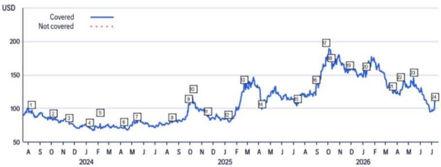
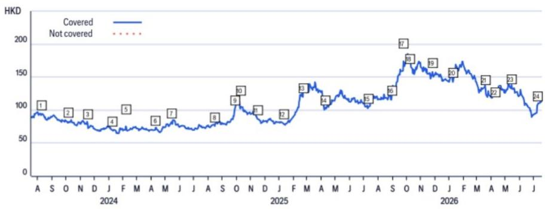
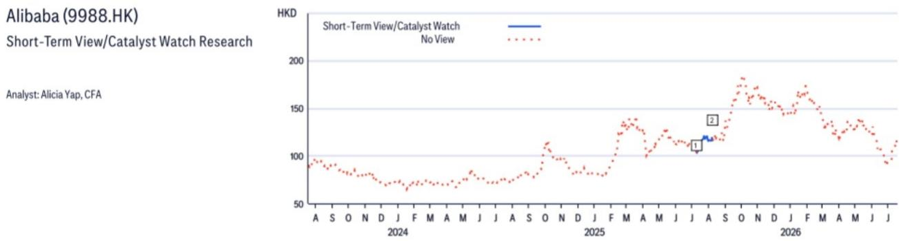

# Alibaba Group Holding (BABA.N)

Thoughts on Qwen 3.8 Max Preview and Implications from Kimi K3 Release

## CITI'S TAKE

We view the preview version of Alibaba's 2.4T-parameter Qwen 3.8 Max and the release of Moonshot AI's 2.8T-parameter Kimi K3 model underscore an accelerating AI race in China, where companies continuously advance their capabilities. We believe the rapid iteration could foster a "model-agnostic" environment, with enterprises adopting multi-model strategies to select the best model and best price for each task. This trend reduces the defensibility of any single model, shifting the competitive focus to the platforms and infrastructure that can seamlessly host and manage them. We believe long-term success will require immense resources, top talent, and a loyal paying customer base. Consequently, companies with full-stack capabilities, from chips and cloud infrastructure to models and applications, like Alibaba, could be better positioned to lead, in our view. We believe the market may also be overlooking the value of Tencent's real-world AI applications, like WorkBuddy, which has demonstrated decent traction recently.

What's new? – As reported by various news reports, including Bloomberg (July 19, 2026), Alibaba announced on its official X account that it has launched a preview version of its flagship Qwen 3.8 Max model on July 19, and described it as comparable to leading frontier AI models. Developers can access Qwen3.8 Max through Alibaba's coding platforms, including Qoder or QoderWork. Alibaba also noted on the post that Qwen 3.8 Max has 2.4trn parameters and that it will make the model open-weight soon. According to MLQ.ai (July 19, 2026), Qwen 3.8 is built on a sparse Mixture-of-Experts architecture and represents the team's first multimodal model exceeding one trillion parameters. It can process text, images, videos, and documents.

Kimi K3 release - Last week on July 16, Moonshot AI released its latest model, Kimi K3, which is a 2.8T-parameter model built on its Kimi Delta Attention and Attention Residuals, with native vision capabilities and a 1-million-token context window designed for long-horizon coding, knowledge work and reasoning. The full weight model will be released on July 27. Since Kimi K3 is the first open model to reach 2.8T parameters, several news outlets, including Bloomberg (July 18, 2026), reported that the Kimi K3 release has drawn attention from industry professionals globally and might have led to some movement in AI-related companies.

Our thoughts on the potential implications of Kimi 3 release for the China AI landscape - We believe the release of Kimi K3 highlights a significant trend in

## Buy

<table><tr><td>Price (17 Jul 26 16:00)</td><td>US$114.97</td></tr><tr><td>Target price</td><td>US$192.00</td></tr><tr><td>Expected share price return</td><td>67.0%</td></tr><tr><td>Expected dividend yield</td><td>1.7%</td></tr><tr><td>Expected total return</td><td>68.7%</td></tr><tr><td>Market Cap</td><td>US$275,591M</td></tr></table>

## Alicia Yap, CFA $^{AC}$

+852-2501-2773

alicia.yap@citi.com

See Appendix A-1 for Analyst Certification, Important Disclosures and Research Analyst Affiliations

## Alibaba Group Holding

## Valuation

Our target price for Alibaba N-shares of US\$192 is based on 10x P/E on FY2027E Ecommerce group net profit, 7.0x P/S on FY2027E Cloud Intelligence Group revenue, 1.2x P/S on AIDC Group revenue, and 0.2x P/S on all other businesses. Our target multiples are benchmarked against comps. We also assign a 30% discount to net cash position, in-line with our SOTP for other internet peers. Our SOTP fair value comes to US\$192 per share.

## Risks

Key downside risks that could prevent the shares from reaching our target price include: (i) failure in executing its new retail strategy; ii) investment spend and margins pressure become worse than expected; iii) slowdown of user traffic and online GMV and losing appeal to brands & merchants; iv) integration risks for newly acquired entities; v) slowdown of the Chinese and global economies and overhang of US-China or other trade disputes; and vi) regulatory risks on poor product quality and integrity of merchants.

## Alibaba

(9988.HK; HK\$112.6; 1; 17 Jul 26; 16:10)

## Valuation

Our target price for Alibaba H-shares of HK\$191 is based on 10x P/E on FY2027E Ecommerce Group net profit, 7.0x P/S on FY2027E Cloud Intelligence Group revenue, 1.2x P/S on AIDC Group revenue, and 0.2x P/S on all other businesses. Our target multiples are benchmarked against comps. We also assign a 30% discount to net cash position, in-line with our SOTP for other internet peers. Our SOTP fair value comes to HK\$191 per H-share.

## Risks

Key downside risks that could prevent the shares from reaching our target price include: (i) failure in executing its new retail strategy; ii) investment spend and margins pressure become worse than expected; iii) slowdown of user traffic and online GMV and losing appeal to brands & merchants; iv) integration risks for newly acquired entities; v) slowdown of the Chinese and global economies and overhang of US-China or other trade disputes; and vi) regulatory risks on poor product quality and integrity of merchants.

If you are visually impaired and would like to speak to a Citi representative regarding the details of the graphics in this document, please call USA 1-888-500-5008 (TTY: 711), from outside the US +1-210-677-3788

## Appendix A-1

## ANALYST CERTIFICATION

The research analysts primarily responsible for the preparation and content of this research report are either (i) designated by "AC" in the author block or (ii) listed in bold alongside content which is attributable to that analyst. If multiple AC analysts are designated in the author block, each analyst is certifying with respect to the entire research report other than (a) content attributable to another AC certifying analyst listed in bold alongside the content and (b) views expressed solely with respect to a specific issuer which are attributable to another AC certifying analyst identified in the price charts or rating history tables for that issuer shown below. Each of these analysts certify, with respect to the sections of the report for which they are responsible: (1) that the views expressed therein accurately reflect their personal views about each issuer and security referenced and were prepared in an independent manner, including with respect to Citi Global Markets Inc. and its affiliates; and (2) no part of the research analyst's compensation was, is, or will be, directly or indirectly, related to the specific recommendations or views expressed by that research analyst in this report.

## IMPORTANT DISCLOSURES

## Alibaba Group Holding (BABA)

Analyst: Alicia Yap, CFA

<table><tr><td colspan="2">Date</td><td>Rating</td><td>Target Price</td><td>Closing Price</td></tr><tr><td></td><td>10-Aug-23 20:47:07</td><td>1</td><td>*151.00</td><td>97.59</td></tr><tr><td></td><td>08-Oct-23 17:09:43</td><td>1</td><td>*147.00</td><td>84.66</td></tr><tr><td></td><td>16-Nov-23 18:13:37</td><td>1</td><td>*142.00</td><td>77.82</td></tr><tr><td></td><td>09-Jan-24 13:40:44</td><td>1</td><td>*125.00</td><td>70.85</td></tr><tr><td></td><td>07-Feb-24 18:37:09</td><td>1</td><td>*126.00</td><td>72.44</td></tr><tr><td></td><td>09-Apr-24 18:25:26</td><td>1</td><td>*124.00</td><td>71.80</td></tr><tr><td></td><td>15-May-24 04:34:45</td><td>1</td><td>*122.00</td><td>79.67</td></tr><tr><td></td><td>15-Aug-24 16:50:03</td><td>1</td><td>*116.00</td><td>78.91</td></tr></table>

\*Indicates Change

<table><tr><td></td><td>Date</td><td>Rating</td><td>Target Price</td><td>Closing Price</td></tr><tr><td>9</td><td>29-Sep-24 22:45:36</td><td>1</td><td>*136.00</td><td>106.48</td></tr><tr><td>10</td><td>09-Oct-24 09:54:52</td><td>1</td><td>*135.00</td><td>107.04</td></tr><tr><td>11</td><td>17-Nov-24 16:15:27</td><td>1</td><td>*133.00</td><td>87.89</td></tr><tr><td>12</td><td>09-Jan-25 17:58:55</td><td>1</td><td>*138.00</td><td>83.03</td></tr><tr><td>13</td><td>20-Feb-25 16:33:13</td><td>1</td><td>*170.00</td><td>134.90</td></tr><tr><td>14</td><td>08-Apr-25 05:01:59</td><td>1</td><td>*169.00</td><td>98.59</td></tr><tr><td>15</td><td>10-Jul-25 07:57:24</td><td>1</td><td>*148.00</td><td>106.64</td></tr><tr><td>16</td><td>31-Aug-25 17:30:14</td><td>1</td><td>*187.00</td><td>135.00</td></tr></table>

<table><tr><td colspan="2">Date</td><td>Rating</td><td>Target Price</td><td>Closing Price</td></tr><tr><td>17</td><td>24-Sep-25 15:11:51</td><td>1</td><td>*217.00</td><td>176.44</td></tr><tr><td>18</td><td>08-Oct-25 07:59:47</td><td>1</td><td>*218.00</td><td>181.12</td></tr><tr><td>19</td><td>25-Nov-25 16:54:34</td><td>1</td><td>*225.00</td><td>157.01</td></tr><tr><td>20</td><td>08-Jan-26 09:37:26</td><td>1</td><td>*197.00</td><td>154.47</td></tr><tr><td>21</td><td>19-Mar-26 16:25:38</td><td>1</td><td>*200.00</td><td>124.90</td></tr><tr><td>22</td><td>08-Apr-26 06:24:46</td><td>1</td><td>*205.00</td><td>125.32</td></tr><tr><td>23</td><td>13-May-26 16:47:38</td><td>1</td><td>*208.00</td><td>145.81</td></tr><tr><td>24</td><td>08-Jul-26 06:13:19</td><td>1</td><td>*192.00</td><td>108.98</td></tr></table>

Rating/target price changes above reflect Eastern Time

Rating/target price changes above reflect Eastern Time

<table><tr><td>Date10-Jul-25 03:57:24</td><td>ActionAdd STV</td><td>ExpectedDirectionDownside</td><td>ClosingPrice30 Days</td><td>106.64</td><td>Date208-Aug-25 14:17:52</td><td>ActionRemove STV</td><td>ExpectedDirectionDownside</td><td>ClosingPrice30 Days</td><td>120.36</td></tr></table>

<table><tr><td colspan="2">Date</td><td>Rating</td><td>Target Price</td><td>Closing Price</td></tr><tr><td>1</td><td>10-Aug-23 20:47:07</td><td>1</td><td>*148.00</td><td>93.46</td></tr><tr><td>2</td><td>08-Oct-23 17:09:43</td><td>1</td><td>*144.00</td><td>82.16</td></tr><tr><td>3</td><td>16-Nov-23 18:13:37</td><td>1</td><td>*140.00</td><td>80.62</td></tr><tr><td>4</td><td>09-Jan-24 13:40:44</td><td>1</td><td>*122.00</td><td>69.13</td></tr><tr><td>5</td><td>07-Feb-24 18:37:09</td><td>1</td><td>*124.00</td><td>74.23</td></tr><tr><td>6</td><td>09-Apr-24 18:25:26</td><td>1</td><td>*122.00</td><td>69.87</td></tr><tr><td>7</td><td>15-May-24 04:34:45</td><td>1</td><td>*120.00</td><td>81.91</td></tr><tr><td>8</td><td>15-Aug-24 16:50:03</td><td>1</td><td>*115.00</td><td>75.80</td></tr></table>

\*Indicates Change

<table><tr><td></td><td>Date</td><td>Rating</td><td>Target Price</td><td>Closing Price</td></tr><tr><td>9</td><td>29-Sep-24 22:45:36</td><td>1</td><td>*135.00</td><td>101.70</td></tr><tr><td>10</td><td>09-Oct-24 09:54:52</td><td>1</td><td>*133.00</td><td>102.09</td></tr><tr><td>11</td><td>17-Nov-24 16:15:27</td><td>1</td><td>*132.00</td><td>86.52</td></tr><tr><td>12</td><td>09-Jan-25 17:58:55</td><td>1</td><td>*137.00</td><td>79.97</td></tr><tr><td>13</td><td>20-Feb-25 16:33:13</td><td>1</td><td>*166.00</td><td>119.95</td></tr><tr><td>14</td><td>08-Apr-25 05:01:59</td><td>1</td><td>*165.00</td><td>101.70</td></tr><tr><td>15</td><td>10-Jul-25 07:57:24</td><td>1</td><td>*144.00</td><td>103.20</td></tr><tr><td>16</td><td>31-Aug-25 17:30:14</td><td>1</td><td>*183.00</td><td>115.70</td></tr></table>

<table><tr><td></td><td>Date</td><td>Rating</td><td>Target Price</td><td>Closing Price</td></tr><tr><td>17</td><td>24-Sep-25 15:11:51</td><td>1</td><td>*215.00</td><td>174.00</td></tr><tr><td>18</td><td>08-Oct-25 07:59:47</td><td>1</td><td>*216.00</td><td>177.60</td></tr><tr><td>19</td><td>25-Nov-25 16:54:34</td><td>1</td><td>*223.00</td><td>157.80</td></tr><tr><td>20</td><td>08-Jan-26 09:37:26</td><td>1</td><td>*195.00</td><td>142.60</td></tr><tr><td>21</td><td>19-Mar-26 16:25:38</td><td>1</td><td>*199.00</td><td>132.00</td></tr><tr><td>22</td><td>08-Apr-26 06:24:46</td><td>1</td><td>*204.00</td><td>126.50</td></tr><tr><td>23</td><td>13-May-26 16:47:38</td><td>1</td><td>*207.00</td><td>132.80</td></tr><tr><td>24</td><td>08-Jul-26 06:13:19</td><td>1</td><td>*191.00</td><td>107.50</td></tr></table>

Rating/target price changes above reflect Eastern Time

<table><tr><td colspan="2">Date10-Jul-25 03:57:24</td><td>ActionAdd STV</td><td>ExpectedDirectionDownside</td><td>Duration30 Days</td><td>ClosingPrice103.20</td><td>Date208-Aug-25 14:18:01</td><td>ActionRemove STV</td><td>ExpectedDirectionDownside</td><td>Duration30 Days</td><td>ClosingPrice116.30</td></tr></table>

CW - Catalyst Watch, STV - Short-Term View

Rating/target price changes above reflect Eastern Time  
  
CW - Catalyst Watch, STV - Short-Term View

The Firm has made a market in the publicly traded equity securities of Alibaba Group Holding Ltd on at least one occasion since 1 Jan 2025.

Within the past 12 months, Citi Global Markets Inc. or its affiliates has acted as manager or co-manager of an offering of securities of Alibaba.

Citi Global Markets Inc. or its affiliates has received compensation for investment banking services provided within the past 12 months from Alibaba.

<table><tr><td>Citi Global Markets Inc. or its affiliates expects to receive or intends to seek, within the next three months, compensation for investment banking services from Alibaba.</td></tr><tr><td>Citi Global Markets Inc. or its affiliates received compensation for products and services other than investment banking services from Alibaba in the past 12 months.</td></tr><tr><td>Citi Global Markets Inc. or its affiliates currently has, or had within the past 12 months, the following as investment banking client(s): Alibaba.</td></tr><tr><td>Citi Global Markets Inc. or its affiliates currently has, or had within the past 12 months, the following as clients, and the services provided were non-investment-banking, securities-related: Alibaba.</td></tr><tr><td>Citi Global Markets Inc. or its affiliates currently has, or had within the past 12 months, the following as clients, and the services provided were non-investment-banking, non-securities-related: Alibaba.</td></tr><tr><td>Citi Global Markets Inc. and/or its affiliates has a significant financial interest in relation to Alibaba. (For an explanation of the determination of significant financial interest, please refer to the policy for managing conflicts of interest which can be found at www.citiVelocity.com.)</td></tr><tr><td>Analysts&#x27; compensation is determined by Citi management and Citi&#x27;s senior management and is based upon activities and services intended to benefit the investor clients of Citi Global Markets Inc. and its affiliates (the &quot;Firm&quot;). Compensation is not linked to specific transactions or recommendations. Like all Firm employees, analysts receive compensation that is impacted by overall Firm profitability which includes investment banking, sales and trading, and principal trading revenues. One factor in equity research analyst compensation is arranging corporate access events between institutional clients and the management teams of covered companies. Typically, company management is more likely to participate when the analyst has a positive view of the company.</td></tr><tr><td>For financial instruments recommended in the Product in which the Firm is not a market maker, the Firm is a liquidity provider in such financial instruments (and any underlying instruments) and may act as principal in connection with transactions in such instruments. The Firm is a regular issuer of traded financial instruments linked to securities that may have been recommended in the Product. The Firm regularly trades in the securities of the issuer(s) discussed in the Product. The Firm may engage in securities transactions in a manner inconsistent with the Product and, with respect to securities covered by the Product, will buy or sell from customers on a principal basis.</td></tr><tr><td>The Firm is a market maker in the publicly traded equity securities of Alibaba.</td></tr><tr><td>Unless stated otherwise neither the Research Analyst nor any member of their team has viewed the material operations of the Companies for which an investment view has been provided within the past 12 months.</td></tr><tr><td>For important disclosures (including copies of historical disclosures) regarding the companies that are the subject of this Citi product (&quot;the Product&quot;), please contact Citi, 388 Greenwich Street, 6th Floor, New York, NY, 10013, Attention: Legal/Compliance [E6WYB6412478]. In addition, the same important disclosures, with the exception of the Valuation and Risk assessments and historical disclosures, are contained on the Firm&#x27;s disclosure website at https://www.citivelocity.com/cvr/eppublic/citi_research_disclosures. Valuation and Risk assessments can be found in the text of the most recent research note/report regarding the subject company. Pursuant to the Market Abuse Regulation a history of all Citi recommendations published during the preceding 12-month period can be accessed via Citi Velocity (https://www.citivelocity.com/cv2) or your standard distribution portal. Historical disclosures (for up to the past three years) will be provided upon request.</td></tr></table>

<table><tr><td></td><td colspan="3">12 Month Rating</td><td colspan="3">Catalyst Watch</td></tr><tr><td>Data current as of 01 Jul 2026</td><td>Buy</td><td>Hold</td><td>Sell</td><td>Buy</td><td>Hold</td><td>Sell</td></tr><tr><td>Citi Global Fundamental Coverage (Neutral=Hold)</td><td>61%</td><td>32%</td><td>7%</td><td>36%</td><td>48%</td><td>16%</td></tr><tr><td>% of companies in each rating category that are investment banking clients</td><td>38%</td><td>42%</td><td>27%</td><td>42%</td><td>37%</td><td>36%</td></tr></table>

## Guide to Citi Fundamental Research Investment Ratings:

Citi stock recommendations include an investment rating and an optional risk rating to highlight high risk stocks. Risk rating takes into account both price volatility and fundamental criteria. Stocks will either have no risk rating or a High risk rating assigned.

Investment Ratings: Citi investment ratings are Buy, Neutral and Sell. Our ratings are a function of analyst expectations of expected total return ("ETR") and risk. ETR is the sum of the forecast price appreciation (or depreciation) plus the dividend yield for a stock within the next 12 months. The target price is based on a 12 month time horizon. The Investment rating definitions are: Buy (1) ETR of 15% or more or 25% or more for High risk stocks; and Sell (3) for negative ETR. Any covered stock not assigned a Buy or a Sell is a Neutral (2). For stocks rated Neutral (2), if an analyst believes that there are insufficient valuation drivers and/or investment catalysts to derive a positive or negative investment view, they may elect with the approval of Citi management not to assign a target price and, thus, not derive an ETR. Citi may suspend its rating and target price and assign "Rating Suspended" status for regulatory and/or internal policy reasons. Citi may also suspend its rating and target price and assign "Under Review" status for other exceptional circumstances (e.g. lack of information critical to the analyst's thesis, trading suspension) affecting the company and/or trading in the company's securities. In both such situations, the rating and target price will show as "—" and "-" respectively in the rating history price chart. Prior to 11 April 2022 Citi assigned "Under Review" status to both situations and prior to 11 Nov 2020 only in exceptional circumstances. As soon as practically possible, the analyst will publish a note re-establishing a rating and investment thesis. Investment ratings are determined by the ranges described above at the time of initiation of coverage, a

change in investment and/or risk rating, or a change in target price (subject to limited management discretion). At times, the expected total returns may fall outside of these ranges because of market price movements and/or other short-term volatility or trading patterns. Such interim deviations will be permitted but will become subject to review by Research Management. Your decision to buy or sell a security should be based upon your personal investment objectives and should be made only after evaluating the stock's expected performance and risk.

## Catalyst Watch/Short Term Views ("STV") Ratings Disclosure:

Catalyst Watch and STV Upside/Downside calls: Citi may also include a Catalyst Watch or STV Upside or Downside call to indicate the analyst expects the share price to rise (fall) in absolute terms over a specified period of 30 or 90 days in reaction to one or more specific near-term catalysts or events impacting the company or the market. A Catalyst Watch will be published when Analyst confidence is high that an impact to share price will occur; it will be a STV when confidence level is moderate. A Catalyst Watch or STV Upside/Downside call will automatically expire at the end of the specified 30/90 day period. The Catalyst Watch will also be automatically removed if share price performance (calculated at market close) exceeds $15\%$ against the direction of the call (unless over-ridden by the analyst). The analyst may also remove a Catalyst Watch or STV call prior to the end of the specified period in a published research note. A Catalyst Watch/STV Upside or Downside call may be different from and does not affect a stock's fundamental equity rating, which reflects a longer-term total absolute return expectation. For purposes of FINRA ratings-distribution-disclosure rules, a Catalyst Watch/STV Upside call corresponds to a buy recommendation and a Catalyst Watch/STV Downside call corresponds to a sell recommendation. Any stock not assigned to a Catalyst Watch Upside, Catalyst Watch Downside, STV Upside, or STV Downside call is considered Catalyst Watch/STV No View. For purposes of FINRA ratings distribution-disclosure rules, we correspond Catalyst Watch/STV No View to Hold in our ratings distribution table for our Catalyst Watch/STV Upside/Downside rating system. However, we reiterate that we do not consider No View to be a recommendation. For all Catalyst Watch/STV Upside/Downside calls, risk exists that the catalyst(s) and associated share-price movement will not materialize as expected.

## RESEARCH ANALYST AFFILIATIONS / NON-US RESEARCH ANALYST DISCLOSURES

The legal entities employing the authors of this report are listed below (and their regulators are listed further herein). Non-US research analysts who have prepared this report (i.e., all research analysts listed below other than those identified as employed by Citi Global Markets Inc.) are not registered/qualified as research analysts with FINRA. Such research analysts may not be associated persons of the member organization (but are employed by an affiliate of the member organization) and therefore may not be subject to the FINRA Rule 2241 restrictions on communications with a subject company, public appearances and trading securities held by a research analyst account.

<table><tr><td>Citi Global Markets Asia Limited</td><td>Alicia Yap, CFA</td></tr><tr><td colspan="2">OTHER DISCLOSURES</td></tr><tr><td colspan="2">Any price(s) of instruments mentioned in recommendations are as of the prior day&#x27;s market close on the primary market for the instrument, unless otherwise stated.</td></tr><tr><td colspan="2">The completion and first dissemination of any recommendations made within this research report are as of the Eastern date-time displayed at the top of the Product. If the Product references views of other analysts then please refer to the price chart or rating history table for the date/time of completion and first dissemination with respect to that view.</td></tr><tr><td colspan="2">Regulations in various jurisdictions require that where a recommendation differs from any of the author&#x27;s previous recommendations concerning the same financial instrument or issuer that has been published during the preceding 12-month period that the change(s) and the date of that previous recommendation are indicated. For fundamental coverage please refer to the price chart or rating change history within this disclosure appendix or the issuer disclosure summary at https://www.citivelocity.com/cvr/eppublic/citi_research_disclosures.</td></tr><tr><td colspan="2">Citi has implemented policies for identifying, considering and managing potential conflicts of interest arising as a result of publication or distribution of investment research. A description of these policies can be found at https://www.citivelocity.com/cvr/eppublic/citi_research_disclosures.</td></tr><tr><td colspan="2">The proportion of all Citi recommendations that were the equivalent to &quot;Buy&quot;, &quot;Hold&quot;, &quot;Sell&quot; at the end of each quarter over the prior 12 months (with the % of these that had received investment firm services from Citi in the prior 12 months shown in brackets) is as follows; Q1 2026 Buy 33%(63%), Hold 44% (52%), Sell 23% (46%), RV 0.5% (89%): Q4 2025 Buy 33% (63%), Hold 44% (50%), Sell 23% (46%), RV 0.4% (91%); Q3 2025 Buy 33% (61%), Hold 44% (52%), Sell 23% (50%), RV 0.4% (80%); Q2 2025 Buy 33%(63%), Hold 44% (51%), Sell 23% (49%), RV 0.4% (86%). For the purposes of disclosing recommendations other than for equity (whose definitions can be found in the corresponding disclosure sections), &quot;Buy&quot; means a positive directional trade idea; &quot;Sell&quot; means a negative directional trade idea; and &quot;Relative Value&quot; means any trade idea which does not have a clear direction to the investment strategy.</td></tr><tr><td colspan="2">European regulations require a 5 year price history when past performance of a security is referenced. CitiVelocity&#x27;s Charting Tool (https://www.citivelocity.com/cv2/#go/CHARTING_3_Equities) provides the facility to create customisable price charts including a five year option. This tool can be found in the Data &amp; Analytics section under any of the asset class menus in CitiVelocity (https://www.citivelocity.com/). For further information contact CitiVelocity support (https://www.citivelocity.com/cv2/go/CLIENT_SUPPORT). The source for all referenced prices, unless otherwise stated, is DataCentral, which sources price information from LSEG Data &amp; Analytics. Past performance is not a guarantee or reliable indicator of future results. Forecasts are not a guarantee or reliable indicator of future performance.</td></tr><tr><td colspan="2">Investors should always consider the investment objectives, risks, and charges and expenses of an ETF carefully before investing. The applicable prospectus and key investor information document (as applicable) for an ETF should contain this and other information about such ETF. It is important to read carefully any such prospectus before investing. Clients may obtain</td></tr></table>

prospectuses and key investor information documents for ETFs from the applicable distributor or authorized participant, the exchange upon which an ETF is listed and/or from the applicable website of the applicable ETF issuer. The value of the investments and any accruing income may fall or rise. Any past performance, prediction or forecast is not indicative of future or likely performance. Any information on ETFs contained herein is provided strictly for illustrative purposes and should not be deemed an offer to sell or a solicitation of an offer to purchase units of any ETF either explicitly or implicitly. The opinions expressed are those of the authors and do not necessarily reflect the views of ETF issuers, any of their agents or their affiliates. Citi Global Markets India Private Limited and/or its affiliates may have, from time to time, actual or beneficial ownership of $1\%$ or more in the debt securities of the subject issuer.

Please be advised that pursuant to Executive Order 13959 as amended (the "Order"), U.S. persons are prohibited from investing in securities of any company determined by the United States Government to be the subject of the Order. This research is not intended to be used or relied upon in any way that could result in a violation of the Order. Investors are encouraged to rely upon their own legal counsel for advice on compliance with the Order and other economic sanctions programs administered and enforced by the Office of Foreign Assets Control of the U.S. Treasury Department.

This communication is directed at persons who are "Eligible Clients" as such term is defined in the Israeli Regulation of Investment Advice, Investment Marketing and Investment Portfolio Management law, 1995 (the "Advisory Law"). Within Israel, this communication is not intended for retail clients and Citi will not make such products or transactions available to retail clients or to non-Eligible Clients. The presenter is not licensed as investment advisor or investment marketer by the Israeli Securities Authority ("ISA") and this communication does not constitute investment or marketing advice. The information contained herein may relate to matters that are not regulated by the ISA. Any securities which are the subject of this communication may not be offered or sold to any Israeli person except pursuant to a security offering exemption according to the Israeli Securities Law, 1968 and the public offering rules provided thereunder.

Citi broadly and simultaneously disseminates its research content to the Firm's institutional and retail clients via the Firm's proprietary electronic distribution platforms (e.g., Citi Velocity and various Global Wealth platforms). As a convenience
