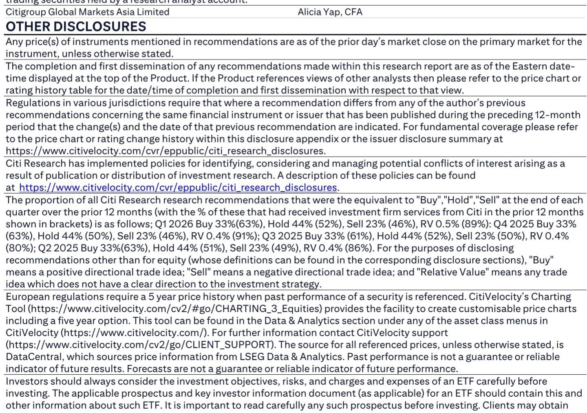
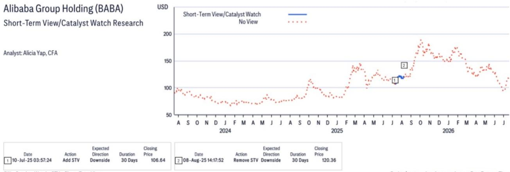
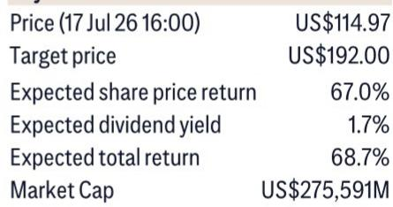

# 中国AI模型竞赛：当模型变得可替代，全栈玩家为何胜出

2026年7月19日，阿里巴巴发布了通义千问3.8 Max预览版，这是一个基于稀疏混合专家架构的2.4万亿参数多模态模型。三天前，月之暗面发布了Kimi K3，一个2.8万亿参数的模型，成为首个突破该阈值的开源权重模型。这两个相隔一个周末的发布，不仅仅是产品公告。它们是最清晰的信号，表明中国AI领域已进入模型层面差异化正在消失的阶段。其战略意义看似反直觉，实则明确：能够捕获长期价值的公司，不是那些拥有当前最佳模型的公司，而是那些拥有基础设施、数据和应用程序层的公司，这些资产让任何特定模型都变得无关紧要。

快速的迭代周期——阿里巴巴和月之暗面在几天内相互超越——创造了一个悖论。每个新模型在技术上令人印象深刻，但改进的速度确保没有一个模型能长期保持领先。曾经押注于单一基础模型的企业，现在被迫采用多模型策略，为每个特定任务选择最佳的架构和价格。这种“模型无关”的环境剥离了专有模型权重曾经承诺的防御性。护城河转移到了别处。

现在重要的不是哪个模型在基准测试中胜出，而是哪家公司能够托管、管理和变现每一个重要的模型。阿里巴巴凭借其云基础设施、专有芯片、模型组合和应用生态系统，在结构上处于有利位置，可以从这种商品化中受益。然而，市场可能低估了这种动态重塑竞争优势的速度——以及有多少参与者将失去可行的位置。

## 两次发布揭示模型层面护城河的终结

通义千问3.8 Max和Kimi K3发布的时间和规格揭示了一种对纯模型开发者来说不可持续的竞争模式。阿里巴巴的通义千问3.8 Max拥有2.4万亿参数，是该公司首个超过万亿参数的多模态模型，能够处理文本、图像、视频和文档。它可通过阿里巴巴的编码平台Qoder和QoderWork访问，公司已承诺很快将模型开源。

月之暗面的Kimi K3拥有2.8万亿参数，引入了新颖的架构创新——Kimi Delta Attention和Attention Residuals——以及原生视觉能力和专为长程编码与推理设计的百万token上下文窗口。其完整权重版本计划于7月27日发布。据报道，该模型令全球行业专业人士感到值得注意，并据新闻报道，导致一些与AI相关的公司报价出现波动。

关键点不在于参数数量。而在于过时的速度。月之暗面于7月16日发布了一个2.8万亿参数的模型。到7月19日，阿里巴巴就有了一个具有竞争力的回应。几周内，很可能会有另一个参与者匹配或超越两者。当一个领先模型的半衰期以天为单位衡量时，该资产本身就不再是持久的竞争优势。相对少见可持续的位置是拥有分发和运行所有模型的平台，无论这些模型由谁构建。

## 模型无关性迫使企业成为平台买家，而非模型忠诚者

中国AI发展的加速步伐正推动企业客户采取一种根本不同的采购策略。企业不再选择单一基础模型并围绕其特定能力构建应用，而是采用多模型架构，允许它们根据性能、成本和延迟将不同任务路由到不同模型。

这种转变有一个直接后果：它降低了曾经将客户锁定在单一AI提供商的转换成本。如果一家企业可以互换使用通义千问和Kimi——或者同时为不同工作负载使用两者——模型提供商将失去定价权和长期收入可见性。价值向上迁移到编排层：提供模型选择、负载均衡、安全性和成本管理的云平台。

阿里云是这一趋势最明显的受益者。其全栈能力——从专有芯片到模型托管再到应用部署——使其能够作为多模型世界的基础设施。该公司可以在同一平台上托管通义千问、Kimi K3以及任何未来竞争对手的模型，无论哪个模型在特定基准测试中胜出，都能捕获收入。这是一种结构性优势，纯模型公司无法复制，除非它们从头开始构建云基础设施，这是一项资本密集型工作，很少有人能负担得起。

## 全栈整合创造自我强化的优势，纯模型玩家无法匹敌

阿里巴巴比其纯模型竞争对手更具优势的论点，基于三个随时间推移而相互强化的优势。

首先，资源强度。训练2.4万亿参数规模的模型需要巨大的资本支出，用于计算、数据中心容量和能源。阿里巴巴的云业务产生经常性收入来资助这项投资。纯模型公司必须反复筹集外部资本，面临稀释和读者审查。

其次，人才保留。最优秀的AI研究人员希望在前沿问题上工作，并能够访问最大的计算集群和最多样化的数据集。阿里巴巴可以提供这两者，以及多元化业务的稳定性。较小的模型公司必须仅靠薪酬和使命来竞争，当最大的参与者能够匹配薪资并提供更好的资源时，这是一个困难的命题。

第三，忠诚的付费客户群。阿里巴巴的云客户已经在与该公司进行计算、存储和数据库服务的交易。添加AI模型推理是一个自然的向上销售。对于已经在使用阿里云的客户来说，转换成本远低于必须从头开始集成新模型提供商API的客户。这个安装基础创造了一个纯模型初创公司所缺乏的收入底线。

这三个优势形成了一个飞轮：资源支持更好的模型，更好的模型吸引更多客户，更多客户产生更多收入，更多收入资助更好的资源。纯模型竞争对手必须仅靠模型质量取胜，但当任何人都可以在72小时内被超越时，模型质量不再是持久的差异化因素。

## 在商品化模型环境中评估AI研究机会的决策框架

对于评估中国AI生态系统的研究人员和企业战略家来说，以下框架取代了“哪个模型最好”这个过时的问题，代之以一套更持久的标准。

**第一层：基础设施所有权。** 公司是否拥有大规模训练和服务模型所需的计算、网络和数据中心资产？如果没有，该公司就是别人生态系统中的租户，随着基础设施成本上升而面临利润率压缩。阿里巴巴和腾讯都符合条件。纯模型公司则不符合。

**第二层：模型组合广度。** 公司是否提供跨不同规模和能力层级的多个模型，还是依赖于单一旗舰产品？单一模型公司面临二元风险：如果其模型落后，整个业务就会受到威胁。组合方法，加上托管第三方模型的能力，提供了对冲。

**第三层：应用层牵引力。** 公司是否拥有经过验证的、现实世界的AI应用，能够产生收入和用户参与度，而不仅仅是路线图上的计划？腾讯的WorkBuddy，根据报告显示近期已展现出不错的用户增长，就是一个例证。应用层的采用创造了数据飞轮和客户关系，这些关系能够经受住模型更替。

**第四层：财务可持续性。** 公司能否用运营现金流为其AI雄心提供资金，还是依赖外部融资？前沿AI的资本需求正在升级。如果读者情绪转变，必须反复回到资本市场的公司将面临生存风险。

应用这个框架，阿里巴巴在所有四个层面都得分很高。腾讯虽然在芯片和云方面的垂直整合程度较低，但在应用牵引力和财务可持续性方面得分不错。纯模型公司，无论其当前的基准测试表现如何，在第一、三和四层面都面临结构性挑战。

## 市场可能低估了腾讯现实世界AI的牵引力，同时高估了模型层面的热度

正如报告中所强调的，当前市场认知中一个显著的差距是，与围绕模型发布的兴奋相比，腾讯AI应用相对被忽视。腾讯的WorkBuddy，一个企业生产力工具，已经展现出有意义的用户采用和收入生成。这不是一个推测性的未来用例；它是一个已部署的产品，具有可衡量的牵引力。

市场对参数数量和基准测试分数的迷恋，掩盖了一个更重要的现实：企业AI价值是在应用层捕获的，而不是模型层。模型是一种商品化输入。一个解决特定业务问题——日程安排、文档处理、客户服务自动化——的应用会创造转换成本，产生经常性收入，并受益于网络效应。腾讯在微信和企业软件中的地位使其拥有任何模型提供商都无法匹敌的分发优势。

其含义很直接。研究人员可能为不会持久的模型层面差异化支付过高代价，而为会随时间加深的应用层护城河支付不足。拥有客户关系和由现实世界使用产生的数据的公司，最终将比仅仅提供底层智能的公司提取更多价值。

## 终局：平台，而非模型，将决定谁能捕获AI的成果

中国AI竞赛不是一场构建最佳模型的竞赛。这是一场构建较完整面的模型消费、应用部署和数据积累平台的竞赛。通义千问3.8 Max和Kimi K3的发布，虽然在技术上令人印象深刻，但加速了模型层的商品化。每一次新发布都使任何单一模型更难声称独特性，并使平台所有者更容易提供“模型无关”的服务，无论哪种架构在下一个基准测试中胜出，都能捕获价值。

阿里巴巴的全栈位置——涵盖芯片、云、模型和应用——使其在这场终局中拥有结构性优势。腾讯在应用层的牵引力提供了一条互补的路径。纯模型公司面临一个日益困难的战略选择：构建它们负担不起的基础设施，或者接受对将捕获大部分价值的平台所有者的依赖。

中国AI竞争的下一个阶段不会由下一个模型发布决定。它将由哪些公司能让每个模型为其客户工作，以及哪些公司不能来决定。

*仅供参考。部分内容可能基于源材料通过AI辅助生成、翻译、总结或编辑，可能存在遗漏或错误。请独立核实。本文不构成任何专业建议。*

仅供参考。部分内容可能基于源材料通过AI辅助生成、翻译、总结或编辑，可能存在遗漏或错误。请独立核实。本文不构成任何专业建议。

