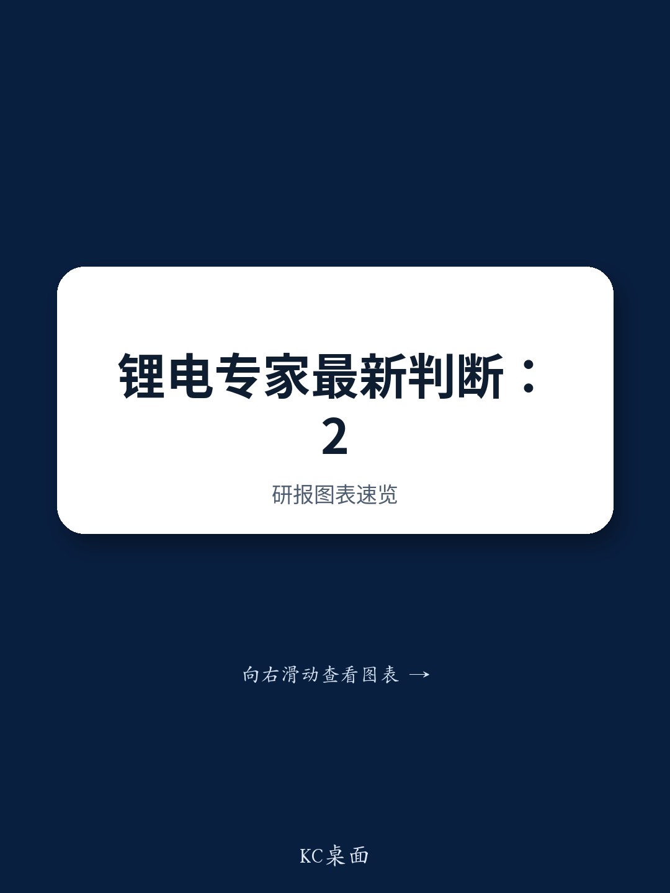

# 锂市场预计2027年进入结构性短缺，但一项政策变量可能改变供需格局

全球锂需求预计在2027年同比增长400至450千吨，而同期供应预计仅增加340千吨。这一缺口——至少60千吨的未满足需求——是推动市场对2027年锂价持积极展望的核心矛盾。基于中国储能和电池供应链的最新实地信息，这一供需测算代表了迄今为止最明确的信号：锂市场正从过剩转向真正的短缺周期。对于布局电池材料领域的观察者和企业策略制定者而言，问题已不再是价格是否会回升，而是价格在供应响应之前能上涨多少——以及南部非洲的一项监管决策可能如何限制这一上行空间。

积极展望基于实体供应链中可观察的行为。截至7月10日，中国国内港口的锂精矿库存为327千吨，较前一周下降39千吨。这一库存下降并非季节性异常；它反映了强劲的下游需求正在以比补货货物到达更快的速度消耗库存。在冶炼环节，精矿库存天数在1至3个月之间，这一水平无法为需求激增提供缓冲。锂冶炼厂自身也通过限制现货销售、优先履行长期合同来传递对价格前景的信心。交易商的碳酸锂库存处于低位。正极材料生产商预计将在8月开始补库。港口库存下降、冶炼厂缓冲库存薄弱以及即将到来的补库需求，共同构成了价格加速的典型条件。

然而，2027年展望中最关键的变量并非需求预测或矿山增产，而是津巴布韦计划于2027年1月生效的锂精矿出口禁令。在基准情景下，该禁令持续有效，将从全球市场中移除一个有意义的供应来源。但如果禁令被取消或推迟，市场格局将发生显著变化。报告专家估计，解除津巴布韦出口禁令将在2027年增加70千吨的额外供应——这足以弥补供需缺口所暗示的短缺。这一单一政策决策将决定锂价是进入持续上涨还是维持区间震荡。

## 港口库存下降并非短暂现象，而是冶炼厂采购行为的结构性转变

国内港口锂精矿库存每周下降39千吨，是支持市场趋紧的最直接、最可验证的数据点。港口库存水平是到货量与提货量的函数，当前的下降表明提货量正超过到货量。这并非供应过剩时期后的暂时修正。冶炼厂的库存天数（1至3个月）与买家仅维持必要工作库存而非投机性缓冲的市场特征一致。当冶炼厂库存薄弱且港口库存同时下降时，任何增量需求都必须通过更高的现货价格或新到货量的激增来满足。报告指出，从津巴布韦进口的锂精矿预计将于7月开始抵达，并在9至10月全面恢复。在这些数量实现之前，实体市场将保持紧张，国内冶炼厂将为港口的可用材料展开竞争。这种竞争已在冶炼厂行为中显现：它们不活跃于现货销售，而是优先履行长期合同——这明确表明它们预期现货价格将上涨，并希望通过锁定合同量的利润来避免追逐公开市场。

## 冶炼厂定价权上升：交易商库存不足，正极材料补库在即

锂价值链中的定价动态正从生产商主导转向买方受限。锂冶炼厂（将精矿转化为电池级锂化学品）已采取限制现货市场销售的策略。这并非被动姿态，而是定价权的主动运用。当冶炼厂减少现货供应时，它们迫使下游正极材料生产商为剩余材料出价更高，或加速自身的补库时间表。报告确认正极材料生产商将在8月补库。这一时机至关重要。8月补库发生在储能和电动汽车电池典型的第三季度生产高峰之前。如果冶炼厂在8月维持当前的销售纪律，补库需求与受限的现货供应将共同引发价格飙升。交易商碳酸锂库存低位放大了这一效应，因为交易商通常充当市场中的缓冲器，在过剩时买入、在稀缺时卖出。交易商库存不足意味着这一缓冲不复存在。正极材料订单数据进一步支撑了需求端：LFP正极材料订单预计在2026年第三季度环比增长20%。即使第四季度因维护出现小幅环比下降，第三季度的需求脉冲仍将是全年较强。

## 2027年供需测算明确显示短缺，但误差范围狭窄

报告专家预计2027年全球锂需求同比增长400至450千吨，而供应增长为340千吨。这并非对市场总量的预测，而是对供需平衡变化的增量分析。如果需求增长处于区间低端、供应增长处于区间高端，缺口为60千吨。如果需求增长处于区间高端、供应增长处于区间低端，缺口则达到110千吨。无论哪种情景，都代表结构性供应不足。预计提供340千吨增量的供应来源包括澳大利亚、回收锂、阿根廷以及JXW矿。每个来源都有其自身的执行风险。澳大利亚矿山扩建历来面临劳动力和许可延迟。回收锂的数量取决于废料可用性和加工能力。阿根廷项目在具有挑战性的监管和物流环境中运营。JXW矿作为中国在非洲的运营项目，有其自身的增产轨迹。基准情景已假设这些来源能够交付。任何来源的短缺都将进一步扩大缺口。因此，专家对2027年锂价的积极展望并非激进判断，而是对数据的保守解读。

## 津巴布韦出口禁令是2027年最重要的供应变量

津巴布韦计划于2027年1月生效的锂精矿出口禁令，是供应展望中的主导不确定性。根据现行政策，津巴布韦将禁止出口原矿以鼓励国内冶炼。预计在禁令生效前相对少见能准备就绪的锂冶炼厂是华友的。其他生产商正在与津巴布韦政府谈判，争取延期至2027年中。如果这些谈判失败，禁令将从1月起从全球市场中移除有意义的精矿量。报告专家估计，如果禁令解除——即津巴布韦允许出口继续——全球供应将比基准情景增加70千吨。这70千吨大于整个预计的60至110千吨缺口范围。换言之，禁令的取消不仅会缩小缺口，还会完全消除缺口，并可能使市场重新回到过剩状态。因此，观察者必须以与矿山产量数据相同的严谨度跟踪津巴布韦的政策动态。未来三至六个月内政府与精矿生产商之间的谈判结果，将有效设定2027年锂价的上限。

## 2027年锂市场布局的决策框架

以下框架将报告发现转化为企业规划者和研究人员的可操作战略考量。

第一，将基准情景校准为短缺情景。在当前政策环境下，2027年至少60千吨的增量供需缺口是最可能的结果。这支持对锂化学品和精矿的积极定价预期。任何对冲、采购或策略规划都应假设至少到2027年上半年现货价格将走高。

第二，将津巴布韦出口禁令视为二元风险因素。如果禁令持续，短缺将被锁定，价格上行空间显著。如果禁令解除，短缺消失，价格动能停滞。在未对津巴布韦出口政策形成明确观点之前，不要对锂市场采取方向性判断。密切关注谈判进展，特别是政府关于非华友冶炼厂截止日期延期的任何信号。

第三，将8月补库周期视为近期催化剂。交易商库存低位、冶炼厂现货销售纪律以及正极材料生产商8月补库的结合，为2026年第三季度的价格变动创造了高概率事件。这是一个战术信号，而非结构性信号，但它将为市场进入2027年合同季的情绪定下基调。

第四，评估四大增长来源的供应侧执行风险。澳大利亚矿山扩建、回收量、阿根廷项目以及JXW矿均存在执行风险。任何来源的延迟或短缺都将使缺口超出基准情景。假设一定程度的供应不及预期的组合策略，比假设完美执行的策略更为稳健。

第五，区分锂精矿和锂化学品。禁令影响精矿出口，而非化学品出口。能够在国内加工精矿的冶炼厂（如华友）无论禁令结果如何，都处于有利位置以获取利润。没有国内冶炼能力的公司将面临一个分化的市场：精矿可能变得稀缺，而化学品仍以溢价可得。

2027年的锂市场并非确定短缺或确定过剩的故事。它是一个狭窄缺口可能被单一政策决策所消除的故事。最严谨的策略是规划短缺情景，同时建立灵活性，以便在津巴布韦禁令取消时进行调整。未来六个月将揭示哪种情景占据主导。

*仅供参考。部分内容可能基于源材料通过AI辅助生成、翻译、总结或编辑，可能存在遗漏或错误。请独立核实。本文不构成专业建议。*

仅供参考。部分内容可能基于源材料通过AI辅助生成、翻译、总结或编辑，可能存在遗漏或错误。请独立核实。本文不构成专业建议。

