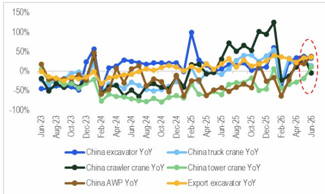
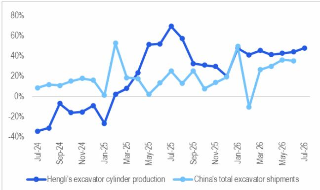
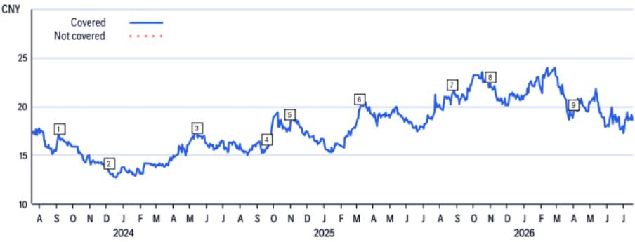
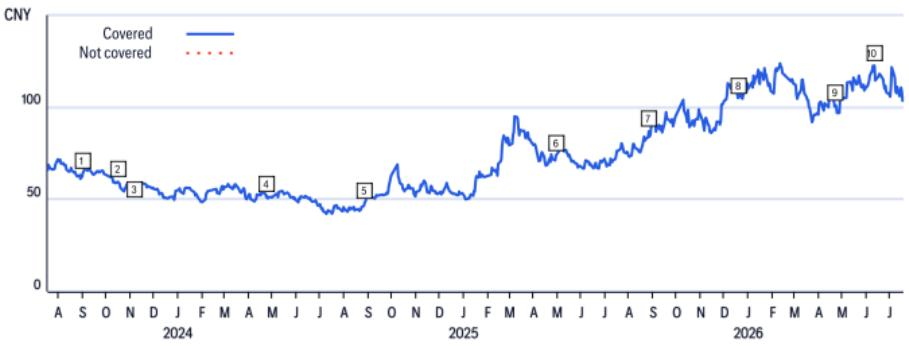
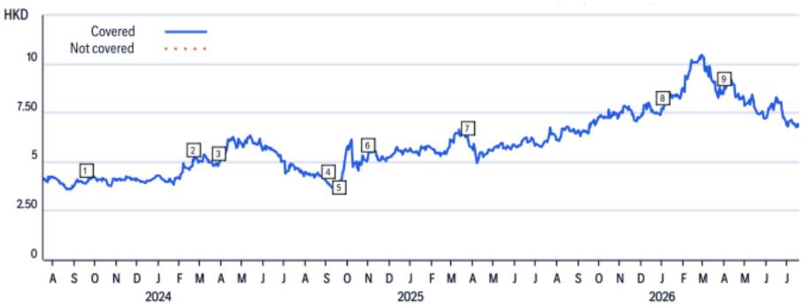
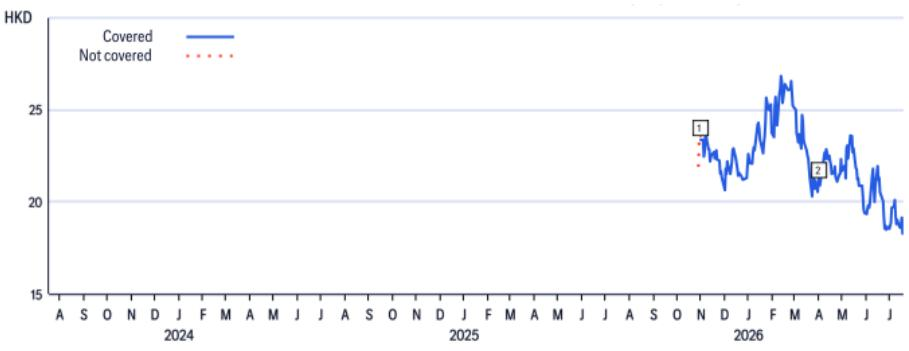
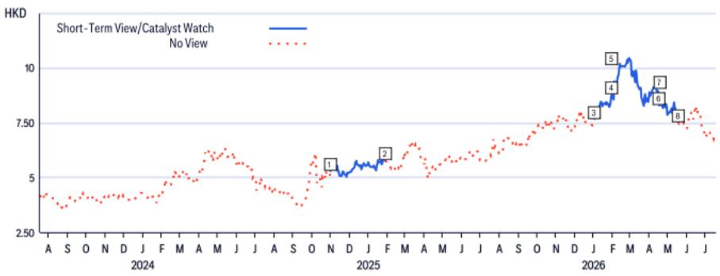
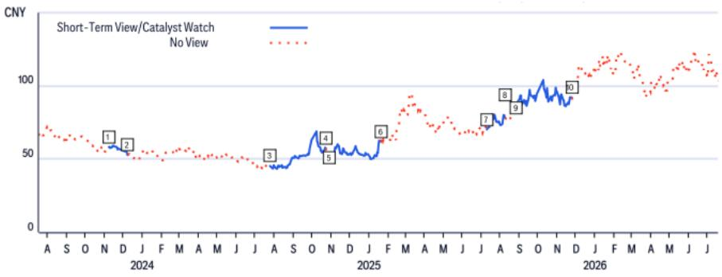
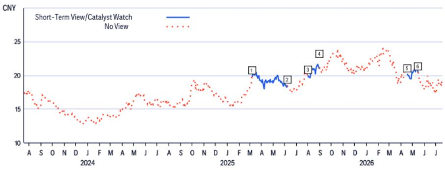
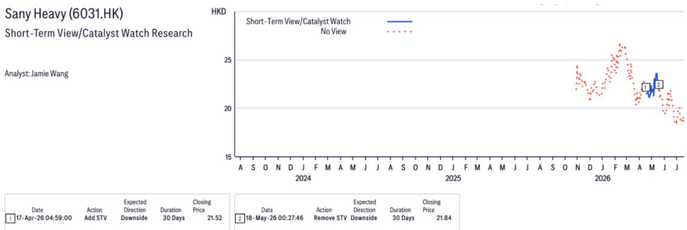

20 Jul 2026 02:18:43 ET | 13 pages

# China Automation and Machinery

# China Tower Crane Shipment YoY Turned Positive for the First Time Since Jul-23

## OBSERVATION

Construction machinery: CCMA (China Construction Machinery Association) recently reported China domestic tower crane shipment grew by 11% YoY in Jun-26, which is the first time of YoY growth after Jul-23 (excl. those due to CNY low base) and the last construction machine to show YoY demand growth. This indicates that China tower crane demand has found a bottom, although it doesn't necessarily suggest strong demand improvement from the property or infrastructure sectors (~70% of tower crane demand comes from the property sector). However, amid recent global market adjustments, we believe that China construction machinery sector with strong operating data points to support appears resilient to market participants. Our machinery OEM order after ex-dividend dates is Sany-H (6031.HK) > Sany-A (600031.SS) > Zoomlion (1157.HK).

More operating data points - China's largest tower crane leasing firm Pangyuan released the latest tower crane leasing rate index at 422 (2016 base: 1,000), up 2% YoY and 14% above the same period last year. However, its tower crane fleet utilization rate has declined YoY for four consecutive months (from Mar-26 to Jun-26), showing no evidence of construction activity recovery. CCMA also reported Jun-26 China construction machinery utilization rate at 51.1%, down 5.8pp YoY and down 1.3pp MoM. Hengli Hydraulic (601100.SS): The excavator cylinder production volume could be 73k-75k in Jul-26, up >40% YoY, driven by strong demand for mid size excavators, which we believe is coming more from its main US client.

What's next? - On the factory automation side, we will host a business update call (Mandarin) with Estun (002747.SZ) at 4:00pm HKT, 21 July (Tuesday). Please click HERE to sign up.

Jamie Wang $^{AC}$ +852-2501-2772
jamie.ck.wang@citi.com

Eric Lau

+852-2501-2726

eric.h.lau@citi.com

Figure 1. YoY: Shipments of key construction machines  
  
© 2026 Citi Inc. No redistribution without Citi's written permission.
Source: Citi, CCMA

Figure 2. China tower crane leasing rate vs. contract amount  
  
© 2026 Citi Inc. No redistribution without Citi's written permission.  
Source: Citi, Pangyuan

Figure 3. China tower crane fleet utilization rate  
  
© 2026 Citi Inc. No redistribution without Citi's written permission.
Source: Citi, Pangyuan

Figure 4. YoY: Hengli's excavator cylinder production vs. China total excavator shipment  
  
© 2026 Citi Inc. No redistribution without Citi's written permission.
Source: Citi, Company Reports, CCMA

## Hengli Hydraulic

(601100.SS; Rmb103.51; 1; 17 Jul 26; 15:00)

## Valuation

Our target price for Hengli of Rmb160.0 is based on 50x 2027E P/E, which is equal to its average P/E + 0.5x SD, to reflect its strong core business and potential re-rating due to rising humanoid robot exposure.

## Risks

Key fundamental downside risks include: 1) weaker demand for excavator and non-excavator components; 2) weaker profitability of ball screw and Mexico plants due to weaker economies of production scale; and 3) lower-than-expected GPM on favorable product mix change. Any of these risk factors could cause the stock to deviate from our target price.

## Sany Heavy

(6031.HK; HK\$18.28; 1; 17 Jul 26; 16:10)

## Valuation

Our TP of HK\$29.0 is based on 2.5x 2026E P/B, derived from 2026E ROE (11.4%) and the average P/B over ROE (~22x) over the past three years. Our P/B multiple for Sany reflects its improving ROE stemming from cost discipline and a cycle turnaround.

## Risks

Key downside risks that could impede the share price from achieving our target price include: 1) weaker machinery demand recovery due to lower-for-longer property and infrastructure FAI; 2) worse-than-expected GPM; 3) weaker-than-expected export sales growth; and 4) a weak global economy.

## Sany Heavy Industry

(600031.SS; Rmb18.65; 1; 17 Jul 26; 15:00)

## Valuation

Our TP of Rmb26.0 is based on 2.5x 2026E P/B, derived from 2026E ROE (11.4%) and the average P/B over ROE (~22x) over the past three years. Our P/B multiple for Sany reflects its improving ROE stemming from cost discipline and a cycle turnaround.

## Risks

Key downside risks that could impede the share price from achieving our target price include: 1) weaker machinery demand recovery due to lower-for-longer property and infrastructure FAI; 2) worse-than-expected GPM; 3) weaker-than-expected export sales growth; and 4) a weak global economy.

## Zoomlion Heavy Industry

(1157.HK; HK\$6.81; 1; 17 Jul 26; 16:10)

## Valuation

Our target price for Zoomlion shares of HK\$10.8 is based on 1.4x 2026E P/B, set at its long-term average + 1.0x SD. We apply a premium P/B multiple to reflect our views on Zoomlion's better fundamental outlook, cash dividend upside, and potential value accretion from its emerging humanoid robot business.

## Risks

Fundamental downside risks that could impede the shares from reaching our target price include: 1) weaker-than-expected mid-to-late cycle machinery demand; 2) worse-than-expected gross profit margins; 3) higher-than-expected credit impairment loss; and 4) weak macroeconomic conditions in China or other key markets.

If you are visually impaired and would like to speak to a Citi representative regarding the details of the graphics in this document, please call USA 1-888-500-5008 (TTY: 711), from outside the US +1-210-677-3788

## Appendix A-1

## ANALYST CERTIFICATION

The research analysts primarily responsible for the preparation and content of this research report are either (i) designated by "AC" in the author block or (ii) listed in bold alongside content which is attributable to that analyst. If multiple AC analysts are designated in the author block, each analyst is certifying with respect to the entire research report other than (a) content attributable to another AC certifying analyst listed in bold alongside the content and (b) views expressed solely with respect to a specific issuer which are attributable to another AC certifying analyst identified in the price charts or rating history tables for that issuer shown below. Each of these analysts certify, with respect to the sections of the report for which they are responsible: (1) that the views expressed therein accurately reflect their personal views about each issuer and security referenced and were prepared in an independent manner, including with respect to Citi Global Markets Inc. and its affiliates; and (2) no part of the research analyst's compensation was, is, or will be, directly or indirectly, related to the specific recommendations or views expressed by that research analyst in this report.

## IMPORTANT DISCLOSURES

Sany Heavy Industry (600031.SS)
Ratings and Target Price History
Fundamental Research

Analyst: Jamie Wang

<table><tr><td></td><td>Date</td><td>Rating</td><td>Target Price</td><td>Closing Price</td></tr><tr><td>1</td><td>06-Sep-23 21:00:00</td><td>*1</td><td>*23.90</td><td>16.78</td></tr><tr><td>2</td><td>05-Dec-23 12:40:50</td><td>*2</td><td>*14.00</td><td>13.29</td></tr><tr><td>3</td><td>14-May-24 05:36:13</td><td>*1</td><td>*23.00</td><td>16.93</td></tr></table>

\*Indicates Change

<table><tr><td></td><td>Date</td><td>Rating</td><td>Target Price</td><td>Closing Price</td></tr><tr><td>4</td><td>19-Sep-24 02:30:09</td><td>1</td><td>*18.40</td><td>15.68</td></tr><tr><td>5</td><td>31-Oct-24 05:19:26</td><td>1</td><td>*22.00</td><td>18.25</td></tr><tr><td>6</td><td>09-Mar-25 17:40:09</td><td>1</td><td>*24.00</td><td>19.86</td></tr></table>

<table><tr><td></td><td>Date</td><td>Rating</td><td>Target Price</td><td>Closing Price</td></tr><tr><td>7</td><td>22-Aug-25 08:54:19</td><td>1</td><td>*25.00</td><td>21.30</td></tr><tr><td>8</td><td>31-Oct-25 13:44:26</td><td>1</td><td>*28.00</td><td>22.14</td></tr><tr><td>9</td><td>31-Mar-26 23:04:20</td><td>1</td><td>*26.00</td><td>19.22</td></tr></table>

Rating/target price changes above reflect Eastern Time

## Hengli Hydraulic (601100.SS)

Ratings and Target Price History
Fundamental Research

Analyst: Jamie Wang

<table><tr><td></td><td>Date</td><td>Rating</td><td>Target Price</td><td>Closing Price</td></tr><tr><td>1</td><td>03-Sep-23 11:12:07</td><td>1</td><td>*80.00</td><td>64.08</td></tr><tr><td>2</td><td>16-Oct-23 11:50:01</td><td>1</td><td>*74.00</td><td>59.56</td></tr><tr><td>3</td><td>07-Nov-23 17:22:26</td><td>1</td><td>*68.00</td><td>57.30</td></tr><tr><td>4</td><td>23-Apr-24 06:18:54</td><td>1</td><td>*59.00</td><td>51.24</td></tr></table>

\*Indicates Change

<table><tr><td></td><td>Date</td><td>Rating</td><td>Target Price</td><td>Closing Price</td></tr><tr><td>5</td><td>27-Aug-24 09:15:53</td><td>1</td><td>*62.00</td><td>48.12</td></tr><tr><td>6</td><td>29-Apr-25 11:21:40</td><td>1</td><td>*85.00</td><td>73.71</td></tr><tr><td>7</td><td>26-Aug-25 10:25:10</td><td>1</td><td>*105.00</td><td>86.90</td></tr><tr><td>8</td><td>18-Dec-25 11:38:03</td><td>1</td><td>*135.00</td><td>105.00</td></tr></table>

Rating/target price changes above reflect Eastern Time

<table><tr><td></td><td>Date</td><td>Rating</td><td>Target Price</td><td>Closing Price</td></tr><tr><td>9</td><td>22-Apr-26 11:42:00</td><td>1</td><td>*125.00</td><td>101.08</td></tr><tr><td>10</td><td>11-Jun-26 23:42:55</td><td>1</td><td>*160.00</td><td>122.51</td></tr></table>

Zoomlion Heavy Industry (1157.HK)
Ratings and Target Price History
Fundamental Research

Analyst: Jamie Wang

<table><tr><td></td><td>Date</td><td>Rating</td><td>Target Price</td><td>Closing Price</td></tr><tr><td>1</td><td>19-Sep-23 13:23:02</td><td>1</td><td>*5.40</td><td>3.97</td></tr><tr><td>2</td><td>21-Feb-24 09:24:00</td><td>1</td><td>*6.40</td><td>5.05</td></tr><tr><td>3</td><td>01-Apr-24 03:57:43</td><td>1</td><td>*6.60</td><td>4.85</td></tr></table>

\*Indicates Change

<table><tr><td>Date</td><td>Rating</td><td>Target Price</td><td>Closing Price</td></tr><tr><td>4 04-Sep-24 02:52:58</td><td>1</td><td>*6.50</td><td>3.90</td></tr><tr><td>5 19-Sep-24 00:39:35</td><td>*2</td><td>*3.80</td><td>3.87</td></tr><tr><td>6 31-Oct-24 13:07:46</td><td>2</td><td>*5.30</td><td>5.30</td></tr></table>

<table><tr><td></td><td>Date</td><td>Rating</td><td>Target Price</td><td>Closing Price</td></tr><tr><td>7</td><td>25-Mar-25 09:45:34</td><td>2</td><td>*6.40</td><td>6.12</td></tr><tr><td>8</td><td>02-Jan-26 07:40:07</td><td>*1</td><td>*10.20</td><td>7.68</td></tr><tr><td>9</td><td>31-Mar-26 13:52:42</td><td>1</td><td>*10.80</td><td>8.65</td></tr></table>

Rating/target price changes above reflect Eastern Time

<table><tr><td>Date1 31-Oct-25 13:44:26</td><td>Rating*1</td><td>Target Price*31.00</td><td>Closing Price23.38</td></tr></table>

\*Indicates Change  
Rating/target price changes above reflect Eastern Time

Zoomlion Heavy Industry (1157.HK)
Short-Term View/Catalyst Watch Research

<table><tr><td></td><td>Date</td><td>Action</td><td>ExpectedDirection</td><td>Duration</td><td>ClosingPrice</td></tr><tr><td>1</td><td>31-Oct-24 09:07:46</td><td>Add STV</td><td>Upside</td><td>90 Days</td><td>5.30</td></tr><tr><td>2</td><td>29-Jan-25 22:14:17</td><td>Remove STV</td><td>Upside</td><td>90 Days</td><td>5.77</td></tr><tr><td>3</td><td>02-Jan-26 02:40:07</td><td>Add STV</td><td>Upside</td><td>90 Days</td><td>7.68</td></tr></table>

CW - Catalyst Watch, STV - Short-Term View

<table><tr><td></td><td>Date</td><td>Action</td><td>ExpectedDirection</td><td>Duration</td><td>ClosingPrice</td></tr><tr><td>7</td><td>17-Apr-26 04:59:00</td><td>Add STV</td><td>Downside</td><td>30 Days</td><td>8.30</td></tr><tr><td>8</td><td>18-May-26 00:27:55</td><td>Remove STV</td><td>Downside</td><td>30 Days</td><td>7.52</td></tr></table>

Rating/target price changes above reflect Eastern Time

Hengli Hydraulic (601100.SS)
Short-Term View/Catalyst Watch Research

<table><tr><td></td><td>Date</td><td>Action</td><td>Expected Direction</td><td>Duration</td><td>Closing Price</td></tr><tr><td>1</td><td>08-Nov-23 02:23:35</td><td>Add CW</td><td>Downside</td><td>30 Days</td><td>58.22</td></tr><tr><td>2</td><td>08-Dec-23 11:00:30</td><td>Remove CW</td><td>Downside</td><td>30 Days</td><td>52.77</td></tr><tr><td>3</td><td>25-Jul-24 02:08:49</td><td>Add STV</td><td>Upside</td><td>90 Days</td><td>45.28</td></tr><tr><td>4</td><td>23-Oct-24 23:28:11</td><td>Remove STV</td><td>Upside</td><td>90 Days</td><td>57.35</td></tr></table>

CW - Catalyst Watch, STV - Short-Term View

<table><tr><td></td><td>Date</td><td>Action</td><td>Expected Direction</td><td>Duration</td><td>Closing Price</td></tr><tr><td>5</td><td>29-Oct-24 20:50:50</td><td>Add CW</td><td>Downside</td><td>90 Days</td><td>53.00</td></tr><tr><td>6</td><td>20-Jan-25 01:12:43</td><td>Remove CW</td><td>Downside</td><td>90 Days</td><td>61.91</td></tr><tr><td>7</td><td>10-Jul-25 04:48:00</td><td>Add CW</td><td>Upside</td><td>30 Days</td><td>70.20</td></tr><tr><td>8</td><td>08-Aug-25 14:18:06</td><td>Remove CW</td><td>Upside</td><td>30 Days</td><td>78.13</td></tr></table>

<table><tr><td rowspan="2">Date</td><td>Action</td><td>ExpectedDirection</td><td>Duration</td><td>ClosingPrice</td></tr><tr><td>Add STV</td><td>Upside</td><td>90 Days</td><td>86.90</td></tr><tr><td>26-Aug-25 06:25:10</td><td></td><td></td><td></td><td></td></tr><tr><td>24-Nov-25 21:14:47</td><td>Remove STV</td><td>Upside</td><td>90 Days</td><td>92.06</td></tr></table>

Rating/target price changes above reflect Eastern Time

<table><tr><td></td><td>Date</td><td>Action</td><td>Expected Direction</td><td>Duration</td><td>Closing Price</td><td></td><td>Date</td><td>Action</td><td>Expected Direction</td><td>Duration</td><td>Closing Price</td><td></td><td>Date</td><td>Action</td><td>Expected Direction</td><td>Duration</td><td>Closing Price</td></tr><tr><td>1</td><td>09-Mar-25 13:40:09</td><td>Add STV</td><td>Upside</td><td>90 Days</td><td>19.86</td><td>3</td><td>31-Jul-25 06:24:31</td><td>Add STV</td><td>Upside</td><td>30 Days</td><td>19.94</td><td>5</td><td>17-Apr-26 04:59:00</td><td>Add STV</td><td>Downside</td><td>30 Days</td><td>20.16</td></tr><tr><td>2</td><td>06-Jun-25 14:25:22</td><td>Remove STV</td><td>Upside</td><td>90 Days</td><td>18.47</td><td>4</td><td>29-Aug-25 14:16:29</td><td>Remove STV</td><td>Upside</td><td>30 Days</td><td>21.03</td><td>6</td><td>17-May-26 23:27:47</td><td>Remove STV</td><td>Downside</td><td>30 Days</td><td>20.46</td></tr></table>

CW - Catalyst Watch, STV - Short-Term View  
Rating/target price changes above reflect Eastern Time

  
CW - Catalyst Watch, STV - Short-Term View  
Rating/target price changes above reflect Eastern Time

Citi Global Markets Inc. or its affiliates beneficially owns 1% or more of any class of common equity securities of Sany Heavy Industry. This position reflects information available as of the prior business day.

Citi Global Markets Inc. or its affiliates received compensation for products and services other than investment banking services from Hengli Hydraulic, Sany Heavy Industry, Zoomlion Heavy Industry in the past 12 months.

Citi Global Markets Inc. or its affiliates currently has, or had within the past 12 months, the following as clients, and the services provided were non-investment-banking, securities-related: Hengli Hydraulic, Sany Heavy Industry.

Citi Global Markets Inc. or its affiliates currently has, or had within the past 12 months, the following as clients, and the services provided were non-investment-banking, non-securities-related: Hengli Hydraulic, Sany Heavy Industry, Zoomlion Heavy Industry.

Analysts' compensation is determined by Citi management and Citi's senior management and is based upon activities and services intended to benefit the investor clients of Citi Global Markets Inc. and its affiliates (the "Firm"). Compensation is not linked to specific transactions or recommendations. Like all Firm employees, analysts receive compensation that is impacted by overall Firm profitability which includes investment banking, sales and trading, and principal trading revenues. One factor in equity research analyst compensation is arranging corporate access events between institutional clients and the management teams of covered companies. Typically, company management is more likely to participate when the analyst has a positive view of the company.

For financial instruments recommended in the Product in which the Firm is not a market maker, the Firm is a liquidity provider in such financial instruments (and any underlying instruments) and may act as principal in connection with transactions in such instruments. The Firm is a regular issuer of traded financial instruments linked to securities that may have been recommended in the Product. The Firm regularly trades in the securities of the issuer(s) discussed in the Product. The Firm may engage in securities transactions in a manner inconsistent with the Product and, with respect to securities covered by the Product, will buy or sell from customers on a principal basis.

Citi Equity Ratings Distribution

<table><tr><td></td><td colspan="3">12 Month Rating</td><td colspan="3">Catalyst Watch</td></tr><tr><td>Data current as of 01 Jul 2026</td><td>Buy</td><td>Hold</td><td>Sell</td><td>Buy</td><td>Hold</td><td>Sell</td></tr><tr><td>Citi Global Fundamental Coverage (Neutral=Hold)</td><td>61%</td><td>32%</td><td>7%</td><td>36%</td><td>48%</td><td>16%</td></tr><tr><td>% of companies in each rating category that are investment banking clients</td><td>38%</td><td>42%</td><td>27%</td><td>42%</td><td>37%</td><td>36%</td></tr></table>

## Guide to Citi Fundamental Research Investment Ratings:

Citi stock recommendations include an investment rating and an optional risk rating to highlight high risk stocks. Risk rating takes into account both price volatility and fundamental criteria. Stocks will either have no risk rating or a High risk rating assigned.

Investment Ratings: Citi investment ratings are Buy, Neutral and Sell. Our ratings are a function of analyst expectations of expected total return ("ETR") and risk. ETR is the sum of the forecast price appreciation (or depreciation) plus the dividend yield for a stock within the next 12 months. The target price is based on a 12 month time horizon. The Investment rating definitions are: Buy (1) ETR of 15% or more or 25% or more for High risk stocks; and Sell (3) for negative ETR. Any covered stock not assigned a Buy or a Sell is a Neutral (2). For stocks rated Neutral (2), if an analyst believes that there are insufficient valuation drivers and/or investment catalysts to derive a positive or negative investment view, they may elect with the approval of Citi management not to assign a target price and, thus, not derive an ETR. Citi may suspend its rating and target price and assign "Rating Suspended" status for regulatory and/or internal policy reasons. Citi may also suspend its rating and target price and assign "Under Review" status for other exceptional circumstances (e.g. lack of information critical to the analyst's thesis, trading suspension) affecting the company and/or trading in the company's securities. In both such situations, the rating and target price will show as "—" and "-" respectively in the rating history price chart. Prior to 11 April 2022 Citi assigned "Under Review" status to both situations and prior to 11 Nov 2020 only in exceptional circumstances. As soon as practically possible, the analyst will publish a note re-establishing a rating and investment thesis. Investment ratings are determined by the ranges described above at the time of initiation of coverage, a change in investment and/or risk rating, or a change in target price (subject to limited management discretion). At times, the expected total returns may fall outside of these ranges because of market price movements and/or other short-term volatility or trading patterns. Such interim deviations will be permitted but will become subject to review by Research Management. Your decision to buy or sell a security should be based upon your personal investment objectives and should be made only after evaluating the stock's expected performance and risk.

Catalyst Watch/Short Term Views ("STV") Ratings Disclosure:

Catalyst Watch and STV Upside/Downside calls: Citi may also include a Catalyst Watch or STV Upside or Downside call to indicate the analyst expects the share price to rise (fall) in absolute terms over a specified period of 30 or 90 days in reaction to one or more specific near-term catalysts or events impacting the company or the market. A Catalyst Watch will be published when Analyst confidence is high that an impact to share price will occur; it will be a STV when confidence level is moderate. A Catalyst Watch or STV Upside/Downside call will automatically expire at the end of the specified 30/90 day period. The Catalyst Watch will also be automatically removed if share price performance (calculated at market close) exceeds 15% against the direction of the call (unless over-ridden by the analyst). The analyst may also remove a Catalyst Watch or STV call prior to the end of the specified period in a published research note. A Catalyst Watch/STV Upside or Downside call may be different from and does not affect a stock's fundamental equity rating, which reflects a longer-term total absolute return expectation. For purposes of FINRA ratings-distribution-disclosure rules, a Catalyst Watch/STV Upside call corresponds to a buy recommendation and a Catalyst Watch/STV Downside call corresponds to a sell recommendation. Any stock not assigned to a Catalyst Watch Upside, Catalyst Watch Downside, STV Upside, or STV Downside call is considered Catalyst Watch/STV No View. For purposes of FINRA ratings distribution-disclosure rules, we correspond Catalyst Watch/STV No View to Hold in our ratings distribution table for our Catalyst Watch/STV Upside/Downside rating system. However, we reiterate that we do not consider No View to be a recommendation. For all Catalyst Watch/STV Upside/Downside calls, risk exists that the catalyst(s) and associated share-price movement will not materialize as expected.

## RESEARCH ANALYST AFFILIATIONS / NON-US RESEARCH ANALYST DISCLOSURES

The legal entities employing the authors of this report are listed below (and their regulators are listed further herein). Non-US research analysts who have prepared this report (i.e., all research analysts listed below other than those identified as employed by Citi Global Markets Inc.) are not registered/qualified as research analysts with FINRA. Such research analysts may not be associated persons of the member organization (but are employed by an affiliate of the member organization) and therefore may not be subject to the FINRA Rule 2241 restrictions on communications with a subject company, public appearances and trading securities held by a research analyst account.

<table><tr><td>Citi Global Markets Asia Limited Eric Lau; Jamie Wang</td></tr><tr><td>OTHER DISCLOSURES</td></tr><tr><td>Any price(s) of instruments mentioned in recommendations are as of the prior day's market close on the primary market for the instrument, unless otherwise stated.</td></tr><tr><td>The completion and first dissemination of any recommendations made within this research report are as of the Eastern date-time displayed at the top of the Product. If the Product references views of other analysts then please refer to the price chart or rating history table for the date/time of completion and first dissemination with respect to that view.</td></tr><tr><td>Regulations in various jurisdictions require that where a recommendation differs from any of the author's previous recommendations concerning the same financial instrument or issuer that has been published during the preceding 12-month period that the change(s) and the date of that previous recommendation are indicated. For fundamental coverage please refer to the price chart or rating change history within this disclosure appendix or the issuer disclosure summary at https://www.citivelocity.com/cvr/eppublic/citi_research_disclosures.</td></tr><tr><td>Citi has implemented policies for identifying, considering and managing potential conflicts of interest arising as a result of publication or distribution of investment research. A description of these policies can be found at https://www.citivelocity.com/cvr/eppublic/citi_research_disclosures.</td></tr><tr><td>The proportion of all Citi recommendations that were the equivalent to "Buy","Hold","Sell" at the end of each quarter over the prior 12 months (with the % of these that had received investment firm services from Citi in the prior 12 months shown in brackets) is as follows; Q1 2026 Buy 33%(63%), Hold 44% (52%), Sell 23% (46%), RV 0.5% (89%): Q4 2025 Buy 33% (63%), Hold 44% (50%), Sell 23% (46%), RV 0.4% (91%); Q3 2025 Buy 33% (61%), Hold 44% (52%), Sell 23% (50%), RV 0.4% (80%); Q2 2025 Buy 33%(63%), Hold 44% (51%), Sell 23% (49%), RV 0.4% (86%). For the purposes of disclosing recommendations other than for equity (whose definitions can be found in the corresponding disclosure sections), "Buy" means a positive directional trade idea; "Sell" means a negative directional trade idea; and "Relative Value" means any trade idea which does not have a clear direction to the investment strategy.</td></tr><tr><td>European regulations require a 5 year price history when past performance of a security is referenced. CitiVelocity's Charting Tool (https://www.citivelocity.com/cv2/#go/CHARTING_3_Equities) provides the facility to create customizable price charts including a five year option. This tool can be found in the Data & Analytics section under any of the asset class menus in CitiVelocity (https://www.citivelocity.com/). For further information contact CitiVelocity support (https://www.citivelocity.com/cv2/go/CLIENT_SUPPORT). The source for all referenced prices, unless otherwise stated, is DataCentral, which sources price information from LSEG Data & Analytics. Past performance is not a guarantee or reliable indicator of future results. Forecasts are not a guarantee or reliable indicator of future performance.</td></tr><tr><td>Investors should always consider the investment objectives, risks, and charges and expenses of an ETF carefully before investing. The applicable prospectus
