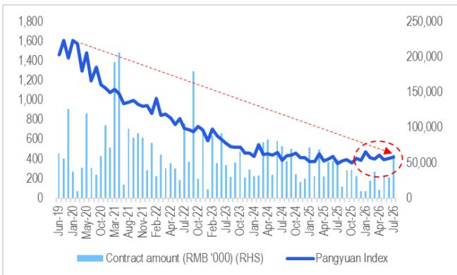
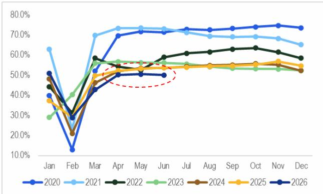

# 塔吊发货量6月转正：最后筑底的工程机械，中国机械选择性复苏的首个信号

中国塔吊市场刚刚发布了一个值得关注的数据。2026年6月，国内塔吊发货量同比增长11%，这是自2023年7月以来首次录得正增长（剔除春节低基数扰动）。这不仅仅是一个统计数字；它是最后一个呈现同比需求增长的工程机械品类，其转折可能标志着整个板块的一个潜在拐点。对于观察者而言，问题已不再是机械周期是否已触底，而是价值链的哪些部分有望引领下一阶段，以及哪些信号仍过于矛盾而难以采信。

这一数据的时间点至关重要。它出现在全球AI相关资产广泛回调的背景下，这种轮动压制了亚洲市场的风险偏好。在此背景下，中国工程机械板块，凭借一个具体且改善中的运营数据点，提供了周期防御性与战术性上行潜力的罕见组合。2026年6月的塔吊发货量数据，可能是今年该板块最重要的单一数据发布，正因为它打破了近三年的负增长趋势，且出现在一个需求约70%与房地产板块相关的机械品类上——而房地产正是中国工业长期承压的根源。

然而，复苏远非均衡。同一份报告揭示了租赁市场发出的混合信号、持续下降的利用率，以及一个可能由单一强大外部客户而非国内需求驱动的工厂自动化板块。驾驭这一环境的关键，在于区分周期底部与结构性复苏，并识别哪些公司能从前者受益，同时免受后者脆弱性的影响。

## 塔吊拐点真实存在，但反映的是底部，而非繁荣

塔吊发货量11%的同比增长，是中国工程机械领域多年来最明确的积极信号。塔吊是最后一个呈现复苏的机械品类，这本身就是一个有启示性的模式。在以往的周期中，塔吊通常滞后于挖掘机、装载机等其他工程设备，因为它们是在施工过程的后期、地基工程完成后才被部署。塔吊如今成为最后一个转正的品类，这一事实暗示其他机械品类此前的复苏可能是真实的，而施工活动的顺序逻辑终于开始传导至最终阶段。

但底部并非繁荣。报告明确指出，这一数据点并不必然意味着房地产或基建板块需求的强劲改善。在近三年收缩之后，单月正增长可能由基数效应、库存补货或少数大型项目驱动，而非广泛的回升。观察者应将6月数据视为复苏叙事的必要条件，而非充分条件。

来自中国最大塔吊租赁公司庞源的租赁数据，强化了这种谨慎态度。其租赁费率指数在6月为422（以2016年为基数1000）。这同比上升2%，且比去年同期高出14%，这是积极的。但机队利用率从2026年3月至6月已连续四个月同比下降。这种分化是问题的核心：费率在上升，但利用率在下降。在正常复苏中，两者应同步上升。这一差距意味着租赁商能对已部署的塔吊收取更高费用，但整体部署的塔吊数量却在减少。这与市场供给整合的情况相符，而非终端用户施工活动加速。

中国工程机械工业协会报告的更广泛工程机械利用率为6月51.1%，同比下降5.8个百分点，环比下降1.3个百分点。这是对发货数据的一个清醒反衬。它告诉我们，即使新机器被销售给经销商和租赁公司，已在现场运行的机器使用强度却在降低。发货量与利用率之间的差距，是渠道库存积累而非终端需求拉动的经典信号。要使复苏具有可持续性，利用率必须企稳并最终上升。在此之前，发货数据应被解读为试探性底部，而非确认的上行趋势。

## 恒立液压的油缸产量激增，揭示组件链条中由美国驱动的分化

报告中最引人注目的数据点并非来自整机厂商，而是来自一家组件供应商。恒立液压的挖掘机油缸产量预计在2026年7月达到7.3万至7.5万件，同比增长超过40%。报告将这一激增归因于中型挖掘机的强劲需求，并明确指出需求更多来自恒立的主要美国客户。

这是一个关键区别。油缸产量超过40%的增长，并非中国国内复苏的信号。它是美国工程设备需求的信号，可能由联邦基建支出、回流相关的工厂建设以及依然坚韧的美国住宅和非住宅建筑市场驱动。恒立是一家领先美国挖掘机OEM的主要供应商，这种关系是其当前生产繁荣的主要驱动力。

对观察者而言，其含义有两点。首先，恒立是对美国施工活动的押注，而非中国房地产。其命运日益与主导中国机械板块叙事的国内周期脱钩。其次，这在该板块内部制造了分化：那些直接或通过组件供应链对美国终端市场有显著敞口的公司，其表现将不同于依赖中国房地产和基建需求的公司。报告对机械OEM的排序将三一重工H股列为首位，其次是三一重工A股，然后是中联重科。但恒立的数据表明，拥有美国敞口的组件供应商，可能提供与整机OEM不同且可能更稳定的增长轨迹，后者的国内收入仍与脆弱的房地产复苏挂钩。

这也带来了报告明确承认的风险：恒立滚珠丝杠和墨西哥工厂因生产规模经济较低而导致盈利能力较弱。公司正在投资新产能和新产品线，包括用于人形机器人的滚珠丝杠，报告将其视为潜在的估值重估催化剂。但这些投资存在执行风险。油缸业务目前火力全开，但投资组合的其他部分仍在爬坡。观察者必须权衡由美国驱动的油缸业务的近期可见性，与机器人相关组件的长期但更不确定的潜力。

## 板块的防御性吸引力是战术性的，而非长期性的，且取决于运营数据的质量

在全球AI资产回调的背景下，报告认为工程机械板块对观察者而言显得具有防御性，因为它有强劲的运营数据点支撑。这是一个战术性论点，而非战略性论点。在一个利用率仍在下降、仅有一个月发货量正增长的板块中采取防御性定位，是对轮动期间相对表现优于大盘的押注，而非对相对盈利增长的押注。

逻辑很简单：当高增长、高估值的板块（如AI）面临压力时，资金会轮动到具有切实、改善中运营指标的板块，即使这些指标处于早期且不完整。塔吊发货量三年来首次转正是一个切实的数据点。恒立超过40%的油缸增长是切实的。这些是在推介中可以引用的事实，不同于尚未产生收入的AI公司的未来盈利潜力。在风险规避环境中，这种切实性具有价值。

但防御性吸引力有其局限。报告自身数据显示工程机械利用率在下降，租赁市场发出混合信号。如果全球资产回调加深并演变为广泛的经济担忧，而不仅仅是科技板块轮动，那么工程机械等周期板块将失去其防御性光环。该板块是特定市场环境下的战术性避风港，而非结构性安全港。

报告的排序具有启发性。三一重工H股排名第一，领先于其A股上市主体和中联重科。这很可能反映了三一更强的资产负债表、包括海外市场在内的更多元化收入基础，以及比同行更能经受国内长期调整的能力。中联重科虽然也被评为正面，但承担了额外风险，包括更高的信用减值损失以及对中后期周期机械需求的更大敏感性。排序是韧性的排名，而非上行潜力的排名。在防御性轮动中，韧性比杠杆更重要——杠杆指向一个尚未到来的复苏。

## 观察者的决策框架：区分周期底部与结构性复苏的三个信号

报告提供了足够的数据，为试图驾驭周期这一阶段的观察者构建一个简单但稳健的决策框架。该框架基于三个顺序信号，在叙事从“触底”转向“复苏”之前，这些信号必须得到确认。

第一个信号是塔吊利用率。发货数据已转正，但利用率仍在下降。观察者应每月跟踪庞源机队利用率以及更广泛的CCMA利用率。利用率的企稳，随后连续两个月同比改善，将是底部发货量转化为实际活动的首个确认。在此之前，发货数据仍是供给侧信号，而非需求侧信号。

第二个信号是塔吊租赁费率指数的轨迹。该指数目前正在上升，但它是从极低基数（以2016年基线1000计，当前为422）上升的。问题是费率上升是否可持续。如果费率在利用率企稳的同时继续上升，那将表明真正的定价能力和市场趋紧。如果费率在利用率依然疲弱时再次开始下降，那么6月的发货量飙升将看起来像是虚假曙光。

第三个信号是美国施工周期的表现。恒立的油缸产量是美国需求（而非中国需求）的领先指标。如果美国经济放缓且美国施工活动减速，恒立的增长将放缓，整个板块将失去其较强的组件层面支撑。相反，如果美国需求保持强劲，恒立将继续表现良好，但观察者必须清楚，他们是在买入美国敞口，而非中国复苏。

这三个信号构成了一个互斥且总体完备的框架，用于评估机械周期。前两个是国内且中国特有的。第三个是外部且全球性的。看到所有三个信号都朝同一积极方向移动的观察者，可以自信地增加对该板块的敞口。那些只看到第一个信号（发货数据）的观察者，应保持谨慎，并聚焦于排序中最具韧性的标的。

报告自身的估值目标反映了基于11.4%净资产回报表现和约22倍市净率与净资产回报表现比率的估值。对于周期转折而言，这是一个合理的倍数，但并非增长倍数。恒立的目标价160元基于50倍2027年预期市盈率，这是一个高得多的倍数，反映了人形机器人敞口带来的潜在估值重估。该目标更具投机性，且依赖于当前运营数据尚未确认的叙事。板块内的估值分化反映了数据分化：一些标的在周期调整基础上估值低廉，而另一些则定价了一个尚未实现的结构性转型。

*仅供参考。部分内容可能基于源材料通过AI辅助生成、翻译、总结或编辑，可能包含遗漏或错误。请独立核实。本文不构成专业建议。*

仅供参考。部分内容可能基于源材料通过AI辅助生成、翻译、总结或编辑，可能包含遗漏或错误。请独立核实。本文不构成专业建议。

