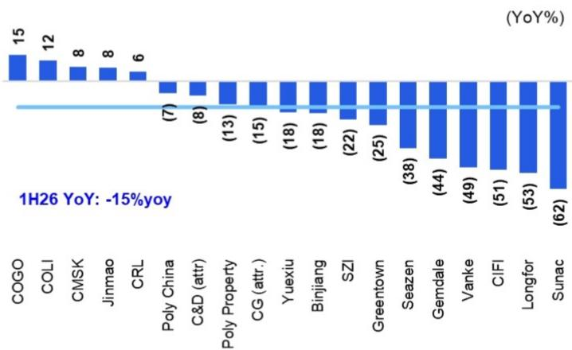
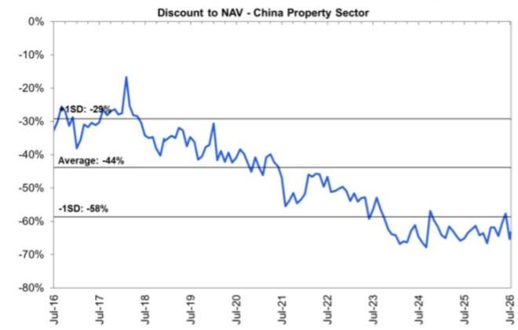
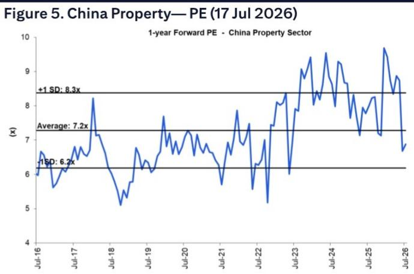

# 宏观环境观察

## 1H26 预览更新：部分表现或优于预期

## 核心观点

1H26 业绩表现分化：随着部分公司发布1H26业绩预告，我们更新了预测：i) 表现较好：华润置地1H26盈利可能持平，受益于较高的REIT处置收益，但开发业务利润下降（符合预期）；建发国际、中海地产、中国海外宏洋和龙湖集团的开发业务毛利率下降幅度可能略好于预期；对于龙湖集团，我们目前预计1H26实现盈亏平衡（此前预期亏损20亿元）；ii) 表现较弱：招商蛇口、金地集团和越秀地产发布了负面盈利预告，1H26利润降幅较大；iii) 1H26合约销售同比下降15%，但五家公司（中国海外宏洋、中海地产、招商蛇口、中国金茂和华润置地）在核心城市复苏的推动下，上半年实现了6-15%的销售增长。

为销售增长和9月起推盘增加做好准备；关注1H26业绩——我们对该板块的积极看法基于：(1) 7-9月销售增长可能加快，得益于核心城市成交量稳健和低基数效应；(2) 9月起新推盘项目增加；(3) 7月重要会议可能释放支持性信号。尽管近期板块报价有所回调，但实体市场活动保持稳定，7月第一周核心城市一/二手房成交套数同比分别增长18%/12%。我们认为1H26业绩疲软已在报价中有所反映，关于销售和利润率的指引可能提供支撑。因此，我们认为该板块已为7-10月的行情做好准备。关注标的：华润置地、建发国际、贝壳、中国金茂和中海地产。自6月以来，我们基于其产品升级和加速拿地，对建发国际的看法更为积极。

土地市场：供应减少推高优质地块价格；等待下半年窗口——5M26上市房企拿地金额同比下降57%，因核心城市土地供应减少（300城1H26：建筑面积同比下降27%，为20年低点）。中海地产、中国金茂、建发国际、绿城中国计划在2025年强劲表现后，于下半年供应增加时获取更优价格的土地。华润置地和保利发展在上半年较为活跃。华润置地在深圳表现强劲。建发国际在6月有所增加。

预计三季度销售增长更多——我们预计更多上市房企的销售增长将在三季度转正，部分得益于9月推盘增加。领先企业的销售增长也应加快。在1H26，五家公司已实现正销售增长：中海地产同比增长12%，中国金茂增长8%，招商蛇口增长8%，华润置地增长6%，中国海外宏洋增长15%。

Griffin Chan AC
+852-2501-2438
griffin.chan@citi.com

Cindy Li
+852-2501-2710
cindy.li@citi.com

图1. 中国房地产板块 – 1H26E 业绩预览

<table><tr><td rowspan="2">公司</td><td rowspan="2">RIC</td><td colspan="4">核心盈利 * (人民币百万元)</td><td colspan="2">占全年比例</td><td colspan="4">毛利率</td><td colspan="3">核心利润率</td><td rowspan="2">盈利预警</td><td rowspan="2">关键要点</td></tr><tr><td>1H25 A</td><td>2H25 B</td><td>1H26E C</td><td>同比 C/A-1</td><td>1H25</td><td>1H26E</td><td>1H25</td><td>2H25</td><td>FY25</td><td>1H26E</td><td>1H25</td><td>FY25</td><td>1H26E</td></tr><tr><td colspan="17">表现较好</td></tr><tr><td>华润置地</td><td>1109.HK</td><td>10,000</td><td>12,480</td><td>10,002</td><td>0%</td><td>44%</td><td>44%</td><td>24.0%</td><td>19.8%</td><td>21.2%</td><td>23.3%</td><td>10.5%</td><td>8.0%</td><td>10.3%</td><td></td><td>预计经常性收入增长8%及REIT处置收益30亿元，抵消开发业务毛利率约10%（1H25: 15.6%）</td></tr><tr><td>建发国际</td><td>1908.HK</td><td>950</td><td>2,670</td><td>860</td><td>-9%</td><td>26%</td><td>24%</td><td>12.9%</td><td>14.2%</td><td>13.9%</td><td>14.0%</td><td>2.8%</td><td>2.6%</td><td>3.7%</td><td></td><td>6月加快拿地；9月起更多新推盘；利润率同比稳定；更多合营项目入账</td></tr><tr><td colspan="2">小计（2家）</td><td>10,950</td><td>15,150</td><td>10,862</td><td>-1%</td><td>42%</td><td>41%</td><td>21.1%</td><td>17.8%</td><td>18.8%</td><td>21.5%</td><td>8.5%</td><td>6.2%</td><td>9.0%</td><td></td><td></td></tr><tr><td colspan="17">表现稳定</td></tr><tr><td>新城发展</td><td>1030.HK</td><td>766</td><td>(385)</td><td>659</td><td>-14%</td><td>201%</td><td>75%</td><td>24.4%</td><td>22.6%</td><td>23.3%</td><td>25.5%</td><td>3.5%</td><td>0.7%</td><td>4.0%</td><td></td><td>5M26同店销售增长4%；预计FY26E租金收入145亿元（同比增长3%），新增5个商场</td></tr><tr><td>中国海外宏洋</td><td>0081.HK</td><td>294</td><td>11</td><td>252</td><td>-14%</td><td>97%</td><td>29%</td><td>9.3%</td><td>8.3%</td><td>8.7%</td><td>8.5%</td><td>2.0%</td><td>0.8%</td><td>1.8%</td><td></td><td>签约下降但利润率稳定；去库存50亿元；1Q26经营利润同比下降20%</td></tr><tr><td>中海地产</td><td>0688.HK</td><td>8,780</td><td>4,230</td><td>7,445</td><td>-15%</td><td>67%</td><td>58%</td><td>17.4%</td><td>13.7%</td><td>15.5%</td><td>14.8%</td><td>10.6%</td><td>7.7%</td><td>9.1%</td><td></td><td>1H26销售增长12%，权益销售额行业领先；预计董事长下半年退休；开发业务毛利率14-16%（1H25: 17.4%）；1Q26经营利润同比下降27.5%</td></tr><tr><td colspan="2">小计（3家）</td><td>9,840</td><td>3,855</td><td>8,356</td><td>-15%</td><td>72%</td><td>57%</td><td>17.7%</td><td>14.8%</td><td>16.1%</td><td>15.6%</td><td>8.2%</td><td>5.3%</td><td>7.4%</td><td></td><td></td></tr><tr><td colspan="17">表现较弱</td></tr><tr><td>中国金茂</td><td>0817.HK</td><td>795</td><td>568</td><td>574</td><td>-28%</td><td>58%</td><td>40%</td><td>16.2%</td><td>15.1%</td><td>15.5%</td><td>13.6%</td><td>3.2%</td><td>2.3%</td><td>2.8%</td><td></td><td>1H26销售增长8%；毛利率下降</td></tr><tr><td>滨江集团</td><td>002244.SZ</td><td>1,836</td><td>243</td><td>1,330</td><td>-28%</td><td>88%</td><td>70%</td><td>11.8%</td><td>16.0%</td><td>13.7%</td><td>11.5%</td><td>4.0%</td><td>2.5%</td><td>2.0%</td><td></td><td>非国企中销售排名第一；权益拿地金额88亿元；平均融资成本2.8%；1Q利润同比下降18%</td></tr><tr><td>保利发展</td><td>600048.SS</td><td>2,579</td><td>(1,951)</td><td>358</td><td>-86%</td><td>411%</td><td>50%</td><td>14.0%</td><td>11.9%</td><td>12.7%</td><td>11.5%</td><td>2.2%</td><td>0.2%</td><td>0.4%</td><td>Y</td><td>商业REIT获批；签约及利润率下降</td></tr><tr><td>深圳控股（港币百万元）</td><td>0604.HK</td><td>(490)</td><td>(3,564)</td><td>178</td><td>NM</td><td>12%</td><td>30%</td><td>17.1%</td><td>15.9%</td><td>16.2%</td><td>15.0%</td><td>-4.7%</td><td>-10.0%</td><td>2.8%</td><td></td><td>出售君华电子及通过债转股处置深业鹏基35%股权（2026年3月）</td></tr><tr><td>龙湖集团</td><td>0960.HK</td><td>1,380</td><td>(3,080)</td><td>125</td><td>-91%</td><td>-81%</td><td>-3%</td><td>12.6%</td><td>5.2%</td><td>9.7%</td><td>2.3%</td><td>2.3%</td><td>-1.7%</td><td>0.3%</td><td>Y</td><td>1H26商场同店销售增长8%，经常性收入同比增长5-10%，但开发业务亏损</td></tr><tr><td>招商蛇口</td><td>001979.SZ</td><td>962</td><td>(793)</td><td>59</td><td>-94%</td><td>569%</td><td>3%</td><td>14.4%</td><td>13.4%</td><td>13.8%</td><td>13.5%</td><td>1.9%</td><td>0.1%</td><td>0.2%</td><td>Y</td><td>公布1H26利润5000-7000万元；产业园REIT扩募及商业REIT申请</td></tr><tr><td>越秀地产</td><td>0123.HK</td><td>1,520</td><td>(1,260)</td><td>80</td><td>-95%</td><td>585%</td><td>10%</td><td>10.6%</td><td>4.3%</td><td>7.8%</td><td>6.9%</td><td>3.2%</td><td>0.3%</td><td>0.5%</td><td>Y</td><td>公布1H26盈利预警，利润5000万-1亿元，因签约及毛利率下降</td></tr><tr><td>绿城中国</td><td>3900.HK</td><td>375</td><td>1,006</td><td>(303)</td><td>NM</td><td>27%</td><td>-10%</td><td>13.4%</td><td>11.1%</td><td>11.9%</td><td>12.3%</td><td>0.7%</td><td>0.9%</td><td>-0.7%</td><td>Y</td><td>将任命新CEO；毛利率下降；计划下半年加快拿地</td></tr><tr><td>保利置业</td><td>0119.HK</td><td>29</td><td>308</td><td>(750)</td><td>NM</td><td>9%</td><td>50%</td><td>17.5%</td><td>16.7%</td><td>17.0%</td><td>16.8%</td><td>0.2%</td><td>0.7%</td><td>-5.0%</td><td>Y</td><td>公布盈利预警，权益净亏损7-8亿元，原因：(1)收入下降，(2)毛利率下降</td></tr><tr><td>金地集团</td><td>600383.SS</td><td>(3,550)</td><td>(8,757)</td><td>(3,109)</td><td>NM</td><td>29%</td><td>73%</td><td>12.2%</td><td>14.8%</td><td>13.7%</td><td>12.0%</td><td>-22.6%</td><td>-34.3%</td><td>-30.0%</td><td>Y</td><td>公布1H26亏损28-33亿元。开发业务签约下降及存货减值准备</td></tr><tr><td colspan="2">小计（10家）</td><td>5,435</td><td>(17,281)</td><td>(1,458)</td><td>NM</td><td>36%</td><td>-5%</td><td>13.7%</td><td>11.9%</td><td>12.5%</td><td>11.3%</td><td>1.4%</td><td>1.0%</td><td>-0.5%</td><td></td><td></td></tr><tr><td colspan="2">小计（15家）</td><td>26,226</td><td>1,724</td><td>17,759</td><td>-32%</td><td>48%</td><td>25%</td><td>15.9%</td><td>14.0%</td><td>14.1%</td><td>14.5%</td><td>4.1%</td><td>2.5%</td><td>3.4%</td><td></td><td></td></tr><tr><td colspan="17">涉及公开债务重组的公司：因售价下调、处置损失、资产减值等导致亏损</td></tr><tr><td>旭辉控股</td><td>0884.HK</td><td>(4,249)</td><td>(4,638)</td><td>(4,159)</td><td>NM</td><td>48%</td><td>110%</td><td>8.0%</td><td>5.8%</td><td>6.9%</td><td>6.0%</td><td>-34.6%</td><td>-34.9%</td><td>-70.0%</td><td></td><td>力争2026年12月前获得第二轮境外重组批准；关注新项目管理业务</td></tr><tr><td>融创中国</td><td>1918.HK</td><td>(14,945)</td><td>(19,206)</td><td>(7,369)</td><td>NM</td><td>44%</td><td>45%</td><td>5.4%</td><td>5.8%</td><td>5.6%</td><td>4.5%</td><td>-9.8%</td><td>-13.5%</td><td>-40.0%</td><td></td><td>债务重组完成后，积极寻求其他债务展期或新融资</td></tr><tr><td>碧桂园</td><td>2007.HK</td><td>(18,468)</td><td>(49,460)</td><td>(11,102)</td><td>NM</td><td>27%</td><td>45%</td><td>-8.9%</td><td>-44.5%</td><td>-27.8%</td><td>-15.0%</td><td>-25.4%</td><td>-43.9%</td><td>-60.0%</td><td></td><td>境内外债务重组进行中；新销售预计毛利率为正但存在减值</td></tr><tr><td>万科</td><td>000002.SZ</td><td>(11,591)</td><td>(74,326)</td><td>(12,418)</td><td>NM</td><td>13%</td><td>65%</td><td>9.0%</td><td>9.9%</td><td>9.5%</td><td>7.1%</td><td>-11.0%</td><td>-36.8%</td><td>-15.0%</td><td>Y</td><td>公布1H26亏损110-140亿元；债务展期；开发业务签约及利润率下降，资产减值</td></tr><tr><td colspan="2">小计（4家）</td><td>(49,254)</td><td>(147,630)</td><td>(35,049)</td><td>NM</td><td>25%</td><td>55%</td><td>2.4%</td><td>-8.8%</td><td>-3.7%</td><td>3.4%</td><td>-23.4%</td><td>-42.9%</td><td>-27.9%</td><td></td><td></td></tr><tr><td colspan="2">合计（19家）</td><td>(32,868)</td><td>(149,761)</td><td>(25,645)</td><td>NM</td><td>23%</td><td>44%</td><td>12.2%</td><td>9.7%</td><td>12.8%</td><td>10.7%</td><td>-2.6%</td><td>-7.7%</td><td>-2.4%</td><td></td><td></td></tr><tr><td colspan="17">按企业类型</td></tr><tr><td colspan="2">央企（6家）</td><td>23,410</td><td>14,544</td><td>18,689</td><td>-20%</td><td>62%</td><td>46%</td><td>17.2%</td><td>14.9%</td><td>15.8%</td><td>15.8%</td><td>6.1%</td><td>3.8%</td><td>5.4%</td><td></td><td></td></tr><tr><td colspan="2">地方国企（4家）</td><td>2,009</td><td>(1,846)</td><td>368</td><td>-82%</td><td>1234%</td><td>10%</td><td>12.2%</td><td>12.3%</td><td>12.3%</td><td>11.7%</td><td>1.8%</td><td>0.1%</td><td>0.6%</td><td></td><td></td></tr><tr><td colspan="2">混合所有制（3家）</td><td>(14,766)</td><td>(82,078)</td><td>(15,830)</td><td>NM</td><td>15%</td><td>78%</td><td>10.6%</td><td>10.8%</td><td>10.7%</td><td>9.1%</td><td>-8.5%</td><td>-22.8%</td><td>-11.6%</td><td></td><td></td></tr><tr><td colspan="2">民营企业（6家）</td><td>(33,681)</td><td>(76,526)</td><td>(20,516)</td><td>NM</td><td>31%</td><td>44%</td><td>4.6%</td><td>-8.5%</td><td>-1.9%</td><td>6.5%</td><td>-14.6%</td><td>-24.0%</td><td>-11.7%</td><td></td><td></td></tr><tr><td colspan="17">债务展期/重组</td></tr><tr><td colspan="2">无公开信用问题（15家）</td><td>26,226</td><td>1,724</td><td>17,759</td><td>-32%</td><td>94%</td><td>43%</td><td>14.7%</td><td>13.6%</td><td>14.1%</td><td>13.0%</td><td>3.8%</td><td>1.6%</td><td>3.0%</td><td></td><td></td></tr><tr><td colspan="2">信用问题（4家）</td><td>(49,254)</td><td>(147,630)</td><td>(35,049)</td><td>NM</td><td>25%</td><td>55%</td><td>-7.2%</td><td>-28.6%</td><td>-18.6%</td><td>-3.7%</td><td>-23.4%</td><td>-42.9%</td><td>-27.9%</td><td></td><td></td></tr></table>

图2. 上市房企5M26权益拿地金额同比下降57%

<table><tr><td colspan="2">（人民币十亿元）</td><td colspan="2">拿地金额（权益价值）</td><td colspan="2">5M26 vs. 5M25</td></tr><tr><td>公司</td><td>RIC</td><td>5M25</td><td>5M26</td><td>同比（金额）</td><td>同比（%）</td></tr><tr><td colspan="6">5M26有拿地的12家公司</td></tr><tr><td>华润置地</td><td>1109.HK</td><td>31.2</td><td>29.7</td><td>-1.5</td><td>-5%</td></tr><tr><td>保利发展</td><td>600048.SS</td><td>36.1</td><td>23.9</td><td>-12.2</td><td>-34%</td></tr><tr><td>中国金茂</td><td>0817.HK</td><td>21.5</td><td>9.6</td><td>-11.9</td><td>-55%</td></tr><tr><td>绿城中国</td><td>3900.HK</td><td>33.7</td><td>8.8</td><td>-24.9</td><td>-74%</td></tr><tr><td>招商蛇口</td><td>001979.SZ</td><td>20.7</td><td>8.4</td><td>-12.3</td><td>-59%</td></tr><tr><td>滨江集团</td><td>002244.SZ</td><td>26.4</td><td>8.1</td><td>-18.3</td><td>-69%</td></tr><tr><td>中海地产</td><td>0688.HK</td><td>29.1</td><td>7.7</td><td>-21.4</td><td>-74%</td></tr><tr><td>建发国际</td><td>1908.HK</td><td>26.6</td><td>5.2</td><td>-21.4</td><td>-80%</td></tr><tr><td>保利置业</td><td>0119.HK</td><td>11.8</td><td>4.5</td><td>-7.4</td><td>-62%</td></tr><tr><td>越秀地产</td><td>0123.HK</td><td>13.7</td><td>3.5</td><td>-10.2</td><td>-74%</td></tr><tr><td>龙湖集团</td><td>0960.HK</td><td>1.8</td><td>1.2</td><td>-0.5</td><td>-30%</td></tr><tr><td>中国海外宏洋</td><td>0081.HK</td><td>4.6</td><td>0.3</td><td>-4.3</td><td>-94%</td></tr><tr><td colspan="2">合计</td><td>257</td><td>111</td><td>-147</td><td>-57%</td></tr></table>

© 2026 Citi Inc. 未经Citi书面许可不得转载。
来源：公司数据、CREIS、Citi

图3. 上市房企1H26合约销售同比下降15%

© 2026 Citi Inc. 未经Citi书面许可不得转载。
来源：公司数据、CREIS、Citi

## 板块估值

图4. 中国房地产板块 — NAV折让（2026年7月17日）

© 2026 Citi Inc. 未经Citi书面许可不得转载。
来源：Datastream、Citi预测

© 2026 Citi Inc. 未经Citi书面许可不得转载。来源：Datastream、Citi预测

图6. 中国房地产板块 — 估值（2026年7月17日收盘价）Citi评级：1 – 买入；2 – 中性；3 – 卖出；H – 高风险

<table><tr><td rowspan="2">股票</td><td rowspan="2">RIC</td><td rowspan="2">2026年7月17日价格</td><td rowspan="2">市值（百万美元）</td><td rowspan="2">Citi评级</td><td rowspan="2">预测NAV</td><td rowspan="2">NAV折让</td><td rowspan="2">目标价</td><td colspan="3">市盈率</td><td colspan="3">市净率</td><td colspan="3">股息率</td></tr><tr><td>FY26E</td><td>FY27E</td><td>FY28E</td><td>FY26E</td><td>FY27E</td><td>FY28E</td><td>FY26E</td><td>FY27E</td><td>FY28E</td></tr><tr><td colspan="8">中国房地产公司（H股）</td><td colspan="3"></td><td colspan="3"></td><td colspan="3"></td></tr><tr><td>建发国际</td><td>1908.HK</td><td>14.28</td><td>4,217</td><td>1</td><td>24.72</td><td>-42%</td><td>18.80</td><td>7.5</td><td>7.4</td><td>7.1</td><td>0.6</td><td>0.6</td><td>0.6</td><td>6.9%</td><td>7.0%</td><td>7.4%</td></tr><tr><td>旭辉控股</td><td>0884.HK</td><td>0.04</td><td>81</td><td>3H</td><td>0.31</td><td>-89%</td><td>0.06</td><td>N/A</td><td>N/A</td><td>N/A</td><td>0.0</td><td>0.0</td><td>0.0</td><td>-</td><td>-</td><td>-</td></tr><tr><td>中国海外宏洋</td><td>0081.HK</td><td>2.35</td><td>1,066</td><td>1</td><td>6.93</td><td>-66%</td><td>2.68</td><td>8.3</td><td>7.9</td><td>7.3</td><td>0.2</td><td>0.2</td><td>0.2</td><td>4.1%</td><td>4.3%</td><td>4.7%</td></tr><tr><td>中海地产</td><td>0688.HK</td><td>13.37</td><td>18,658</td><td>1</td><td>34.32</td><td>-61%</td><td>18.20</td><td>9.8</td><td>10.0</td><td>9.7</td><td>0.3</td><td>0.3</td><td>0.3</td><td>3.5%</td><td>3.5%</td><td>3.6%</td></tr><tr><td>碧桂园</td><td>2007.HK</td><td>0.18</td><td>1,058</td><td>3H</td><td>0.83</td><td>-78%</td><td>0.25</td><td>N/A</td><td>N/A</td><td>N/A</td><td>-0.3</td><td>-0.2</td><td>-0.1</td><td>-</td><td>-</td><td>-</td></tr><tr><td>华润置地</td><td>1109.HK</td><td>33.72</td><td>30,658</td><td>1</td><td>71.70</td><td>-53%</td><td>43.00</td><td>9.1</td><td>8.9</td><td>8.6</td><td>0.7</td><td>0.7</td><td>0.6</td><td>4.1%</td><td>4.1%</td><td>4.3%</td></tr><tr><td>绿城中国</td><td>3900.HK</td><td>7.26</td><td>2,351</td><td>1</td><td>18.60</td><td>-61%</td><td>11.80</td><td>5.2</td><td>4.8</td><td>4.8</td><td>0.4</td><td>0.4</td><td>0.4</td><td>7.1%</td><td>7.6%</td><td>7.6%</td></tr><tr><td>中国金茂</td><td>0817.HK</td><td>1.35</td><td>2,326</td><td>1</td><td>3.80</td><td>-64%</td><td>1.90</td><td>11.0</td><td>10.2</td><td>9.1</td><td>0.2</td><td>0.2</td><td>0.2</td><td>2.3%</td><td>2.3%</td><td>2.8%</td></tr><tr><td>龙湖集团</td><td>0960.HK</td><td>6.67</td><td>6,036</td><td>1</td><td>22.25</td><td>-70%</td><td>11.10</td><td>NM</td><td>8.6</td><td>7.7</td><td>0.2</td><td>0.2</td><td>0.2</td><td>-</td><td>-</td><td>-</td></tr><tr><td>美的置业</td><td>3990.HK</td><td>2.86</td><td>523</td><td>1</td><td>3.51</td><td>-18%</td><td
