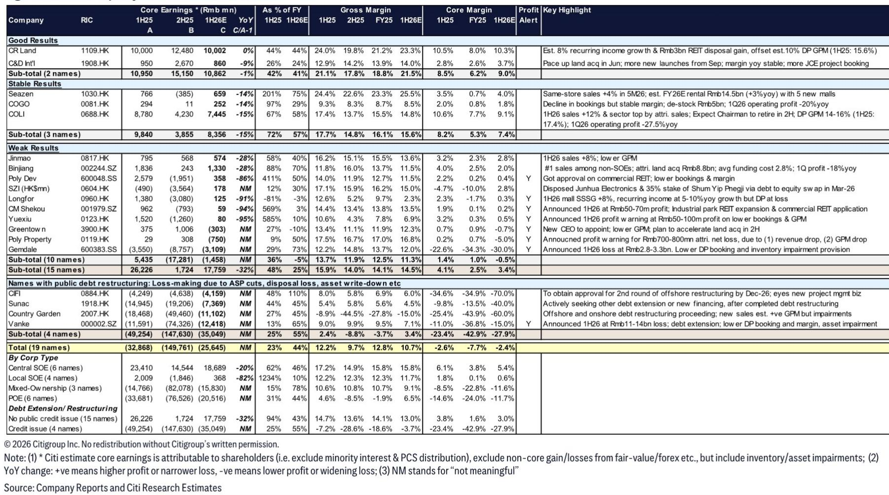
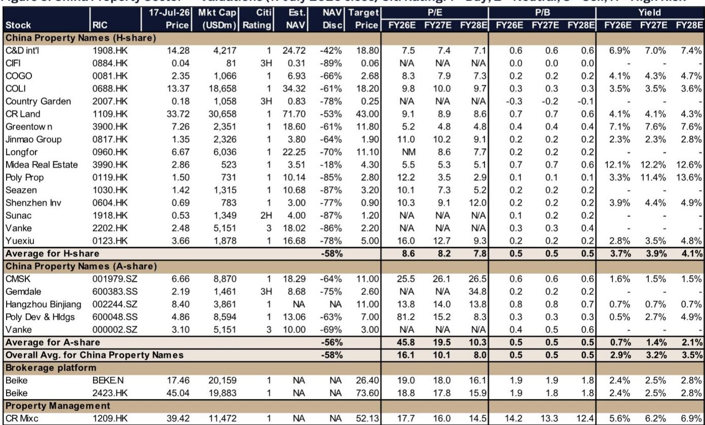
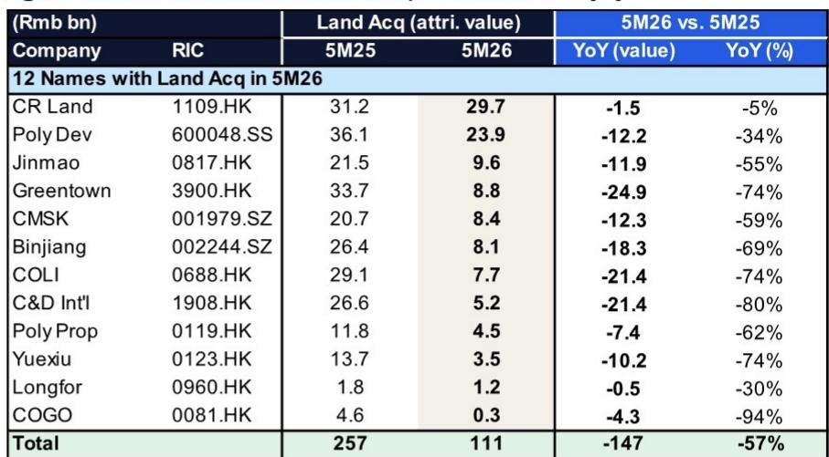

# 城市与住房数据变化观察

近期一份关于中国房地产行业的报告中，更新了19家主要企业的上半年业绩预览。核心观察是：尽管多数公司上半年盈利仍在调整，但合约销售已在第二季度出现边际改善，部分头部央企实现了6%-15%的同比增长。报告认为，市场对上半年盈利的调整已有定价，更值得关注的是后续政策窗口，以及9月推盘高峰可能带来的销售变化。

这份报告覆盖的样本中，15家无公开信用问题的企业上半年核心净利润合计约178亿元，同比下降32%。但结构分化显著：中央国企板块整体盈利仅下滑20%，而地方国企和混合所有制企业降幅分别达到82%和由盈转亏。报告将这一格局概括为“国企韧性、民企承压、信用重组企业仍在深度调整”。

## 1. 上半年盈利预览：央企利润占比升至近九成

报告将19家样本公司分为三档。第一档是“好于预期”，仅华润置地和建发国际两家，上半年核心净利润合计同比仅下降1%。华润置地凭借约30亿元的REIT处置收益和8%的经常性收入增长，抵消了开发业务毛利率的下滑。建发国际虽然利润同比下降9%，但毛利率同比基本稳定，且6月已加速拿地。

第二档是“稳定”，包括新城发展、中国海外发展、路劲基建三家公司，利润降幅在14%-15%之间。中国海外发展是其中销售表现较强的，上半年合约销售同比增长12%，位列行业第一梯队。

第三档是“弱于预期”，涵盖10家公司。其中招商蛇口、越秀地产、保利发展、绿城中国、金地集团等均发布了盈利预警。龙湖集团上半年预计仅能实现盈亏平衡，较此前预期的20亿元亏损有所改善，但开发业务毛利率已降至2.3%。万科上半年预计亏损110-140亿元，仍在债务展期和资产减值中。

从所有制结构看，6家中央国企上半年核心净利润约187亿元，占样本总利润的105%；地方国企和民企整体均为亏损。这意味着行业利润已高度集中于少数央企。

> **观察：** 报告的利润分层显示，上半年房地产行业的盈利底可能已接近，但这不是行业整体复苏的信号，而是央企凭借融资优势和土地获取能力，在调整市场中挤出了民企份额。利润集中度上升，意味着后续销售弹性和估值修复也将高度分化。

## 2. 合约销售：5家实现正增长，9月推盘是关键节点

报告数据显示，19家样本公司上半年合约销售总额同比下降15%，但5家公司实现了正增长：路劲基建+15%、中国海外发展+12%、金茂+8%、招商蛇口+8%、华润置地+6%。这些公司均集中在核心城市，且以改善型产品为主。

报告特别指出，7月第一周，重点城市一二手住宅成交套数同比分别增长18%和12%，实物市场活动并未因报价回调而走弱。报告认为，后续可能释放支持性信号，叠加9月推盘高峰，第三季度销售增速有望进一步转正。

土地市场方面，1-5月样本公司拿地金额同比下降57%，300城土地出让面积创20年新低。但报告注意到，华润置地、保利发展上半年仍在积极补仓，而中国海外发展、金茂、建发国际、绿城中国则计划在下半年土地供应增加时择机买入。土地供给调整推高了优质地块的成交价格，但下半年供地放量可能带来更合理的拿地窗口。

## 3. 估值与市场定价：NAV折价仍深，但盈利底可能已被消化

截至7月17日，报告覆盖的H股房企平均NAV折价约65%。其中，华润置地、中国海外发展、建发国际等央企折价在42%-61%之间，而龙湖集团、新城发展等民企折价在70%-87%之间。报告对多数央企和部分优质民企更新公司观点，认为当前估值已隐含了较为悲观的盈利预期。

报告的核心逻辑是：上半年盈利弱于预期已在报价中反映，而销售端的边际改善和政策窗口尚未被充分定价。报告预计，7-10月行业可能迎来一轮由销售驱动、政策配合的阶段性行情，但这一判断的前提是9月推盘后销售数据能持续改善，且土地市场不再进一步出现变化。

对于信用重组企业，报告认为其资产减值和债务重组仍在进行中，盈利拐点尚未到来。万科、碧桂园、融创中国等公司上半年仍录得大额亏损，其估值修复需要更明确的债务解决方案和销售回款改善。

For informational purposes only. Portions may be generated,translated,summarized,or edited with AI assistance based on source materials and may contain omissions or errors. Please verify independently. This is not investment,legal,tax,accounting,or other professional advice.

