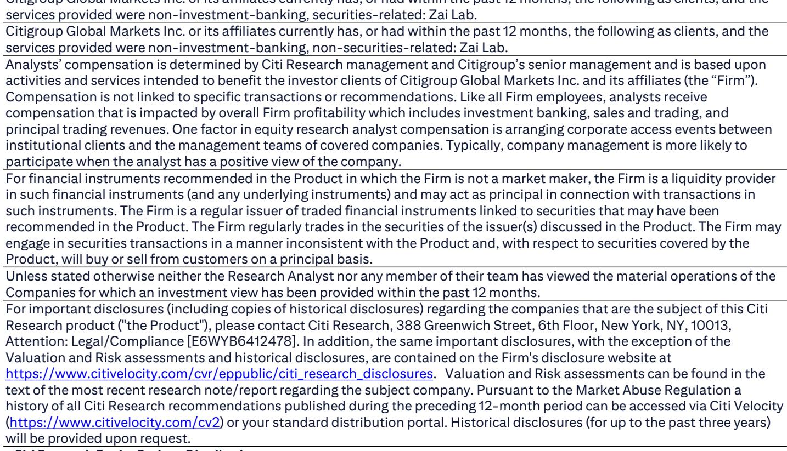
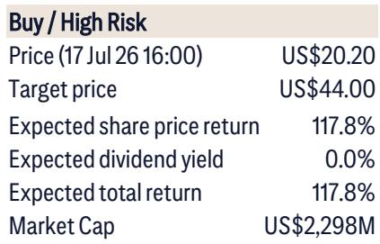
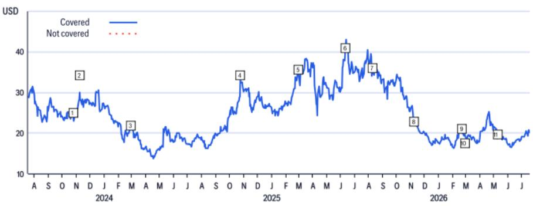

# Citi：再鼎医药ZociDLL3数据ESMO预告

再鼎医药将在欧洲肿瘤内科学会（ESMO）年会上以海报形式首次公布其DLL3 ADC药物Zoci（ZL-1310）在一线广泛期小细胞肺癌（ES-SCLC）中的临床数据。这是该靶点ADC首次在未经治疗的患者群体中展示疗效与安全性。

Citi在会前报告中指出，此次披露的核心看点不在于客观缓解率（ORR）能否超越现有标准疗法——IMpower133和CASPIAN试验中ORR已分别达到60-68%——而在于Zoci能否在无进展生存期（PFS）和安全性上做出有意义的改善。报告预计入组患者约30-40例，其中一线患者占相当比例，足以初步评估疗效信号。

当前一线SCLC标准疗法包含4个周期的化疗联合免疫治疗，多数患者难以完成全部疗程。Citi认为，Zoci的差异化机会在于通过改善耐受性延长治疗持续时间，从而转化为更优的疗效。报告对PFS的期待是“高个位数月”的改善，而非仅多出1-2个月。

## 1. 化疗联合方案与去化疗双药方案各有侧重

再鼎尚未公布一线试验的具体设计，但Citi推测，去化疗的双药方案（Zoci联合阿替利珠单抗）可能是更受关注的方向。原因在于，去掉化疗后耐受性提升的空间更大，患者更可能维持长期治疗，从而累积疗效优势。

三药方案（Zoci联合阿替利珠单抗和化疗）则更接近现有标准疗法的框架，其增量改善空间相对有限。报告认为，市场对两种方案的反应将取决于ESMO海报中各自的数据成熟度。

## 2. 中枢神经系统活性可能成为额外区分点

SCLC最常见的首次进展部位是脑部。现有标准疗法对脑转移的控制效果并不理想。Zoci在二线及以上治疗中已展现出令人鼓舞的脑转移应答数据。

尽管ESMO海报预计不会专门展示脑转移数据，但Citi认为，Zoci的中枢神经系统活性一旦在后续研究中得到验证，将构成与一线标准疗法的又一重要差异。这一判断基于一个临床事实：如果药物能有效控制脑部病灶，患者的整体治疗路径和生存质量都会发生实质变化。

> **KC评论：** 脑转移数据在SCLC药物开发中常被低估，但临床医生和支付方对此关注度很高。Zoci若能在后续研究中展示CNS活性，其临床定位将从“又一个ADC”转变为“有明确差异化优势的疗法”。

## 3. 三期临床启动时间表指向2026年底

再鼎已给出三期临床启动的时间指引：2026年底前开始一线SCLC的三期研究。这意味着ESMO数据不仅用于学术交流，更将直接决定三期试验的设计方向——是选择去化疗双药还是三药方案，以及主要终点是PFS还是总生存期。

Citi报告未对三期设计做更多推测，但明确指出，ESMO海报中一线患者亚组的疗效和安全性数据，将是判断Zoci能否在竞争激烈的SCLC治疗领域占据一席之地的关键依据。

---

For informational purposes only. Portions may be generated,translated,summarized,or edited with AI assistance based on source materials and may contain omissions or errors. Please verify independently. This is not investment,legal,tax,accounting,or other professional advice.

For informational purposes only. Portions may be generated,translated,summarized,or edited with AI assistance based on source materials and may contain omissions or errors. Please verify independently. This is not investment,legal,tax,accounting,or other professional advice.

