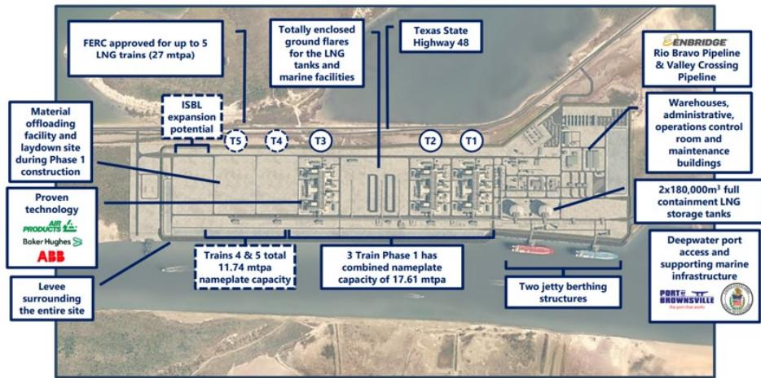
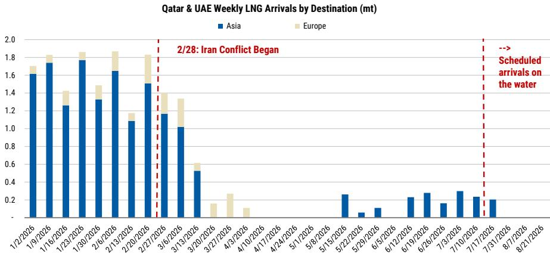
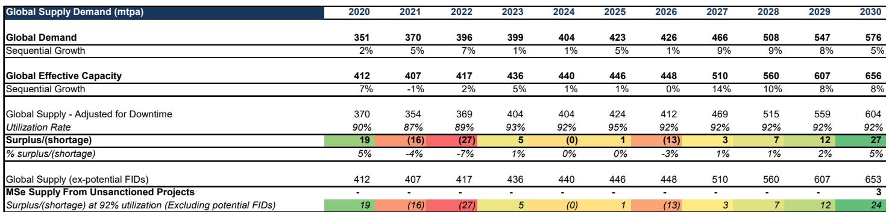

# MS：价格数据与市场变化观察

亚洲液化天然气（LNG）现货价格（JKM）自 7 月初以来已上涨 35%，年内累计涨幅超过一倍。MS在最新发布的研报中判断，当前全球 LNG 市场面临低库存、供应持续中断和季节性需求回升三重叠加，价格上行不确定性仍未出清。即便中东局势出现缓和，冬季前补库的时间窗口也在收窄。

报告覆盖的美国 LNG 出口商——Venture Global 和 Cheniere Energy——报价虽从 6 月下旬低点反弹，但MS认为两者仍低于其估算的基础资产价值。对于 VG，该机构给出的估值较当前报价高出约 21%；Cheniere 则高出约 4%。这意味着，市场尚未充分定价这些公司现有运营资产和在建项目的价值。

## 1. 供应中断与低库存共同推升价格

报告指出，7 月初伊朗冲突再度升级，导致卡塔尔 LNG 出口恢复进一步延迟。卡塔尔能源公司此前表示，在安全通行恢复后，一个月内可将产量提升至产能的 50%，两个月内达到 80%。但这一时间表目前已被搁置。

与此同时，也门胡塞武装宣布对沙特实施海上封锁，虽然对 LNG 直接影响有限，但增加了霍尔木兹海峡以外另一条关键水道的通行不确定性。约每日 450 万桶原油及成品油经过曼德海峡。

在供应端，除中东外，全球液化装置利用率 7 月至今达到 95%，高于五年均值 83% 和去年同期的 90%。但 Golden Pass 项目（满产 1800 万吨/年）仍在调试阶段，出运量波动较大；Freeport LNG 于 7 月 10 日起进入计划检修，预计持续至 8 月下旬。

> **KC评论：** 市场容易把注意力放在中东地缘事件上，但真正决定短期供需平衡的，是卡塔尔出口恢复的速度和 Golden Pass 的爬坡节奏。这两条线目前都不明朗。

## 2. 亚洲需求回暖，欧洲进口大幅下滑

过去 30 天，全球除欧洲外的 LNG 进口量同比增长 3%，印度和台湾分别增长 12% 和 10%。近两周，日本进口量同比回升 25%，正在加速补库。台湾自美国进口的 LNG 占比已升至最大供应来源。

欧洲的情况则相反。过去 30 天，欧洲 LNG 进口量同比下降 24%，库存填充率仅为 54%，远低于去年同期的 64% 和 2016-2025 年均值 69%。7 月欧洲气温预计为 2000 年以来第二高，制冷度日数（CDD）较十年均值高出 26%。报告认为，欧洲将在未来几个季度加速采购 LNG，从而进一步推高全球价格。

## 3. 2026 年市场仍处于短缺状态

MS的全球供需模型显示，2026 年全球 LNG 市场将出现约 1300 万吨的供应缺口，占需求总量的 3%。2027-2028 年市场逐步接近平衡，此后随着新项目投产，到 2030 年转为约 5% 的供应过剩。

这一判断的关键假设是：2026 年全球有效产能几乎没有增长，而需求增速虽节奏变化至 1%，但相对量仍在上升。报告特别指出，如果当前 JKM 和 TTF 期货价格维持到年底，Cheniere 全年 EBITDA 可能接近 80 亿美元，高于公司自身给出的 72.5-77.5 亿美元指引区间。

## 4. 两家公司各有不同的定价逻辑

Venture Global 的“设计一套、批量建造”模式使其在建设速度上优于同行，且约 15% 的 2026 年货物敞口于现货市场，使其成为覆盖标的中对 LNG 价格上涨最敏感的公司。报告估算，每 1 美元/百万英热单位的边际变化，对 VG 当年 EBITDA 的影响约为 3-3.5 亿美元。

Cheniere 则不同。其约 95% 的液化产能已通过长期固定价格合同锁定至 2030 年，现金流稳定性更高。报告认为，Cheniere 的增量价值来自后续扩产项目的 FID（最终研究决定），包括 Corpus Christi 和 Sabine Pass 的扩建，预计可将其年产量提升至 7100-7500 万吨，远期目标超过 1 亿吨。

> **KC评论：** 两家公司代表了两种不同的 LNG 研究逻辑——VG 是价格弹性标的，Cheniere 是现金流和扩产期权。读者需要根据自身对 LNG 价格走势的判断来选择暴露方向。

对于 Excelerate Energy 和 NextDecade，报告更新公司观点。Excelerate 的卡塔尔合同在二季度和三季度均受到供应中断影响，全年 EBITDA 预计接近指引中值。NextDecade 的 Rio Grande 一期项目进度超前，首船 LNG 预计在 2027 年上半年产出，Train 6 的 FERC 申请已于 5 月提交，较预期有所提前。

For informational purposes only. Portions may be generated,translated,summarized,or edited with AI assistance based on source materials and may contain omissions or errors. Please verify independently. This is not investment,legal,tax,accounting,or other professional advice.

For informational purposes only. Portions may be generated,translated,summarized,or edited with AI assistance based on source materials and may contain omissions or errors. Please verify independently. This is not investment,legal,tax,accounting,or other professional advice.

