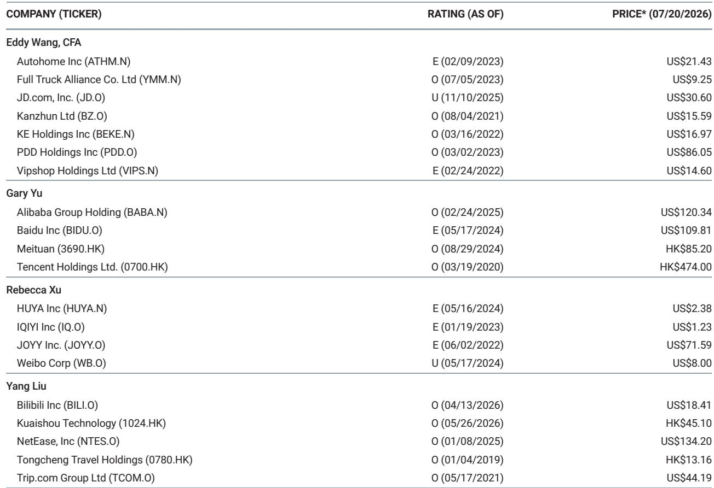
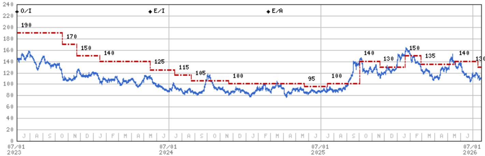
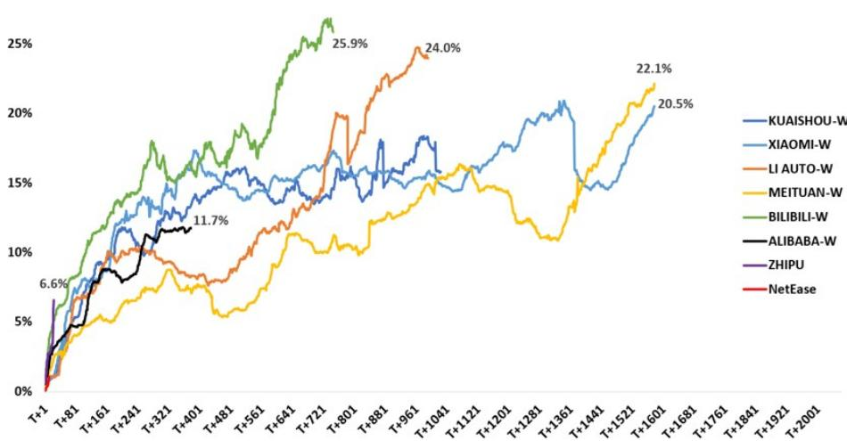

# 百度双重主要上市：流动性催化剂，而非基本面转折

百度已提交申请，将其香港二次上市转换为双重主要上市。这一结构性举措为纳入港股通打开了大门，预计在最初6至12个月内将带来约30亿至68亿美元的增量资金流入。这些流入资金预计将在一年内使南向资金持股比例达到约7%至15%。但这是一次流动性事件，而非业务转折。公司核心广告收入仍面临挑战，而不断上升的人工智能投资成本正在挤压2026年下半年的营业利润。

时机至关重要。根据现行港交所规则，具有加权投票权结构的公司若在2026年9月3日前完成主要上市转换，将有资格于9月7日纳入港股通。若错过截止日期，下一个窗口期将开放至2027年3月8日。历史先例表明，具有WVR结构的公司在公告后大约需要两到六个月完成主要上市转换。对于已完成前期准备工作的公司，时间线可压缩至一到一个月半。百度的申请使其有望赶上2026年9月的纳入日期。

这是继非核心资产分拆和股息之后的一系列催化剂中的第二个。市场一直关注这些资产出售。但主要上市转换以更持久的方式改变了股东基础。它解锁了一个新的资金池，该资金池在结构上不同于已经交易百度美国上市ADR的全球基金。来自内地读者的南向资金往往具有前置性和持续性，而非机会主义。对于一只过去52周交易区间在84.64美元至165.30美元之间、收盘价为109.81美元的股票而言，增量需求可能在短期内提供有意义的报价支撑。

然而，基本面情况则有所不同。百度的核心广告业务显示出有限的复苏迹象。核心营业利润面临下半年人工智能投资增加带来的下行风险。该公司正在大力投资其文心大模型及相关基础设施，这些成本恰好在收入增长乏力时对利润率造成压力。矛盾显而易见：该股票受益于事件驱动的催化剂，但基础盈利轨迹在收入稳定之前仍然疲弱。

## 主要上市转换时间表紧张但可行，2026年9月窗口是关键转折点

百度必须在9月3日前完成转换，才有资格在9月7日纳入。这距离7月下旬的公告日期大约有六周时间。历史案例显示，像哔哩哔哩和中通快递这样的WVR公司分别耗时6.7个月和5.5个月，但这些时间线包括了在未做准备的情况下宣布的公司。另一家WVR公司宝尊电商在2.3个月内完成了转换。已完成前期准备工作的公司可以在一个月到一个半月内完成。9月的窗口期虽然紧张，但现实可行，尤其是考虑到百度的申请表明它已就相关要求与交易所进行了沟通。

错过9月的窗口期将使纳入推迟到2027年3月，延迟六个月。这将推迟流动性事件，并消除该股票一个关键的短期支撑。机会成本是显著的：南向资金通常具有前置性，六个月的延迟意味着该股票将错过一个市场情绪已经脆弱的时期。因此，按时完成的压力不仅是程序性的，也是战略性的。

## 这种规模的南向资金流入历史上曾改变可比科技公司的所有权结构

预计的30亿至68亿美元流入并非推测。它基于对市值在400亿至450亿美元区间公司的观察模式。百度目前的市值约为376亿美元，正好处于该区间。对于主要恒生科技指数成分股，南向资金持股比例已达到20%至30%。在12个月内实现7%至15%的持股比例增长，将使百度成为南向资金持有比例较高的公司之一。

机制很重要。南向资金通过港股通流入，该渠道允许内地读者交易香港上市股票。这些读者往往比全球对冲基金持有期更长、换手率更低。他们也倾向于青睐他们熟悉的公司，而百度在中国是一个知名品牌。资金流入不仅仅是一个数量事件；它改变了边际买家。当边际买家从全球套利者转变为内地长线基金时，股票的波动特征和估值支撑可能会发生显著变化。

但有一个问题。资金流入取决于百度是否被纳入港股通合格名单。这要求主要上市在截止日期前生效。如果转换延迟，整个预计的资金流入将转移到下一个窗口期。除非读者对转换速度有高度信心，否则不能假设资金会在9月的时间线上实现。

## 非核心资产分拆提供短期价格支撑，但并未解决核心业务的结构性问题

百度非核心资产变现策略一直是市场关注的主要焦点。该公司已宣布计划分拆或派发某些资产，这些举措为该股票提供了底部支撑。通过股息和回购，每年总计10亿至15亿美元的现金回报，相当于2%至3%的回报表现，进一步增加了支撑。资产出售、股息和主要上市转换的组合创造了一个多层次的催化剂堆叠，应能防止该股票在短期内大幅下跌。

然而，这些都属于财务工程操作。它们并未改变百度核心搜索广告业务面临结构性挑战的事实。来自短视频平台和人工智能驱动的搜索替代方案的竞争正在加剧。流量获取成本正在上升。该公司的人工智能投资，虽然在战略上是必要的，但在短期至中期内对利润率构成拖累。核心营业利润面临压力，收入轨迹不支持仅基于基本面的估值重估。

催化剂驱动的价格支撑与疲弱的基础盈利之间的分歧创造了一种不寻常的风险特征。在正常情况下，基本面恶化的股票会下跌。但百度正受到事件驱动需求的支撑，这种需求在很大程度上独立于其运营表现。这意味着该股票可能会在一个狭窄的区间内交易，直到催化剂耗尽，然后如果核心业务未能稳定，将面临新的压力。

## 读者的决策框架：区分流动性催化剂与基本面催化剂

对于在此节点评估百度的读者而言，关键的分析任务是区分流动性故事与盈利故事。主要上市转换和纳入港股通是流动性催化剂。它们增加了来自新读者群体的股票需求，但并未改变公司的收入增长、利润率结构或竞争地位。非核心资产分拆和股息是资本配置催化剂。它们向股东返还现金并释放子公司的价值，但并未解决核心广告业务的问题。

基本面催化剂则不同。它们包括广告支出的复苏、人工智能产品的成功变现以及通过成本纪律实现的利润率扩张。这些在近期展望中均不可见。报告指出，核心广告显示出有限的复苏，人工智能投资将在2026年下半年对营业利润造成压力。计划于第四季度进行的文心大模型升级可能是一个催化剂，但评估其收入影响还为时过早。

因此，读者应问三个问题。第一，百度在9月3日前完成主要上市转换的概率是多少？历史先例表明，如果前期准备工作已完成，概率很高，但时间线很紧。第二，预计的南向资金流入有多少已被定价？如果该股票在公告后已经上涨，实际纳入的边际影响可能较小。第三，如果核心业务未能复苏，退出策略是什么？该股票可能会在流动性催化剂推动下表现良好六到十二个月，但如果没有基本面改善，中期风险是该股票将回归到反映其盈利轨迹而非事件日历的估值水平。

## 流动性窗口创造了战术性机会，但中期风险是该股票将回归盈利现实

最可能的情景是百度按时完成主要上市转换，在9月触发纳入港股通，并在接下来的一年内受益于30亿至68亿美元的资金流入。该股票应获得这些资金流入、非核心资产分拆以及股息计划的支持。对于一只基于共识预期以个位数远期市盈率交易的股票而言，这种支撑是有意义的。

但基本面的挑战并未消失。核心广告业务处于低增长或无增长阶段。人工智能投资正在消耗现金流。竞争格局正在发生变化。该股票的中期轨迹取决于公司能否稳定其核心收入，并证明其人工智能投资将产生回报。在此之前，该股票是一个催化剂驱动的名称，而市场对没有数字支撑的叙事越来越持怀疑态度。

主要上市转换是一个真实且积极的发展。它解锁了新的需求来源，并减少了该股票对美国上市ADR流动性的依赖。但它并非公司战略挑战的解决方案。读者应将其视为一个具有明确时间范围的战术性机会，而非改变其对业务长期看法的理由。

*仅供参考。部分内容可能基于源材料通过人工智能辅助生成、翻译、总结或编辑，可能存在遗漏或错误。请独立核实。这不构成专业建议。*

仅供参考。部分内容可能基于源材料通过人工智能辅助生成、翻译、总结或编辑，可能存在遗漏或错误。请独立核实。这不构成专业建议。

