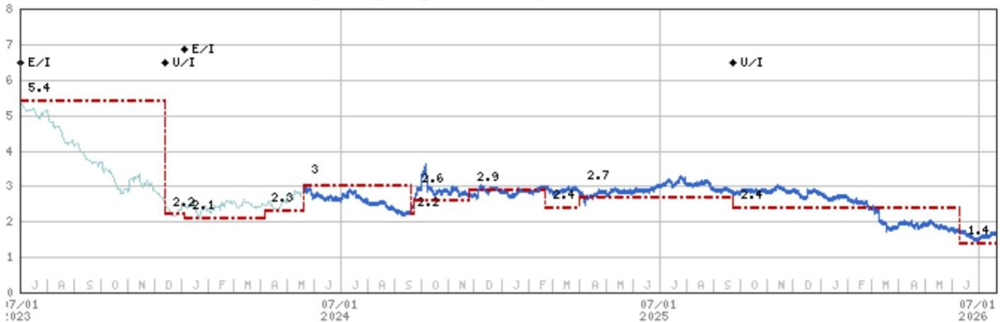
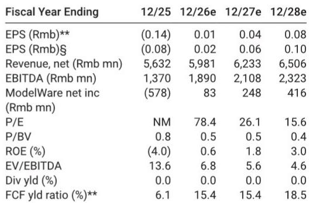
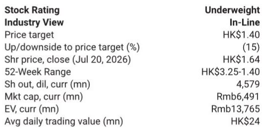

# 北京首都国际机场的微薄利润背后：非国内航线难以支撑价值重估

北京首都国际机场（BCIA）公布2026年上半年初步净利润为人民币1000万至2000万元，这意味着第二季度净利润仅为人民币100万至1100万元。相较于第一季度900万元的利润略有改善，并较去年同期3900万元的净亏损有所恢复。公司将此归因于非国内航线的增长。但数据揭示了更值得关注的情况：第二季度总客运量环比下降4%，同比基本持平，尽管公司勉强实现盈利。全球能源价格波动推高了机票价格并抑制了出行需求，这正在压缩BCIA实现可观回报所需的客流量。

表面的利润数字并非观察者应关注的重点。真正的问题是，尽管有非国内航线复苏的支撑，BCIA仅产生微薄利润，且这一利润不足以支撑当前估值。该公司的报价反映了这一情况。基于报告观点和行业中性看法，研究认为风险回报比并不有利。对于观察者而言，问题不在于BCIA能否保持盈利，而在于它能否产生足以支持价值重估的盈利轨迹。

根据现有证据，答案是否定的。BCIA面临的结构性挑战并非周期性。它们源于大兴国际机场启用后北京航空格局的永久性变化、来自这一竞争枢纽的持续客流量分流，以及已重新谈判下调的免税合同环境中的定价能力受限。第二季度业绩证实，即使非国内航线复苏，盈利杠杆也过低，无法产生当前报价所需的回报。这不是一个反转故事，而是一个低利润均衡状态。

## 第二季度利润在客流量疲软下实现，证实成本控制而非收入增长驱动了结果

初步业绩中最具启示性的数据点是，BCIA在2026年第二季度仍保持盈利，尽管总客运量环比下降4%，同比基本持平。在正常情况下，一个固定成本高、运营杠杆显著的机场，当客流量下降时盈利能力会恶化。BCIA能够勉强盈利表明，改善来自成本纪律或向高利润非国内旅客的结构性转变，而非广泛的需求复苏。

收入情况并不乐观。2026年全年收入估计为人民币59.81亿元，仅比2025年的56.32亿元增长6%。EBITDA预计为18.9亿元，EBITDA利润率约为31.6%，高于2025年的24.3%。这一利润率改善是真实的，但来自较低基数且并未加速。轨迹比水平更重要：隐含的第二季度EBITDA运行率表明，公司仍远低于疫情前的利润率结构，而能源驱动的机票通胀和国内需求疲软在短期内不太可能缓解。

结论很明确：第二季度报告的利润是紧缩的结果，而非扩张。那些将亏损转为利润视为持续盈利复苏开始的观察者可能会失望。公司未能产生足够的收入增长来覆盖其固定成本基础，以实现支撑当前股权估值的回报水平。在客流量增长以有意义的方式恢复之前，盈利底线将保持低位。

## 非国内航线是相对少见增长引擎，且不足以抵消国内疲软

BCIA明确将其同比盈利改善归因于非国内航线的增长。这与整个中国航空业的广泛模式一致，即国际旅行恢复速度慢于国内，但正在逐步改善。然而，数据显示这一恢复速度不足以改变整体盈利能力。

研究报告显示，2026年第二季度总客运量同比持平。如果非国内航线在增长，那么国内航线必然在下降。这是一个值得关注的动态。国内旅客通常产生较低的航空收入，且对免税消费等商业活动价值较低。一个依赖国际旅客来弥补国内基础萎缩的机场，在结构上容易受到任何冲击长途旅行因素的影响，包括燃料价格飙升、地缘政治紧张或签证政策变化。

全球能源价格波动已经产生了影响。更高的航空燃油成本被转嫁到机票价格上，这抑制了价格敏感的休闲需求，尤其是在竞争激烈的国内航线上。BCIA的国内航线受到双重挤压：大兴机场继续分流北京地区的旅客，而更高的票价减少了总可寻址市场。非国内航线虽然在增长，但增长不够快以填补缺口。结果是收入基础几乎未扩张，而成本仍然居高不下。

## 估值隐含的复苏是盈利轨迹无法支撑的

当前报价为每股1.64港元，基于2026年每股收益0.01元人民币的预估，远期市盈率约为78倍。即使使用每股0.02元人民币的共识预估，市盈率也超过60倍。对于一家2026年净资产回报表现为0.6%、预计到2028年仅为3.0%的公司来说，这些倍数在没有盈利大幅加速的情况下是不可持续的。

现金流折现估值使用了特定的加权平均资本成本。这一WACC反映了资本密集型基础设施资产的风险特征，其定价能力有限且面临来自大兴的显著竞争压力。终期增长率较为温和，反映了北京双机场结构对BCIA长期增长潜力的限制。

乐观情景（假设国际航线恢复快于预期且来自大兴的分流低于预期）仅被赋予15%的概率。悲观情景（假设运营成本更高且免税合同条款更差）也获得15%的权重。基准情景（70%的概率）是当前趋势持续：国际恢复缓慢、国内持续侵蚀以及免税贡献温和。该基准情景产生1.40港元的估值，意味着较当前报价有15%的下行空间。

对BCIA持乐观态度的观察者必须相信乐观情景比研究显示的更可能。但第二季度业绩并不支持这一观点。利润太薄，客流量趋势太弱，宏观环境也不利。报价正在定价一个基本面尚未实现的复苏。

## 观察者的决策框架：重新考虑BCIA前需满足三个条件

对于当前持有或考虑BCIA头寸的观察者，证据指向一组明确的条件，在这些条件满足之前，风险回报比才会变得有吸引力。这些条件不是预测，而是表明盈利轨迹真正变化的门槛。

首先，总客运量必须显示持续的环比增长。单季度同比持平是不够的。观察者应寻找至少连续两个季度总旅客数同比显著超过前一年水平，理想情况下为5%或更多。这将表明国内稳定与国际恢复的结合正在获得真正动力，而非被大兴分流所抵消。

其次，EBITDA利润率必须扩大到35%以上。当前31.6%的利润率较2025年的24.3%有所改善，但仍低于产生高于股权成本的净资产回报表现所需的水平。一个具有BCIA固定成本结构的机场在正常需求环境下应能实现40%或更高的利润率。如果即使在客流量恢复时利润率也无法达到这一水平，则表明来自大兴的竞争压力已永久性地削弱了定价能力。

第三，免税合同必须以改善每位国际旅客收入的条件重新谈判。当前合同是在机场议价能力较弱的时期签署的，条款被广泛认为不利。免税经济的任何改善都将直接提升商业收入，而无需额外资本支出。在此之前，BCIA的非航空收入将继续拖累整体盈利能力。

如果这三个条件在未来两到四个季度内未能满足，当前估值将被证明过高。观察者不应将微薄利润与反转混淆。第二季度业绩提醒我们，BCIA处于低利润均衡状态，而非复苏。

*仅供参考。部分内容可能基于源材料通过AI辅助生成、翻译、总结或编辑，可能包含遗漏或错误。请独立核实。这不构成专业建议。*

仅供参考。部分内容可能基于源材料通过AI辅助生成、翻译、总结或编辑，可能包含遗漏或错误。请独立核实。这不构成专业建议。

