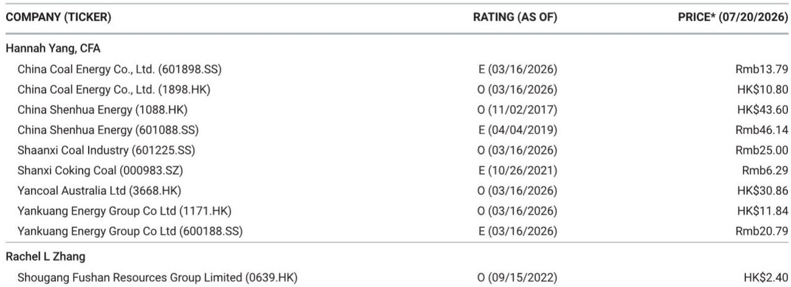
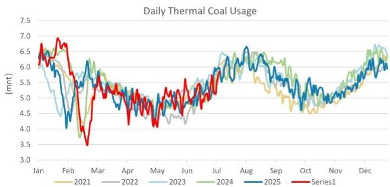
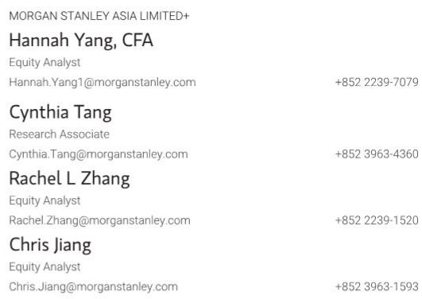

# MS：中国煤炭周报，动力煤价格因夏季高温需求预期反弹

截至7月17日当周，中国国内动力煤市场出现一轮价格反弹，产地和北方港口报价同步走高。MS在最新一期煤炭周报中记录了这一变化：CCI 5500大卡指数周环比上涨2.6%至每吨821元，山西大同5800大卡坑口价上涨3.7%至每吨708元。同期，秦皇岛港5500大卡价格微涨0.1%至每吨722元，而国际纽卡斯尔港报价持平。

这一价格走势的背景是夏季高温天气范围扩大，推动火电发电量加速上升。报告援引煤炭行业数据平台Sxcoal的信息指出，华东等地区已开始出现电厂和非电力工业用户（包括冶金和化工企业）的适度补库需求。与此同时，发运到港的成本倒挂幅度扩大，叠加产地安全监察下的持续减产，对价格形成了额外支撑。

> **KC观察：** 报告中的价格分化值得留意。CCI指数周涨幅2.6%明显高于秦皇岛港现货的0.1%，说明产地端涨价动力更强，港口库存并未同步收紧——秦皇岛港库存周环比持平于680万吨。这种产地与港口之间的价差结构，暗示当前价格上涨更多由供给调整预期驱动，而非终端需求的全面回暖。

## 1. 焦煤价格延续节奏变化，与动力煤走势分化

与动力煤的反弹形成对比，国内焦煤价格继续走弱。柳林4号主焦煤坑口价周环比下跌1.7%至每吨850元，而澳大利亚昆士兰硬焦煤价格下跌2.1%至每吨233美元。报告显示，焦煤的铁路交货价（FOR）周环比持平于每吨2010元，但整体趋势仍偏弱。

这一分化反映了两种煤种下游需求的差异。动力煤受益于季节性电力负荷上升，而焦煤主要面向钢铁行业，后者当前面临产能调控和需求变化的多重不确定性。报告未对焦煤后续走势做出明确判断，但价格数据本身已显示出两个子市场的基本面差异。

## 2. 海运煤价格平稳，中国进口成本优势收窄

国际海运煤市场本周表现平稳，纽卡斯尔港动力煤价格维持在每吨130美元。报告数据显示，2025年至今该价格累计上涨19.3%，平均为每吨128美元，较2025年全年均价预测的106.6美元高出约20%。这意味着中国进口煤的成本优势正在收窄。

对于依赖进口煤的沿海电厂而言，这一变化可能影响其采购策略。当国内煤价反弹而进口煤价持平时，进口煤的相对性价比会阶段性改善。但报告同时指出，产地到港的成本倒挂仍在持续，这会抑制贸易商的发运意愿，从而限制港口现货的供应弹性。

## 3. 一个可复用的观察框架：价格信号的三层验证

对于跟踪煤炭市场的读者，这份报告提供了一个简洁的观察框架。第一层看产地价格：坑口价的变化最能反映供给端的真实状况，因为它受港口库存和贸易商行为的干扰较小。第二层看港口价格与库存的组合：如果港口价格上涨但库存同步上升，说明需求并未真正走强；如果价格上涨而库存下降或持平，则供需关系更可能偏紧。第三层看海运煤价格：国际价格的变化会影响进口煤的到岸成本，进而改变沿海市场的竞争格局。

当前的数据组合是：产地价格上涨、港口库存持平、海运煤价格稳定。这组信号指向一个短期供需偏紧但尚未形成趋势性缺口的市场状态。后续需要关注的是高温天气的持续时间和范围，以及产地安全监察是否会进一步收紧。

For informational purposes only. Portions may be generated,translated,summarized,or edited with AI assistance based on source materials and may contain omissions or errors. Please verify independently. This is not investment,legal,tax,accounting,or other professional advice.

