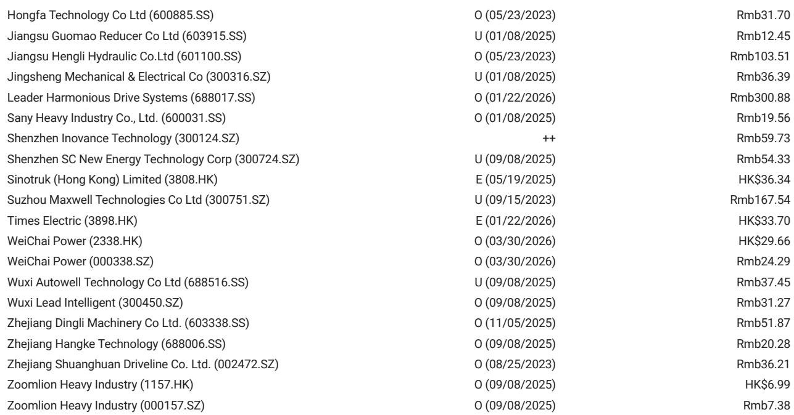
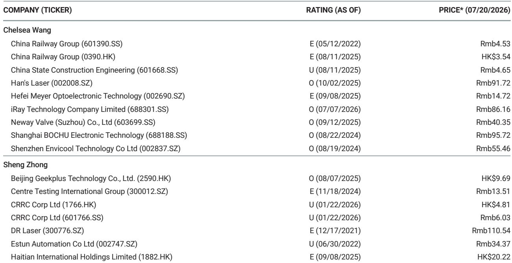

# MS：中国工业-WAIC2026物理AI迭代

2026 年世界人工智能大会（WAIC）在上海落下帷幕。MS在最新发布的研究中指出，这场汇聚超过 1000 家参展商的大会，最突出的信号是物理 AI——涵盖工业 AI 解决方案、人形机器人与机器人技术、以及新型 AI 硬件——正在快速迭代，并开始对工业资本开支产生实质性拉动。

报告认为，这并非概念展示，而是从数据采集、设备升级到商业模式转换的链条正在逐步打通。机器人/智能硬件成为最拥挤的赛道，占参展企业数量的 24%，其次是计算、芯片与基础设施（20%），以及行业 AI 应用（13%）。数据来源显示，这一分布结构本身反映了产业重心从纯软件向“具身化”迁移的趋势。

## 1. 工业 AI 从监控走向工程自动化，订阅模式初现

工业 AI 正在从概念阶段进入可部署的智能体系统。报告观察到，当前这些系统主要集中于运营监控与决策支持，但已开始向工程自动化扩展。例如，西门子的 Eigen Engineering 智能体，基于其庞大的安装数据库训练，能够理解自然语言并自主支持 PLM 和 HMI 编程，让工程师专注于更复杂的任务。另一案例是 Microintelligence 的 AI 辅助检测系统，利用 AI 规划搭载摄像头的机械臂运动路径，从多角度完成质检，新用例部署时间已缩短至一个月以内。

一个关键约束是设备互联互通问题。报告指出，中国大量存量工业设备的联网能力和跨设备互操作性有限，AI 部署所需的数据层无法直接获取。客户设备必须先完成数字化或升级，才能为模型训练提供足够数据。随着智能体 AI 解决方案在多个行业展现出可衡量的价值，这一需求有望推动设备升级，进而支撑更长的工业资本开支周期。

> **KC评论：** 工业 AI 的商业化路径正在从一次性项目费转向年度订阅。硬件销售叠加持续的后训练模型（即持续的 token 消耗），为订阅定价提供了自然基础。虽然转型仍处早期，但服务收入占比的提升方向已经明确。

## 2. 人形机器人进入部署年，数据瓶颈催生新基础设施

2026 年被行业普遍视为人形机器人的真实部署之年。报告显示，主流应用场景集中在工业取放任务，包括物料与箱子搬运、物流分拣和巡检。市场仍高度碎片化，泛化能力有限，部署过程依赖大量工程师，不同集成商服务不同客户。与此同时，新的应用探索仍在继续，例如 Tars 人形机器人在线束装配线、Psibot 在 CPO 制造线的插件与真空封装环节的应用。

数据被反复强调为关键瓶颈。报告指出，数据量、多样性和质量对模型泛化同样重要。行业正在转向不直接使用人形机器人采集训练数据的方法，包括第一人称视频和通用操作接口（UMI）解决方案。这催生了一批“数据基础设施”公司，提供外包数据采集服务。报告判断，这些初创公司服务趋同，差异化有限，数据价格可能快速下降。相比之下，集成商和模型公司的专有数据管线——包括标注、复杂动作分解、上下文分析和数据质量评级——正变得更具战略价值。

## 3. 大型科技公司入场，视觉触觉传感与世界模型成为技术焦点

大型科技公司正在围绕具身智能布局。蚂蚁集团最为活跃，其子公司 Robbyant 推出了覆盖视觉-语言-动作（VLA）、视觉-动作（VA）和世界模型的完整模型组合，支持 20 余种机器人硬件平台，并积极从数据基础设施初创公司获取外部数据以丰富训练集。京东通过 JoyInside 及其组合观察公司、腾讯通过与 Dobot 合作及内部研发、甚至大模型初创公司 StepFun 通过与 Dexmal 合作，都在进入这一领域。报告认为，当前这些公司主要处于前沿研究或早期生态建设阶段，但一旦技术路径开始收敛，资金充裕的科技公司可能更激进地进入，聚焦于“大脑/能力层”。

世界模型是 WAIC 上的主要技术主题，多数领先企业声称已开发出专有世界模型或世界-动作模型。但报告通过与销售和技术人员的交流发现，VLA 模型结合强化学习仍是当前更务实的部署路径。世界模型可能在零样本任务中展现更好的泛化能力，但 VLA 结合真实世界后训练/强化学习在特定任务上表现更优。混合路径可能持续，直到行业积累足够数据实现世界模型的泛化突破。

视觉触觉传感是另一个新兴方向。多家初创公司采用类似技术路径：利用摄像头捕捉嵌入指尖的凝胶或硅胶垫的形变，理论上可实现更高分辨率和多模态信号捕获，同时借助计算机视觉的既有进展。但成本仍高，耐久性、尺寸和与现有算法的互操作性等障碍尚未解决。初期应用集中在高端灵巧手上。

报告最后指出，物理 AI 正在渗透日常生活，从纯软件走向具身化。WAIC 上涌现的智能硬件——包括阿里巴巴通义千问和科大讯飞的 AI 眼镜、AI 宠物/桌面陪伴设备——标志着这一进程的早期阶段：先构建感知层/具身化，再推进执行层。

For informational purposes only. Portions may be generated,translated,summarized,or edited with AI assistance based on source materials and may contain omissions or errors. Please verify independently. This is not investment,legal,tax,accounting,or other professional advice.

