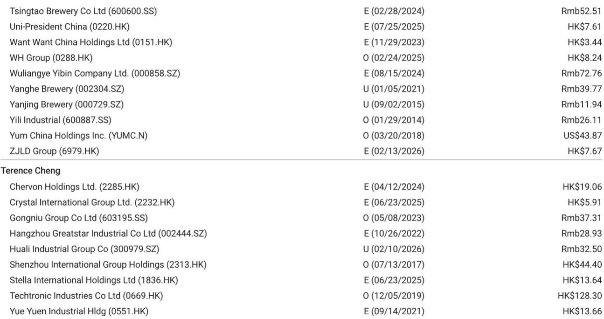
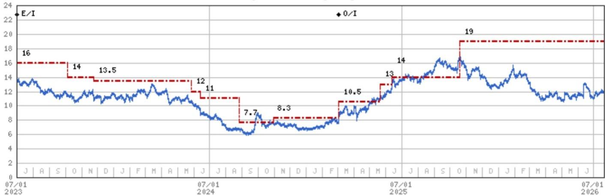
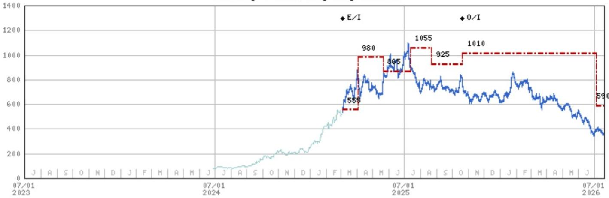

# 黄金珠宝需求并非一致：六月数据揭示按克计价与固定溢价模式的结构性分化

2026年6月，中国黄金珠宝市场呈现出一个值得关注的分化信号。六福珠宝第二季度中国内地同店销售增长率为16%，相较于4月1日至6月21日期间超过20%的增速有所放缓。与此同时，固定溢价黄金产品——这一利润率较高、注重设计的品类——在重点商场的同比表现出现改善，扭转了此前数月的收缩态势。市场并非简单的“回暖”或“降温”，而是在发生结构性分化。

这种分化之所以重要，是因为它重新定义了国内珠宝行业两种主流模式的观察逻辑。周大福以按克计价黄金为主，在下沉市场有较广布局，在金价稳定在每盎司约4000美元附近、人民币走强的环境下具备一定优势。而老铺黄金的固定溢价产品需求在经历第二季度疲软后出现环比回升，但第三季度的可见度仍然较低，其报价已包含较多谨慎预期。问题不在于黄金珠宝需求是否健康——答案是选择性的——而在于哪种商业模式在当前宏观环境与价格体系下更具结构性增长潜力。

六月数据带来的核心观察是：按克计价黄金需求依然稳健但动能减弱，而固定溢价需求正从低位开始回升。值得关注的是那些既能把握金价稳定环境下按克计价量的稳定性，又能捕捉溢价品类复苏弹性的运营商，同时对于纯溢价模式的公司，在第三季度可见度改善前需保持审慎。

## 按克计价黄金同店销售增长保持健康但环比放缓，显示金价上涨对需求的支撑效应正在减弱

六福珠宝的六月数据为更广泛的按克计价黄金市场提供了清晰的参考。在第二季度初期增速超过20%后，该公司中国内地同店销售增长率在4月至6月完整期间放缓至16%。这并非下滑，但确实是一个需要解读的明显减速。此前的强劲表现源于金价稳定与消费者对进一步涨价的担忧——典型的“担心涨价而提前购买”心理。随着金价稳定在每盎司约4000美元，远低于许多运营商此前规划的4300美元水平，购买紧迫感有所减弱。

对于周大福而言，其将在7月下旬公布2027财年第一季度运营数据，预计中国内地同店销售增长率可能与4月至5月约20%的趋势大致相当。这是一个稳健的数字，但代表的是平台期而非加速。公司不太可能在简报会上调整全年指引，因为该指引公布不到一个月，管理层希望在调整前观察更多数据。

战略层面的启示是，按克计价黄金需求现在更多取决于稳定性而非动能。金价稳定在每盎司约4000美元对销量有支撑作用，尤其是在价格敏感度更高、产品保值功能更突出的下沉市场。但金价上涨带来的顺风已经消退。对周大福而言，这意味着同店销售增长将需要来自真实的消费需求而非提前购买，利润率提升将依赖成本控制和产品组合优化，而非金价波动带来的收益。

## 固定溢价黄金需求从第二季度低位回升，但复苏范围仍较窄，尚不足以确认趋势

六月数据中最积极的信号来自固定溢价品类，包括利润率较高、注重设计、按固定价格而非重量销售的产品。在经历第二季度疲软后，该品类在六月出现同比改善，全球投行房地产分析师追踪的重点商场中，中国黄金珠宝销售降幅有所收窄。这一环比改善意义重大，因为固定溢价产品此前持续承压，消费者在金价上涨环境下转向按克计价黄金以获取更好的感知价值。

对于定位为纯固定溢价运营商的老铺黄金而言，这一回升令人鼓舞但尚不具决定性。公司第二季度趋势偏弱，虽然环比改善确实存在，但第三季度仍是一个未知数。管理层将在8月下旬的中期业绩简报会上提供更多信息，届时市场将关注7月和8月的销售趋势、任何战略调整以及分红政策变化。风险在于，六月的改善可能由单一促销活动或消费者情绪的暂时转变驱动，未必能持续。

老铺面临的结构性问题在于，在消费者日益注重性价比的宏观环境下，其高端定位能否维持需求。公司估值已包含较多悲观预期，报价约为2026年预估收益的11倍，隐含PEG比率约0.35倍——低于消费类公司平均水平。报告认为，考虑到金价波动和宏观环境变化，这一折价是合理的，但也意味着第三季度数据的任何积极惊喜都可能带来显著的估值重估。反之亦然。

## 香港和澳门需求保持结构性亮点，为内地市场变化提供多元化对冲

在中国内地市场信号复杂的同时，主要珠宝商的香港和澳门业务表现强劲。六福珠宝第二季度香港和澳门同店销售增长率为41%，与4月至6月趋势一致，显示跨境旅游消费和本地需求依然旺盛。对于周大福而言，其收入中有相当比例来自这些市场，预计第一财季香港和澳门同店销售增长率约为41%，与4月至5月运行节奏相符。

这一强劲表现并非仅源于低基数效应。它反映了内地游客赴香港和澳门进行可选消费的真实需求，以及本地消费的韧性。近期人民币升值对周大福构成额外利好，因为该公司以港元报告业绩，人民币走强会提升其内地收入的折算价值。对于评估这两家公司的观察者而言，这种地域多元化是一个关键区分因素。周大福既受益于稳定的内地按克计价业务，也受益于蓬勃发展的香港和澳门业务，而老铺的布局则更集中于内地溢价品类，执行风险相对更高。

## 观察框架：从金价环境、产品组合和地域布局三个维度评估各公司

六月数据为观察国内珠宝公司提供了一个简单但有效的框架。未来六至十二个月决定相对表现的三项变量是：金价环境、各公司的产品组合以及地域布局。

关于金价环境，金价稳定在每盎司约4000美元附近有利于按克计价销量，但不会带来库存增值的利润率提升。如果金价再次上涨至每盎司4300美元或以上，按克计价运营商将从销量和利润率两方面受益，而固定溢价公司则将面临消费者转向按克计价产品的压力。如果金价大幅下跌，按克计价需求将因消费者推迟购买而受损，溢价运营商则将面临销量下降和利润率压缩的双重挑战。

关于产品组合，周大福以按克计价为主的业务在金价稳定或上涨环境下具有结构性优势，而老铺的固定溢价定位提供更高利润率但销量可见度较低。近期溢价需求的环比改善是积极信号，但尚未形成趋势。

关于地域布局，周大福在香港和澳门的重要业务提供了老铺所缺乏的多元化优势。这些市场41%的同店销售增长率是对中国内地任何放缓的有力对冲，而人民币升值带来的财务利好是纯内地运营商所不具备的。

基于这一框架，报告对周大福的观察似乎合理，其结合了稳定的按克计价销量、地域多元化以及约18倍远期收益的估值——略高于历史平均水平，但得到2025至2027财年每股收益预计30%复合年增长率的支撑。对于老铺，报告观点反映了第二季度疲软趋势已被定价的预期，但该报价仍是对尚未确认的溢价复苏的较高信心押注。风险承受能力较低的观察者可等待八月中期业绩后再做判断。

六月数据并未终结按克计价与固定溢价模式之间的讨论，而是重新定义了讨论框架。市场并非单向运行，而是在根据各公司商业模式与当前金价环境、产品组合动态和地域布局的匹配程度进行筛选。将六月数据视为单一数据点而非结构性信号的观察者，可能会错过定义本轮周期下一阶段的分化趋势。

*仅供参考。部分内容可能基于源材料通过AI辅助生成、翻译、总结或编辑，可能存在遗漏或错误。请独立核实。本文不构成专业建议。*

仅供参考。部分内容可能基于源材料通过AI辅助生成、翻译、总结或编辑，可能存在遗漏或错误。请独立核实。本文不构成专业建议。

