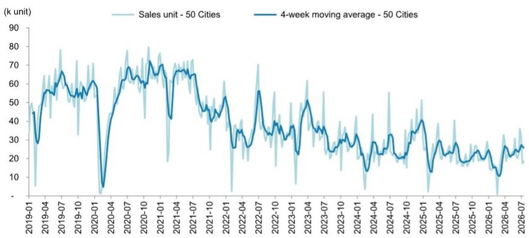

# 中国房地产 | 亚太市场

## 每周数据追踪 #29

## 核心要点

■ 当周新房登记成交量同比增长3%。

■ 当周二手房登记成交量同比增长6%。

■ 上周整体去化率为26%。

截至7月19日当周，50城新房登记成交量同比增长3%（前一周为同比增长1%），年初至今累计成交量同比下降11%：一线城市成交量同比下降24%（前一周为同比增长40%）。二线城市成交量同比增长14%（前一周为同比增长0%）。三线城市成交量同比增长2%（前一周为同比下降18%）。

截至7月19日当周，10城二手房登记成交量同比增长6%（前一周为同比下降3%），年初至今累计成交量同比增长4%：一线城市当周二手房成交量同比增长9%（前一周为同比增长6%）。二线城市当周二手房成交量同比增长5%（前一周为同比下降9%）。

整体去化率为26%（前一周为95%）：一线城市因远郊项目影响，去化率为4%（前一周为90%）。二线城市去化率为48%（前一周为100%）。

中原六城二手房挂牌价格跟踪指数为16.5%（前一周为16.3%），一线城市中介指数为52.8（前一周为51.8）。

图表1：新房周度成交量及四周移动平均——50城合计  
  
来源：CREIS，MS。

MS 亚洲有限公司+

Stephen Cheung, CFA

股票研究分析师

Stephen.Cheung@morganstanley.com

+852 3963-0385

Cara Zhu  
股票研究分析师  
Cara.Zhu@morganstanley.com +852 2848-7117

亚洲暑期学校 2026

## 中国房地产

亚太市场

行业观点

中性

MS 与其所覆盖的公司有业务往来。因此，读者应注意，该公司可能存在影响 MS 客观性的利益冲突。读者应将 MS 视为其决策的单一因素之一。

分析师认证及其他重要披露信息，请参阅本报告末尾的披露部分。

+= 受雇于非美国关联公司的分析师未在 FINRA 注册，可能不是该会员的关联人士，并且可能不受 FINRA 关于与标的公司沟通、公开露面以及交易研究分析师账户持有证券的限制。

## 披露部分

MS 中的信息和观点由 MS 亚洲有限公司（对其内容负责）和/或 MS 亚洲（新加坡）私人有限公司（注册号 199206298Z）和/或 MS 亚洲（新加坡）证券私人有限公司（注册号 200008434H，受新加坡金融管理局监管，对其内容承担法律责任，如有任何问题应联系该公司）和/或 MS 台湾有限公司和/或 MS & Co. International plc 首尔分行和/或 MS 澳大利亚有限公司（ABN 67 003 734 576，持有澳大利亚金融服务牌照号 233742，对其内容负责）和/或 MS 财富管理澳大利亚私人有限公司（ABN 19 009 145 555，持有澳大利亚金融服务牌照号 240813，对其内容负责）和/或 MS 印度私人有限公司（公司识别号 CIN U22990MH1998PTC115305，受印度证券交易委员会 SEBI 监管，持有研究分析师牌照 SEBI 注册号 INH000001105；股票经纪商 SEBI 注册号 INZ000244438；商人银行家 SEBI 注册号 INM000011203；以及国家证券存管有限公司存管参与者 SEBI 注册号 IN-DP-NSDL-567-2021，注册办公地址为 Altimus, Level 39 & 40, Pandurang Budhkar Marg, Worli, Mumbai 400018, India；电话 +91-22-61181000；合规官详情：Tejarshi Hardas 先生，电话 +91-22-61181000 或电邮 tejarshi.hardas@morganstanley.com；投诉官详情：Tejarshi Hardas 先生，电话 +91-22-61181000 或电邮 msic-compliance@morganstanley.com）及其关联公司（统称“MS”）编制或传播。MS 印度私人有限公司 (MSICPL) 可能在提供研究服务时使用人工智能工具。本文中的所有建议均由合格的研究分析师做出。

有关本报告所涉及公司的重要披露、股价图表和股票评级历史，请访问 MS 披露网站 www.morganstanley.com/eqr/disclosures/webapp/generalresearch，或联系您的投资代表或 MS，地址：1585 Broadway, (Attention: Research Management), New York, NY, 10036 USA。

有关本研究报告中所提及的任何建议、评级或目标价相关的估值方法和风险，请联系客户支持团队：美国/加拿大 +1 800 303-2495；香港 +852 2848-5999；拉丁美洲 +1 718 754-5444（美国）；伦敦 +44 (0)20-7425-8169；新加坡 +65 6834-6860；悉尼 +61 (0)2-9770-1505；东京 +81 (0)3-6836-9000。或者，您也可以联系您的投资代表或 MS，地址：1585 Broadway, (Attention: Research Management), New York, NY 10036 USA。

## 分析师认证

以下分析师特此证明，他们对本报告中所讨论的公司及其证券的看法准确表达，并且他们没有也不会因表达本报告中的具体建议或观点而直接或间接获得报酬：Stephen Cheung, CFA；Cara Zhu。

## 全球研究冲突管理政策

MS 已根据我们的冲突管理政策发布，该政策可在 www.morganstanley.com/institutional/research/conflictpolicies 获取。该政策的葡萄牙语版本可在 www.morganstanley.com.br 找到。

## 关于标的公司的重要监管披露

在未来3个月内，MS 预计将或意图寻求从中国金茂控股集团有限公司、中国海外发展有限公司、华润置地有限公司、万科企业股份有限公司、龙湖集团控股有限公司、越秀地产股份有限公司获得投资银行服务报酬。

在过去12个月内，MS 已从中国金茂控股集团有限公司、绿城中国控股有限公司、龙湖集团控股有限公司获得投资银行服务以外的产品和服务报酬。

在过去12个月内，MS 已向或正在向以下公司提供投资银行服务，或与以下公司存在投资银行客户关系：中国金茂控股集团有限公司、中国海外发展有限公司、华润置地有限公司、万科企业股份有限公司、龙湖集团控股有限公司、越秀地产股份有限公司。

在过去12个月内，MS 已向或正在向以下公司提供非投资银行、证券相关服务，和/或过去已签订协议提供服务或与以下公司存在客户关系：中国金茂控股集团有限公司、华润置地有限公司、万科企业股份有限公司、绿城中国控股有限公司、龙湖集团控股有限公司。

主要负责编制 MS 的股票研究分析师或策略师的薪酬基于多种因素，包括研究质量、读者客户反馈、选股能力、竞争因素、公司收入和整体投资银行收入。股票研究分析师或策略师的薪酬不与 MS 执行的投资银行或资本市场交易或特定交易台的盈利能力或收入挂钩。

MS 及其关联公司从事与 MS 所涵盖的公司/工具有关的业务，包括做市、提供流动性、基金管理、商业银行、信贷扩展、投资服务和投资银行。MS 以自营方式向客户买卖 MS 所涵盖公司的证券/工具。MS 可能持有本报告所讨论的公司债务或工具的头寸。MS 作为自营交易商交易或可能交易作为债务研究报告主题的债务证券（或相关衍生品）。

上述某些披露也是为了遵守非美国司法管辖区的适用法规。

## 股票评级

MS 使用相对评级系统，包括超配、平配、未评级或低配（见下文定义）。MS 不对我们覆盖的股票分配买入、持有或报告评级。超配、平配、未评级和低配不等同于买入、持有和卖出。读者应仔细阅读 MS 中使用的所有评级的定义。此外，由于 MS 包含关于分析师观点的更完整信息，读者应仔细阅读完整的 MS，而不仅仅从评级推断内容。在任何情况下，评级（或研究）不应被用作或依赖为研究交流。读者买卖股票的决定应取决于个人情况（如读者现有持仓）和其他考虑因素。

## 全球股票评级分布

## （截至2026年6月30日）

下文描述的股票评级适用于 MS 的基础股票研究，不适用于公司生产的债务研究。

仅为披露目的（根据 FINRA 要求），我们在超配、平配、未评级和低配评级旁边包含了买入、持有和卖出的类别标题。MS 不对我们覆盖的股票分配买入、持有或报告评级。超配、平配、未评级和低配不等同于买入、持有和卖出，而是代表推荐的相对权重（见下文定义）。为满足监管要求，我们将超配（我们最积极的股票评级）对应为买入建议；将平配和未评级对应为持有建议，将低配对应为卖出建议。

<table><tr><td></td><td colspan="2">覆盖范围</td><td colspan="3">投资银行客户 (IBC)</td><td colspan="2">其他重大投资服务客户 (MISC)</td></tr><tr><td>股票评级类别</td><td>数量</td><td>占总数的百分比</td><td>数量</td><td>占 IBC 总数的百分比</td><td>占评级类别的百分比</td><td>数量</td><td>占其他 MISC 总数的百分比</td></tr><tr><td>超配/买入</td><td>1544</td><td>42%</td><td>453</td><td>49%</td><td>29%</td><td>757</td><td>44%</td></tr><tr><td>平配/持有</td><td>1577</td><td>43%</td><td>390</td><td>42%</td><td>25%</td><td>769</td><td>44%</td></tr><tr><td>未评级/持有</td><td>3</td><td>0%</td><td>1</td><td>0%</td><td>33%</td><td>1</td><td>0%</td></tr><tr><td>低配/卖出</td><td>544</td><td>15%</td><td>89</td><td>10%</td><td>16%</td><td>204</td><td>12%</td></tr><tr><td>总计</td><td>3,668</td><td></td><td>933</td><td></td><td></td><td>1731</td><td></td></tr></table>

数据包括当前已分配评级的普通股和 ADR。投资银行客户是过去12个月内 MS 从中获得投资银行报酬的公司。由于四舍五入，“占总数的百分比”列中的百分比之和可能不完全等于100%。

## 分析师股票评级

超配 (O)。预计该股票在风险调整后的未来12-18个月内，其总回报将超过分析师行业（或行业团队）覆盖范围的平均总回报。

平配 (E)。预计该股票在风险调整后的未来12-18个月内，其总回报将与分析师行业（或行业团队）覆盖范围的平均总回报保持一致。

未评级 (NR)。目前分析师对该股票在风险调整后的未来12-18个月内相对于分析师行业（或行业团队）覆盖范围的平均总回报没有足够的信心。

低配 (U)。预计该股票在风险调整后的未来12-18个月内，其总回报将低于分析师行业（或行业团队）覆盖范围的平均总回报。

除非另有说明，MS 中包含的目标价的时间范围为12至18个月。

## 分析师行业观点

看好 (A)：分析师预计其行业覆盖范围在未来12-18个月内的表现相对于相关广泛市场基准（如下所示）具有吸引力。

中性 (I)：分析师预计其行业覆盖范围在未来12-18个月内的表现将与相关广泛市场基准（如下所示）保持一致。

谨慎 (C)：分析师认为其行业覆盖范围在未来12-18个月内的表现相对于相关广泛市场基准（如下所示）需持谨慎态度。

各区域基准如下：北美 - 标普500指数；拉丁美洲 - 相关 MSCI 国家指数或 MSCI 拉丁美洲指数；欧洲 - MSCI 欧洲指数；日本 - TOPIX 指数；亚洲 - 相关 MSCI 国家指数或 MSCI 次区域指数或 MSCI AC 亚太（除日本）指数。

## 对 MS Smith Barney LLC 客户的重要披露

关于任何可能合理预期会影响 MS Smith Barney LLC 选择第三方研究提供商或第三方研究报告标的公司的重大利益冲突的重要披露，可在 MS 财富管理披露网站 www.morganstanley.com/online/researchdisclosures 上获取。有关 MS 的具体披露，请参阅 https://www.morganstanley.com/eqr/disclosures/webapp/generalresearch。

每份 MS 报告均代表 MS Smith Barney LLC 进行审查和批准。此审查和批准由代表 MS 审查研究报告的同一人进行。这可能会产生利益冲突。

## 其他重要披露

MS 的政策是，当研究分析师和研究管理层认为基于发行人、行业或市场的发展可能对其中所述的研究观点或意见产生重大影响时，更新研究报告。此外，某些研究出版物旨在定期（每周/每月/每季度/每年）更新，并且通常会按该频率更新，除非研究分析师和研究管理层根据当前情况确定不同的发布时间表更合适。

MS 不担任市政顾问，本文所包含的意见或观点无意构成，也不构成《多德-弗兰克华尔街改革和消费者保护法》第975条含义内的建议。

MS 生产一种称为“战术性观点”的股票研究产品。关于特定股票的“战术性观点”中包含的观点可能与同一股票研究中表达的建议或观点相反。这可能是由于不同的时间范围、方法论、市场事件或其他因素造成的。有关特定股票的所有研究，请联系您的销售代表或访问 Matrix：http://www.morganstanley.com/matrix。

MS 通过我们专有的研究门户网站 Matrix 提供给我们的客户，并由 MS 以电子方式分发给客户。某些（但非全部）MS 产品也通过第三方供应商提供给客户，或通过替代电子方式重新分发给客户，以方便起见。要访问所有可用的 MS，请联系您的销售代表或访问 Matrix：http://www.morganstanley.com/matrix。

任何对 MS 的访问和/或使用均受 MS 使用条款 (http://www.morganstanley.com/terms.html) 的约束。通过访问和/或使用 MS，即表示您已阅读并同意受我们的使用条款 (http://www.morganstanley.com/terms.html) 的约束。此外，您同意 MS 根据我们的隐私政策和全球 Cookie 政策 (http://www.morganstanley.com/privacy_pledge.html) 处理您的个人数据并使用 Cookie，包括用于设置您的偏好和收集读者数据，以便我们为您提供更好、更个性化的服务和产品。要了解有关 MS 如何处理个人数据、我们如何使用 Cookie 以及如何拒绝 Cookie 的更多信息，请参阅我们的隐私政策和全球 Cookie 政策 (http://www.morganstanley.com/privacy_pledge.html)。请使用提供的链接查看 MS 印度私人有限公司的条款和条件以及最重要的条款和条件 (https://www.morganstanley.com/assets/pdfs/about-us-global-offices/india/Terms_and_conditions.pdf)，并使用以下链接查看审计报告 (https://ny.matrix.ms.com/eqr/research/webapp/researchdocs/MSICPL_Morgan_Stanley_Research_Audit_Report.pdf)。

如果您不同意我们的使用条款和/或不希望同意 MS 处理您的个人数据或使用 Cookie，请不要访问我们的研究。MS 不提供量身定制的研究交流。MS 的编制未考虑接收者的具体情况和目标。MS 建议读者独立评估特定的投资和策略，并鼓励读者寻求财务顾问的建议。投资或策略的适当性取决于读者的具体情况和目标。MS 中讨论的证券、工具或策略可能不适合所有读者，某些读者可能没有资格购买或参与其中部分或全部。MS 不是购买或出售任何证券/工具或参与任何特定交易策略的要约或招揽。您的研究价值和收入可能因利率、汇率、违约率、提前还款率、证券/工具价格、市场指数、公司的运营或财务状况或其他因素的变化而波动。期权或其他证券/工具交易权利的行使可能存在时间限制。过往表现并不一定是未来业绩的指引。对未来表现的估计基于可能无法实现的假设。如果提供，除非另有说明，封面上的收盘价是标的公司证券/工具的主要交易所价格。

主要负责编制 MS 的固定收益研究分析师、策略师或经济学家的薪酬基于多种因素，包括研究的质量、准确性和价值、公司盈利能力或收入（包括固定收益交易和资本市场盈利能力或收入）、客户反馈和竞争因素。固定收益研究分析师、策略师或经济学家的薪酬不与 MS 执行的投资银行或资本市场交易或特定交易台的盈利能力或收入挂钩。

MS 中的“关于标的公司的重要监管披露”部分列出了 MS 持有该公司一类普通股权益证券1%或以上的所有提及公司。对于 MS 中提及的所有其他公司，MS 可能持有少于1%的证券/工具或衍生品投资，并且可能以与 MS 中讨论的方式不同的方式进行交易。未参与 MS 编制的 MS 员工可能持有提及公司的证券/工具或衍生品投资，并且可能以与 MS 中讨论的方式不同的方式进行交易。衍生品可能由 MS 或关联人士发行。

除有关 MS 的信息外，MS 基于公开信息。MS 尽一切努力使用可靠、全面的信息，但我们不保证其准确或完整。当我们打算停止对标的公司的股票研究覆盖时，我们没有义务告知您 MS 中的观点或信息发生变化。MS 中提出的事实和观点未经 MS 其他业务领域（包括投资银行人员）的专业人士审查，可能不反映他们所了解的信息。

MS 人员可能参与公司活动，例如实地考察，并且通常被禁止接受公司支付相关费用，除非获得研究管理授权成员的预先批准。

MS 可能做出与本报告中的建议或观点不一致的投资决策。

致我们基于台湾或在台湾交易证券/工具的读者：有关在台湾交易的证券/工具的信息由 MS 台湾有限公司 (MSTL) 分发。此类信息仅供您参考。读者应独立评估投资风险，并对其投资决策全权负责。未经 MS 明确书面同意，MS 不得向公共媒体分发，或被公共媒体引用或使用。访问和/或接收 MS 的《台湾证券交易所推荐规定》第7-1条范围内的非客户读者不得将 MS 提供给任何第三方（包括但不限于关联方、关联公司和任何其他第三方）或从事任何可能产生或看似产生利益冲突的与 MS 相关的活动。有关不在台湾交易的证券/工具的信息仅供参考，不应被解释为建议或招揽交易此类证券/工具。MSTL 可能无法为客户执行这些证券/工具的交易。

MS 中的某些信息由 MS 亚洲有限公司上海代表处的员工为 MS 亚洲有限公司的使用而获取。MS 未根据中国法律注册成立，与本报告相关的研究在中国境外进行。MS 不构成在中国出售任何证券的要约或招揽购买任何证券的要约。中国读者应具备投资此类证券的相关资格，并应自行负责从相关政府机构获得所有必要的批准、许可、验证和/或注册。本报告或其任何部分均无意或构成中国法律定义的证券投资咨询或顾问服务。此类信息仅供您参考。

MS 在巴西由 MS C.T.V.M. S.A. 分发，地址为 Av. Brigadeiro Faria Lima, 3600, 6th floor, São Paulo - SP, Brazil；受巴西证券委员会监管；在墨西哥由 MS México, Casa de Bolsa, S.A. de C.V 分发，受墨西哥国家银行和证券委员会监管，地址为 Paseo de los Tamarindos 90, Torre 1, Col. Bosques de las Lomas Floor 29, 05120 Mexico City；在日本由 MS MUFG 证券有限公司分发，对于仅与商品相关的研究报告，由 MS Capital Group Japan Co., Ltd. 分发；在香港由 MS 亚洲有限公司（对其内容负责）和 MS 银行亚洲有限公司分发；在新加坡由 MS 亚洲（新加坡）私人有限公司（注册号 199206298Z）和/或 MS 亚洲（新加坡）证券私人有限公司（注册号 200008434H，受新加坡金融管理局监管，对其内容承担法律责任，如有任何问题应联系该公司）和 MS 银行亚洲有限公司新加坡分行（注册号 T14FC0118）分发；在澳大利亚向《澳大利亚公司法》定义的“批发客户”由 MS 澳大利亚有限公司（ABN 67 003 734 576，持有澳大利亚金融服务牌照号 233742，对其内容负责）分发；在澳大利亚向《澳大利亚公司法》定义的“批发客户”和“零售客户”由 MS 财富管理澳大利亚私人有限公司（ABN 19 009 145 555，持有澳大利亚金融服务牌照号 240813，对其内容负责）分发；在韩国由 MS & Co. International plc 首尔分行分发；在印度由 MS 印度私人有限公司（公司识别号 CIN U22990MH1998PTC115305，受印度证券交易委员会 SEBI 监管，持有研究分析师牌照 SEBI 注册号 INH000001105；股票经纪商 SEBI 注册号 INZ000244438；商人银行家 SEBI 注册号 INM000011203；以及国家证券存管有限公司存管参与者 SEBI 注册号 IN-DP-NSDL-567-2021，注册办公地址为 Altimus, Level 39 & 40, Pandurang Budhkar Marg, Worli, Mumbai 400018, India；电话 +91-22-61181000；合规官详情：Tejarshi Hardas 先生，电话 +91-22-61181000 或电邮 tejarshi.hardas@morganstanley.com；投诉官详情：Tejarshi Hardas 先生，电话 +91-22-61181000 或电邮 msic-compliance@morganstanley.com）分发。MS 印度私人有限公司 (MSICPL) 可能在提供研究服务时使用人工智能工具。本文中的所有建议均由合格的研究分析师做出；在加拿大由 MS 加拿大有限公司分发；在德国和欧洲经济区（如要求）由 MS Europe S.E. 分发，由德国联邦金融监管局 (BaFin) 授权和监管，参考号 149169；在美国由 MS & Co. LLC 分发，对其内容负责。MS & Co. International plc，由审慎监管局授权并由金融行为监管局和审慎监管局监管，在英国分发其自己准备的研究以及其任何关联公司准备的研究，仅面向 (i) 属于《2000年金融服务和市场法（金融促进）令2005》（修订版，“该法令”）第19(5)条范围内的投资专业人士；(ii) 属于该法令第49(2)(a)至(d)条范围内的高净值实体；或 (iii) 可以合法地传达或促使其传达参与投资活动（根据修订后的《2000年金融服务和市场法》第21条的含义）的邀请或诱因的人士。RMB MS Proprietary Limited 是 JSE Limited 和 A2X (Pty) Ltd 的成员。RMB MS Proprietary Limited 是由 MS International Holdings Inc. 和 RMB Investment Advisory (Proprietary) Limited（由 FirstRand Limited 全资拥有）平等拥有的合资企业。MS 中的信息由 MS Saudi Arabia 分发，受沙特阿拉伯王国资本市场管理局监管，仅面向成熟读者。

MS 香港证券有限公司是香港联合交易所有限公司上市的中国海外发展有限公司、华润置地有限公司、万科企业股份有限公司证券的流动性提供者/做市商。更新后的名单可在香港交易所网站 http://www.hkex.com.hk 上找到。

MS 中的信息由 MS & Co. International plc (DIFC 分行) 传达，受迪拜金融服务管理局 (DFSA) 监管，或由 MS & Co. International plc (ADGM 分行) 传达，受阿布扎比金融服务监管局 (FSRA) 监管，并且仅面向 DFSA 或 FSRA 定义的“专业客户”。本研究所涉及的金融产品或金融服务将仅提供给我们确信满足“专业客户”监管标准的客户。按所覆盖的每个行业投资分类的 MS 研究评级或建议的百分比分布，可向您的销售代表索取。

MS 中的信息由 MS & Co. International plc (QFC 分行) 传达，受卡塔尔金融中心监管局 (QFCRA) 监管，并且仅面向商业客户和市场对手方，不适用于 QFCRA 定义的零售客户。

根据土耳其资本市场委员会的要求，此处所述的投资信息、评论和建议不属于投资咨询活动范围。投资咨询服务仅由授权公司根据个人的风险和收入偏好提供。此处所述的评论和建议具有一般性质。这些意见可能不符合您的财务状况、风险和回报偏好。因此，仅依赖此处所述信息做出投资决策可能无法产生符合您预期的结果。

MS 中包含的商标和服务标志是其各自所有者的财产。第三方数据提供商不对其提供的数据的准确性、完整性或及时性做出任何保证或陈述，并且不对与此类数据相关的任何损害承担责任。全球行业分类标准 (GICS) 由 MSCI 和 S&P 开发，是其专有财产。

未经 MS 书面同意，不得重印、出售或再分发 MS 或其任何部分。

MS 中引用的指标和追踪器不得用作或被视为欧盟法规 2016/1011 或任何其他类似框架下的基准。

某些固定收益研究报告中推荐或讨论的发行人和/或固定收益产品可能不会被持续跟踪。因此，读者应将这些固定收益研究报告视为提供独立分析，不应期望对此类发行人和/或个别固定收益产品进行持续分析或额外报告。MS 可能不时持有与研究报告中标的公司相关的重大财务和商业利益。

SEBI 的注册和国家证券市场研究所 (NISM) 的认证绝不保证中介机构的业绩，也不向读者提供任何回报保证。证券市场投资存在市场风险。投资前请仔细阅读所有相关文件。

## 行业覆盖：中国房地产

<table><tr><td>公司（股票代码）</td><td>评级（自）</td><td>价格*（2026年7月20日）</td></tr><tr><td colspan="3">Stephen Cheung, CFA</td></tr><tr><td>建发国际投资集团有限公司 (1908.HK)</td><td>超配 (2024年8月1日)</td><td>14.45 港元</td></tr><tr><td>中国金茂控股集团有限公司 (0817.HK)</td><td>超配 (2026年7月16日)</td><td>1.38 港元</td></tr><tr><td>招商局蛇口工业区控股股份有限公司 (001979.SZ)</td><td>平配 (2021年5月6日)</td><td>6.97 人民币</td></tr><tr><td>中国海外发展有限公司 (0688.HK)</td><td>平配 (2025年1月20日)</td><td>13.66 港元</td></tr><tr><td>华润置地有限公司 (1109.HK)</td><td>超配 (2019年1月2日)</td><td>34.48 港元</td></tr><tr><td>万科企业股份有限公司 (2202.HK)</td><td>平配 (2023年11月7日)</td><td>2.44 港元</td></tr><tr><td>万科企业股份有限公司 (000002.SZ)</td><td>低配 (2022年11月30日)</td><td>3.15 人民币</td></tr><tr><td>金地（集团）股份有限公司 (600383.SS)</td><td>低配 (2026年1月28日)</td><td>2.22 人民币</td></tr><tr><td>绿城中国控股有限公司 (3900.HK)</td><td>低配 (2025年8月26日)</td><td>7.37 港元</td></tr><tr><td>龙湖集团控股有限公司 (0960.HK)</td><td>平配 (2024年5月17日)</td><td>6.71 港元</td></tr><tr><td>保利发展控股集团股份有限公司 (600048.SS)</td><td>平配 (2024年5月17日)</td><td>5.04 人民币</td></tr><tr><td>新城发展控股有限公司 (1030.HK)</td><td>超配 (2026年1月28日)</td><td>1.42 港元</td></tr><tr><td>新城控股集团股份有限公司 (601155.SS)</td><td>超配 (2025年11月3日)</td><td>11.09 人民币</td></tr><tr><td>越秀地产股份有限公司 (0123.HK)</td><td>超配 (2024年9月27日)</td><td>3.72 港元</td></tr></table>

股票评级可能会发生变化。请参阅每家公司的最新研究。

\* 历史价格未进行拆股调整。

## © 2026 MS
