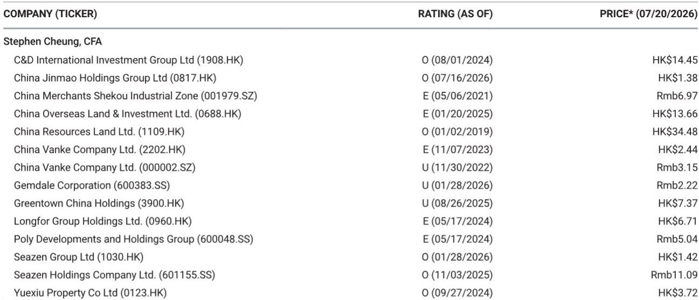

# MS：中国50城新房周成交同比转正-二手房延续回暖

截至7月19日当周，中国50城新房周度备案成交面积同比上升3%，扭转了此前一周仅1%的微弱增幅。同期10城二手房成交同比上升6%，较前一周的-3%明显改善。这份来自MS的周度数据库追踪报告，提供了政策密集期后市场量能变化的近期切片。

新房成交的同比转正，主要由二线城市拉动。当周二线城市新房成交同比上升14%，而前一周这一数字仅为0%。三线城市同比上升2%，同样好于前一周的-18%。但一线城市新房成交同比下降24%，与此前一周40%的同比增幅形成明显反差。报告没有展开这一波动的具体原因，但样本周内一线城市推盘结构可能发生了显著变化。

二手房市场延续了更稳定的修复节奏。当周一线城市二手房成交同比上升9%，高于前一周的6%；二线城市同比上升5%，扭转了前一周-9%的降幅。从年初至今累计看，10城二手房成交同比已录得4%的正增长，而50城新房累计仍为-11%。二手房市场在成交量层面先于新房企稳，这一分化格局在多个城市样本中持续存在。

一个值得关注的指标是整体去化率。当周50城新房整体去化率为26%，而前一周为95%。这一剧烈波动主要来自一线城市：当周一线城市去化率仅为4%，前一周为90%。报告明确指出，这一骤降是由于当周推盘项目位于偏远区位。二线城市去化率从100%降至48%，同样受到推盘结构影响。去化率作为短期指标，单周波动较大，不宜过度解读为需求趋势的转折。

> **KC评论：** 去化率从95%骤降至26%，表面看是需求骤冷，但报告已提示这是推盘区位变化所致。读者应关注连续四周移动平均数据，而非单周波动。报告附图中50城新房周度成交及四周移动平均线，是更稳定的观察窗口。

中原报价指数显示，六城二手房挂牌价同比降幅为16.5%，略高于前一周的16.3%。一线城市中介信心指数为52.8，较前一周的51.8小幅回升。价格端仍在调整，但中介预期出现边际改善。

这份周度数据追踪的价值在于，它提供了一个高频、可比较的成交与价格框架。对于关注中国住房市场的读者，可以将新房与二手房、一线与二线、成交与价格拆开观察，而非笼统判断市场方向。当前数据指向的图景是：二手房成交在量上已出现累计同比正增长，新房成交在二线城市出现边际改善，但一线城市波动较大，价格端尚未确认企稳。

For informational purposes only. Portions may be generated,translated,summarized,or edited with AI assistance based on source materials and may contain omissions or errors. Please verify independently. This is not investment,legal,tax,accounting,or other professional advice.

For informational purposes only. Portions may be generated,translated,summarized,or edited with AI assistance based on source materials and may contain omissions or errors. Please verify independently. This is not investment,legal,tax,accounting,or other professional advice.

