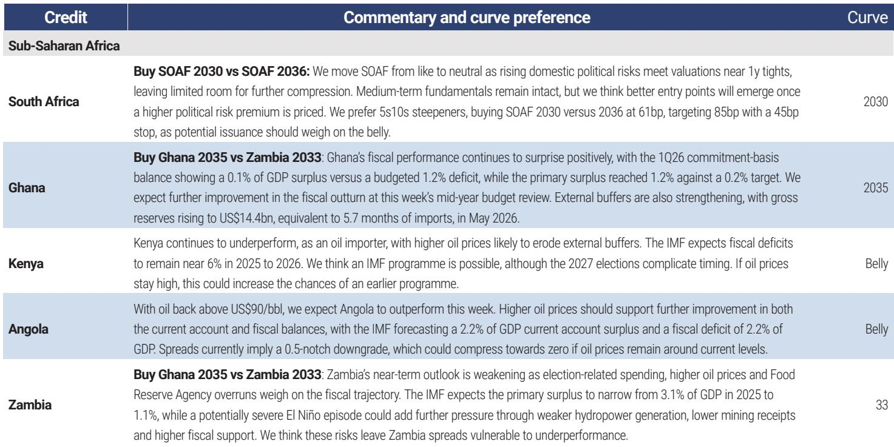
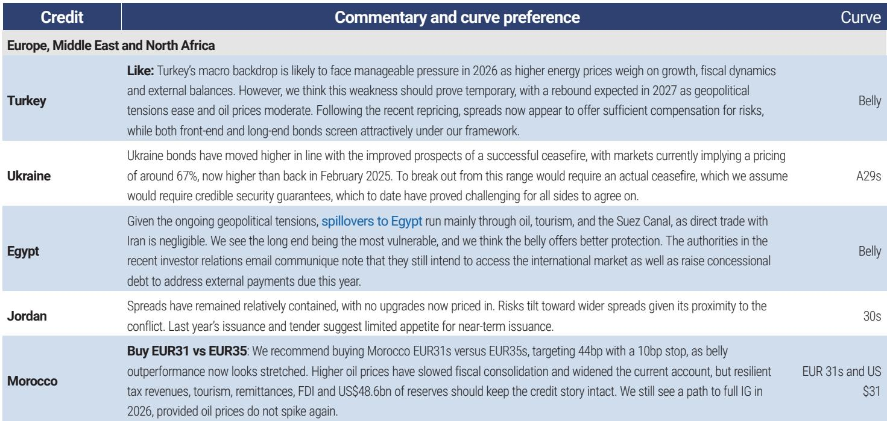
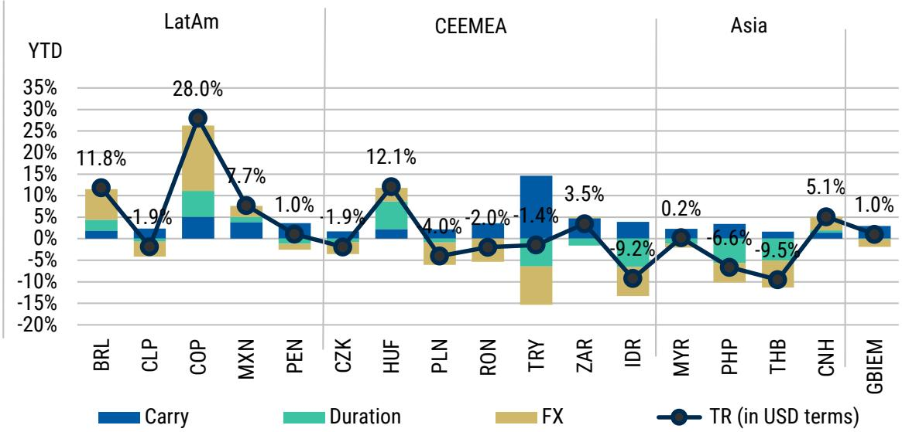

# MS：全球新兴市场系统性外汇策略

MS全球新兴市场策略团队在最新报告中，没有直接给出一个方向性交易建议，而是展示了一种工作方法：如何将量化系统性策略的输出，作为主观判断流程中的不确定性测试工具。报告的核心矛盾点在于，该行的量化多因子策略当前持有温和的美元多头仓位，而策略团队自身对美元持中性偏空立场。这种分歧本身，比任何单一结论都更有信息量。

报告明确指出，系统性策略的美元多头信号自3月中旬以来持续存在，而同期美元确实总体走强。但策略团队认为，这一信号未能充分反映该行对美联储政策路径的判断——该行内部对联邦产品利率的预期比市场定价更为宽松。这构成了两者分歧的关键来源。

> **KC评论：** 这份报告最有价值的不是结论，而是展示了一个可复用的决策框架：当量化信号与主观判断冲突时，不是简单否定某一方，而是追问“量化策略没有纳入什么变量”。在这里，未被纳入的变量是美联储政策路径的差异。

## 1. 量化策略的仓位信号与主观判断的分歧点

该行的FX多因子策略当前净美元敞口为-21.0%，即做多美元兑组合中的其他货币。报告特别指出，这一仓位在历史序列中属于温和水平。策略中最大的空头头寸是离岸人民币，权重为-47.2%，但报告解释这主要是因为人民币波动率较低，导致名义权重显得突出。

当调整波动率影响后，按过去12个月z-score衡量，策略最偏好的多头货币为印尼盾、南非兰特、罗马尼亚列伊、挪威克朗和新台币；最偏好的空头货币为秘鲁索尔、哥伦比亚比索、离岸人民币、英镑和以色列谢克尔。整体呈现明显的利差交易倾向。

策略团队对美元的中性偏空立场，核心依据是该行对美联储更宽松的预期。报告认为，这一宏观变量是量化策略无法自然捕捉的，因此两者分歧并非系统性问题，而是输入条件不同。

## 2. 系统性信号在主观决策流程中的三种应用场景

报告详细讨论了主观决策者如何有选择地使用量化信号，而非全盘采纳。三种场景被明确列出：对抗确认偏误、辅助交易时机与仓位规模判断、以及过滤市场观点。

对抗确认偏误是最具操作价值的场景。当主观持仓已持续盈利，而量化策略突然发出反向信号时，这应成为重新审视交易逻辑的触发点。报告以离岸人民币为例——该货币是今年亚洲表现最好的货币之一，但量化策略却持有最大空头仓位。这种分歧值得进一步追问：出口驱动型增长模式是否意味着人民币持续走强会带来宏观环境阻力。

在过滤市场观点方面，报告提出了一种更精细的做法：主观管理者可以根据对市场环境的判断，选择性地关注多因子策略中的特定因子。例如，在区间震荡市中，可以过滤掉动量因子，只关注其他信号。

## 3. 多因子框架的跨周期表现与组合价值

报告引用了量化研究策略团队此前发布的研究成果，展示了FX多因子策略的长期表现特征。该策略自2000年以来的夏普比率为1.87，年化复合增长率9.3%，最大回撤仅-6.8%。更重要的是，其表现不依赖特定宏观环境：美元走强时夏普1.84，走弱时1.70；不确定性偏好时期1.86，不确定性规避时期1.67。

该策略与传统资产类别的相关性接近零，包括公司、利率、商品和波动率策略。当作为60/40组合的资本效率型叠加使用时，组合夏普比率从0.78提升至1.54，扰动期间平均回报从-8.9%改善至-5.5%。这些数据表明，FX系统性策略提供的是一类独立的回报来源，而非对现有敞口的简单放大。

> **KC评论：** 量化策略在扰动期间仍能提供正贡献，这一点值得关注。传统利差交易在不确定性规避时往往明显波动，但多因子框架通过引入技术面和情绪面信号，降低了单一因子的尾部不确定性。报告展示的扰动期间平均回报改善，暗示的是因子之间的互补性，而非策略本身无懈可击。

## 4. 从分歧到验证：一个可复用的决策流程

报告没有给出一个标准答案，而是提供了一个思考框架。当量化信号与主观判断不一致时，正确的反应不是立即调整仓位，而是追问分歧的根源。在这个案例中，分歧源于对美联储政策路径的不同假设——量化策略反映的是市场定价，而策略团队反映的是内部研究判断。

这种框架对于资产管理者具有直接的可操作性。任何主观决策流程都存在确认偏误的不确定性，而一个独立的量化信号可以作为外部校验点。报告建议，不需要全盘采纳系统性策略的输出，而是将其视为众多输入之一，与仓位数据、央行沟通、宏观数据等并列使用。

报告最后提到，该行FX策略团队已经在使用估值信号、不确定性溢价和仓位指标等量化工具，并计划逐步整合更多因子策略。这暗示了一种趋势：即使以主观判断为主的团队，也在系统性地增加量化输入的比例。

For informational purposes only. Portions may be generated,translated,summarized,or edited with AI assistance based on source materials and may contain omissions or errors. Please verify independently. This is not investment,legal,tax,accounting,or other professional advice.

For informational purposes only. Portions may be generated,translated,summarized,or edited with AI assistance based on source materials and may contain omissions or errors. Please verify independently. This is not investment,legal,tax,accounting,or other professional advice.

