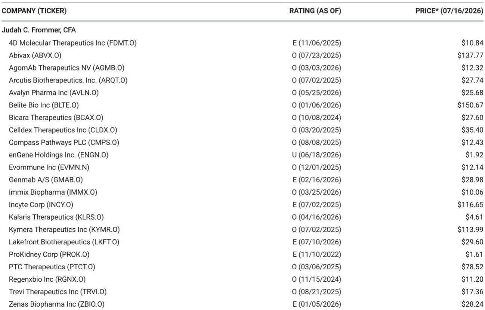
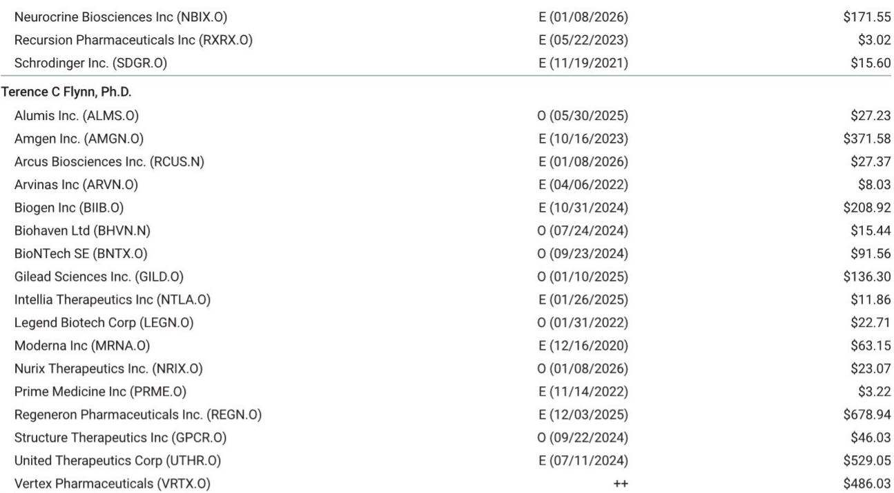
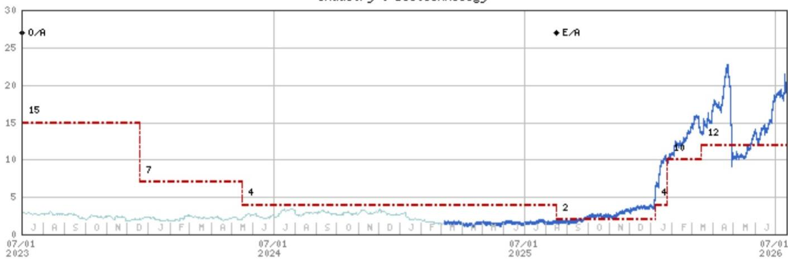

# MS：ErascaInc.

Erasca 的 RAS 抑制剂 ERAS-0015 在近期数据更新中展现出更强的疗效信号和更清晰的注册路径，但MS仍维持等权重评级，等待更成熟的数据和更长的随访周期。这份报告的核心判断是：ERAS-0015 正在从早期临床概念验证阶段，转向一个具备多适应症注册潜力的候选药物，但当前数据仍基于小样本和早期随访，关键验证节点在 2026 年下半年和 2027 年上半年。

主要基于对 ERAS-0015 和 ERAS-4001 在胰腺导管腺癌、非小细胞肺癌和结直肠癌中成功概率的提升，以及将部分适应症的上市时间提前。但分析师明确表示，要转为更积极的立场，需要看到三个关键条件：更长的随访数据以确认疗效持久性、更大样本的患者数据以验证应答一致性，以及按计划启动和入组注册性研究。

## 1. 胰腺癌疗效数据在扩展队列中持续改善

在 2 线及以上 KRAS G12X 胰腺癌患者中，ERAS-0015 在 32mg 剂量组的未确认客观缓解率从 4 月数据截止时的 50% 提升至 5 月的 57%，可评估患者从 4 例增至 7 例，应答人数从 2 例增至 4 例。跨 24-32mg 提到扩展剂量的合并分析显示，缓解率从 27% 提升至 40%，所有应答者仍在治疗中。

剂量-应答关系仍然清晰：在 8mg、16mg、24mg 和 32mg 剂量组中，缓解率分别为 11%、0%、25% 和 57%。药代动力学数据显示剂量依赖性暴露，未观察到平台期。但报告也指出，32mg 组 57% 的缓解率基于小样本量，且持久性随访数据尚不成熟，需要更多患者和更长随访来确认。

> **KC评论：** 这份报告最有价值的信息不是单一数字，而是“剂量-应答关系持续存在”和“应答随队列扩展而增加”这两个趋势。对于早期临床数据，趋势的稳定性比单点数值更重要。但 32mg 组仅 7 例可评估患者，任何解读都需谨慎。

## 2. 安全性特征支持持续给药和联合用药潜力

在 16-32mg 剂量范围内，安全性数据库已从 43 例扩展至 72 例。皮疹发生率为 72%，腹泻为 32%，口腔炎为 19%，但 3 级及以上不良事件发生率较低。剂量中断率为 13%，剂量降低率为 8%，无治疗相关不良事件导致的停药。中位相对剂量强度在所有剂量水平均为 100%。

与同类药物 daraxonrasib 的跨研究比较显示，ERAS-0015 的 3 级以上皮疹和口腔炎发生率更低，剂量调整也更少。但报告强调，这种比较涉及不同试验阶段和人群，且 ERAS-0015 的随访时间更短。值得注意的是，两个项目各报告了一例 5 级肺炎事件，分析师认为这可能是同类药物的共同不确定性，而非分子特异性信号。

## 3. 联合用药策略成为差异化关键

ERAS-0015 与标准剂量 panitumumab 的联合用药在初始剂量水平未观察到剂量限制性毒性，4 例可评估患者均安全通过。16mg 组的回填和向 24mg 的剂量递增正在进行中。报告认为，考虑到 RAS 联合策略历史上存在的耐受性挑战，这一进展具有重要意义。

联合用药机会还在扩展。默克正在为 Erasca 赞助的 AURORAS-1 研究提供 pembrolizumab，Tango 将赞助一项 ERAS-0015 联合 PRMT5 抑制剂 vopimetostat 的 1/2 期研究，针对 MTAP 缺失的胰腺癌和 RAS 突变非小细胞肺癌。这些合作被视为早期信号，但报告认为，即将公布的联合用药数据对于确立疗效、耐受性、剂量强度和联合用药能力的平衡至关重要。

## 4. 注册路径清晰但依赖执行和监管对齐

公司计划在 2027 年上半年启动一项潜在的注册性 2 线及以上非小细胞肺癌研究，随后在 2027 年启动 1 线胰腺癌 3 期研究，并在 2027 年下半年至 2028 年上半年启动 RAS 突变非小细胞肺癌的关键 3 期研究。如果按计划执行，ERAS-0015 将在约 18-24 个月内从早期临床开发进入三个注册导向项目。

公司还完成了 6.325 亿美元的公开增发，为并行注册开发提供了资金支持。但报告指出，执行仍取决于监管对齐和及时启动试验，特别是首个非小细胞肺癌研究预计将在与即将公布的数据更新相近的时间窗口内启动。整体而言，这条路径已明确且有资金支持，但仍需持续的监管明确性和运营执行。

> **KC评论：** 对于关注早期生物技术公司的读者，这份报告提供了一个可复用的观察框架：从早期数据到注册性研究的转化，需要同时关注疗效信号的稳定性、安全性对联合用药的支持程度，以及资金和监管路径的可行性。Erasca 在这三个维度上都有进展，但每个维度都还有待验证。

## 5. 知识产权不确定性仍存，但临床差异化可逐步缓解

关于专利侵权不确定性，报告认为存在一条可信的路径，即如果临床差异化得以持续，当前的估值折价可以缩小。Revolution Medicines 的索赔依赖于等同原则而非字面侵权，分析师此前的分析表明，在该框架下成功索赔的先例有限。更重要的是，在剂量、药代动力学/药效学、疗效、安全性、剂量强度和联合用药能力方面的持续差异化，可能越来越多地支持功能-方式-结果和实质性差异的论点。但这需要更成熟且明确差异化的临床数据来证实。

For informational purposes only. Portions may be generated,translated,summarized,or edited with AI assistance based on source materials and may contain omissions or errors. Please verify independently. This is not investment,legal,tax,accounting,or other professional advice.

For informational purposes only. Portions may be generated,translated,summarized,or edited with AI assistance based on source materials and may contain omissions or errors. Please verify independently. This is not investment,legal,tax,accounting,or other professional advice.

