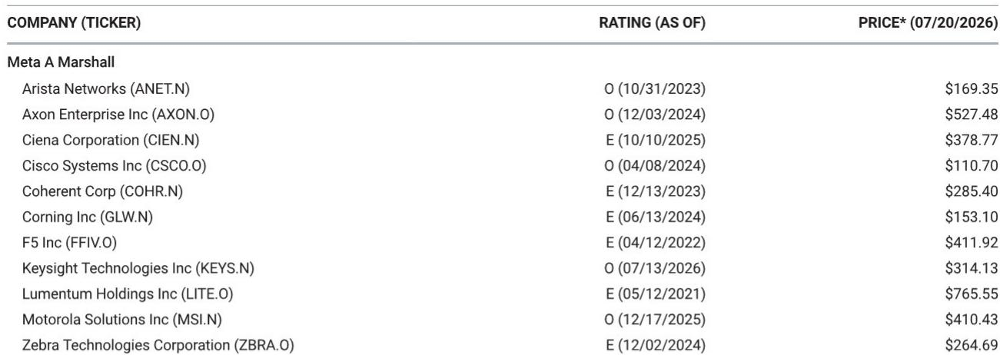
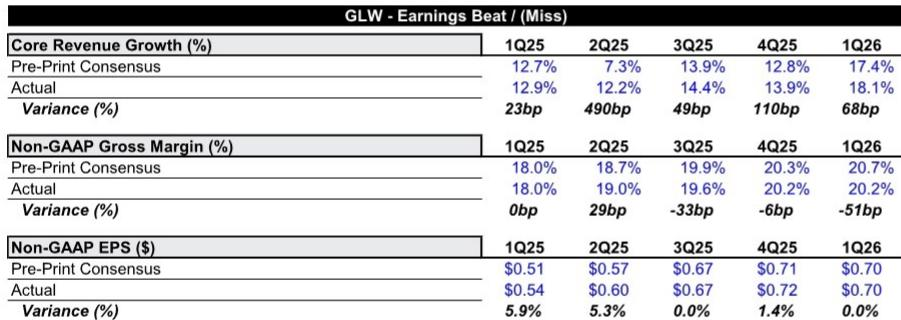
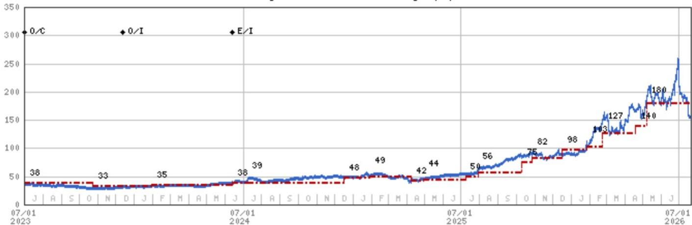

# MS：康宁业务与季度数据观察

康宁将在7月28日盘前发布二季度财报。MS在最新报告中指出，由于光学业务处于售罄状态，二季度营收超预期的幅度可能有限，市场关注点将转向利润率表现和光学业务在三季度的供应驱动型加速。这家光纤和显示玻璃供应商自6月底GlassBridge相关消息后报价回调约40%，但报告认为，有意义的报价上行仍需看到额外定价证据或更快的供应爬坡。

报告显示，这一估值倍数远高于康宁过去十年的16倍平均交易区间，但报告认为光学密度增速超过GPU支出的趋势支撑了这一溢价。

## 1. 二季度营收超预期幅度可能不超过1亿美元

报告测算，康宁二季度营收超预期幅度可能在5000万美元左右，不太可能超过1亿美元。若结果显著高于这一水平，大概率需要来自定价因素而非销量。每股收益的超预期空间也被压缩在0.01至0.02美元之间。

市场共识已隐含约2亿美元的环比增长，这意味着光学业务需要在新增产能上线后贡献至少5000万美元的超预期增量。报告认为，售罄状态限制了营收超预期的幅度，也使利润率表现和光学业务在三季度的加速节奏成为更关键的讨论点。

> **KC评论：** 市场对康宁二季度的预期并不低，但报告认为实际超预期空间有限。关键在于，市场已经在等待三季度供应端改善带来的增长，而非二季度本身。

## 2. 太阳能业务仍是利润率的最大未知数

报告将太阳能业务视为康宁近期最大的不确定性。管理层预计二季度太阳能业务对核心每股收益的影响约为0.07美元，相当于较0.75美元的指引中值减少约9%。其中约0.03美元来自约3000万美元的临时停产费用，剩余约0.04美元指向持续的硅片爬坡低效。

停产相关成本预计将率先恢复，而硅片爬坡的持续进展将在2026年下半年推动增量成本逐步下降。报告认为，若太阳能业务恢复速度快于预期，三季度每股收益指引存在上行空间。

## 3. 显示业务上半年受益于面板出货前置，下半年动能可能减弱

2026年电视面板出货呈现明显的前置特征。品牌商为冬奥会、世界杯和中国618促销提前备货，使显示面板厂利用率在二季度维持在80%至85%的水平，与一季度基本持平，且高于2025年二季度78%的谷底。

报告指出，这些事件未必显著提升全年电视需求，但改变了出货节奏。随着面板订单在下半年节奏变化，提前备货效应将逐渐消退。不过，面板厂商的产出纪律仍然保持，这应能支撑康宁近期的定价和利用率。

## 4. 光学业务受益于架构无关的规模扩展趋势

报告认为，康宁是光学规模扩展趋势中最清晰的架构无关受益者。无论市场最终选择共封装光学、近封装光学、线性可插拔光学还是其他格式，更高的带宽需求都将推动光学内容增加。康宁在光纤阵列单元、保偏光纤、外部激光源光纤和GlassBridge等无源光子学领域的布局，使其能够参与多种架构。

管理层仍将2028年视为规模扩展的起点，早期采用预计将通过铜和光学的混合方案推进，而非立即切换。报告认为，这一时间框架为康宁提供了持续的需求支撑，但短期内的供应爬坡节奏仍是市场关注的焦点。

For informational purposes only. Portions may be generated,translated,summarized,or edited with AI assistance based on source materials and may contain omissions or errors. Please verify independently. This is not investment,legal,tax,accounting,or other professional advice.

