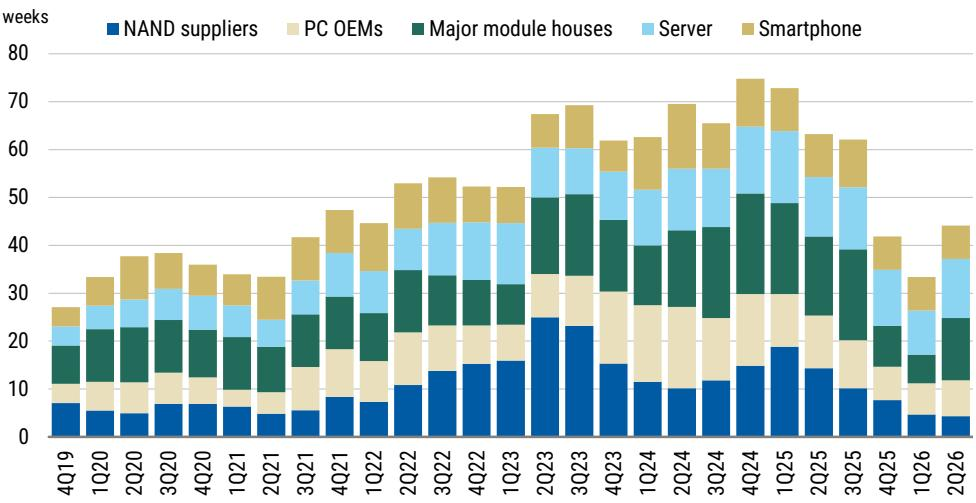
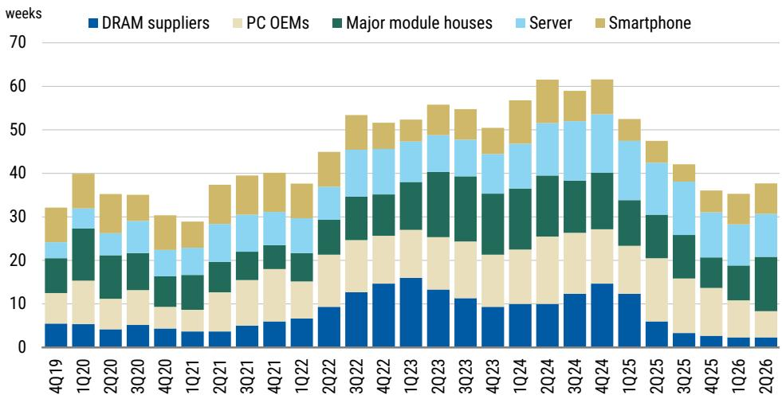
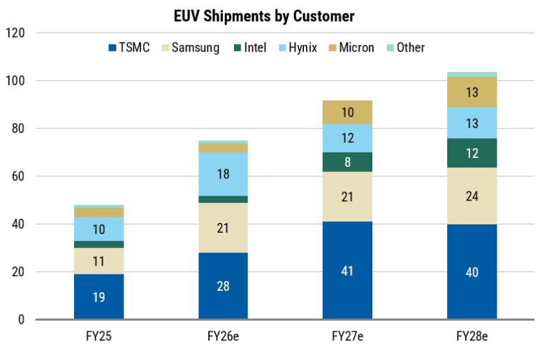

# 存储周期的结构性延伸：市场尚未完全定价这一转变

当前半导体研究领域最核心的议题，并非存储报价何时见顶——数据指向2026年第四季度前后——而是这个峰值究竟意味着急剧下行周期的开端，还是一个结构性延长的平台期。从最新的行业调研、存储创新分析以及中国市场竞争格局演变来看，证据明确指向后者。若将此轮周期简单视为过往繁荣的重演，可能错失自2D NAND转型以来存储领域最关键的变革。

三大力量正同时重塑存储格局。首先，超大规模资本支出持续加速，受大语言模型训练与推理需求的驱动。其次，存储创新正在创造传统HBM之外的新增市场，基准情景下估值约250亿美元。第三，中国DRAM领军企业完成了科创板史上最大规模的IPO，从根本上改变了全球供应结构。这些力量并非相互抵消，而是以延长周期持续时间的方式相互作用，即便报价变化速率正在放缓。

市场对存储类公司的当前估值，反映了一种理性但不完整的评估。市净率已从近期高点回落——三星为1.7倍，SK海力士为2.5倍——但两者仍高于长期均值。盈利修正率已从92%的峰值降至77%。这些并非狂热迹象，而是表明市场已正确识别出动量峰值，但尚未对周期的结构性延伸进行定价。机会正存在于这一差距之中。

## 超大规模AI支出尚未见顶，关于变现的讨论偏离了重点

存储领域最持久的看空论点是，超大规模AI资本支出将因运营商难以变现其基础设施而不可避免放缓。这一论点误解了当前投资周期的本质。相关指标并非每美元资本支出是否直接对应当前收入，而是领先AI平台的年收入运行率是否增长足够快，以吸收正在建设的产能。证据表明答案是肯定的。

某全球投行报告围绕三个因素展开讨论：高质量大语言模型训练运行的强度、可用资金规模，以及超大规模运营商年收入运行率的轨迹。三者均保持积极态势。训练运行强度并未减弱，反而随着模型向万亿参数规模扩展而增加。AI基础设施资金并未收缩。虽然变现情况不均衡，但关键转折点并非2025年或2026年初，而是2026年第二季度的资本支出计划。若这些计划维持或增加，存储需求轨迹将进一步延伸。

关键洞察在于，基础设施变现并不要求每台服务器从第一天起就满负荷运转，而是要求最大运营商的总体收入轨迹持续快于其硬件折旧进度。这一条件目前仍然满足。计算能力过剩的风险真实存在但尚显遥远。更紧迫的风险是存储带宽不足以支持下一代AI工作负载。

## 存储报价将于2026年底见顶，但周期正在延长而非崩溃

DRAM合约价格同比增速正从周期峰值回落。变化速率在放缓。这是历史上存储类公司变得危险的周期节点。但历史类比具有误导性，因为需求的结构性驱动因素已经改变。

当前周期的库存积累集中在模组厂商，而非终端用户渠道。DRAM和NAND库存在2026年第二季度有所增加，但增长由分销商和模组制造商驱动，而非超大规模运营商或企业客户。这很重要，因为模组厂商库存比更下游的渠道库存更透明，修正也更迅速。当修正来临时，幅度将更浅。

盈利修正率已从92%降至77%。这是有意义的放缓，但77%仍是净正向修正率。升级周期正在失去动力，而非逆转。SK海力士和三星基于2026年预估的前瞻市盈率已分别压缩至6.8倍和5.9倍。这些并非泡沫估值，而是已经折价了显著放缓的估值。存储报价崩溃的风险已被部分定价，但延长平台期的风险尚未被定价。

2026年第四季度很可能是DRAM合约价格同比增速的峰值。但峰值不等于崩盘。周期正在延长，因为需求基础正从传统服务器和PC市场多元化扩展至AI推理、边缘计算和汽车领域。变化速率正在见顶，但需求的相对水平仍在增长。

## 中国DRAM领军企业重塑竞争格局，但并未冲击市场

CXMT约85亿美元的科创板IPO是该交易所历史上最大规模，也是2026年亚洲最大。该公司是中国相对少见的大规模DRAM制造商，在无EUV光刻条件下运营D1z节点生产DDR5和LPDDR5X。其约850亿美元的隐含估值，对应2026年市盈率约5.8倍，市净率约3倍。

战略读者包括阿里云、美团和小米。这并非偶然。它们是中国本土生态系统中最大的存储消费者。它们的参与表明，CXMT的产能是为服务国内需求而建，而非以低价冲击全球市场。

产能轨迹清晰但克制。CXMT的全球DRAM份额预计将从2025年的约8%提升至2027年的约12%，成为全球第四大DRAM制造商。该公司填补了韩美存储领先企业将产能转向HBM后留下的DDR5缺口。这一转向是结构性的。三大存储制造商正将越来越多的晶圆启动份额分配给高带宽内存，后者利润率更高但单位产量更低。大宗DRAM市场正在被腾出，而CXMT正进入这一空间。

需要注意的是，CXMT无法填补HBM缺口。这仍是中国AI雄心的结构性制约，也是现有存储领先企业的持久竞争优势。此次IPO不会改变HBM的供需平衡，但确实会改变大宗DRAM的定价动态。市场正在理性地为这一风险定价。

## 存储创新创造HBM之外的250亿美元新增市场

存储行业最被低估的发展并非产量周期，而是创新周期。某全球投行报告识别出存储创新的六个方向：近存计算、存内处理、计算快速链路内存、光学内存接口、混合键合和先进封装。这些并非理论概念。高通的混合键合立方体技术和AI架构优化，正是存储为AI时代重新设计的现实案例。

排除HBM后，存储创新的总可寻址市场在基准情景下估计约250亿美元，乐观情景下可能显著更大。这不是一个替代市场，而是由计算速度与存储带宽之间的架构不匹配所创造的新增市场。随着每一代AI加速器的推出，计算性能与存储带宽之间的差距正在扩大。缩小这一差距需要创新，而不仅仅是更多产能。

市场尚未对这一创新周期定价，因为它难以建模且时间不确定。但方向是明确的。存储正从大宗商品业务向技术差异化业务转变。投资于存储创新的公司将在整个周期中获得更高的资本回报。而保持纯大宗商品生产商的公司，将面临中国产能上线带来的利润率压缩。

## 存储周期定位的决策框架

研究者需要一个涵盖三种重叠力量的框架：定价的周期峰值、需求的结构性延伸，以及中国新竞争格局的出现。以下框架将这些力量组织为可操作的定位。

第一，评估对HBM与大宗DRAM的敞口。拥有显著HBM敞口的公司受益于独立于大宗定价周期的结构性需求增长。SK海力士和美光拥有较强的HBM地位。三星正在追赶，但在认证周期上仍落后。HBM溢价是持久的，因为该技术难以复制，且客户集中度造成高转换成本。

第二，评估模组厂商与终端客户的库存状况。当前库存积累集中在分销环节。这比超大规模或企业客户的库存积累信号危险性更低。若模组厂商库存在2026年第三季度得到修正，价格下跌幅度将比历史类比更浅。

第三，关注2026年第二季度超大规模运营商的资本支出计划。这是2027年存储需求最重要的领先指标。若资本支出计划维持或增加，周期延长；若被削减，周期收缩速度将快于当前共识预期。

第四，区分估值压缩与结构性降级。当前存储类公司的市净率高于长期均值，但低于以往周期峰值。这与市场定价正常周期性放缓而非结构性衰退的情况一致。若周期延长，这些倍数将重新上调。

第五，考虑中国因素。CXMT的IPO是一个供应事件，但也是一个需求信号。战略读者是国内存储消费者。产能是为服务中国市场而建，而非以低价出口。由中国产能驱动的全球供应过剩风险，低于市场假设。

## 估值已回落，但盈利轨迹尚未恶化

主要存储制造商的市净率已从近期高点回落。三星交易于1.7倍市净率，SK海力士为2.5倍，美光前瞻为3.9倍。这些高于各公司长期均值，但远低于2017-2018年周期峰值。盈利修正率已放缓但仍为正值。升级周期正在失去动力，而非逆转。

价格与盈利之间的背离是当前格局中最有趣的特征。SK海力士一年前瞻每股盈利已从峰值略有回落，但股价跌幅超过盈利修正所应证实的幅度。这表明市场正在折价一个比基本面数据目前所支持的更急剧的下行。若周期如结构性力量所暗示的那样延长，则股价正在定价一个不会实现的风险。

可比公司表格显示，存储板块2026年市盈率中位数为9.8倍，2027年中位数为6.9倍。对于拥有结构性需求顺风和技术地位改善的公司而言，这些并非苛刻的估值。风险并非估值过高，而是周期比预期更快转向。但证据指向延长，而非崩溃。

最重要的结论是，存储周期并非在重复历史模式。AI驱动需求、存储创新和中国产能扩张的结合，创造了一个比行业过去经历的更复杂、更持久的周期。市场正在定价一个放缓，但尚未定价一个结构性转变。这一差距正是战略机遇所在。

*仅供参考。部分内容可能基于源材料通过AI辅助生成、翻译、总结或编辑，可能存在遗漏或错误。请独立核实。本文不构成专业建议。*

仅供参考。部分内容可能基于源材料通过AI辅助生成、翻译、总结或编辑，可能存在遗漏或错误。请独立核实。本文不构成专业建议。

