# 黄金与白银：ETF购买何时恢复？

July 20, 2026 07:42 PM GMT

metal&ROCK | Europe

## 黄金与白银：ETF购买何时恢复？

黄金目前方向不明，各国央行购金有所改善，但ETF因对美联储加息的担忧而持续卖出。白银也面临类似的ETF卖出情况，且表现落后于黄金，工业需求较为疲软。展望未来，两者均存在上行空间，前提是美联储避免加息。

## 核心要点

- 2025年，ETF占黄金需求的20%和白银需求的15%，但自中东局势变化以来，因对加息的担忧，ETF一直在卖出贵金属。
- 以中国和波兰为首的各国央行购金正在加速。
- 相比之下，2025年白银的工业和珠宝需求因价格高企和波动而承压。
- 我们认为，如果美联储能够避免加息，这两种金属都有反弹空间，这与我们美国经济学家的观点一致，即通胀放缓已经开始。
- 我们预计2026年第四季度黄金价格为4,450美元/盎司，白银为65.40美元/盎司。

## 央行需求出现改善迹象

黄金的央行需求出现改善迹象：3月/4月，以土耳其和俄罗斯为首的央行售金占据了头条新闻。然而，此后销售有所放缓，而在其他地区，购买正在加速，尤其是在中国（年初至今增加40吨，而2025财年为25.8吨）、波兰（年初至今增加64吨，而2025财年为102吨）和乌兹别克斯坦（年初至今增加33吨，而2025年为7.8吨）。

## 实物白银需求仍面临挑战

白银近几个月表现落后于黄金，受到宏观因素以及工业（太阳能）和珠宝需求疲软的影响，高价格和波动性促使了替代和减量使用。这削弱了白银与铜的相关性。

## 但ETF的回归是两者的关键变量

2025年，随着降息刺激了贵金属购买，ETF占黄金需求的20%和白银需求的15%。然而，随着中东局势变化和市场定价转向加息，ETF一直在卖出，抑制了黄金和白银的价格。我们的经济学家持非共识观点，认为美联储今年可以按兵不动，明年降息两次，近期的CPI数据表明通胀放缓已经开始。基于此，我们认为ETF有重新参与的空间，但这可能在第四季度更为明显。

## MS展望

我们认为，到2026年下半年及进入2027年，黄金和白银均存在上行空间，到年底黄金约有11%的上行空间，白银约有16%的上行空间，白银的额外上行空间得益于其较高的贝塔特性以及我们对铜的建设性看法。稳定的央行需求应为黄金提供底部支撑，任何ETF购买的回归都是积极因素，而白银可能会重新与铜建立相关性，并受益于任何ETF的资金流入。

MS & CO. INTERNATIONAL PLC+
Amy Gower (Amy Sergeant), CFA
商品策略师
Amy.Gower1@morganstanley.com +44 20 7677-6937

Ben Kelson
研究助理
Ben.Kelson@morganstanley.com +44 20 7677-1392

Martijn Rats, CFA
股票分析师兼商品策略师
Martijn.Rats@morganstanley.com +44 20 7425-6618

图表1：中国加速了黄金购买
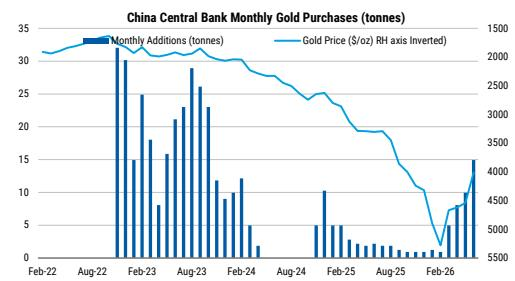
来源：彭博

图表2：但ETF目前仍缺席
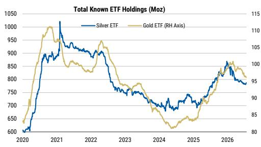
来源：彭博
metal&ROCK: The Price Deck – 3Q26: Micro Narratives, But Macro Matters (2026年7月8日)

MS与报告中涵盖的公司有业务往来或寻求业务往来。因此，读者应注意，该公司可能存在影响MS客观性的利益冲突。读者应将MS视为做出决策的单一因素。

有关分析师认证和其他重要披露，请参阅本报告末尾的披露部分。

+= 非美国关联公司雇用的分析师未在FINRA注册，可能不是该会员的关联人士，并且可能不受FINRA关于与主题公司沟通、公开露面以及交易研究分析师账户中持有的证券的限制。

图表3：我们观察到2022年央行黄金购买的战略性转变
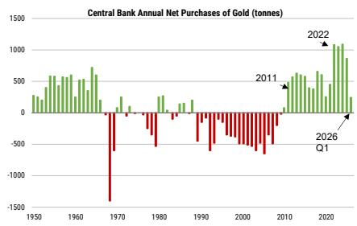
来源：世界黄金协会

## 央行重新参与

以土耳其为首的央行售金在3月/4月占据头条：土耳其是2022-2025年周期中三大官方黄金买家之一（与中国和波兰并列），四年内增加了154吨。然而，中东局势的开始以及土耳其高达约90%的燃料依赖进口，扩大了其贸易逆差，推动了对美元的需求，并在3月31%通胀的背景下将里拉推至历史低点。土耳其央行通过出售黄金来捍卫货币，据彭博报道，在中东局势开始后的两周内，土耳其出售和掉期了约60吨黄金。

其他国家也在出售：俄罗斯年初至今已出售34.2吨，已经超过了2025年出售的6.2吨，原因是军费开支和财政制裁使联邦赤字在5月底达到6万亿卢布（830亿美元）。阿塞拜疆也转为净卖家，阿塞拜疆共和国国家石油基金（SOFAZ）年初至今释放了21.9吨，原因是金价上涨将黄金在其储备中的份额推高至SOFAZ自行设定的35%门槛以上。

然而，其他地区的购买正在加速，尤其是中国和波兰：中国央行已连续20个月购买黄金，并且自金价回调以来加速了购买。在冲突之前，中国每月购买约1吨，但在6月购买了14.9吨，使年初至今的购买量达到40.1吨，已经超过了2025年购买的25.8吨。波兰延续了2025年的强劲购买势头，年初至今购买了63.6吨（按时间调整后，超过了其2025财年100吨的购买量）。乌兹别克斯坦年初至今增加了32.7吨，而2025年为7.8吨。总体而言，我们看到近期数据中全球央行购买量有所恢复。土耳其的销售也显著放缓，5月仅为2.7吨。全球净销售额在3月达到50.6吨，但4月和5月数据显示购买量增加，分别为21.5吨和41.2吨。截至5月的年初至今，可识别的黄金购买量达到84.4吨，比2025年同期下降30%，但在下半年有进一步恢复的空间。

图表4：中国加速了黄金购买，而土耳其转为净卖家
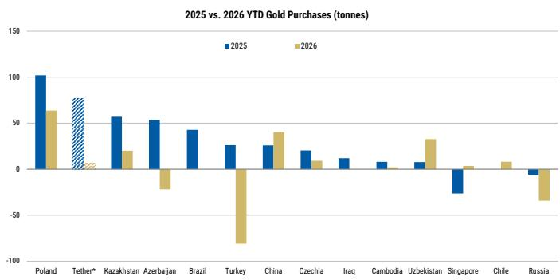
来源：世界黄金协会。*2026年第一季度

图表5：中国在6月购买了14.9吨，这是自2023年10月以来的最高月度增量，也是连续第20个月净流入
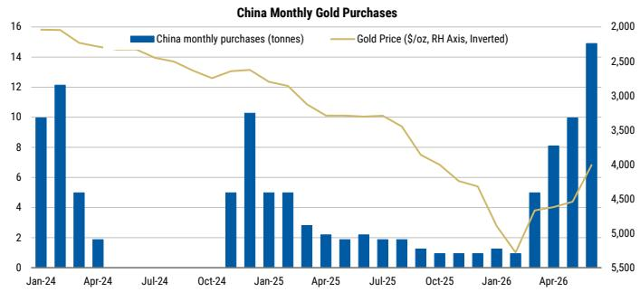
来源：世界黄金协会，彭博

图表6：自冲突以来，美联储利率定价发生了变化
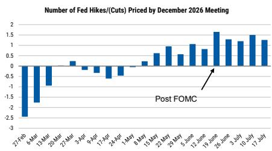
来源：彭博（WIRP功能）

## 但ETF仍然缺席

黄金ETF持仓年初至今持平，北美推动了近期的销售：虽然央行购买无疑在2025年支撑了金价，但需求的最大波动来自ETF，它们购买了约800吨黄金，与央行的购买量相差无几。相比之下，它们在2026年迄今为止明显落后。世界黄金协会数据显示，从2025年底到2026年上半年末，ETF仅增加了18吨黄金，1月、2月和4月的大量购买被其他月份的销售所抵消，6月所有地区均出现净销售，总计74吨。北美推动了这一逆转，6月流出42吨，使上半年净销售额达到60.5吨。相比之下，亚洲年初的强劲流入意味着该地区年初至今仍为净买家，上半年增加了69.7吨，而欧洲的流入年初至今也保持正值。

上半年流出集中在北美，凸显了该地区近期作为摇摆买家的角色。美国上市的基金是黄金ETF资本的边际池，往往主导周期的上涨和下跌阶段。由于北美在上涨过程中引领了全球流入，当情绪发生变化时，它也有最多近期积累的头寸需要平仓，特别是对于在较高价格水平上增加的仓位。

## 需要明确美联储路径，ETF才能重新参与

黄金ETF持仓通常与美联储利率负相关，美国资金流尤其敏感。中东局势增加了通胀担忧并改变了美联储利率预期后，持有黄金的机会成本对美国读者来说上升最为显著。图表8突出了这种关系，ETF购买实际上直到2024年底首次降息前几个月才开始。

虽然央行购买更有可能继续，无论价格或货币政策如何，但ETF的重新参与可能仍将对美联储路径、实际回报表现和美元保持敏感。目前，市场定价年底前加息1.4次，低于上周初的1.7次，情绪因中东紧张局势和即将公布的美国经济数据而转变。6月CPI数据较为温和推动了加息预期的下降，我们的美国经济学家认为通胀将在今年剩余时间内继续放缓，使美联储能够按兵不动。然而，一个月的数据并不构成趋势，近期中东冲突的再次升级给利率轨迹增加了更多不确定性。我们认为，要让ETF重新参与，市场需要更有信心美联储至少能够按兵不动，并在明年转向降息。这可能需要时间和更多支持性的经济数据，表明任何黄金头寸都需要耐心。

图表7：北美销售推动了近期ETF黄金流出
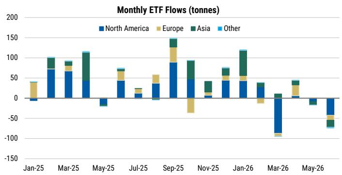
来源：世界黄金协会

图表8：我们认为，需要清晰的降息路径，ETF持仓才能有意义地增加
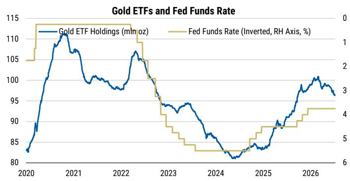
来源：彭博

## 持仓正在回升

数据显示：在第一季度的洗牌之后，COMEX黄金的非商业持仓开始上升，特别是自5月中旬以来，净多头达到2月初以来的最高水平。截至7月15日，CFTC非商业净多头增加了3.4万手至19.4万手，这是通过2.3万手新增多头和1.2万手空头回补共同建立的。

宏观资金正在介入：黄金似乎在4,000美元/盎司附近找到了一些支撑，央行购买加速，加上一些迹象表明，受财政赤字、储备多元化和法定货币贬值的结构性故事驱动，一些 discretionary 宏观资金正在介入。

但CTA倾向于另一方向：复杂之处在于黄金目前交易在其200日移动均线下方。在3月首次从200日移动均线反弹后，黄金在6月初跌破该关键技术位，此后未能恢复。7月中旬，50日移动均线也下穿200日移动均线，触发"死亡交叉"。这一点很重要，因为当价格位于关键移动均线下方且动能负面时，CTA和其他算法交易者会机械地减少多头或增加空头。由于黄金低于200日移动均线且短期移动均线向下倾斜，CTA可能倾向于在反弹时卖出，而不是在下跌时买入，这可能在近期限制了价格上涨，尽管央行购买加速且宏观资金增加了多头。

图表9：黄金净非商业持仓已开始再次上升
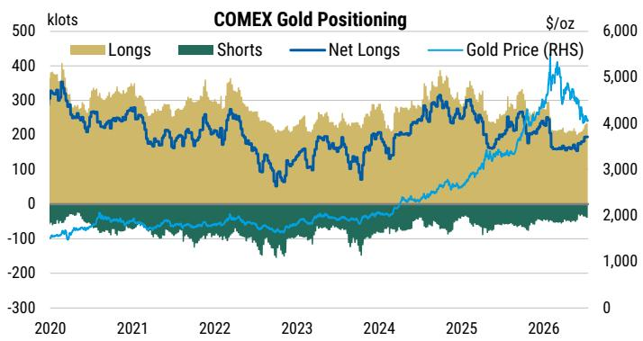
来源：彭博

图表10：但黄金仍低于其200日移动均线，50日移动均线近期下穿200日移动均线，触发"死亡交叉"
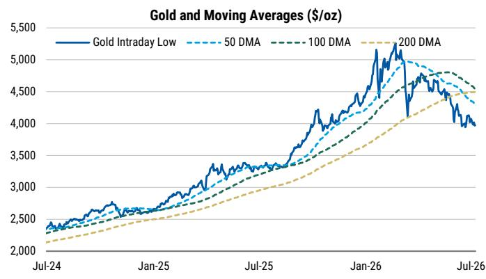
来源：彭博

MS展望：我们认为黄金的风险回报偏向上行，前提是美联储能够避免另一轮紧缩周期。我们的美国经济学家预计通胀将放缓，美联储今年将按兵不动，而明年更清晰的降息路径应会降低实际回报表现并鼓励ETF重新参与。由于全球ETF持仓在北美主导的流出后年初至今基本持平，即使是美国基金（边际摇摆买家）的部分回归，也可能提供有意义的上行空间。主要下行风险仍然是中东局势再次升级和油价上涨，这可能会重燃通胀担忧并推高利率预期。

央行需求应能提供更坚实的底部支撑，土耳其的销售放缓，而中国、波兰和乌兹别克斯坦的购买加速。持仓也开始恢复，表明 discretionary 宏观读者正在重建敞口。然而，技术面仍是短期逆风，黄金低于其200日移动均线，近期的"死亡交叉"使CTA倾向于在反弹时卖出。持续回升至200日移动均线上方可能逆转这一压力，并伴随着ETF资金流入的恢复和央行持续购买，强化我们更为看涨的展望——MS预计2026年第四季度为4,450美元/盎司。

## 白银

相关性正在瓦解：白银似乎正在与它通常最密切跟踪的两种金属——黄金和铜——脱钩。2026年前6个月，白银与黄金的相关性为79%，低于2025年下半年的98%，而与铜的相关性已从2025年下半年的95%降至目前的0%。这表明，随着白银应对不断变化的终端使用需求和宏观逆风，其驱动因素可能正在发生变化，贵金属主题目前超过了工业需求。

铜/白银脱钩：白银与铜的相关性今年变化最大，从2025年下半年的95%降至目前的0%。历史上，这种强相关性是由对电气行业的类似敞口驱动的，因为它们具有很强的导电性，但这似乎正在改变。虽然铜受益于电网投资和数据中心的良好终端使用需求，以及美国在潜在关税前的囤货需求，但白银的工业用途面临更多挑战，尤其是在太阳能领域。

光伏（太阳能）行业在2025年占白银需求的17%，高于2019年的7.4%，但未来需求风险更偏向下行而非上行。光伏行业对白银的需求在2025年已经同比下降了6%，白银协会预测2026年将进一步下降19%，原因是太阳能产出放缓以及减量和替代变得更加普遍。中国的太阳能电池产出年初至今下降2%，而由于2025年5月电价关税的变化，安装量从高基数下降70%。中国还计划征收消费税，这可能会进一步压制需求。出口一直在提供帮助，年初至今增长43%，但随着增值税退税逐步取消，5月出口量放缓。储能电池容量的共址可能有助于提供一些抵消。

去年，白银占太阳能电池板成本的30-35%，这推动了对降低白银使用强度的关注。例如，中国最大的太阳能生产商隆基最近启动了一家新工厂，用铜替代白银，耗时3个月才投入运营。我们预计2024年是太阳能对白银需求的高峰，虽然全球安装量可能仍在上升，但我们假设减量和替代将继续。

图表11：中国太阳能电池产出同比下降
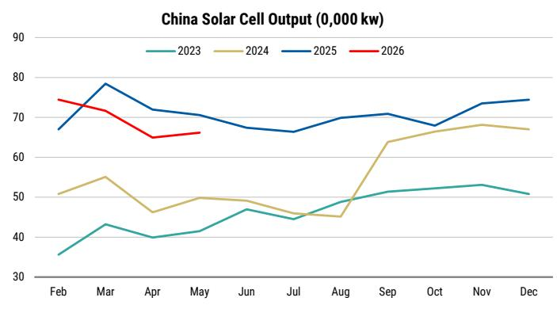
来源：彭博

图表12：中国太阳能出口此前抵消了国内需求的下降，但随着增值税退税的取消，这些也在回落
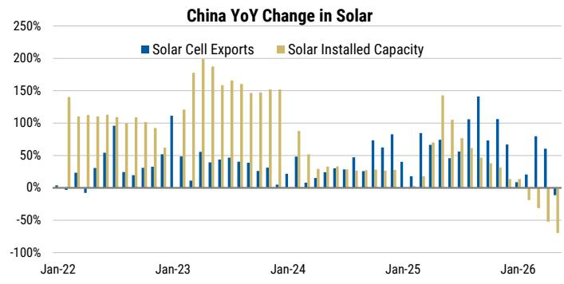
来源：中国海关，彭博

2026年可能再次下降。潘多拉（由Grace Smalley覆盖）正在转向镀铂珠宝，远离纯银，而蒂芙尼也在转向黄金。中国的白银进口年初强劲，也许是一些金属从迪拜转移过来，但这些也已大幅下降。

图表13：珠宝需求一直在下降

来源：白银协会

图表14：中国的白银进口也已大幅下降
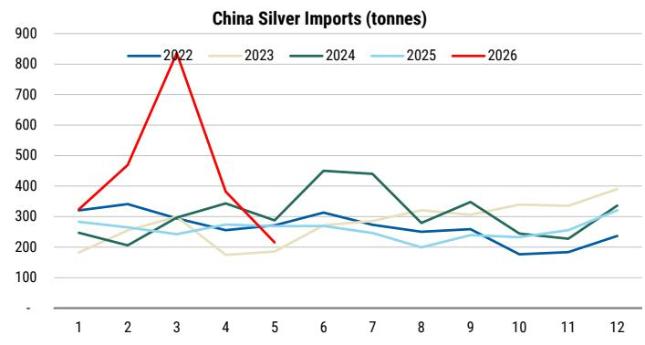
来源：中国海关

宏观逆风依然存在：与铂金和钯金一样，白银年初至今下跌约23%，而黄金仅下跌8%，这表明工业需求逆风以及宏观挑战都损害了需求。这在白银与黄金的相关性中也很明显，该相关性从2025年下半年的98%降至2026年上半年的79%。由于白银近期表现不佳，金银比已反弹至70倍（从1月底46倍的低点），符合我们的长期估计。

图表15：白银ETF持仓在2026年呈下降趋势
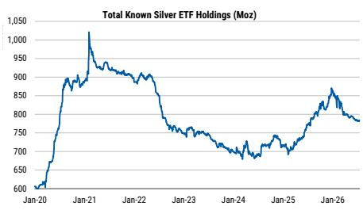
来源：彭博

ETF仍然缺席，但有重新参与的空间：彭博报告的总已知白银ETF持仓在2025年底左右达到约8.7亿盎司的峰值，但在2026年已下降至7.84亿盎司，下降了10%，而黄金持仓从峰值下降了5%。ETF流出可能是由一些获利了结引发的，此前白银在2025年翻了一番多，以及美联储更为鹰派的前景推高了实际回报表现，也威胁到了白银的工业需求。

与黄金类似，我们认为，重新参与需要更强烈的预期，即美联储加息可以避免，以及一条可信的回归降息路径，同时工业/增长前景也更加稳定。我们预计今年的购买量将显著放缓，但假设ETF仍是净买家，这与MS认为美联储今年可以按兵不动的观点一致。不过，如果美联储最终加息，我们可能会看到更多的下行风险。

MS展望：金银比已反弹至70倍，符合我们的长期估计。我们认为，到第四季度，白银的上行空间略大于黄金，原因是白银近期表现不佳，如果白银重新与铜建立联系或ETF恢复购买，这种情况可能会出现。我们将继续关注美国的利率发展和即将公布的经济数据，这些数据可能支持ETF的重新参与。如果铜价上涨且相关性重新出现，白银也可能面临上行风险，但太阳能疲软可能仍是一个逆风。与黄金相比，COMEX的白银持仓目前持平，表明读者目前仍在观望。

## 本周回顾

基本金属：基本金属上周表现不一，中东紧张局势再度升温。铝价周环比上涨0.4%，霍尔木兹海峡的任何进一步中断都可能限制该地区流出的恢复。LME铜价周环比上涨0.3%，因LME库存继续下降；然而，COMEX铜价周环比下跌0.3%，可能是由于对中东局势再次升级的宏观影响敞口较大。镍价上涨1.3%，中东紧张局势可能进一步限制硫磺流向印度尼西亚的HPAL业务。铅和锌分别周环比下跌0.7%和2.5%。

贵金属：中东紧张局势的再次升级上周打压了黄金和白银，尽管美国CPI数据较为温和，但通胀担忧和美联储路径的不确定性仍在持续。黄金和白银分别周环比下跌2.5%和6.65%。铂金下跌2.3%，钯金下跌2.5%。

散货：散货上周表现不一。铁矿石方面，由于黑德兰港罢工导致的供应限制和较高的运费，支撑价格在周中反弹至100美元/吨，尽管价格在周五略有回落，最终周环比上涨0.8%。冶金煤周环比下跌2.4%，因中国钢铁前景疲软。动力煤周环比上涨1.1%，随着中东紧张局势再次升级，跟踪能源综合体的其他品种走高。

图表16：基本金属价格指数（12个月滚动）
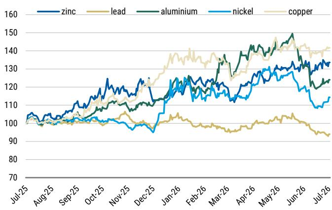
来源：彭博，MS

图表17：贵金属指数（12个月滚动）
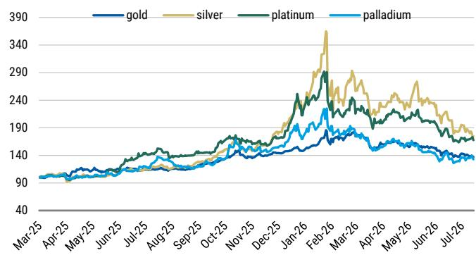
来源：彭博，MS

图表18：散货商品价格指数（12个月滚动）
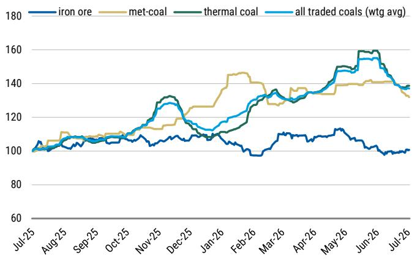
来源：Platts，彭博，MS

## MS价格预测

图表19：MS商品价格预测摘要（2026年7月8日设定）

<table><tr><td>商品组</td><td>单位</td><td>2026年第二季度a</td><td>2026年第三季度e</td><td>2026年第四季度e</td><td>2027年第一季度e</td><td>2027年第二季度e</td><td>2027年第三季度e</td><td>2027年第四季度e</td><td>2028年第一季度e</td><td>2025年e</td><td>2026年e</td><td>2027年e</td><td>2028年e</td><td>2029年e</td><td>2030年e</td><td>2031年e</td><td>长期实际</td><td>长期名义</td></tr><tr><td colspan="19">基本金属</td></tr><tr><td rowspan="2">LME铝</td><td>美元/磅</td><td>1.62</td><td>1.50</td><td>1.36</td><td>1.32</td><td>1.32</td><td>1.27</td><td>1.27</td><td>1.27</td><td>1.20</td><td>1.48</td><td>1.29</td><td>1.27</td><td>1.36</td><td>1.36</td><td>1.36</td><td>1.13</td><td>1.30</td></tr><tr><td>美元/吨</td><td>3,565</td><td>3,300</td><td>3,000</td><td>2,900</td><td>2,900</td><td>2,800</td><td>2,800</td><td>2,800</td><td>2,638</td><td>3,265</td><td>2,850</td><td>2,800</td><td>3,000</td><td>3,000</td><td>3,000</td><td>2,500</td><td>2,871</td></tr><tr><td rowspan="2">LME铜</td><td>美元/磅</td><td>6.04</td><td>6.12</td><td>6.46</td><td>6.03</td><td>5.90</td><td>5.81</td><td>5.67</td><td>5.67</td><td>4.56</td><td>6.11</td><td>5.85</td><td>5.67</td><td>5.44</td><td>5.22</td><td>5.22</td><td>4.40</td><td>5.05</td></tr><tr><td>美元/吨</td><td>13,317</td><td>13,500</td><td>14,250</td><td>13,300</td><td>13,000</td><td>12,800</td><td>12,500</td><td>12,500</td><td>10,053</td><td>13,471</td><td>12,900</td><td>12,500</td><td>12,000</td><td>11,500</td><td>11,500</td><td>9,700</td><td>11,141</td></tr><tr><td rowspan="2">COMEX铜</td><td>美元/磅</td><td>6.18</td><td>6.43</td><td>6.85</td><td>6.46</td><td>6.31</td><td>6.15</td><td>6.01</td><td>5.78</td><td>4.85</td><td>6.32</td><td>6.23</td><td>5.78</td><td>5.55</td><td>5.32</td><td>5.32</td><td>#N/A</td><td>#N/A</td></tr><tr><td>美元/吨</td><td>13,627</td><td>14,175</td><td>15,105</td><td>14,231</td><td>13,910</td><td>13,568</td><td>13,250</td><td>12,750</td><td>10,691</td><td>13,935</td><td>13,740</td><td>12,750</td><td>12,240</td><td>11,730</td><td>11,730</td><td>#N/A</td><td>#N/A</td></tr><tr><td rowspan="2">LME镍</td><td>美元/磅</td><td>8.20</td><td>7.48</td><td>7.48</td><td>7.94</td><td>7.94</td><td>7.94</td><td>7.48</td><td>7.48</td><td>6.94</td><td>7.76</td><td>7.82</td><td>7.48</td><td>7.71</td><td>8.16</td><td>8.16</td><td>7.44</td><td>8.54</td></tr><tr><td>美元/吨</td><td>18,080</td><td>16,500</td><td>16,500</td><td>17,500</td><td>17,500</td><td>17,500</td><td>16,500</td><td>16,500</td><td>15,294</td><td>17,101</td><td>17,250</td><td>16,500</td><td>17,000</td><td>18,000</td><td>18,000</td><td>16,400</td><td>18,836</td></tr><tr><td rowspan="2">LME锌</td><td>美元/磅</td><td>1.57</td><td>1.54</td><td>1.61</td><td>1.50</td><td>1.47</td><td>1.41</td><td>1.32</td><td>1.32</td><td>1.31</td><td>1.55</td><td>1.42</td><td>1.32</td><td>1.32</td><td>1.36</td><td>1.36</td><td>1.27</td><td>1.46</td></tr><tr><td>美元/吨</td><td>3,457</td><td>3,400</td><td>3,550</td><td>3,300</td><td>3,250</td><td>3,100</td><td>2,900</td><td>2,900</td><td>2,879</td><td>3,410</td><td>3,138</td><td>2,900</td><td>2,900</td><td>3,000</td><td>3,000</td><td>2,801</td><td>3,217</td></tr><tr><td rowspan="2">LME铅</td><td>美元/磅</td><td>0.89</td><td>0.86</td><td>0.88</td><td>0.88</td><td>0.91</td><td>0.93</td><td>0.95</td><td>1.00</td><td>0.90</td><td>0.88</td><td>0.92</td><td>1.00</td><td>1.01</td><td>1.13</td><td>1.13</td><td>1.02</td><td>1.17</td></tr><tr><td>美元/吨</td><td>1,955</td><td>1,900</td><td>1,950</td><td>1,950</td><td>2,000</td><td>2,050</td><td>2,100</td><td>2,200</td><td>1,978</td><td>1,934</td><td>2,025</td><td>2,200</td><td>2,238</td><td>2,500</td><td>2,500</td><td>2,250</td><td>2,584</td></tr><tr><td colspan="19">贵金属</td></tr><tr><td>黄金</td><td>美元/盎司</td><td>4,521</td><td>4,200</td><td>4,450</td><td>4,700</td><td>4,900</td><td>5,100</td><td>5,200</td><td>4,500</td><td>3,469</td><td>4,509</td><td>4,975</td><td>4,500</td><td>4,000</td><td>4,000</td><td>4,000</td><td>2,500</td><td>2,871</td></tr><tr><td>白银</td><td>美元/盎司</td><td>73.1</td><td>64.6</td><td>65.4</td><td>67.1</td><td>70.0</td><td>72.9</td><td>74.3</td><td>64.3</td><td>40.5</td><td>71.7</td><td>71.1</td><td>64.3</td><td>57.1</td><td>57.1</td><td>57.1</td><td>31.3</td><td>35.9</td></tr><tr><td>铂金</td><td>美元/盎司</td><td>1,930</td><td>1,550</td><td>1,580</td><td>1,610</td><td>1,660</td><td>1,710</td><td>1,760</td><td>1,810</td><td>1,291</td><td>1,819</td><td>1,685</td><td>1,900</td><td>2,095</td><td>2,148</td><td>2,202</td><td>1,940</td><td>2,228</td></tr><tr><td>钯金</td><td>美元/盎司</td><td>1,425</td><td>1,100</td><td>1,150</td><td>1,200</td><td>1,250</td><td>1,275</td><td>1,300</td><td>1,300</td><td>1,160</td><td>1,349</td><td>1,256</td><td>1,312</td><td>1,345</td><td>1,379</td><td>1,414</td><td>1,250</td><td>1,436</td></tr><tr><td colspan="19">散货</td></tr><tr><td>铁矿石（61% Fe粉矿，cfr中国北方）</td><td>美元/吨</td><td>105</td><td>93</td><td>92</td><td>92</td><td>92</td><td>92</td><td>95</td><td>95</td><td>102</td><td>99</td><td>93</td><td>94</td><td>100</td><td>100</td><td>100</td><td>90</td><td>103</td></tr><tr><td>硬焦煤（现货，fob澳大利亚）</td><td>美元/吨</td><td>238</td><td>230</td><td>235</td><td>230</td><td>225</td><td>225</td><td>230</td><td>220</td><td>188</td><td>235</td><td>228</td><td>214</td><td>215</td><td>215</td><td>215</td><td>191</td><td>219</td></tr><tr><td>动力煤（现货，fob纽卡斯尔）</td><td>美元/吨</td><td>135</td><td>145</td><td>140</td><td>140</td><td>135</td><td>125</td><td>125</td><td>125</td><td>107</td><td>136</td><td>131</td><td>124</td><td>130</td><td>135</td><td>135</td><td>120</td><td>138</td></tr><tr><td colspan="19">其他</td></tr><tr><td>锰矿（44%）</td><td>美元/吨度</td><td>5.3</td><td>5.4</td><td>5.4</td><td>5.4</td><td>5.5</td><td>5.5</td><td>5.5</td><td>5.6</td><td>4.6</td><td>5.3</td><td>5.5</td><td>5.6</td><td>5.7</td><td>5.8</td><td>5.8</td><td>5.2</td><td>6.0</td></tr><tr><td>氧化铝（现货，fob澳大利亚）</td><td>美元/吨</td><td>308</td><td>320</td><td>320</td><td>325</td><td>325</td><td>325</td><td>325</td><td>350</td><td>362</td><td>314</td><td>325</td><td>350</td><td>350</td><td>380</td><td>400</td><td>380</td><td>436</td></tr><tr><td>碳酸锂（中国现货，不含增值税）</td><td>美元/吨</td><td>22,370</td><td>24,000</td><td>20,000</td><td>19,000</td><td>18,500</td><td>18,000</td><td>18,000</td><td>17,000</td><td>9,300</td><td>21,433</td><td>18,375</td><td>16,000</td><td>14,000</td><td>14,000</td><td>16,000</td><td>14,800</td><td>16,998</td></tr><tr><td>钴</td><td>美元/磅</td><td>26.5</td><td>27.0</td><td>27.0</td><td>27.0</td><td>27.0</td><td>27.0</td><td>27.0</td><td>20.0</td
