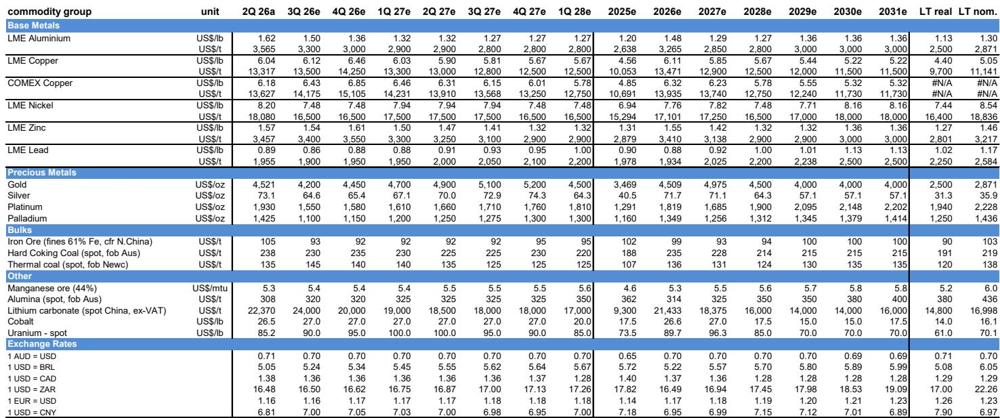
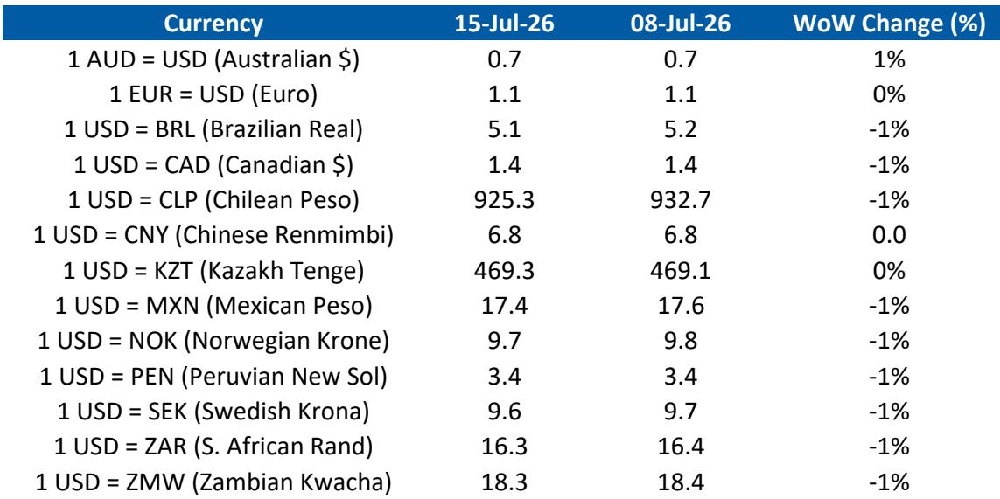
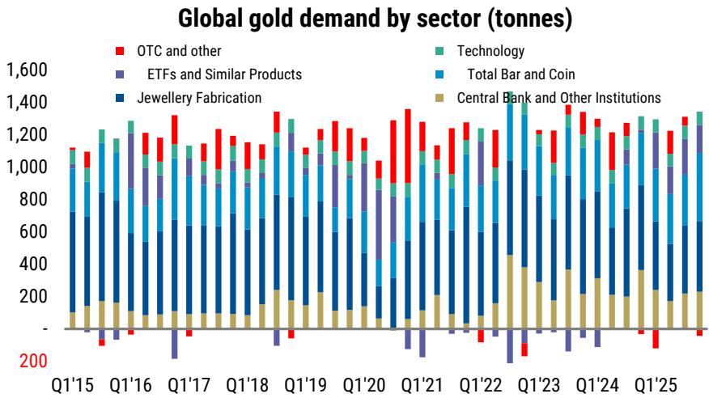

# 黄金与白银：市场观察与趋势分析

## 关键变量：ETF资金流向与宏观环境预期

2026年下半年贵金属市场最关键的变量，并非各国央行储备、工业需求或地缘避险，而是交易所交易基金（ETF）的重新参与。2025年，ETF曾贡献黄金需求的20%和白银需求的15%，但自中东局势变化影响市场对宏观政策的预期后，ETF已转为净卖出。若缺乏ETF资金流入，即便其他需求支柱有所改善，贵金属价格仍面临挑战。

当前黄金报价约每盎司4000美元，较年内高点回落约8%；白银年内累计下跌约23%，表现明显弱于黄金。这种分化反映出市场正受到两股相反力量的作用：各国央行加速购入为价格提供支撑，而ETF持续减持则压制上行空间。若黄金要在2026年第四季度达到每盎司4450美元的目标，白银实现约16%的预期涨幅，市场需要的不仅是官方部门购买的稳定，更需要宏观政策预期的明确转变。

需求结构的变化值得关注。2025年，ETF作为边际买家，吸纳了约800吨黄金，规模接近央行购买量。而2026年上半年，ETF仅增持18吨，其中6月单月净卖出74吨。北美地区是这一逆转的主要推动力，6月流出42吨，使上半年该地区净卖出达60.5吨。此前引领资金流入的地区，如今成为持有量最易调整的部分，成为市场两端的摇摆力量。在美国读者看到明确的政策路径变化之前，这一动态难以逆转。

## 央行购买加速：为黄金提供更坚实的支撑

关于各国央行抛售黄金的说法被夸大了。尽管土耳其和俄罗斯在第一季度有可观规模的卖出，但这些压力正在减弱，其他主要市场的购买正在加速。中国人民银行已连续20个月购入黄金，并在价格回调后加快购买，6月单月购入14.9吨。上半年累计购入40.1吨，已超过2025年全年的25.8吨。波兰上半年增持63.6吨，按时间调整后超过2025年全年节奏。乌兹别克斯坦增持32.7吨，而2025年全年仅为7.8吨。

卖出方的动能也在减弱。土耳其的销售在5月已放缓至仅2.7吨，远低于冲突后两周内约60吨的规模。俄罗斯上半年卖出34.2吨，这反映了军事支出和制裁带来的特定财政压力，联邦赤字扩大至6万亿卢布（约830亿美元）。阿塞拜疆通过国家石油基金的销售则源于机械性阈值：价格上涨后，黄金在储备中的占比超过了基金自设的35%上限。

净效果是市场从3月的净卖出50.6吨转为5月的净买入41.2吨。上半年可识别的购买量为84.4吨，较2025年同期下降30%，但下半年仍有进一步恢复空间。央行需求对价格不敏感且独立于政策周期，无需降息即可持续，提供了比其他需求来源更可靠的结构性支撑，但仅凭此不足以推动价格上行，市场仍需ETF买家回归。

## ETF回归的条件：不止于通胀数据稳定

黄金ETF持仓与宏观利率呈负相关，美国资金流对政策预期最为敏感。历史模式显示，ETF购买在2024年末首次降息前几个月才真正开始。中东局势变化使市场定价转向加息预期后，美国读者持有黄金的机会成本上升最为显著，而他们正是边际资金流的主导者。

市场目前定价年内加息1.4次，低于月初的1.7次，此前6月CPI数据略低于预期。报告中的美国研究团队认为，美联储今年可维持当前利率，明年降息两次，并指出通缩进程已开始。但单月数据不足以形成趋势，中东局势的再度升级为利率路径增添了不确定性。ETF若要实质性重新参与，市场需要确信美联储至少能维持当前利率并转向明年降息。这可能需要时间和更多支持性数据，意味着持有黄金需要耐心。

北美地区资金流出的集中并非偶然。美国上市基金是黄金ETF资本的边际池，往往主导周期的两端。由于北美引领了此前的全球资金流入，当情绪转变时，该地区也拥有最多近期积累的持有量需要调整，尤其是那些在更高价位增持的部分。即便这些流出资金部分回归，考虑到全球ETF持仓年内基本持平，也可能带来可观的上行空间。主要下行风险仍是中东局势再度升级和油价上涨，这可能重燃通胀担忧并推高利率预期。

## 白银面临更复杂的挑战：工业需求变化打破传统关联

白银表现弱于黄金，并非仅仅是宏观逆风所致。它反映了工业需求的结构性变化，打破了白银与黄金及铜的传统关联。2026年上半年，白银与黄金的相关系数为79%，低于2025年下半年的98%；与铜的相关系数从95%降至接近零。这表明白银的驱动因素正在变化，因其终端需求面临压力。

光伏领域是主要压力来源，该领域2025年占白银需求的17%，高于2019年的7.4%。白银来自太阳能的需求在2025年已同比下降6%，白银协会预测2026年将进一步下降19%。中国太阳能电池产量上半年同比下降2%，安装量在高基数上下降70%，反映了2025年5月实施的电价政策变化。中国还计划征收消费税，可能进一步影响需求。出口上半年增长43%提供了一定支撑，但随着增值税退税逐步取消，5月出口量有所放缓。

最显著的结构性风险是替代。2025年，白银占太阳能电池板成本的30-35%，为制造商降低白银用量提供了强大动力。中国最大的太阳能生产商隆基已启动新工厂，用铜替代白银，产能爬坡需三个月。报告模型显示2024年是太阳能领域白银需求的高峰，尽管全球安装量可能仍会上升，但节约使用和替代预计将持续降低每块电池板的白银含量。

珠宝需求也面临压力。高企且波动的价格促使该行业节约使用和替代。潘多拉正从纯银转向镀铂金珠宝，蒂芙尼则转向黄金。中国白银进口年初强劲，可能反映了从迪拜转移的金属，但此后大幅下降。太阳能和珠宝领域的逆风意味着白银的工业需求故事比铜更具挑战，这也解释了两者为何脱钩。

## 贵金属市场观察框架：三种情景及其含义

黄金和白银的前景可归纳为三种情景，每种情景对持仓和时机有不同的含义。

基准情景假设美联储今年维持利率，明年降息两次，与报告美国研究团队的看法一致。在此情景下，ETF卖出应会放缓并最终逆转，但重新参与可能集中在第四季度。黄金将在2026年第四季度达到每盎司4450美元，白银因较高贝塔值和铜的积极前景，涨幅略高至16%。央行购买提供支撑，ETF资金流入的任何回归将推动价格回升。

上行情景涉及ETF购买以快于预期的速度回归，由更明确的通缩数据或中东局势缓和触发。在此情况下，黄金可能升至每盎司4500美元以上，白银因其较高贝塔值和近期表现落后而表现更佳。黄金白银比率已从1月下旬的46倍低点回升至70倍，随着白银重新与黄金和铜关联，该比率将再次压缩。技术因素也将转为支持：黄金目前交易于200日移动均线下方，50日移动均线近期下穿200日移动均线形成"死叉"模式，使商品交易顾问倾向于在反弹时卖出。持续回升至200日移动均线上方可能逆转这一压力并增强看涨动能。

下行情景涉及中东局势再度升级、油价上涨以及加息预期回归。在此情景下，ETF流出将加速，黄金可能测试每盎司4000美元以下的支撑位。白银因工业需求逆风以及衰退环境进一步削弱太阳能和珠宝需求的风险，将受到更大冲击。黄金白银比率将升至70倍以上，白银与铜的相关系数将保持接近零。央行购买将提供一定支撑，但不足以抵消ETF清算和工业需求恶化。

对市场观察者而言，关键启示是贵金属市场目前受两股独立力量驱动：提供支撑的结构性央行需求，以及决定上限的周期性ETF需求。前者已经到位，后者需要宏观政策预期的转变，这可能需要时间。耐心是持有黄金或白银的关键变量，入场时机与方向同样重要。

*仅供参考。部分内容可能基于源材料通过AI辅助生成、翻译、摘要或编辑，可能存在遗漏或错误。请独立核实。本文不构成专业建议。*

仅供参考。部分内容可能基于源材料通过AI辅助生成、翻译、摘要或编辑，可能存在遗漏或错误。请独立核实。本文不构成专业建议。

