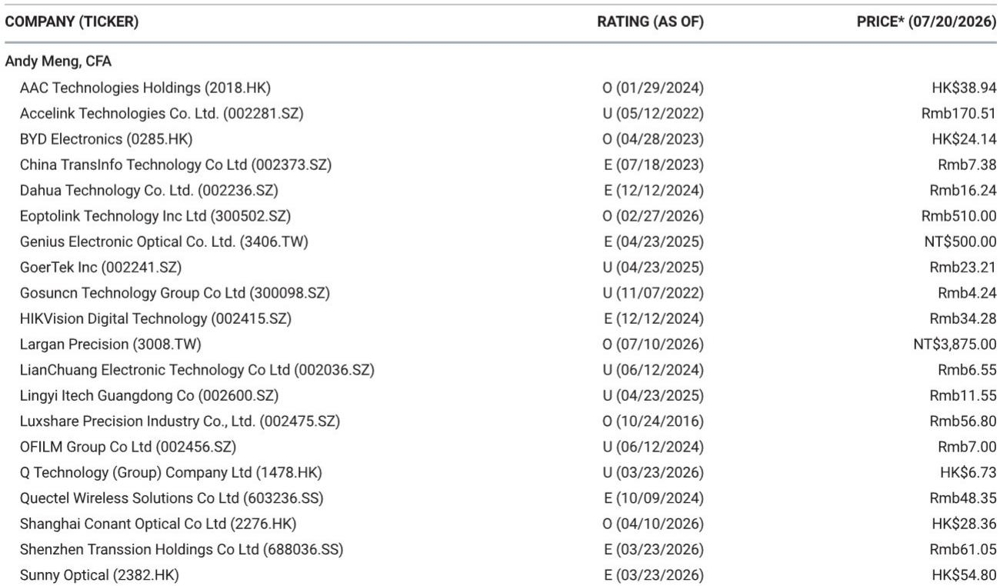
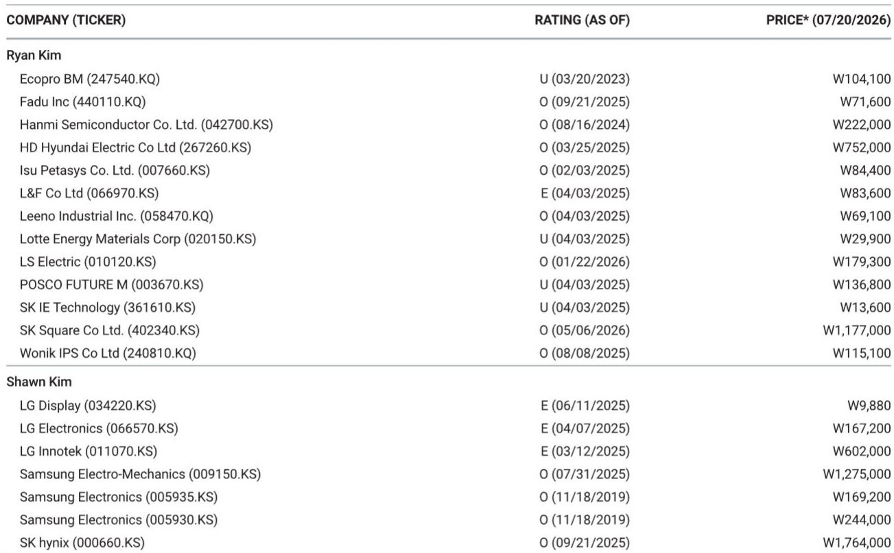
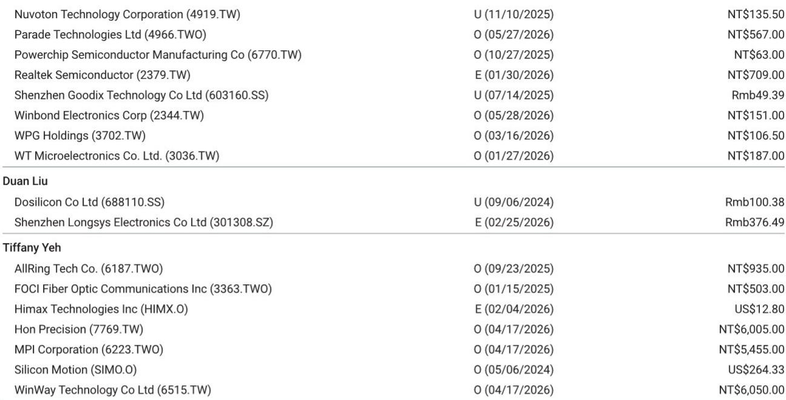

# MS：TFT-LCD面板价格7月TV环比跌2%IT持平

2026年7月，TFT-LCD面板价格走势出现明确分化。根据MS最新发布的月度价格追踪，TV面板价格在7月环比下跌2%，而IT面板（显示器与笔记本）价格则环比持平。这一变化并非意外，而是上半年品牌提前备货后的自然回调。报告认为，当前面板相关公司的估值不确定性已趋于平衡，基于先进封装玻璃基板机会来评估面板公司仍为时过早。

TV面板价格下跌的幅度在各尺寸间略有差异。32英寸和43英寸面板跌幅最大，均为3%；55英寸、65英寸和75英寸跌幅在1%至2%之间。下跌的直接原因是品牌客户在经历了1H26的积极采购后，订单动能减弱。2026年上半年，冬奥会、世界杯以及中国618购物节等大型促销活动驱动了明显的提前拉货，使得2H26的面板出货量大概率低于季节性水平。报告预计，3Q26 TV面板价格按季度均值计算将环比下降低个位数百分比。不过，供给侧纪律——包括中国面板厂从追求规模转向追求盈利、补贴减少以及LGD广州8.5代线出售给TCL、Sharp关闭堺市10代线等整合动作——应能防止价格出现大幅下滑。下一个关键观察节点是8月至9月，届时品牌将开始为年末促销备货。

IT面板价格在7月保持平稳。显示器与笔记本面板均未出现价格变动。尽管2H26需求同样因上半年提前拉货而节奏变化，但面板厂面临显著的零部件成本不确定性，短期内不愿在价格上让步。报告预计3Q26 IT面板价格按季度均值计算将环比持平。

> **KC评论：** 面板价格的分化本质上是需求节奏的差异。TV面板的下跌是上半年透支的必然结果，而IT面板的僵持则反映了成本端与需求端之间的角力。对于关注面板周期的读者，8月至9月的品牌备货力度将是判断TV面板价格是否触底的关键信号。

在公司层面，报告认为经过近期回调，估值已趋于合理。对于台湾面板厂友达和群创，报告指出先进封装玻璃基板的增量贡献可能需要更长时间才能兑现，且随着行业向量产推进，竞争可能加剧。在中国面板厂中，报告更偏好京东方而非TCL，理由是京东方具有规模优势，且在玻璃核心基板领域进展更快。报告同时提到，康宁的显示业务与面板厂产能利用率高度相关，且是其最大的盈利贡献来源。

报告还覆盖了驱动IC供应链。对于联咏，报告维持谨慎看法，认为其面临PC、智能手机和汽车需求变化、毛利率不确定性以及缺乏新增长动力的挑战。但报告也指出，联咏的OLED驱动IC路线图在性能和成本方面均优于韩国同行，有助于其在苹果iPhone供应链中获取份额。

For informational purposes only. Portions may be generated,translated,summarized,or edited with AI assistance based on source materials and may contain omissions or errors. Please verify independently. This is not investment,legal,tax,accounting,or other professional advice.

For informational purposes only. Portions may be generated,translated,summarized,or edited with AI assistance based on source materials and may contain omissions or errors. Please verify independently. This is not investment,legal,tax,accounting,or other professional advice.

