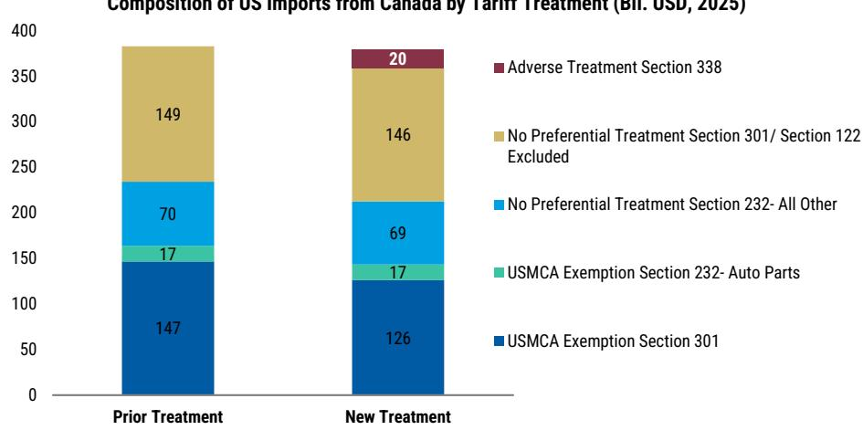
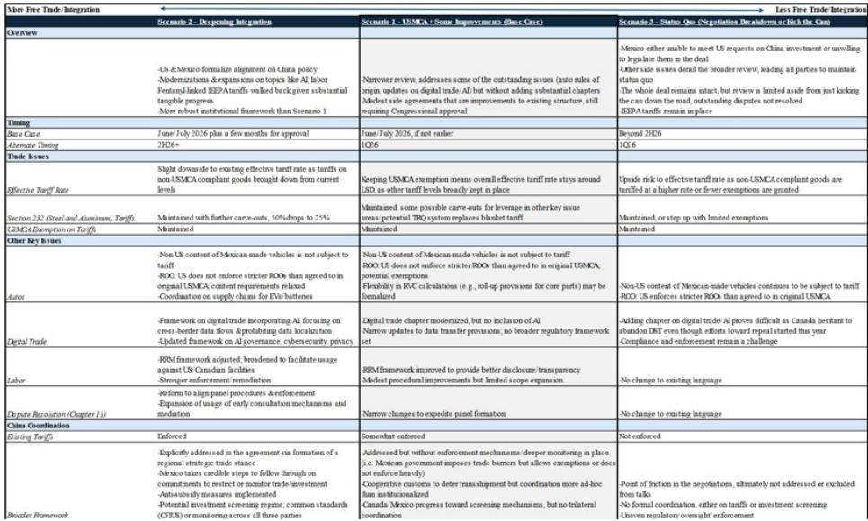
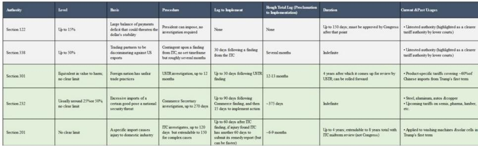

# Section 338 关税对加拿大而言是可控的宏观冲击，但为双层USMCA创造了危险先例

美国已宣布根据Section 338对约200亿加元的加拿大商品加征50%关税，这是一项未经测试的贸易授权，不豁免符合USMCA规定的产品。直接的宏观影响有限：加拿大商品的有效关税率上升约2个百分点至5-6%，而美国整体关税率仅上升0.2个百分点。然而，其战略意义远超直接的经济影响。Section 338突破了此前保护大多数加拿大贸易免受关税影响的USMCA保护条款，开创了一个先例，即市场准入取决于双边政治谈判而非条约规则。对于加拿大央行而言，风险在于出口疲软可能中断预期的投资和就业复苏——这一传导渠道已在制造业就业数据中显现。对于美元/加元汇率，任何情绪驱动的走弱都应被淡化，因为能源和其他战略重要的大宗商品出口未受影响。30天的实施窗口为谈判留有余地，但核心尾部风险并非关税本身：而是出现一个分化的USMCA，即协议形式上存续，但实际市场准入变得越来越具有自由裁量权。

这一时机放大了风险。加拿大央行7月展望预计2027年和2028年增长1.8%，这越来越依赖于出口。出口预计将为2026年GDP增长贡献0.5个百分点，与4月预测中负0.2个百分点形成鲜明对比。这一改善依赖于USMCA豁免基本保持完整，以及美国对加拿大商品的平均关税率约为5%。Section 338在边际上削弱了这两个假设。这些关税本身可能不足以推翻预测，但它们侵蚀了预测所依赖的条件。

## Section 338突破USMCA保护，使优惠准入取决于政治自由裁量权

Section 338行动最重要的特征并非50%的关税率，而是实施该关税的法律授权。与Section 122关税或拟议的强迫劳动Section 301制度不同，Section 338不因产品符合USMCA规则而豁免。符合USMCA可能影响产品的普通关税率，但不会取消额外的Section 338关税。这提高了加拿大商品相对于全球同行不享有关税优势的比例。

已受Section 232约束的商品完全排除在Section 338之外，这就是附件中列出的某些电气控制面板最终不面临额外关税的原因。合格的民用航空产品也被排除。因此，在考虑这些排除后，有效覆盖范围降至约180亿加元。但原则很明确：该措施突破了此前保护大部分加拿大贸易免受早期行动影响的保护措施。许多列出的商品目前面临基于Section 122的关税，一旦这些关税到期，它们可能会转入拟议的强迫劳动Section 301框架。这两种制度都考虑了对符合USMCA产品的保护。Section 338突破了仍在其范围内的商品的这种保护。

报复性商品篮子远远超出了涉及美国机动车、酒精饮料和乳制品等基础争端的产品。它包括电气设备、机械、塑料和包装、家具、木材和纸制品、食品、酒精和其他消费品。重要的排除包括能源、钾肥、选定的关键矿产、鱼类以及已受Section 232限制的产品。该行动也紧随最近与加拿大处理跨境野火烟雾相关的新闻。综合来看，这些措施强化了贸易政策正变得更加自由裁量、双边和针对特定问题的风险，即使在USMCA框架内也是如此。

## 商品篮子针对加拿大难以替代的中间产品和消费领域，将成本转移至利润和价格

该产品篮子的三个特征对加拿大很重要。首先，它将关税压力扩大到早期升级中针对的汽车、金属和重工业部门之外。其次，受影响的贸易大部分由嵌入美国生产和分销网络的中间产品组成。第三，由于加拿大在美国进口中占有较高份额，或者商品体积大、易腐烂或与现有供应链紧密整合，其中一些产品可能难以快速替代。

按总附件计算，电气和电子设备是最大的可识别类别，包括电气控制面板、通信设备、导体、印刷电路、雷达设备及相关组件。然而，一些最大的电气产品线因已受Section 232覆盖而被排除。化学品、塑料和橡胶也很重要，特别是塑料袋、瓶子、薄膜、封盖、包装产品、聚合物、涂料和橡胶组件。木材、纸张和包装构成另一个主要集群，包括单板、中密度纤维板、胶合板、涂布和未涂布纸、瓦楞纸箱和其他包装材料。家具、座椅和照明受到实质性影响，工业机械产品如制冷设备、压缩机、过滤设备和包装机械也是如此。酒精、食品制剂、园艺产品、水泥、个人护理产品和珠宝占较小但商业上可见的面向消费者的部分。

这一构成很重要，因为消费品出口在关税升级的早期阶段相对保持韧性。广泛的国家层面措施通常考虑对符合USMCA的加拿大产品提供保护。Section 338取消了仍在其范围内的列名商品的这种保护。按总HS6映射计算，该篮子覆盖了加拿大对美消费品出口的10%以上，尽管在应用产品级排除后，实际应税风险略低。

加拿大在几个受影响的类别中是美国的 dominant 供应商，包括某些针叶单板、烘焙混合物、活植物、纸张、利口酒、塑料容器和波特兰水泥。最重要的风险结合了高加拿大市场份额与可观的贸易价值，特别是纸张和包装、塑料、食品和选定的木材材料。由于其中许多商品体积大、易腐烂或嵌入现有供应链，短期替代可能成本高昂。因此，关税负担可能通过更高的美国价格、更低的加拿大利润以及针对特定产品豁免的压力来分担。

该关税篮子主要不是一项AI硬件措施，加拿大在最大的全球技术类别中仍然是相对较小的供应商。总附件包括网络设备、通信硬件、光纤电缆和与数字及数据中心基础设施相关的电气控制系统。然而，由于某些电气控制产品根据Section 232被排除，且合格的民用航空产品也被排除，实际风险较小。更广泛地扩展到这些类别将对加拿大需要扩大制造业参与的高增长领域施加额外压力。

## 加拿大央行的出口导向复苏是关键传导渠道，制造业就业已显示模式

关税公告的时机很重要，因为加拿大央行更积极的展望越来越依赖于出口。尽管央行在疲软的第一季度后将2026年年度GDP增长预测下调至0.7%，但它将2027年和2028年的预测增长提高至1.8%，并更加确信经济已进入扩张。这一改善主要不是国内需求的故事。出口对2026年GDP增长的贡献被修正为正向0.5个百分点，而央行4月预测为负0.2个百分点。更强的出口预计将支持国内生产，鼓励商业投资，并最终带来更强劲的招聘。

央行认为额外的支持来自更强的美国投资，特别是AI和数据中心相关的资本支出。这种投资应增加对加拿大原材料、金属、电气设备和其他制造投入的需求。该预测还假设USMCA豁免基本保持完整，并纳入了美国对加拿大商品的平均关税率约为5%。Section 338在边际上削弱了这两个假设。

已宣布的关税本身可能不足以推翻央行的预测。然而，更强的2027-28年增长前景取决于出口复苏能否持续。货币政策报告明确将更弱的出口反弹视为下行风险：较低的外国需求将降低公司投资和招聘的激励，削弱收入和消费，并增加通胀的下行压力。因此，相关风险不仅限于净出口的机械性减少。而是更弱的出口中断了从外部需求到投资、就业和国内支出的更广泛传导。

行业层面分析表明，这种传导可能已在制造业就业中显现。面临增量关税风险低于1%的制造业部门，其就业相对于2024年平均水平有适度增长。面临1%至5%关税风险的部门就业下降约2%，而面临5%以上风险的部门就业下降约2.5%至3%。这种关系本身并不建立因果关系。特定行业的需求、大宗商品周期和结构性变化也会影响就业。然而，这种梯度与关税压力更重地影响最暴露行业的招聘和就业是一致的。

这一点很重要，因为当前的劳动力市场调整主要通过疲软的招聘而非大规模裁员进行。2026年6月失业率为6.5%，自2024年底以来一直保持在约6.5%至7%之间。公司通常保留现有员工，但仍不愿增加人手，而工资增长接近3%。Section 338将这一风险扩大到汽车、金属和重制造业之外。它将纸张和包装、塑料、家具、食品加工、电气设备、机械和其他消费品行业更直接地带入关税冲击。因此，就业效应可能首先通过更弱的招聘和更慢的劳动力市场松弛吸收出现。如果出口未能按预期复苏，央行预期的序列——从更强的出口，到更高的投资，再到更强劲的招聘——将被中断。

如果338关税得以维持，它们将为经济增长提供下行风险，并可能打乱央行对潜在经济动力的看法。这可能导致短期内更鸽派的政策利率前景。我们的基准情景仍然是央行在年底前将利率维持在2.25%，尽管实施将增加增长下行风险。

## 读者的决策框架：区分直接宏观冲击与战略先例

对于评估Section 338影响的读者，一个有用的框架将影响分为三个层面：直接贸易效应、间接信心和投资效应，以及结构性制度效应。

直接贸易效应是最可量化且最不令人担忧的。约180亿加元的加拿大出口面临额外50%的关税，使加拿大商品的有效关税率上升约2个百分点。能源、钾肥、关键矿产和Section 232覆盖的商品被排除。受影响的部门主要是中间产品和消费品，加拿大在这些领域的高市场份额和产品特性限制了短期替代。关税负担将在较低的加拿大利润和较高的美国价格之间分担。仅这一层面不足以证明对加拿大宏观前景或加元估值进行重大重新评估的合理性。

间接信心和投资效应更为重要但更难衡量。加拿大央行的复苏叙事依赖于出口推动商业投资和招聘。关税风险较高的制造业部门已显示出较弱的就业结果。如果Section 338扩大了面临逆风的行业范围，它可能恰恰在央行预期商业投资加速时减缓其复苏。对于加元，美元/加元的任何初始上升可能反映较弱的情绪、更高的加拿大特定风险溢价以及更大的央行宽松预期，而非加拿大外部平衡的重大恶化。由于能源和其他战略重要的大宗商品出口基本未受影响，与加元最相关的贸易渠道仍然完好。因此，除非争端扩大或开始导致投资和增长持续疲软，否则我们会淡化关税驱动的美元/加元走强。

结构性制度效应是最重要且最不确定的。Section 338是一项未经测试的授权，关于歧视的认定、ITC的角色及其与USMCA的互动仍存在疑问。然而，总统拥有广泛的自由裁量权来暂停、修改或撤销关税，使产品层面的让步和豁免成为可能。30天的实施窗口为谈判留有余地。但核心尾部风险是分化的USMCA：协议可能形式上存续，而实际市场准入变得越来越双边化和自由裁量。Section 338作为孤立争端是可控的；但作为使USMCA准入取决于双边政治谈判的先例，它对加拿大的出口复苏和制造业地位构成了更大的风险。

对于读者而言，决策框架因此不是关于关税本身是否会实质性改变2026年加拿大GDP增长。而是关于这一行动是否标志着向自由裁量贸易执法的更广泛转变，从而削弱USMCA准入的可预测性。如果答案是肯定的，其影响远远超出180亿加元受影响的贸易，延伸到加拿大央行展望和加拿大资产价格中嵌入的投资、招聘和增长假设。

*仅供参考。部分内容可能基于源材料通过AI辅助生成、翻译、总结或编辑，并可能包含遗漏或错误。请独立核实。这不构成投资、法律、税务、会计或其他专业建议。*

仅供参考。部分内容可能基于源材料通过AI辅助生成、翻译、总结或编辑，并可能包含遗漏或错误。请独立核实。这不构成投资、法律、税务、会计或其他专业建议。

