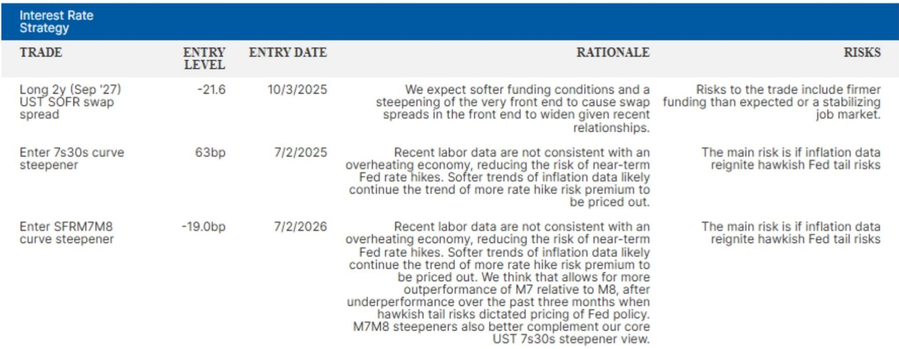
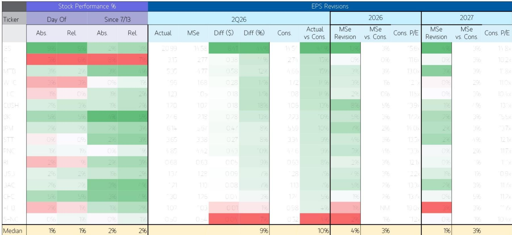
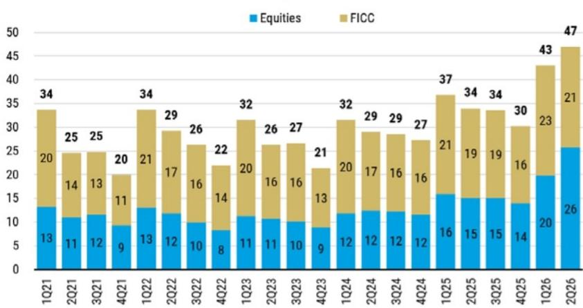

# MS：MS全球宏观论坛-信号解读-登月计划

这份MS全球宏观论坛报告的核心判断是：六月通胀数据为“去通胀”提供了清晰信号，市场对美联储年内加息的定价可能过度。报告同时覆盖了二季度银行财报、中国AI模型进展以及利率策略三个独立但相互关联的主题。

报告认为，六月核心CPI和PCE数据均指向通胀节奏变化。能源价格回落、关税传导效应接近尾声以及住房成本下降是主要驱动力。MS维持其非共识判断：美联储今年将维持利率不变，2027年才会降息两次，总计50个基点。这与当前市场定价形成明显分歧——市场隐含的联邦产品利率路径显示，截至2027年3月，市场定价了接近50个基点的加息，相当于认为加息概率超过50%。

## 1. 二季度银行财报显示宏观环境韧性超预期

已公布财报的16家美国大型银行中，15家每股收益超出市场预期，中位数超预期幅度达10%。资本市场业务表现强劲，公司交易收入同比增长71%，首次在名义金额上超过FICC业务。国际机构业务钱包同比增长46%，其中股权资本市场增长87%，债务资本市场增长41%并创下纪录，并购业务增长27%。贷款增长呈现广泛且强劲的态势，商业贷款增长正在扩散，消费贷款增长则趋于选择性。整体信贷趋势保持良性，问题资产在减少而非转化为损失。

> **KC评论：** 银行财报的超预期并非孤立现象。报告特别指出，AI研究周期仍在加速，且机会正在向宏观环境各领域扩散。这意味着市场对宏观环境的悲观定价可能需要修正，尤其是在银行股估值尚未充分反映这一改善的情况下。

## 2. 六月通胀数据：去通胀信号明确，关税传导接近尾声

六月通胀数据被报告描述为“不是梅西式的一记绝杀”，而是“帽子戏法”——能源、关税和住房三个因素共同推动通胀节奏变化。关税已将价格水平推高约63个基点，但传导效应已基本完成。软件价格仍存在上行不确定性，但整体来看，报告预计六月核心PCE环比仅上涨0.17%，三个月和六个月年化核心PCE通胀率将分别降至3.00%和3.82%，低于五月的3.52%和4.14%。

报告认为，美联储将看到下半年通胀以年化约2.0%的速度运行，从而有能力维持利率不变。但中东局势升级推动WTI原油重回每桶80美元附近，仍是去通胀前景的节奏变化不确定性。此外，AI相关的需求效应可能抵消关税带来的价格变化影响。

## 3. 市场对美联储加息定价过度，回报表现曲线陡化策略有支撑

报告利率策略团队指出，当前市场定价隐含的加息路径与MS宏观环境学家的基准情景存在显著偏差。市场实际上已经替美联储完成了加息——通过推高远期利率路径。如果通胀数据继续软化，加息不确定性溢价将被逐步挤出，这为回报表现曲线陡化策略提供了支撑。

报告建议的7s30s国债曲线陡化交易于7月2日以63个基点入场，逻辑是近期劳动力数据不支持宏观环境过热，降低了美联储近期加息的不确定性。该交易的主要不确定性在于通胀数据重新点燃鹰派尾部不确定性。

## 4. 中国AI模型进展：成本下降可能催生更大算力需求

报告在开篇“早期思考”中提及了中国AI初创公司Moonshot发布的Kimi K3开源大语言模型。该公司声称该模型以相当于美国同类模型40-70%的成本实现了前沿性能。报告谨慎指出，这些声明需要验证，且围绕采用中国开发模型的地缘政治、监管和战略考量需要关注。

但报告认为，这一进展突显了美国以外地区创新的快速步伐，并提出了一个可能性：领先的AI能力可能以更低成本变得日益可及。更广泛的解读是，模型效率的持续提升有潜力降低使用AI执行广泛宏观环境活动的成本，从而引发经典的“杰文斯悖论”——效率提升反而驱动更大的算力需求及相关AI基础设施研究。

对于关注AI基础设施研究的读者而言，这一逻辑链条值得留意：模型效率提升并不必然意味着算力需求见顶，反而可能通过降低使用门槛扩大应用场景，最终推动算力总需求增长。

For informational purposes only. Portions may be generated,translated,summarized,or edited with AI assistance based on source materials and may contain omissions or errors. Please verify independently. This is not investment,legal,tax,accounting,or other professional advice.

For informational purposes only. Portions may be generated,translated,summarized,or edited with AI assistance based on source materials and may contain omissions or errors. Please verify independently. This is not investment,legal,tax,accounting,or other professional advice.

