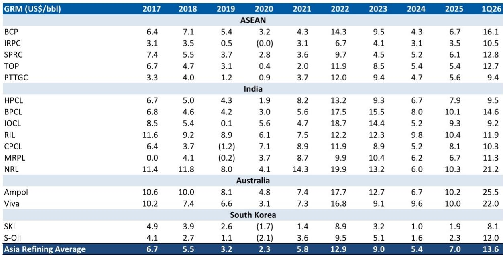
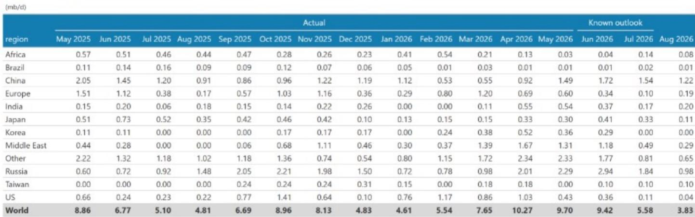
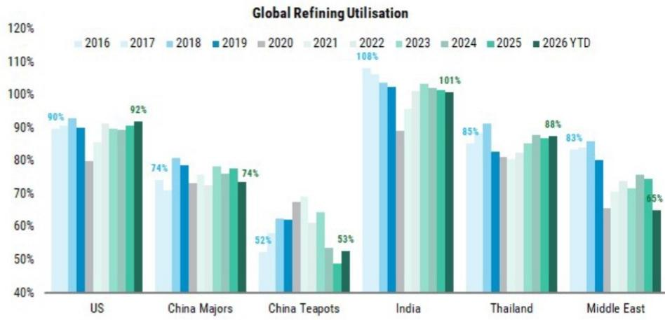

# 研究笔记：全球炼油行业供需格局观察

全球炼油行业在经历六年三次重大冲击后，展现出超出市场预期的韧性。某机构在2026年7月发布的报告中提出一个核心判断：市场高估了新增产能，同时低估了持续发生的供应中断。该机构认为，亚洲炼油商将迎来一个高于历史中周期的盈利环境，柴油和汽油裂解价差在冲突因素消退后仍将比冲突前水平高出约20%。

报告指出，全球炼厂开工率目前约为80%，但这并未反映真实瓶颈。过去三年，亚洲和北美多数炼厂的平均开工率达到95%，印度、泰国和马来西亚的部分炼厂甚至超过100%。那些在当前利润率环境下仍无法满负荷运行的炼厂，可能面临结构性困境。即便在上一轮上行周期中，85%的开工率已是峰值，因为炼厂每年需要计划检修，每三到四年还有一次大型停工。

## 1. 未来三年需求增量约250万桶/日，产能增长不足150万桶/日

报告展示了一组关键供需对比数据：未来三年全球炼油产品需求预计增加约250万桶/日，而同期可确认的产能增长不到150万桶/日。这一缺口意味着炼油系统将持续处于紧绷状态。该机构认为，市场对新增产能的统计过于乐观，部分项目可能延期或无法落地，而现有炼厂的意外停工、地缘政治扰动和原料供应变化，正在制造比预期更多的供给损失。

> **观察评论：** 供需缺口本身不是新闻，但报告强调了一个容易被忽略的细节——即便市场已经意识到供给偏紧，实际可用产能仍可能低于名义产能。2026年全球计划停工数据（见报告Exhibit 4）显示，仅中东和俄罗斯在2026年上半年的停工规模就超过300万桶/日，这些数字往往被市场低估。

## 2. 亚洲各国炼油敞口差异显著，泰国和韩国提供最直接的上行暴露

不同亚洲市场对炼油利润周期的暴露程度并不相同。报告指出，泰国和韩国是炼油上行周期中最纯粹的受益者，这两个国家对成品油产品征收暴利税的限制较少。印度则对柴油和汽油的利润率设定了约20-25美元/桶的上限，这意味着印度炼厂更多受益于其全球最大的新增产能规模，而非利润率弹性。日本和澳大利亚的炼厂利润率受零售端动态影响，但在上行周期中同样能从更高的裂解价差中获益。

报告测算了一个敏感度关系：柴油利润率每上升1美元/桶，对该机构重点覆盖的炼油公司（包括泰国Thai Oil、Star Petroleum、韩国S-Oil、印度HPCL、澳大利亚Ampol和泰国Bangchak）的盈利影响约为20-30%。

## 3. 新中周期利润率比过去三个周期均值高35%，原油贴水提供额外支撑

市场普遍担心炼油利润率从当前高位回落，但该机构认为，市场定价的“中周期”利润率本身需要上修。报告判断，新的中周期利润率将比过去三个周期的平均水平高出约35%，原因在于供给端被系统性低估。此外，2027年原油市场预计供给充裕，迪拜原油相对布伦特的贴水已接近6美元/桶，这一贴水结构将为亚洲炼厂提供额外的原料成本优势。

报告进一步指出，对于其重点覆盖的炼油公司，2027年和2028年的市场盈利预测存在40-60%的上修空间。这一判断的基础是：当前报价已经隐含了中周期利润率，但市场对中周期水平的定义可能过低。

## 4. 中国成品油出口不会成为破坏性因素

市场另一个常见担忧是中国成品油出口增加会压制亚洲炼油利润。报告提供了两个反论据。第一，中国成品油出口配额已从2020年的5900万吨降至2025年约3200万吨的年化水平，出口量自2022年以来基本持平。第二，随着全球折扣原油供应增加，中国地方炼厂（“茶壶”）相对于区域同行的成本优势正在收窄。同时，中国国内成品油消费近期表现偏弱，这意味着出口更多是消化国内过剩产能，而非主动冲击国际市场。

> **观察评论：** 中国出口这个议题经常被简化为“中国放量就会压垮市场”。报告用配额数据和成本结构变化说明，中国炼厂的实际出口能力在下降，而非上升。这一点对理解亚洲炼油供需平衡至关重要。

整体来看，这份报告的核心逻辑链条清晰：需求韧性被低估、供给中断被低估、新增产能被高估，三者叠加推动炼油利润率中枢上移。对于关注亚洲能源和材料板块的读者而言，理解这一中周期重估的幅度，比跟踪短期利润率波动更有意义。

For informational purposes only. Portions may be generated,translated,summarized,or edited with AI assistance based on source materials and may contain omissions or errors. Please verify independently. This is not investment,legal,tax,accounting,or other professional advice.

For informational purposes only. Portions may be generated,translated,summarized,or edited with AI assistance based on source materials and may contain omissions or errors. Please verify independently. This is not investment,legal,tax,accounting,or other professional advice.

