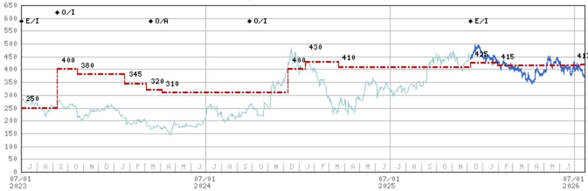
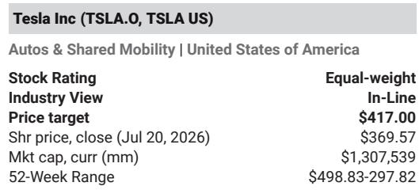
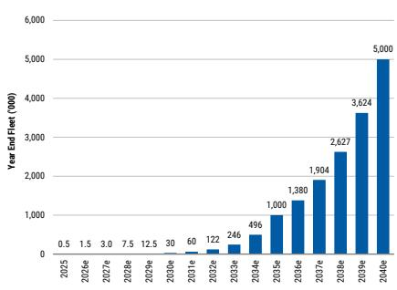

# Tesla's Robotaxi Expansion into Orlando and Tampa Signals a Strategic Pivot from Fleet Size to Geographic Breadth as the Key Metric of Autonomous Progress

Tesla announced the launch of its Robotaxi service in Orlando and Tampa on Tuesday, July 21, adding two more Florida cities to its growing network of unsupervised autonomous vehicle operations. This expansion comes just one day before the company's second-quarter earnings report on Wednesday, July 22, and represents a deliberate sequencing of city launches that observers should interpret as a strategic choice about how Tesla wants the market to evaluate its autonomous progress. The timing matters because it directly counters a narrative that had been building around deceleration in the Robotaxi program, with third-party tracking data showing a decline in active vehicles in the unsupervised fleet since late April.

The company's approach to city selection reveals a pattern that is more sophisticated than simply maximizing the number of vehicles deployed. Miami launched first. Orlando and Tampa now follow. Phoenix and Las Vegas remain in the "preparations underway" category, as listed in the first-quarter 2026 slide deck. What connects these cities is not their size or density alone, but their regulatory environments, weather patterns, and road geometry. Florida's consistent climate eliminates weather variability as a confounding variable in safety data. The state's relatively uniform road infrastructure and supportive regulatory stance on autonomous vehicles create a controlled testing environment where Tesla can accumulate miles and safety data under conditions that maximize the probability of favorable incident rates.

This geographic concentration strategy carries an important implication for those who have been focused on fleet size as the primary measure of robotaxi progress. The active vehicle count in the unsupervised fleet has declined since late April according to third-party trackers, though the company has not validated this data. If observers interpret this decline as evidence of technological setbacks, they are missing the more important signal: Tesla is deliberately managing fleet composition to prioritize safety data quality over vehicle quantity. A smaller fleet operating in carefully selected cities generates more statistically meaningful safety data than a larger fleet scattered across less controlled environments. The company is building the evidence base it needs to convince regulators and the public, not just market participants.

## The Rate of Change in Geographic Expansion, Not Absolute Fleet Size, Will Determine Perception of Robotaxi Viability Through Year-End

The most important number to watch is not how many robotaxis are on the road today, but how quickly Tesla can add new metro areas to its service map. The company has five cities in various stages of preparation: Miami (launched), Orlando and Tampa (now launched), Phoenix and Las Vegas (preparations underway). The first-quarter slide deck listed these five, but the company has not confirmed whether additional cities are being prepared. Unconfirmed sightings of presumed robotaxi test vehicles in New Orleans, which was not on the original list, suggest the company may be building a pipeline that extends beyond its publicly disclosed targets.

The earnings report tomorrow will likely provide the next update on which cities will be added to the preparation list. Each new city announcement serves a dual purpose. It demonstrates operational capability to replicate the launch process. It also expands the geographic diversity of the safety data set, which strengthens the statistical case for the technology's generalizability. A robotaxi that operates safely in Miami, Orlando, and Tampa provides more convincing evidence of reliability than one that operates safely only in Miami, even if the total fleet size remains constant.

The more cautious perspective focuses on the lack of growth in unsupervised fleet size, limited data transparency, and the small service areas for the Orlando and Tampa launches. These criticisms are valid as observations but miss the strategic logic. Tesla is not trying to maximize vehicle deployment in the short term. It is trying to maximize the rate of learning and the quality of evidence. A fleet that grows too quickly before the safety case is established risks accumulating incidents that could set the program back years. The deliberate pace of city expansion suggests management understands this trade-off and is making a calculated bet that evidence quality will be valued over vehicle quantity.

## Hiring Patterns for AI Safety Operators in Northern Metro Areas Provide Leading Indicators of Robotaxi Expansion That Precede Official City Announcements

Data from a proprietary tracking system called Alphawise showed increased hiring for AI Safety Operators in northern metro areas last month, before any official announcement about expansion beyond the original five cities. This hiring signal is worth watching because it provides a leading indicator of where Tesla plans to launch next, independent of the company's public communications. The unconfirmed sightings of test vehicles in New Orleans, combined with hiring activity in other northern locations, suggest the company may be building operational capacity in cities that have not yet appeared on any earnings slide deck.

The role of AI Safety Operators is critical to understanding how Tesla scales its robotaxi operations. These operators monitor vehicle performance remotely and can intervene when necessary. Their presence in a city does not guarantee a launch, but their absence guarantees that a launch cannot happen. The geographic distribution of hiring activity therefore reveals where the company is investing in operational infrastructure, which is a more reliable signal than any single statement from management about future plans.

For those trying to build a forward view of robotaxi expansion, tracking these hiring patterns is more useful than waiting for official announcements. The company's earnings presentations provide a backward-looking snapshot of what has already been decided. The hiring data, if it can be systematically tracked, provides a forward-looking view of what is being decided now. The Alphawise data showed increased hiring in northern metro areas before the Orlando and Tampa launches were announced. Observers who were watching this signal would have had weeks of advance warning that expansion was accelerating.

## Safety Data from the Austin Fleet Shows Measurable Improvement in Miles Between Incidents, Creating the Statistical Foundation for Scaling the Robotaxi Business

The Austin fleet, which has been operating the longest, provides the most mature data set for evaluating Tesla's autonomous safety performance. A tracker that normalizes National Highway Traffic Safety Administration data from the Austin fleet shows significant improvement in miles per incident since the service launched. This improvement rate is the single most important metric to monitor because it directly addresses the central question about Tesla's autonomous technology: can it get safer at a rate that justifies scaling?

The company's ability to grow its robotaxi fleet while concurrently improving incident rates is the key measure that will dominate perception of progress for the robotaxi business. These two objectives are in tension. Adding more vehicles and expanding to new cities introduces new variables and new risks. If incident rates improve even as the fleet grows and expands geographically, that provides strong evidence that the technology is genuinely improving rather than simply benefiting from favorable operating conditions.

The cumulative miles traveled by Tesla vehicles with Full Self-Driving capability reached 10 billion miles in early May. This scale is important because safety statistics become more meaningful as the denominator grows. A system with 10 billion miles of operation provides a much more reliable estimate of its true incident rate than a system with 100 million miles. The acceleration in FSD usage that drove this milestone also means the data set is becoming more representative of real-world driving conditions, not just carefully curated test routes.

## A Decision Framework for Evaluating Robotaxi Progress: Focus on Safety Data Velocity, City Addition Rate, and Hiring Signals Rather Than Fleet Size or Market Reactions

Observers need a structured approach to evaluating robotaxi progress that goes beyond reacting to individual announcements. The following framework organizes the available signals into three categories that collectively provide a more complete picture than any single metric.

The first category is safety data velocity. This measures the rate of improvement in miles between incidents, normalized for fleet size and geographic diversity. The Austin tracker provides the best available data for this metric. Focus should be on the slope of the improvement curve, not the absolute level. A system that improves from 10,000 miles between incidents to 20,000 miles between incidents over six months is more valuable than a system that maintains 50,000 miles between incidents with no improvement, because the improving system has a demonstrable learning curve that can be extrapolated.

The second category is city addition rate. This measures how quickly Tesla can replicate the launch process in new metro areas. The current pace suggests the company can add roughly one new city per quarter, based on the progression from Miami to Orlando and Tampa. If the earnings report tomorrow announces additional cities beyond the original five, that would signal an acceleration in the launch cadence. If no new cities are announced, that would suggest the company is still in the learning phase of the replication process.

The third category is hiring signals for AI Safety Operators. This provides the earliest leading indicator of future expansion. Those who can systematically track job postings for these roles in specific cities will have weeks or months of advance warning before official announcements. The Alphawise data demonstrated that this signal was reliable for the Orlando and Tampa launches. Its continued reliability will determine whether it becomes a standard input for robotaxi evaluation models.

The interaction between these three categories matters more than any individual metric. A company that shows strong safety data velocity but slow city addition is building evidence but not scaling. A company that shows fast city addition but flat safety data velocity is scaling before the evidence base is solid. The ideal combination is improving safety data velocity combined with accelerating city addition, because that suggests the technology is both getting safer and becoming operationally replicable.

## The Earnings Report Tomorrow Will Either Validate or Challenge the Thesis That Robotaxi Expansion Is Accelerating, Making It a Significant Milestone for Tesla This Quarter

The second-quarter earnings report on Wednesday, July 22, comes at a pivotal moment for the robotaxi narrative. The market had been interpreting the decline in active fleet size since late April as evidence of deceleration. The Orlando and Tampa launches, announced the day before earnings, directly counter that interpretation. The question now is whether the company will use the earnings call to provide additional detail about future expansion plans, including which cities will be added to the preparation list and what the expected launch cadence looks like for the remainder of 2026.

The company's own forecast of 1,500 robotaxis in the fleet by year-end, ramping to 30,000 by 2030, provides a long-term target that is ambitious but not implausible. The absolute number of robotaxis is likely immaterial to earnings this year, as the revenue contribution from a fleet of 1,500 vehicles is negligible relative to the company's overall revenue base. What matters is the rate of change in the rollout, because that provides clarity for those who may be skeptical about Tesla's autonomous technology at scale.

The earnings report will also provide an update on Cybercab production, which is the vehicle specifically designed for the robotaxi fleet. The production timeline for Cybercab is the binding constraint on how quickly the fleet can scale beyond the current fleet of retrofitted Model Y vehicles. If Cybercab production is on track, the 1,500 vehicle target for year-end becomes more credible. If there are delays, the target may need to be revised downward.

The market reaction to the earnings report will depend less on the financial results and more on the qualitative updates about robotaxi progress. This is unusual for an earnings report, but it reflects the reality that Tesla's valuation is driven more by its autonomous technology prospects than by its current automotive earnings. The company's stock price closed at $36hat only $47 per share comes from the core auto business, while $146 comes from network services, $125 from mobility, $40 from energy, and $60 from humanoids. The robotaxi business, captured in the mobility and network services components, represents more than half of the total valuation.

This valuation structure means that every data point about robotaxi progress has an outsized impact on the stock. A positive update tomorrow that confirms accelerating expansion and improving safety data could drive significant upside. A disappointing update that reveals delays or setbacks could reverse the gains from the Orlando and Tampa announcement. The binary nature of the catalyst creates both opportunity and risk for those positioned around the earnings event.

*For informational purposes only. Portions may be generated, translated, summarized, or edited with AI assistance based on source materials and may contain omissions or errors. Please verify independently. This is not professional advice.*

For informational purposes only. Portions may be generated, translated, summarized, or edited with AI assistance based on source materials and may contain omissions or errors. Please verify independently. This is not professional advice.

