July 21, 2026 09:00 PM GMT

SpaceX | North America

# Stefan-Boltzmann: Das ist super cool

Space is 2.7 Kelvin (negative 455 degrees Fahrenheit)... but space is not cold. Confused yet? Don't panic. Two 19th-century Austrian physicists got your back. Engineers have been keeping satellites and other spacecraft from overheating for many decades. Really.

## Please see here for our SpaceX Initiation: SpaceX: AI's Final Frontier; Initiate at Overweight, PT \$300 (7 Jul 2026)

From our client discussions there seems to be a hearty contingent who believe that space-based AI infrastructure quickly confronts physical limitations of thermal management in a vacuum, where convective cooling through air or water cannot be used in space. This note is meant to outline how space-based computers, and other heat-generating apparatuses, may indeed be thermally managed within operating design limits. Some high level thoughts:

\- Thermal management in space is done through radiative cooling - ever since early satellites of the 1960s. The US even launched a nuclear reactor to space in 1965 (SNAP-10A) and operated it for 43 days.

\- The International Space Station (ISS) uses fluid loops with ammonia (stays liquid across a wide range of temperatures), pumped out to large radiator panels that 'glow' in infrared. Experts believe SpaceX will use a similar technique with some tweaks.

\- SpaceX is targeting an eventual 370 Kelvin (97 °C) operating temperature for its AI sats to benefit from greater heat-flux between chip and space and increase efficiency of the radiator. We assume \~360K (\~87 °C) at the high-end of terrestrial GPU operating temps for the initial version of the sats to launch in 2028.

\- For a 1kW computer running at \~90 degrees Celsius in space, the radiator panel surface area would need to be approximately 0.57 square meters (assuming \~0.90 emissivity for white thermal control paint and two radiating sides).

\- Deep space is 2.7 K, but environmental heat inputs (Earth IR, albedo) raise the equilibrium radiative sink seen by a radiator in LEO. NASA technical guidance on effective sink temperature does acknowledge this and suggests an equivalent LEO sink temp between 200 and 300 K (we assume 250 K in our model or negative 23 °C - still cold).

\- Emissivity is how good a surface is at radiating heat - measured on a scale of 0 to 1. A measure of 1.0 would be 'perfect' radiation of heat into space. A measure of 0.0 is a perfect reflector that does not radiate any heat at all.

\- In our model, we assume the Gen 1 SpaceX AI sat achieves 150kW of peak power (120kW of compute), implying a radiator size of 110 square meters per side assuming 2 radiating sides or roughly half the size of a standard singles tennis court.

\- This is largely based on the AI1 sat design initially shared by Elon Musk/SpaceX last month. While Musk has since suggested peak power could rise by $\sim 2\frac{1}{3}$ with battery assistance, the impact on sustained compute density is not yet clear. We expect the design to iterate significantly before 2028 deployment and will update our assumptions when more technical details are released.

\- The AI compute portion of our SpaceX model makes detailed assumptions about the satellite radiator, incorporating emissivity coefficients and the Stefan-Boltzmann constant (more details in following section).

\- Radiator mass accounts for $>1/3$ of the total mass of an AI satellite. The hotter you can run the chips, the smaller you can keep the radiator. Running an AI chip at a $20\%$ higher temperature requires $50\%$ less radiator mass.

19th and Early 20th Century Physics. The fundamentals of managing temperatures in space traces its roots to 19th century physicists including the work of Josef Stefan, Ludwig Boltzmann, and Max Planck.

Black body radiation. Any object with temperature above absolute zero emits electromagnetic radiation.

The Stefan-Boltzmann Law in simple language: The hotter something is, the much more energy it radiates. If you double the temperature of an object, it radiates at 16x as much heat.

Exhibit 1: Stefan-Boltzmann Law lets you size the radiator surface area needed to reject a given heat load, based on the surface's temperature and emissivity.

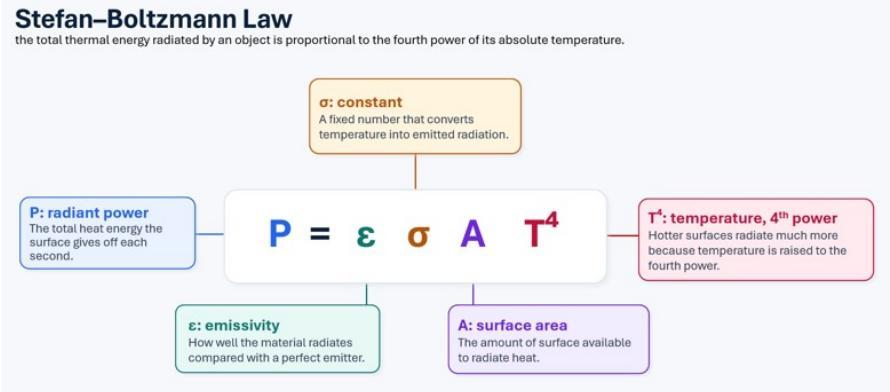  
Source: MS

Max Planck. A pioneer of quantum mechanics. Objects in space lose heat by radiating it into the vaccum (black body) - almost entirely infra red light. This is the same principle that we see with everyday objects that get hot on earth such as a glowing stove burner or a hot coal in your smoker. In 1900, Planck figured out that energy is emitted in discrete packets (quanta). Planck ultimately won the Nobel Price in 1918 for his discovery of energy quanta.

None of this is to say that building data centers in space is easy. Thermal management is solvable within well-understood physics, but it is only one problem among several, and arguably not the binding constraint. Orbital compute still has to contend with radiation damage beyond the protection of Earth's magnetosphere, the physical security of assets in a domain no one owns, lack of maintenance that must be handled remotely through built-in redundancy rather than hands-on repair, a launch cadence that potentially yields only single-digit megawatts per flight at first, reliance on the same capacity-constrained chip supply chains as terrestrial AI, and a growing orbital-debris hazard in low Earth orbit. The point of the thermal discussion above is deliberately narrow: heat rejection in a vacuum is not the physical showstopper some assume, which shifts the real debate to cost, reliability, scalability, and time-to-power.

We thank Herr Doktor Stefan and Herr Doktor Boltzmann for their contributions to science - we wouldn't have data centers in space without them.

Exhibit 2: Max Planck  
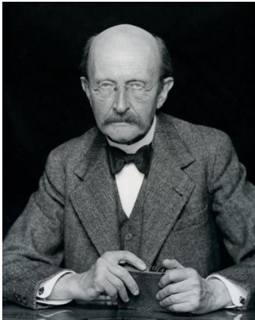

Exhibit 3: Josef Stefan and Ludwig Boltzmann

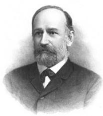  
Source: Wikipedia

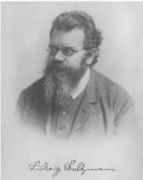  
Source: Wikipedia

## SpaceX Orbital Compute Estimates

We model SpaceX reaching GW-scale orbital compute in 2030, with orbital capacity becoming the majority of deployed compute in 2032. Our forecast assumes first orbital compute deployments in 2028 at 160 MW, rising to approximately 2.7 GW in 2030. From there, orbital compute reaches 21.2 GW in 2032, or 58% of total compute capacity, before scaling to 111 GW in 2035, or 88% of total, and 364 GW in 2040, or 96% of total. Long term, we envision terrestrial compute primarily supporting model training, while most inference moves to orbit.

When accounting for total operating costs, our estimates imply that incremental orbital compute becomes cost-advantaged versus current industry terrestrial costs in 2031. We believe investors should evaluate cost parity on an all-in basis, particularly opex, because most ongoing costs associated with orbital compute are depreciation, while terrestrial compute has meaningful recurring power, cooling, land, staffing, maintenance, and site operating costs. Based on our internet team's recent estimate of industry avg Blackwell costs of \~\$6.8 per watt per year, we estimate incremental SpaceX orbital compute falls below that level in 2031, at \$32.4 per watt of capex divided by a five-year useful life, or approximately \$6.5 per watt per year.

On our capex estimates alone, orbital is significantly higher than terrestrial in the initial years of deployment before falling to within 50% more than terrestrial in 2031 and parity around 2035 due to falling launch costs, cheaper satellite hardware, and GPU costs that get closer to parity with terrestrial. However, this is 1) comparing SpaceX orbital and SpaceX terrestrial capex estimates in the same year while SpaceX has materially cheaper cost to deploy compute terrestrial vs. the industry (potentially <50% ex-compute); and 2) only looking at capex costs whereas a significant portion of savings from orbital compute is due to the lack of material opex, i.e., no power/cooling or maintenance costs.

Exhibit 4: Our estimates imply orbital has cost advantage vs. current industry terrestrial costs in 2031 (Bars are orbital capex for newly deployed capacity divided by 5 year useful life, i.e., ongoing depreciation expense for new capacity, since vast majority of ongoing orbital compute expense is depreciation on upfront capex)

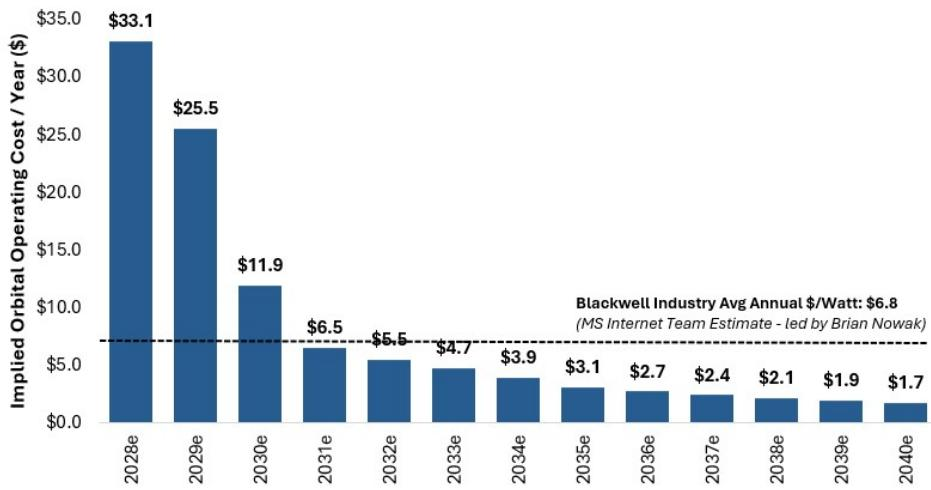  
Note: For orbital compute, uses newly deployed capacity in any given year not avg compute in use. \$6.8 calculated using \$23.5 chip capex per watt at a 5 year useful life, \$9.3 infrastructure capex at a 15 year useful life, and \$1.5 of power and other operating costs.
Source: MS estimates

Orbital Compute helps drive materially lower cash costs/watt into the 2030s and long-term EBIT margins of >50%. We estimate overall cash costs per watt (inclusive of capex and non-D&A operating costs) declines from a current \~\$35-40/watt to <\$9/watt in 2035 and \$3.7/watt in 2040. This helps drive EBIT margins from \~42% in 2028 (first year of deployment) to roughly 50%+ in the 2030s. This compares to 2025 EBIT margins for Amazon AWS of \~35%, Microsoft Intelligence Cloud of \~42%, and Meta of \~41%. Note that EBIT margin increase is limited beyond this point because we are assuming SpaceX passes savings onto customers as a trade-off for growth, with total AI revenue/watt declining from \$16.6 in 2028 to \$7.3 by 2040.

\- To help justify our opex savings, we estimate electricity costs of SpaceX's AI over time given that this is one major cost item only relevant to terrestrial compute. In 2028 (first year of orbital deployment), we estimate electrical costs at \~10% of revenue which declines to 5% by 2033, 2% by 2035, and 1% by 2040.

Cost alone doesn't tell the full story. Cost is one aspect of scalability, but orbital compute could also have advantages in time-to-power, access to energy, permitting risk, local land and water constraints, and the ability to deploy repeatable infrastructure in parallel. In AI infrastructure, customers may pay a premium for near-term access to large-scale compute if terrestrial capacity remains constrained by grid interconnect queues, equipment availability, and site development timelines. This has been recently evidenced by SpaceX's two neocloud deals, which appear to have commanded a meaningful premium to industry averages, likely reflecting the scarcity value of high-end, large-scale GPU clusters that can be accessed relatively quickly. In other words, even if orbital compute does not initially reach cost parity with terrestrial compute, the company may still be able to charge a material premium if it becomes the most scalable AI infrastructure provider available. This would be analogous to SpaceX's current launch business, where prices have continued to rise despite steadily declining underlying costs. The key debate, in our view, is whether SpaceX can use Starship, satellite manufacturing, space-based solar power, and optical networking to become one of the most scalable sources of AI compute in the 2030s.

Exhibit 5: Annual SpaceX Nameplate Compute (GW): Orbital vs. Terrestrial  
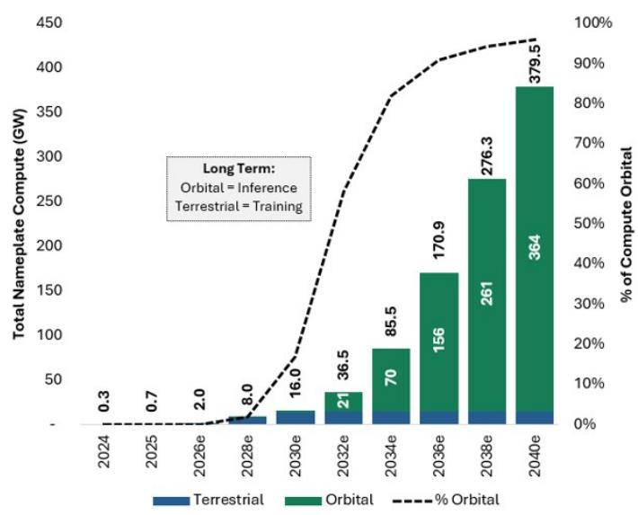  
Source: Company Data, MS estimates  
Note: Slight dip in early 2030s is due to initial depreciation on orbital compute which is assumed to have higher initial capex cost vs. terrestrial.

Exhibit 6: Orbital Compute Deployed Becomes Meaningful in 2030; Helps Drive Materially Lower Cash Costs Long-Term for AI  
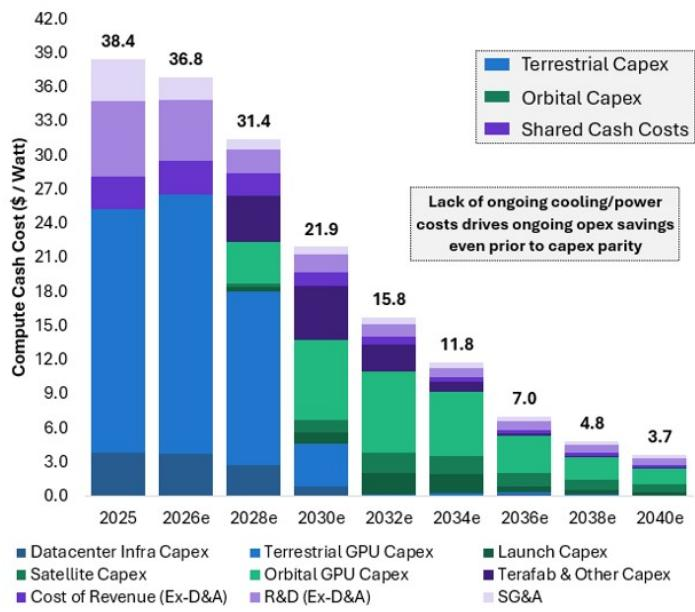  
Exhibit 7: Estimated AI EBIT Margins. We assume long-term savings are partially offset by declining revenue/watt.  
Source: Company Data, MS estimates  
Source: Company Data, MS estimates

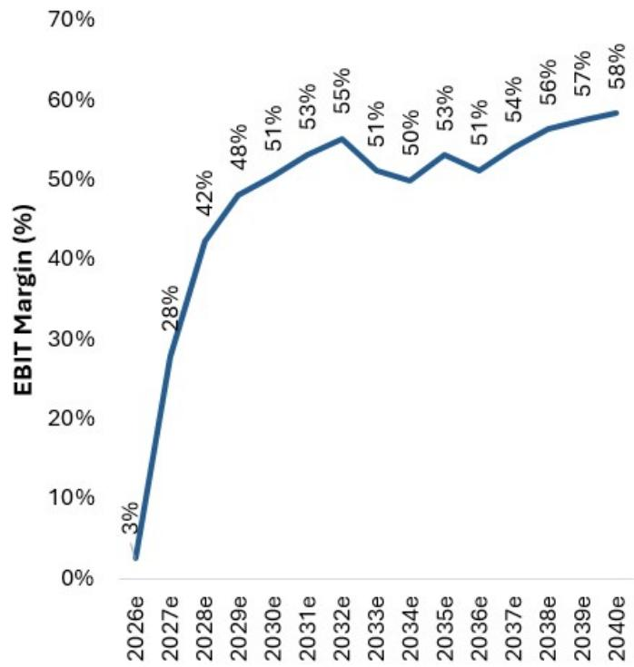

Exhibit 8: Estimated Electricity Costs for AI Compute (\$mn)  
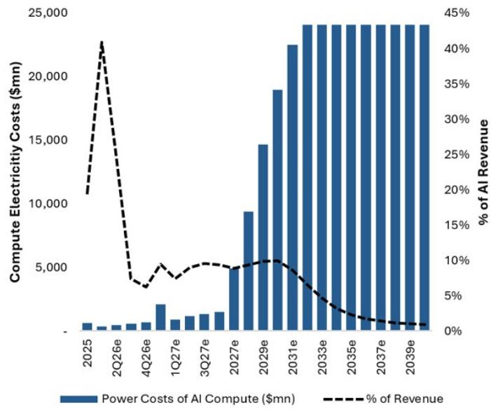  
Note: Estimated as terrestrial compute watts \* \$0.15 kWh, assuming a PUE of 1.2 and 24/7 operations.
Source: Company Data, MS estimates

Exhibit 9: MW of Compute in Orbit  
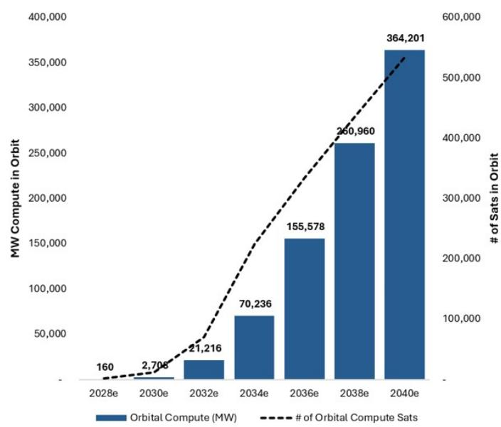  
Source: Company Data, MS estimates

Exhibit 10: Annual Orbital Compute Launches  
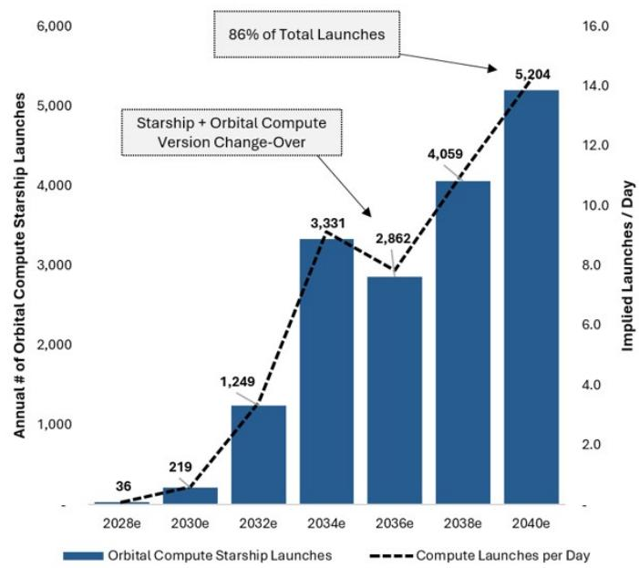  
Source: Company Data, MS estimates

## Detailed Orbital Compute Engineering & Capex Assumptions

We have constructed a detailed bottom-up build of SpaceX orbital compute (recently dubbed 'Starmind') which informs our capex estimates. We model 3 generations of SpaceX orbital compute aligning with estimated variants of Starship. We align our initial generation of orbital compute to the Al1 Sats shared recently by Elon Musk (70 kW/ton or 56 kW/ton - compute only; 150 kW peak power; \~2.1 tons) which we expect to launch on Starship V3. We assume this is largely a prototype version for the company and that future iterations will be both larger and more compute dense to get closer (and eventually greater than) the targeted 100 kW of compute per ton targeted by the company. Orbital compute sats, while novel concepts, are based on existing satellite technology leveraged on Starlink. The satellite can largely be divided into 3 parts: 1) Thermal Radiator; 2) Solar Array; 3) Compute Payload. We outline our assumptions for the solar array and thermal radiator below.

## • Thermal Radiator Design:

We would like to address up-front that there has been a major debate recently on the ability to radiate heat in space which we think is significantly overblown. Thermal radiation in space has been a field of study since the advent of spacecraft (all electronics radiate heat), and the constraints are relatively known and well-documented in scientific research. Investors also frequently point to the fact that heat of compute is much higher than that of typical satellite hardware, which is true, but also overlooks the multi-decades of international research on even hotter payloads such as in-space nuclear power where test satellites have been launched and operated in space since the mid-1960s.

• Thermal radiator specifications are guided by the Stefan-Boltzmann Law which defines the required surface area to radiate a given level of heat. After that, we estimate the areal density (kg/m $^{2}$ ) of the radiator to determine the total mass.

\- Compute Temp. To benefit from Stefan-Boltzmann's law which states that radiation efficiency is directly related to the heat differential between the radiator and background temp, we assume chips are designed to run slightly hotter than on Earth at \~90 °C (362 K) initially which rises to 97 °C and 99 °C in later generations. Note that space radiators currently operate as hot as 300 to 400 K depending on the application. This likely does require new compute designs – see below for more.

\- Emissivity Factor. We assume a 0.91 emissivity factor in all generations corresponding to the advertised emissivity of spacecraft thermal control paint.

• Background Temp of LEO. We assume the background temperature of LEO is 250 K or -23 °C. The background temperature of deep space is much lower at just 2.7 K. However, spacecraft radiator sizing in LEO should use an effective sink temperature materially higher due to environmental heat inputs (Earth IR, albedo) which raise the equilibrium radiative sink seen by the radiator. Historical NASA technical guidance on effective sink temperature does acknowledge this and suggests an equivalent LEO sink temp between 200 and 300 K.

• 2 Radiating Sides. We assume 2 radiating sides (similar to that of the ISS) unlike the 1 radiating side on Starlink and many other satellites. This effectively doubles the radiator efficiency, but at the cost of having a larger profile as the radiators must protrude out of the satellite bus (as seen on Al1 Sat diagram below) instead of being mounted on other subsystems.

\- Radiator areal density. We assume an initial areal density of the radiator of \~7 kg/m $^{2}$ or roughly half that of the radiators of the ISS (designed in late 90's and optimized for long-life). For Al2 sats, we assume 5 kg/m $^{2}$ and 3.5 kg/m $^{2}$ for Al3 sats. Modern aluminum honeycomb radiators have been reported to be within the 5-10 kg/m $^{2}$ range, and thus we are not assuming that SpaceX uses any fully novel designs until Al3 in 2035. The 3.5 kg/m $^{2}$ for Al3 is well within a past NASA areal density goal for in-space nuclear electric propulsion of 2-4 kg/m $^{2}$ which researchers have investigated in labs using carbon composites, graphene, specialty composites, and other materials.

\- Radiator coolant. As for the liquid coolant in the radiator, ammonia (the standard for current radiator designs) has a critical temperature of \~405 K at which it can no longer be kept a liquid by increasing pressure. However, we note there are also alternative coolants (such as sodium-potassium alloy or NaK) which can have critical temperatures of >2000 K which is often used in nuclear applications (including in space, as far back as the SNAP-10A experimental nuclear powered satellite in 1965).

Overall, we estimate the surface area per side/total mass of the radiator as follows: 110 m $^{2}$ /767 kg for Al1 Sats, 266 m $^{2}$ /1,328 kg for Al2 Sats, 580 m $^{2}$ /2,030 kg for Al3 Sats.

## - Solar Array Design:

• Assume Sats in Dawn-Dusk SSO. We assume that SpaceX compute satellites operate in Dawn-Dusk Sun-Synchronous Orbit across various orbital shells (aligning with recent FCC filings) which allows for near-continuous sunlight (we assume 95%).

• Cell type and efficiency. Space receives the full solar constant (thought of as theoretical maximum output) of 1,361 watts/m $^{2}$ due to lack of atmospheric attenuation. For conservatism, we assume a cell efficiency of 25% (rises by 1% through generations) which is relatively in line with terrestrial silicon cells although traditional space-based solar is generally greater efficiency depending on cell type. Due to cost, SpaceX has been reported to be using silicon solar cell technology for Starlink (commonly used for terrestrial solar) compared to more efficient and rad-resistant but significantly expensive gallium arsenide (GaAs) cells.

• Degradation assumptions. We assume a conservative 5-year degradation factor (or end-of-life output divided by beginning output) of 85% for Al1 sats which rises to 88% and 90% in later generations. This is materially worse than traditional gallium arsenide cells used for space-based solar which experience <1% degradation per year. Since we are assuming each satellite has a useful life of just 5 years, we assume SpaceX continues to optimize for cost rather than long-life.

\- Packing fraction/panel density. We assume a $95\%$ packing fraction ( $\%$ of panel that is active cells vs. structure) and $95\%$ power distribution efficiency ( $\%$ of energy that reaches compute vs. lost as waste heat) across all generations.

\- Solar areal density. We assume the areal density of the solar panel begins at $1.7 \mathrm{~kg} / \mathrm{m}^{2}$ which is at the upper-end of currently available flexible solar arrays, but lighter than standard rigid arrays. This declines to $1.3 \mathrm{~kg} / \mathrm{m}^{2}$ for Al2 Sats and $0.9 \mathrm{~kg} / \mathrm{m}^{2}$ for Al3 sats.

Overall, we estimate the surface area/total mass of the solar array as follows: 605 m $^{2}$ /1,028 kg for Al1 Sats, 1,523 m $^{2}$ /1,979 kg for Al2 Sats, 3,218 m $^{2}$ /2,897 kg for Al3 Sats.

\- Improvements in the mass of the solar array and thermal radiator allow for greater compute/sat. We estimate that, across generations, the satellite bus which contains compute, fluid pumps, inter-satellite laser links, electric thrusters, etc. is just \~15-20% of total satellite mass.

\- As added conservatism, we assume 4% compute radiation loss rates per year (20% by end of life) across all satellite generations. This is incremental to the previously outlined annual solar cell degradation.

\- We assume SpaceX opts for larger satellites over time to maximize compute efficiency. Similar to the progression of broadband Starlink sats, orbital compute sats get larger through generations. AI1 Sats are assumed to be 2.1 tons with a 600 m² solar array. In comparison, our assumed AI3 Sats are assumed to be 6.1 tons with a 3,200 m² solar array - partially enabled by successive Starship versions. Why larger: 1) reduced satellite hardware costs per unit of compute as the bus, propulsion, avionics, laser links, and other fixed systems scale more slowly than compute payload; 2) better thermal and power efficiency as larger solar arrays and radiators allow more compute per satellite without a proportional increase in support hardware; 3) improved launch efficiency as larger Starship variants can deploy heavier satellites and reduce the number of spacecraft needed per MW of compute; 4) lower operational complexity as fewer, larger satellites can reduce constellation management burden, inter-satellite handoffs, collision avoidance events, and replacement logistics per unit of deployed compute.

Exhibit 11: We model 3 generations of SpaceX orbital compute with improving compute mass/ton  
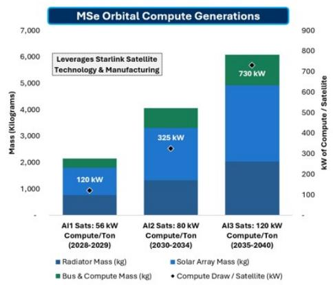  
Source: Company Data, MS estimates

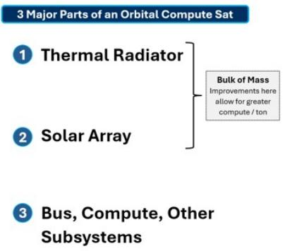

## 3 Bus, Compute, Other Subsystems

Exhibit 12: Our initial orbital compute estimates are primarily based on the "AI1 Satellite" details shared by SpaceX: 70 kW/ton (or 56 kW/ton - compute only); 150 kW peak power; \~2.1 tons.  
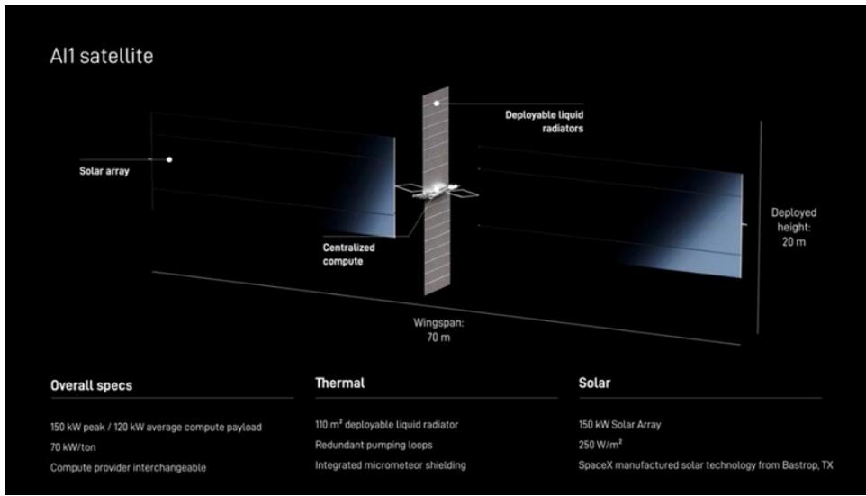

## Orbital compute capex can be divided into three primary areas: Launch, Satellite Hardware, and Compute.

\- Capitalized launch capex is based on our estimated slope of internal SpaceX cost/kg also applicable to the Space and Connectivity segments: we estimate \~\$500/kg in 2030 and <\$200/kg in 2035. Orbital compute generations correspond to Starlink versions, and we assume 80 tons, 120 tons, and 160 tons effective mass to orbit for Starship V3/V4/V5 equating to 37 satellites, 30 satellites, and 26 satellites per launch.

\- Satellite hardware capex is initially assumed at \~9 \$/Watt of total satellite power (of which \~80% is compute across gens), which declines steadily over time. This is half our estimate for that of current Starlink v2 Mini sats or \~18 \$/Watt due to both more mature manufacturing/greater scale and the fact that AI sats exclude much of the expensive hardware such as RF antennas, larger batteries, etc. For historical reference, we estimate v1.5 sats were \$36/watt and v1.0 sats were \$50/watt.

\- We are assuming orbital GPUs are significantly more expensive than terrestrial GPUs in the earlier years. Due to the unique requirements of the GPUs on orbital compute sats (run hotter, greater fault tolerance, radiation hardening), we are being very conservative, and assuming chips for orbit are made in small quantities for the first few years which significantly increases costs due to economies of scale. In 2028, we are assuming orbital GPUs are >5x that of terrestrial, which declines to 2.3x in 2030 (first year orbital is at GW-scale), and eventually run-rates at 5-10% greater than terrestrial beginning in 2032. We note that since Terafab is likely to be very orbital compute-focused, there is a scenario in the long-run where orbital compute chip costs are actually cheaper than that of terrestrial, though we are not making that assumption in our model.

• For reference, we model terrestrial chip costs (on a per watt basis, not necessarily per chip) rising 12% in 2026 and 2027 followed by a decline of 10% per year through 2034 and 15%+ per year 2034-2040 (Terafab benefits). The initial years of this decline are driven by a mix-shift away from Nvidia to various ASICs which is continued due to additional chip supply which eases the current supply/demand chip pricing pressure.

\- Overall, we assume a 5-year useful life across all generations of orbital compute and straight-line depreciation, similar to Starlink.

Exhibit 13: Detailed Satellite Design Spec Estimates for SpaceX Orbital Compute

<table><tr><td>4b) New Satellite Engineering Specs</td><td>2028e</td><td>2029e</td><td>2030e</td><td>2031e</td><td>2032e</td><td>2033e</td><td>2034e</td><td>2035e</td><td>2036e</td><td>2037e</td><td>2038e</td><td>2039e</td><td>2040e</td></tr><tr><td>Capacity &amp; Compute Draw / Satellite (kW)</td><td colspan="3">A1 Satellites 56 kW/Ton</td><td colspan="4">A2 Satellites 80 kW/Ton</td><td colspan="6">A3 Satellites 120 kW/Ton</td></tr><tr><td>Satellite All-In Power Capacity (kW)</td><td>150</td><td>150</td><td>407</td><td>407</td><td>407</td><td>407</td><td>407</td><td>913</td><td>913</td><td>913</td><td>913</td><td>913</td><td>913</td></tr><tr><td>Y/Y Change in All-In Power Capacity (kW)</td><td></td><td></td><td>171%</td><td></td><td></td><td></td><td></td><td>125%</td><td></td><td></td><td></td><td></td><td></td></tr><tr><td>% of Capacity to Compute</td><td>80%</td><td>80%</td><td>80%</td><td>80%</td><td>80%</td><td>80%</td><td>80%</td><td>80%</td><td>80%</td><td>80%</td><td>80%</td><td>80%</td><td>80%</td></tr><tr><td>Y/Y In Capacity to Compute</td><td></td><td></td><td>0%</td><td></td><td></td><td></td><td></td><td>0%</td><td></td><td></td><td></td><td></td><td></td></tr><tr><td>Compute Draw / Satellite (kW)</td><td>120</td><td>120</td><td>325</td><td>325</td><td>325</td><td>325</td><td>325</td><td>730</td><td>730</td><td>730</td><td>730</td><td>730</td><td>730</td></tr><tr><td>Check</td><td></td><td></td><td></td><td></td><td></td><td></td><td></td><td>50%</td><td></td><td></td><td></td><td></td><td></td></tr><tr><td>Energy Efficiency &amp; Mass</td><td></td><td></td><td></td><td></td><td></td><td></td><td></td><td></td><td></td><td></td><td></td><td></td><td></td></tr><tr><td>Satellite All-In Power Capacity (kW)</td><td>150</td><td>150</td><td>407</td><td>407</td><td>407</td><td>407</td><td>407</td><td>913</td><td>913</td><td>913</td><td>913</td><td>913</td><td>913</td></tr><tr><td>Satellite Specific Power (W/kg)</td><td>70</td><td>70</td><td>100</td><td>100</td><td>100</td><td>100</td><td>100</td><td>150</td><td>150</td><td>150</td><td>150</td><td>150</td><td>150</td></tr><tr><td>Y/Y Change in Specific Power (W/kg)</td><td></td><td></td><td>43%</td><td></td><td></td><td></td><td></td><td>2%</td><td></td><td></td><td></td><td></td><td></td></tr><tr><td>Mass Per New Satellite (kg)</td><td>2,143</td><td>2,143</td><td>4,061</td><td>4,061</td><td>4,061</td><td>4,061</td><td>4,061</td><td>6,078</td><td>6,078</td><td>6,078</td><td>6,078</td><td>6,078</td><td>6,078</td></tr><tr><td>kW of Compute per Metric Ton</td><td>56</td><td>56</td><td>80</td><td>80</td><td>80</td><td>80</td><td>80</td><td>120</td><td>120</td><td>120</td><td>120</td><td>120</td><td>120</td></tr><tr><td>Assumed Thermal Radiator Specs</td><td></td><td></td><td></td><td></td><td></td><td></td><td></td><td></td><td></td><td></td><td></td><td></td><td></td></tr><tr><td>Satellite Total Capacity (kW)</td><td>150</td><td>150</td><td>407</td><td>407</td><td>407</td><td>407</td><td>407</td><td>913</td><td>913</td><td>913</td><td>913</td><td>913</td><td>913</td></tr><tr><td>Waste Heat % of Total Power</td><td>100%</td><td>100%</td><td>100%</td><td>100%</td><td>100%</td><td>100%</td><td>100%</td><td>100%</td><td>100%</td><td>100%</td><td>100%</td><td>100%</td><td>100%</td></tr><tr><td>Waste Heat (kW)</td><td>150</td><td>150</td><td>407</td><td>407</td><td>407</td><td>407</td><td>407</td><td>913</td><td>913</td><td>913</td><td>913</td><td>913</td><td>913</td></tr><tr><td>Radiator Temperature (K)</td><td>362</td><td>362</td><td>370</td><td>370</td><td>370</td><td>370</td><td>370</td><td>372</td><td>372</td><td>372</td><td>372</td><td>372</td><td>372</td></tr><tr><td>Emissivity Factor (0-1)</td><td>0.91</td><td>0.91</td><td>0.91</td><td>0.91</td><td>0.91</td><td>0.91</td><td>0.91</td><td>0.91</td><td>0.91</td><td>0.91</td><td>0.91</td><td>0.91</td><td>0.91</td></tr><tr><td>Background Temp of LEO (K)</td><td>250</td><td>250</td><td>250</td><td>250</td><td>250</td><td>250</td><td>250</td><td>250</td><td>250</td><td>250</td><td>250</td><td>250</td><td>250</td></tr><tr><td>Number of Radiating Sides</td><td>2</td><td>2</td><td>2</td><td>2</td><td>2</td><td>2</td><td>2</td><td>2</td><td>2</td><td>2</td><td>2</td><td>2</td><td>2</td></tr><tr><td>Stefan-Bolzmann Constant</td><td>(6.08)</td><td>(6.08)</td><td>(6.08)</td><td>(6.08)</td><td>(6.08)</td><td>(6.08)</td><td>(6.08)</td><td>(6.08)</td><td>(6.08)</td><td>(6.08)</td><td>(6.08)</td><td>(6.08)</td><td>(6.08)</td></tr><tr><td>Radiator Temp*</td><td>2E+10</td><td>2E+10</td><td>2E+10</td><td>2E+10</td><td>2E+10</td><td>2E+10</td><td>2E+10</td><td>2E+10</td><td>2E+10</td><td>2E+10</td><td>2E+10</td><td>2E+10</td><td>2E+10</td></tr><tr><td>Background Temp*</td><td>4E+09</td><td>4E+09</td><td>4E+09</td><td>4E+09</td><td>4E+09</td><td>4E+09</td><td>4E+09</td><td>4E+09
