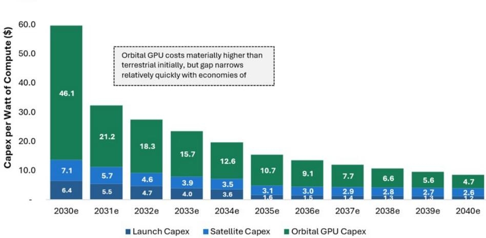
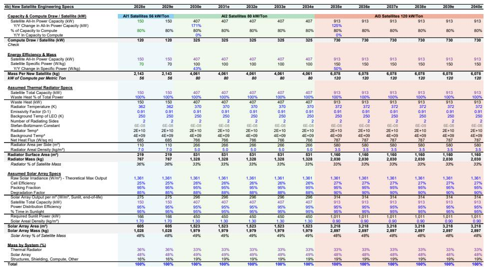

# MS：AI技术与行业应用观察

太空AI基础设施面临一个被广泛讨论的物理问题：真空中无法使用空气或水进行对流散热，高密度计算芯片的热量如何排出？MS在近期一份SpaceX研究报告中，用19世纪的物理定律给出了一个反直觉的判断——散热不是太空计算的核心约束。

报告认为，热管理在太空中有成熟的技术路径，从1960年代核反应堆卫星到国际空间站的氨循环散热系统，辐射冷却已被验证数十年。真正限制太空AI规模化的是成本、可靠性、发射节奏和轨道碎片不确定性，而非真空中的散热能力。

## 1. 辐射散热依赖温度差与表面特性

太空散热的核心是斯特藩-玻尔兹曼定律：物体辐射的热量与自身相对温度的四次方成正比。这意味着芯片运行温度每提高20%，所需散热器质量可减少约50%。

MS假设SpaceX第一代AI卫星芯片运行温度约90摄氏度（362K），后续提升至97-99摄氏度。散热器表面使用发射率约0.91的白色热控漆，背景温度为低地球轨道等效250K（约零下23摄氏度），而非深空的2.7K。环境热输入（地球红外辐射、反照率）使实际散热条件比直觉更温和。

对于120千瓦计算功耗的卫星，散热器面积约110平方米，相当于半个标准单打网球场。散热器质量占卫星总质量超过三分之一，是重量优化的关键变量。

> **KC评论：** 散热器面积与芯片温度的四次方成反比，这一物理关系决定了温度策略对卫星设计的杠杆效应。读者常低估高温运行对系统减重的贡献，而SpaceX的目标温度已高于当前大多数卫星的散热设计范围。

## 2. 轨道计算成本有望在2031年低于地面

报告构建了详细的成本模型。SpaceX预计2028年首次部署160兆瓦轨道计算能力，2030年达到约2.7吉瓦，2032年升至21.2吉瓦，占公司总计算能力的58%。长期来看，地面计算主要支持模型训练，多数推理迁移至轨道。

成本对比的关键在于全口径运营支出。地面数据中心有持续的电力、冷却、土地、运维成本，而轨道计算的主要持续成本是折旧。MS估算，行业平均地面Blackwell芯片年化成本约每瓦6.8美元，SpaceX轨道计算在2031年降至每瓦约6.5美元，实现增量成本优势。

仅看资本支出，轨道在初期显著高于地面，但随着发射成本下降、卫星硬件和GPU成本趋近地面，预计2035年左右达到资本支出平价。报告强调，SpaceX自身的地面部署成本已远低于行业水平，轨道计算的真正优势在于运营支出节省。

## 3. 时间与可扩展性可能比成本更重要

成本并非相对少见考量。轨道计算在时间-电力获取、许可不确定性、土地和水资源约束方面具有结构性优势。地面AI基础设施受限于电网并网排队、设备可用性和场地开发周期，而轨道部署可并行扩展。

报告指出，SpaceX近期两笔云服务交易定价显著高于行业平均水平，反映了大型GPU集群的稀缺价值。即使轨道计算初期未达到成本平价，如果SpaceX成为最具可扩展性的AI基础设施提供商，仍可收取溢价。这与SpaceX发射业务的定价逻辑一致——成本持续下降，但价格因稀缺性而上升。

报告预计，SpaceX整体AI计算现金成本（含资本支出和非折旧运营支出）将从当前的每瓦35-40美元降至2035年的9美元以下，2040年降至3.7美元。这推动息税前利润率从2028年的约42%升至2030年代的50%以上，高于2025年亚马逊AWS约35%、微软智能云约42%和Meta约41%的水平。

> **KC评论：** 轨道计算的成本优势主要来自运营支出节省，而非资本支出。电力成本从占收入约10%降至2040年的1%，这一假设基于SpaceX使用空间太阳能和光学网络。读者应关注这一假设的验证节点，而非仅关注散热技术本身。

## 4. 散热之外的真实约束

报告明确列出了太空计算面临的其他挑战：地球磁层外的辐射损伤、无人管辖域内的物理安全、必须通过冗余而非维修实现的远程维护、初期每次发射仅个位数兆瓦的运力、与地面AI共享的芯片供应链瓶颈，以及低地球轨道日益严重的碎片不确定性。

这些约束中，任何一个都可能成为比散热更紧的瓶颈。散热问题有清晰的物理解法和数十年的工程验证，而辐射防护、在轨维护和发射节奏的规模化路径仍在演进。

MS认为，核心辩论应转向SpaceX能否利用星舰、卫星制造、空间太阳能和光学网络，在2030年代成为最具可扩展性的AI计算来源。散热是其中技术可行性最清晰的一环。

For informational purposes only. Portions may be generated,translated,summarized,or edited with AI assistance based on source materials and may contain omissions or errors. Please verify independently. This is not investment,legal,tax,accounting,or other professional advice.

For informational purposes only. Portions may be generated,translated,summarized,or edited with AI assistance based on source materials and may contain omissions or errors. Please verify independently. This is not investment,legal,tax,accounting,or other professional advice.

