July 20, 2026 06:03 AM GMT

Semiconductors | North America

# Disti Survey 2Q'26: Broadly Holding Up

Disti responses remain constructive after the sharp 1Q step-up. We expect strong JunQ prints, with leading indicators broadly holding into SepQ.

## AlphaWise α

Last quarter marked a clear turn in the cycle, and the 2Q26 survey suggests that strength is carrying into SepQ, albeit at a more measured pace. Expectations remain healthy after seasonality, with no respondents expecting a decline in Analog or MCU. Industrial held up, while Auto was mixed. The recovery remains healthy, though the rate of improvement has moderated after the sharp 1Q acceleration.

Our AlphaWise analysis points to a similarly uneven but constructive setup. Analog and MCU are shipping above demand, while Disti momentum eased as inventory-building intentions moderated. We view the deceleration as a more measured continuation, rather than a reversal, as momentum remains positive and the moderation has not been accompanied by weaker pricing or forward expectations. The recovery continues to look demand-led, with selective replenishment and supply tightness rather than broad restocking or shortages at this stage.

What does this mean for upcoming reports? We expect strong JunQ prints, similar to last quarter, and raise our JunQ/SepQ estimates for TXN, with our updated estimates implying above-seasonal growth in both quarters, supported by Analog/Industrial strength, data center growth and firm pricing, though this does not change our UW view. We leave other estimates unchanged for now, with TXN the first test of whether these trends are translating into revenue and gross margin. ADI has the clearest Analog/Industrial read-through, ON is best exposed to selective power tightness, NXP could benefit if Auto is better than feared and MCHP remains a later-2H/4Q MCU/pricing story.

Exhibit 1: 2Q26 Disti Survey Scorecard: Constructive; 1Q Strength Broadly Holds

<table><tr><td colspan="4">2Q26 Disti Survey: Healthy &amp; Holding Up</td></tr><tr><td>Section</td><td>Signal</td><td>Q/Q Trend | Reading</td><td>%ile Rank</td></tr><tr><td>Growth Expectations</td><td>HEALTHY, PROTECTED DOWNSIDE</td><td>Analog ↑MCU ↓Power (new)</td><td>Q/Q: 96th %ile | S: 90th %ileQ/Q: 76th %ile | S: 92nd %ile</td></tr><tr><td>End Markets</td><td>SELECTIVE UPSIDE</td><td>AI/DC (New)Industrial →Auto ↓</td><td>93rd %ile46th %ile</td></tr><tr><td>Inventory/ Channel</td><td>→NORMALIZING</td><td>Inventory Builds ↓Double orders ↑</td><td>80th %ile82nd %ile</td></tr><tr><td>Supply&amp; Pricing</td><td>→FIRM PRICING MIXED SUPPLY</td><td>Analog pricing →MCU pricing →Constraints →Lead times ↓</td><td>89th %ile88th %ile53rd %ile57th %ile</td></tr></table>

Source: AlphaWise, SIA, MS.

<table><tr><td colspan="3">MS &amp; CO. LLC</td></tr><tr><td colspan="3">Joseph Moore</td></tr><tr><td colspan="3">Equity Analyst</td></tr><tr><td colspan="2">Joseph.Moore@morganstanley.com</td><td>+1 212 761-7516</td></tr><tr><td colspan="3">Nicole Kozhukhov</td></tr><tr><td colspan="3">Research Associate</td></tr><tr><td colspan="2">Nicole.Kozhukhov@morganstanley.com</td><td>+1 212 761-1636</td></tr><tr><td colspan="3">Wen Zhang, CFA</td></tr><tr><td colspan="3">Equity Strategist</td></tr><tr><td colspan="2">Wen.Zhang@morganstanley.com</td><td>+1 212 761-1732</td></tr><tr><td colspan="3">Shane Brett</td></tr><tr><td colspan="3">Equity Analyst</td></tr><tr><td colspan="2">Shane.Brett@morganstanley.com</td><td>+1 212 761-1022</td></tr><tr><td colspan="3">Mason Wayne</td></tr><tr><td colspan="3">Research Associate</td></tr><tr><td colspan="2">Mason.Wayne@morganstanley.com</td><td>+1 212 761-6012</td></tr><tr><td colspan="3">Ella Tulchinsky</td><td>Research Associate</td></tr><tr><td colspan="2">Ella.Tulchinsky@morganstanley.com</td><td>+1 212 761-2222</td></tr><tr><td colspan="3">SEMICONDUCTORS</td></tr><tr><td colspan="3">North America</td></tr><tr><td colspan="2">Industry View</td><td>Attractive</td></tr><tr><td colspan="3">WHAT&#x27;S CHANGED</td></tr><tr><td>Texas Instruments (TXN.O)</td><td>From</td><td>To</td></tr><tr><td>Price Target</td><td>$221.00</td><td>$230.00</td></tr></table>

For analyst certification and other important disclosures, refer to the Disclosure Section, located at the end of this report.

## Cycle Analysis: Recovery Progressing, but Still Below Prior Pace

Analog, MCU and IGBT/Power have all moved to shipping above demand, but the broader recovery remains gradual. The sharp 1Q acceleration was meaningful, while the latest moderation reflects a slower rate of improvement rather than a return to contraction.

## Where Are We in the Cycle?

Recovery progressing, but still slower than most prior cycles. Analog, MCU and IGBT/Power have all moved to shipping above demand, but the broader recovery remains gradual. The sharp 1Q acceleration was meaningful, while the latest moderation reflects a slower rate of improvement rather than a return to contraction.

\- Analog: bottomed in June 2024 at 7.1% below demand. As of May 2026, Analog is shipping 2.6% above demand, representing a 9.7ppt improvement over 23 months. That remains slower than the closest comparable historical recoveries, but the cycle continues to advance.

\- MCU: bottomed later than Analog and moved above demand more recently. As of May 2026, MCU is shipping $6.8\%$ above demand. The recovery has accelerated meaningfully since 1Q, but remains earlier and more uneven than Analog.

\- IGBT/Power: moved from shipping \~1% below demand in February to 3% above demand in May. Power is therefore also moving into modest overshipping, supported by stronger demand around AI/data center and selected high-voltage applications.

Exhibit 2: Analog & MCU Sales Cycle - both now shipping above demand  
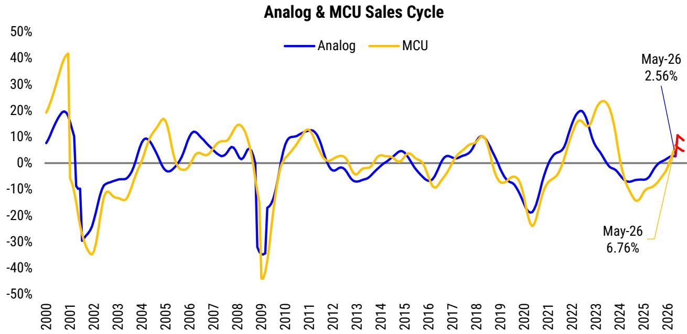  
Source: AlphaWise, SIA, MS.

Exhibit 3: IGBT Sales cycle: now marginally shipping above demand  
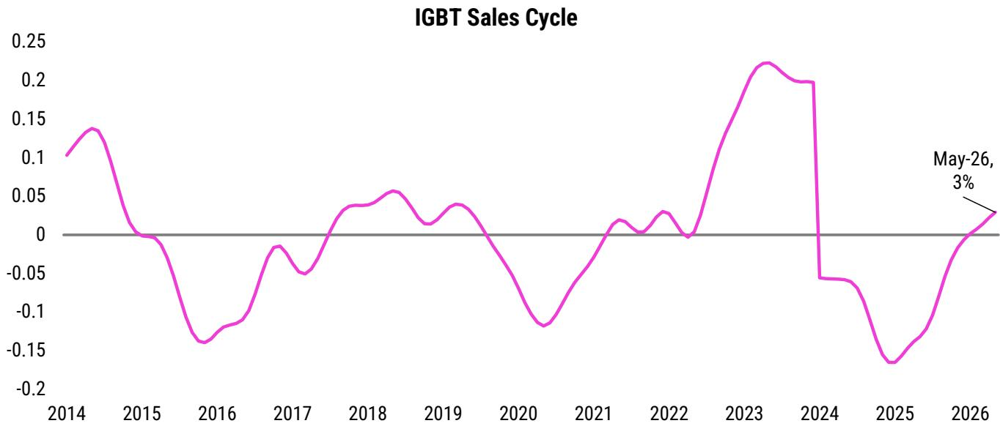  
Source: AlphaWise, SIA, MS.

Analog continues to recover, but the pace remains slower than in most prior cycles. Since bottoming in June 2024, the cycle indicator has improved 9.7ppts to +2.6% through May 2026. That trails the 11.5ppt and 13.7ppt improvements seen at the same point following the January 2013 and January 2016 troughs, respectively, while the recovery following April 2020 was considerably faster. In our view, the slower path leaves further room for the cycle to run, even as near-term momentum becomes more measured.

The slow pace was evident early in the recovery. During the first seven months after the June 2024 trough, Analog improved just 0.8ppt, versus a 12.6ppt average across the prior upcycles shown. The closest comparison was January-August 2013 at +2.3ppts, while the 2009 and 2020 recoveries were much stronger at +27.6ppts and +14.2ppts, respectively. These figures measure the pace of improvement over a fixed period, while the chart below measures the duration between cycle inflection points.

Exhibit 4: Analog cycles have typically lasted \~22-26 months from trough to peak or peak to trough  
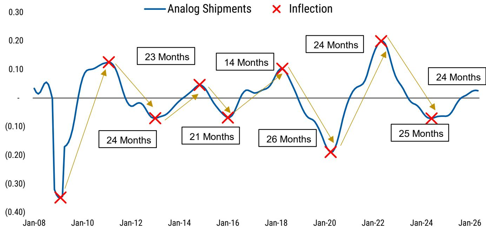  
Source: AlphaWise, SIA, MS.

Exhibit 5: MCU cycle duration has been more variable, with pre-2020 cycle legs typically lasting \~22-27 months  
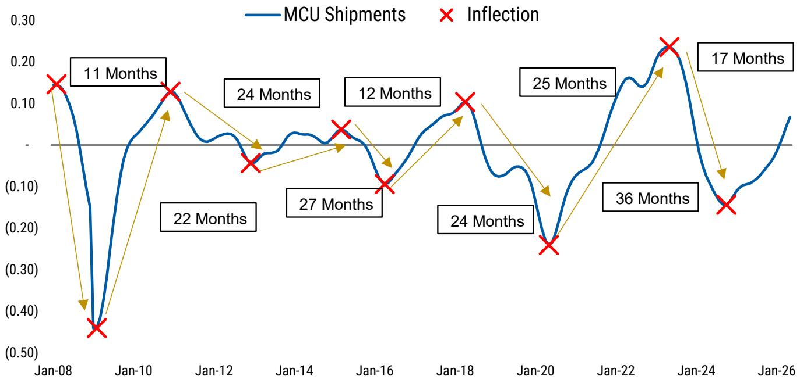  
Source: AlphaWise, SIA, MS.

Taken together, Analog, MCU and IGBT/Power are all now shipping modestly above demand. That suggests the initial catch-up phase has progressed, but not that the cycle is mature: the recovery remains slower than most prior cycles, broad industry revenues remain below prior peaks and pricing continues to hold. We view the 2Q moderation as a slower continuation of the upcycle, not a rollover.

## Disti Momentum - Moderating After the 1Q Jump

The moderation in Disti momentum is consistent with inventory-building intentions easing after the sharp 1Q increase. Because the Disti tracker is based on the spread between respondents building and depleting inventory, the 1Q jump moved ahead of the shipment recovery. Some deceleration is therefore natural as shipments catch up and inventory intentions become less aggressive. The tracker remains positive and well above the levels seen through most of the current recovery.

Exhibit 6: Analog Disti momentum moderated after the sharp 1Q increase...  
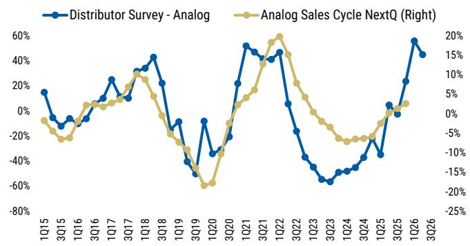  
Source: AlphaWise, SIA, MS

Exhibit 7: ...while MCU momentum also eased, though underlying trends remain positive  
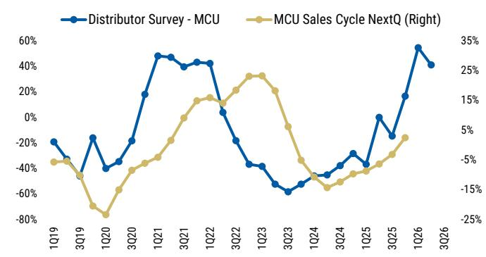  
Source: AlphaWise, SIA, MS

The return analysis adds an important distinction. Forward returns have historically moderated as the sales cycle moves further into overshipping, suggesting that broad cycle beta may become less powerful as the recovery advances. However, Analog and MCU remain only modestly above demand and broader industry revenues remain below prior peaks. We view this as an argument for greater stock selection, not a negative sector call.

Exhibit 8: Forward analog returns historically moderate as the sales cycle advances...  
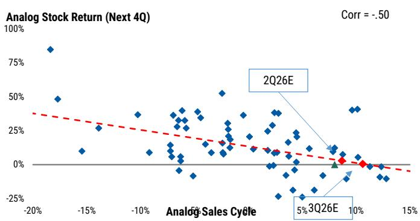  
Source: AlphaWise, SIA, MS

Exhibit 9: ...with a similar relationship for MCU  
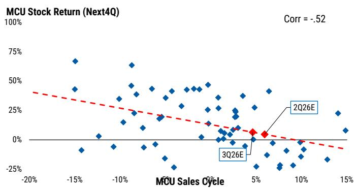  
Source: AlphaWise, SIA, MS

# Disti Survey 2Q'26: 1Q Strength Broadly Holds as Momentum Moderates

The 1Q step-up is broadly holding. SepQ demand expectations remain healthy after accounting for seasonality, pricing remains firm and inventory-building intentions are normalizing without renewed inventory digestion. Industrial remains constructive, Auto is more mixed and supply tightness remains selective.

## AlphaWise Analysis: Healthy & Holding Up

Our 2Q26 Distributor Survey points to healthy SepQ demand across Analog/MCU. Analog sequential growth expectations increased to 75% from 71%, while MCU moderated to 54% from 64%, with no respondents expecting a decline in either product line. Given typically stronger SepQ seasonality, the more useful signal is that 95% of respondents expect demand to be in-line with or above seasonal levels. Above-seasonal expectations eased to 50% for Analog and 46% for MCU from the very strong 1Q readings, but remain elevated.

The broader scorecard tells a similar story. Analog demand and pricing remain the strongest signals, Industrial held up and inventory-building intentions eased without renewed inventory digestion. Supply signals remain selective, with pockets of tightening around MCU/power and AI/data-center applications rather than a broad shortage cycle.

Exhibit 10: 2Q26 Disti Survey Scorecard: Constructive; 1Q Strength Broadly Holds

<table><tr><td colspan="5">2Q26 Disti Survey: Healthy &amp; Holding Up</td></tr><tr><td>Section</td><td>Signal</td><td>Q/Q Trend | Current Reading</td><td colspan="2">Survey Quotes</td></tr><tr><td>Growth Expectations</td><td>HEALTHY, PROTECTED DOWNSIDE</td><td>Growth: 75% q/q (+4pp); 96th %ile rankAnalog ↑ Seasonal: 95% ≥ seasonal; 90th %ile rankMCU ↓ Growth: 54% q/q (-10pp); 76th %ile rankPower (new) Seasonal: 95% ≥ seasonal; 92nd %ile rankDemand: 63% higher</td><td colspan="2">Analog: “Higher demand...driven by AI, Datacenter, and Aerospace.”MCU: “MCU constrained but demand still strong...”Power: “MCU, power anything going into AI servers.”</td></tr><tr><td>End Markets</td><td>SELECTIVE UPSIDE</td><td>AI/DC (New) 63% higher demandIndustrial → 40% net positive (+2pp); 93rd %ile rankAuto ↓ 13% net positive (-11pp); 46th %ile rank</td><td colspan="2">AI/DC: “Strong AI demand...affecting surrounding components.”Industrial: “Data center, industrial connectors.”Auto: “Industrial, data center, auto markets.”</td></tr><tr><td>Inventory/ Channel</td><td>→ NORMALIZING</td><td>Inventory ↓ 50% build (-21pp); 80th %ile rankDouble orders ↑ 38% (+11pp)</td><td colspan="2">Restocking: “Customers buying additional units due to supply fears.” behaviors: “Front loading demand...pressure to the expediting activities.”</td></tr><tr><td>Supply&amp; Pricing</td><td>→ FIRM PRICING MIXED SUPPLY</td><td>Analog pricing → 63% stronger (-2pp); 89th %ile rankMCU pricing → 59% stronger (+1pp)Constraints → 68% constrained (flat); 53rd %ile rankLead times ↓ 53% rising (-12pp)</td><td colspan="2">Analog: “All pricing is going up.”MCU: “All vendors are increasing pricing.”Power: “AI boost...pushing lead times and prices up.”</td></tr></table>

Source: AlphaWise, SIA, MS.

Exhibit 11: Disti results point to positive sequential growth for the SepQ...

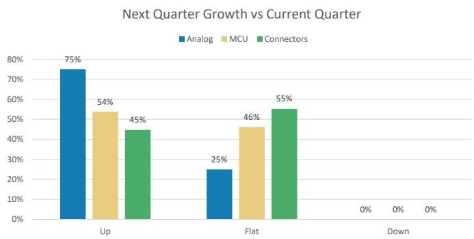  
Source: AlphaWise, SIA, MS  
Exhibit 12: ...while seasonally adjusted expectations remain healthy across Analog/MCU.

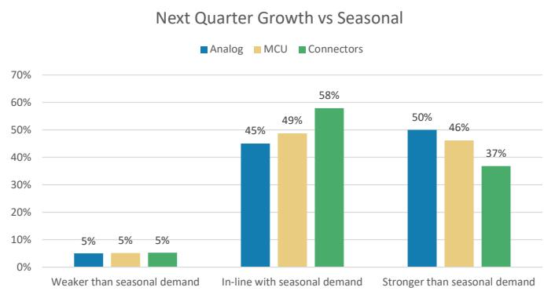  
Source: AlphaWise, SIA, MS

## 1) Industrial Demand Holds Up; Auto Remains Mixed

Industrial remains the clearest area of strength outside data center. Stronger-than-seasonal expectations remained \~flat q/q at 47%, while the latest Multi-Industry Distributor Survey also improved, with better-than-expected results rising to 36% from 31% and FY26 volume expectations increasing to 2.8% from 2.3%. Company commentary continues to characterize the recovery as underlying demand rather than inventory build.

Auto is less clean. Weaker-than-seasonal responses increased to 15% from 6%, even as company commentary suggests inventory digestion is largely complete and suppliers are shipping closer to natural demand. The contrast is that Industrial is already showing a broader demand recovery, while Auto has not yet entered a broad replenishment cycle. We remain constructive on Industrial and selective in Auto.

Exhibit 13: Multi-Industry distributors continued to report better-than-expected results in 2Q26...  
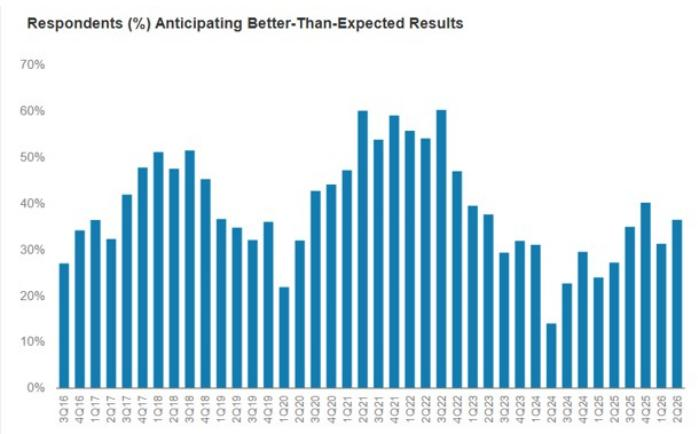  
Source: AlphaWise, MS

Exhibit 14: ...while FY26 volume expectations increased  
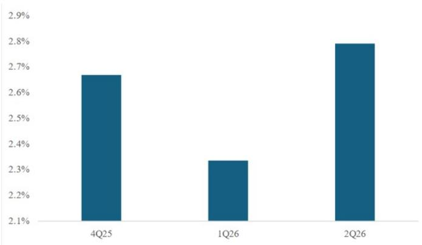  
Source: AlphaWise, MS

Exhibit 15: Industrial growth has accelerated sharply...  
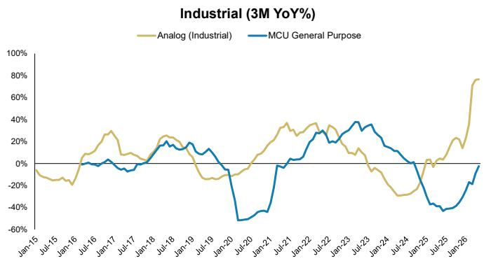  
Source: SIA, MS

Exhibit 16: ...while Auto growth remained more mixed  
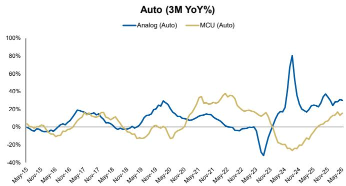  
Source: SIA, MS

Exhibit 17: The industry remains below prior peaks, though Industrial improved sequentially...  
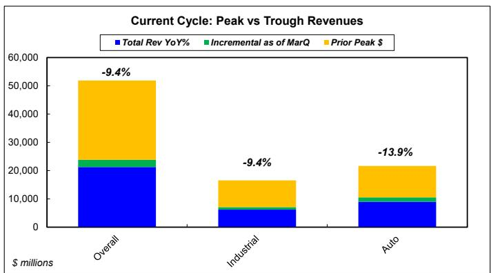  
Note: As of 1Q26 earnings. Source: Company data, VisibleAlpha, MS

Exhibit 18: ....with broadly improving PMIs providing further support  
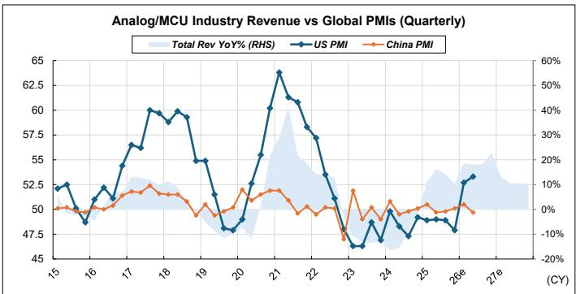  
Note: Estimates are consensus. Source: Company data, VisibleAlpha, MS

## 2) Inventory Builds Moderate; Broad Restocking Still Absent

Inventory-building intentions moderated after the sharp 1Q increase. Overall builders declined to 50% from 71%, while depletion increased to 30% from 18%. However, builds greater than 5% remained \~flat for Analog and MCU, suggesting less aggressive inventory accumulation rather than a renewed correction.

Distributor inventory declined for a fourth consecutive quarter and producer builds remained below seasonality, while customer DOI increased \~in-line with normal seasonality. Absolute inventory remains elevated, but the data do not indicate that broad inventory digestion has restarted. We continue to see selective replenishment and channel discipline rather than a broad 2H restocking cycle.

Exhibit 19: Analog/MCU inventory remains elevated, although DOI momentum has moderated since 2Q23...  
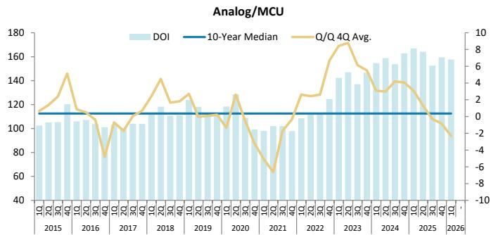  
Source: FactSet, MS

Exhibit 20: ...while overall semi company DOI momentum has been increasing...  
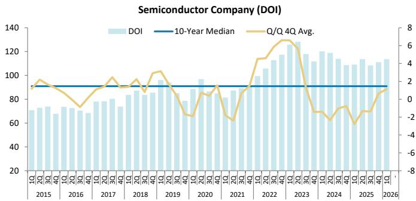  
Source: FactSet, MS

Exhibit 21: ...and distributor inventory has declined for four consecutive quarters...  
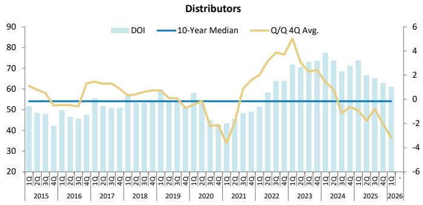  
Source: FactSet, MS

Exhibit 22: ...while customer DOI increased, restocking \~in-line with 1Q seasonality.  
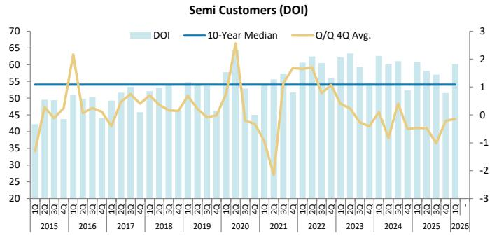  
Source: FactSet, MS

## 3) Pricing Holds; Tightness Remains Selective

Pricing remains the strongest carryover from the 1Q survey. Stronger-than-usual Analog pricing held at 63% versus 65% in 1Q, while stronger MCU pricing was 59% versus 58%. No respondents reported weaker pricing. That matters because the moderation in Disti momentum has not been accompanied by the pricing deterioration that would make the deceleration more concerning.

Supply signals were more mixed. Overall constraints remained at 68% and respondents reporting rising lead times declined to 53% from 65%. At the same time, Analog expedites increased, MCU constraints rose to 44% from 39% and MCU double ordering increased. Selected power lead times also tightened around AI/data-center demand. We see firm pricing and pockets of tightness, not a broad shortage cycle.

Exhibit 23 Analog unit momentum is improving as ASPs stabilize...  
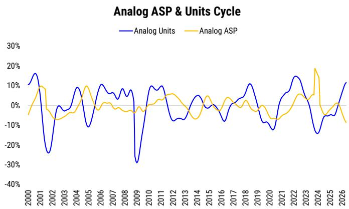  
Source: AlphaWise, SIA, MS
Exhibit 25 ...while IGBT units continue to recover as ASPs inflect...

Exhibit 24 ...with MCU units recovering and ASP pressure easing...  
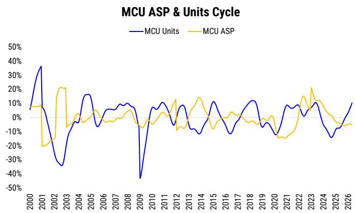  
Source: AlphaWise, SIA, MS
Exhibit 26 ...and power Analog unit momentum remains strong despite softer ASPs

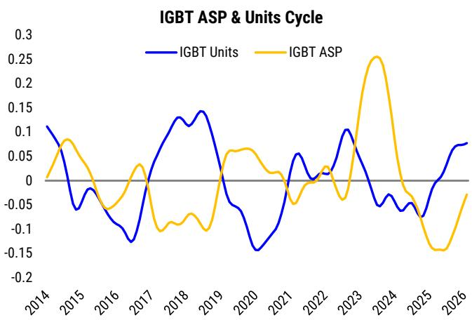  
Source: AlphaWise, SIA, MS.

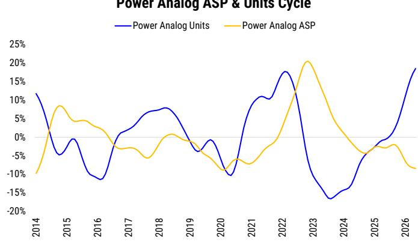  
Source: SIA, MS.

## Raising Estimates for TXN

We believe the upcoming JunQ will be a different story than last year. Recall that JunQ 2025 appeared to carry similar tailwinds, with the broader analog complex speaking to clearly positive demand signals intra-quarter - only for the momentum to prove short-lived and for TXN to miss expectations. What we see now is different in character - yes, there is some sequential easing at the margin, but the group remains \~10% below historical peak levels overall, with Industrial similarly \~10% below peak and Auto holding at \~14% below peak. Data center provides additional support, with TXN benefiting from broad content across power mgmt, signal chain, clocking, sensing, protection and control used across compute, networking and rack power/cooling. We view this as additive to the Industrial recovery, rather than the sole reason for the estimate increase.

The m/m unevenness is not a new development. As the SIA data has consistently shown, m/m oscillations across analog/MCU have been highly uneven throughout this recovery, and we do not interpret the current normalization as an overall cooling of demand. What is new and notable is the breadth of the Industrial recovery - 1Q26 marked the first quarter where the broad market (including traditional factory automation, medical, and building automation) began to wake up alongside the more defensive verticals like A&D and energy that had been carrying the early recovery. For TI specifically, Industrial grew across all sectors and all geographies sequentially last quarter - a qualitatively different signal than what we saw in 1H25.

Why are we not raising estimates elsewhere? TXN is the first upcoming print and provides the earliest test of whether the survey's Analog/Industrial strength, data center momentum and firm pricing are translating into revenue and gross margin. The read-through for the rest of the group remains constructive but less immediate: Auto remains mixed, power tightness is selective and most MCHP pricing actions do not take effect until September, with the P&L impact weighted toward 4Q26. We prefer to use TXN's results and subsequent company commentary to confirm the breadth and durability of these trends before changing the remaining models.

Changes to our estimates: We raise our JunQ/SepQ revenue growth estimates by 70bps/190bps to 9.1%/8.4% q/q, respectively, versus normal seasonality of \~3%/\~7%. CY26 revenue/GPM/EPS move from \$21.0bn/60.1%/\$7.82 to \$21.3bn/59.6%/\$7.90. Our CY27 estimates move from \$22.3bn/60.7%/\$8.50 to \$22.8bn/60.9%/\$8.86. Our PT to moves up to \$230 from \$221, based on 26x CY27E EPS of \$8.86. We are 1% above/3% below Street on revenue and 2% above/2% below Street on EPS for CY26/CY27, respectively.

Exhibit 27: Most broad analog names remain below prior peaks  
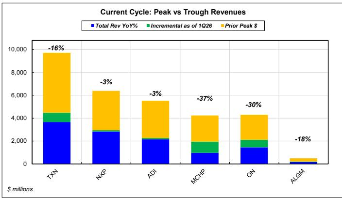  
Source: Company Data, MS.

Exhibit 28: We raise our JunQ/SepQ estimates for TXN  
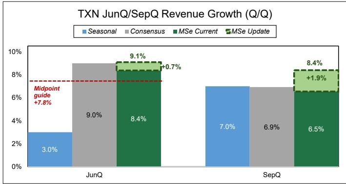  
Source: MS Estimates, VisibleAlpha, Company Data.

# 2Q26 Results – Key Charts & Takeaways

# Main takeaway: Strong JunQ prints, with healthy SepQ expectations across Analog/MCU

Exhibit 29: Analog growth expectations increased from 1Q...  
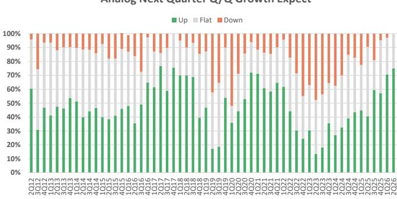  
Source: AlphaWise, MS  
Exhibit 30: ...while MCU growth expectations eased marginally, though also remain healthy

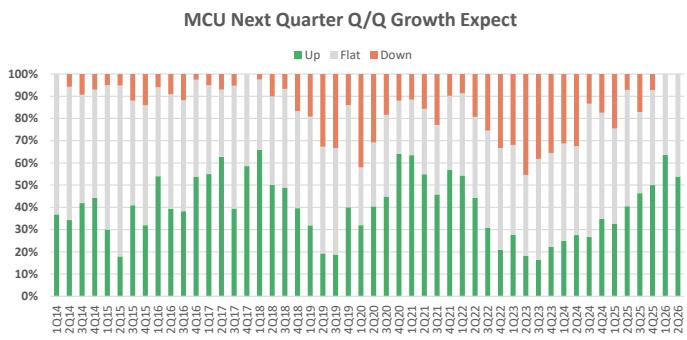  
Source: AlphaWise, MS

## 1) Industrial Holds Up; Auto Remains Mixed

Industrial momentum held up, with stronger-than-seasonal expectations remaining \~flat q/q. The latest Multi-Industry survey was also supportive, while company commentary continues to point to underlying demand rather than inventory build. Auto remains mixed, with weaker-than-seasonal expectations increasing even as inventory digestion appears largely complete.

Exhibit 31: Stronger-than-seasonal Industrial expectations remained \~flat q/q

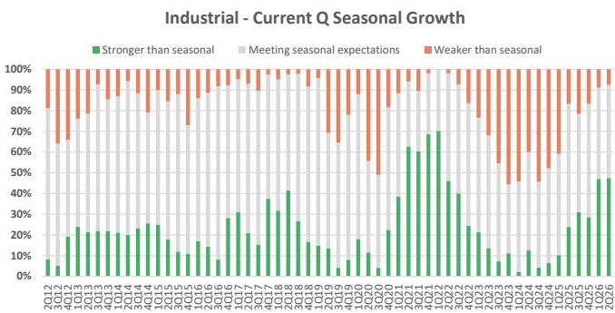  
Source: AlphaWise, MS  
Exhibit 32: ...while weaker-than-seasonal Auto expectations increased to 15% from 6%

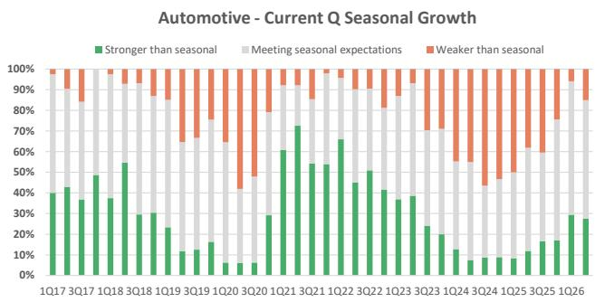  
Source: AlphaWise, MS

## 2) Inventory Builds Moderate After the 1Q Jump

Overall inventory-building intentions declined to 50% from 71%, while depletion increased to 30% from 18%. However, builds greater than 5% remained \~flat for Analog and MCU. Combined with distributor inventory declines and below-seasonal producer builds, the data point to continued inventory discipline despite elevated absolute levels, rather than broad restocking or renewed digestion.

Exhibit 33: Those looking to deplete inventory increased from 18% in the MarQ to 30% in the JunQ...  
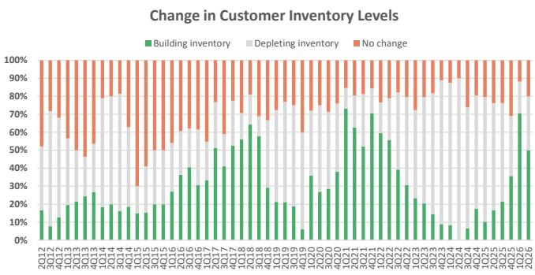  
Source: AlphaWise, MS

Exhibit 34: ... expectations for increasing supplier lead times decreased from 65% to 53%...  
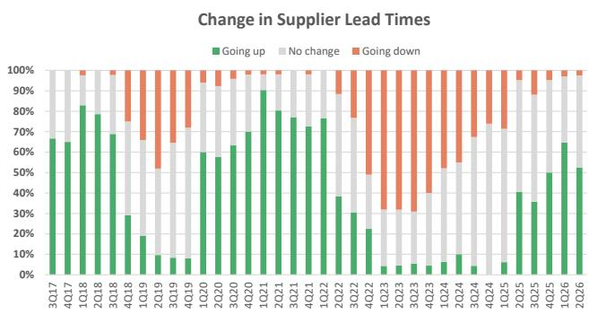  
Source: AlphaWise, MS

## 3) Pricing Holds; Tightness Remains Selective

Pricing remained firm, with 63% reporting stronger-than-usual Analog pricing and 59% reporting stronger MCU pricing, while weaker-pricing responses fell to zero. Overall constraints remained unchanged and lead-time momentum eased, but Analog expedites, MCU constraints and MCU double ordering increased. The data support firm pricing and selected areas of tightening, rather than a broad shortage call.

Exhibit 35: Stronger-than-usual Analog pricing held near the 1Q26 high (63% vs 65%)...  
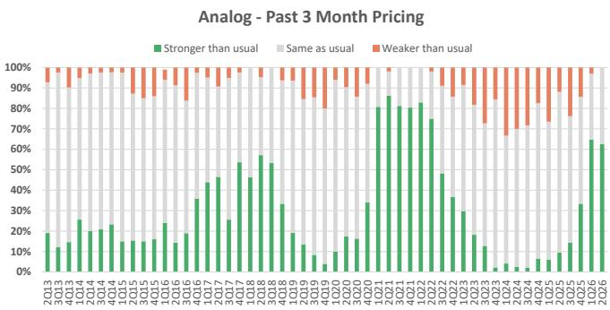

Exhibit 36: ...while stronger MCU pricing remained \~flat q/q...  
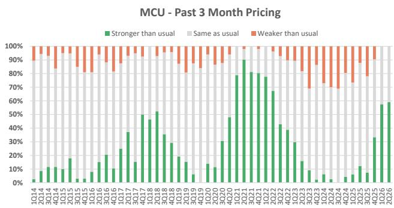  
Source: AlphaWise, MS  
Source: AlphaWise, MS

Exhibit 37: ...and the magnitude of pricing pressure remained elevated...  
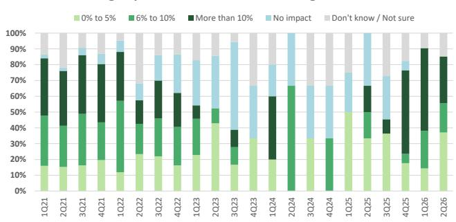  
Source: AlphaWise, MS

Exhibit 38: with overall supply constraints holding at 68%  
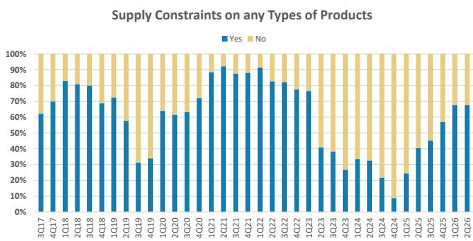  
Source: AlphaWise, MS

# 2Q'26 Disti Survey - Details

In conjunction with MS AlphaWise, we conducted our 55th quarterly survey among 40 semiconductor distributors during May - July 2026. We asked questions around sales volumes, growth expectations and inventory levels, among other topics.

## SepQ expectations remain healthy across Analog/MCU after accounting for seasonality

Exhibit 39: The majority of respondents anticipate results in-line with or stronger than seasonal...

Next Quarter Growth vs Seasonal  
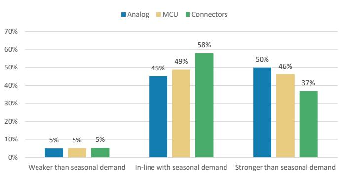  
Source: AlphaWise, MS

Exhibit 40: ...while sequential 3Q26 growth expectations remain healthy.

Next Quarter Growth vs Current Quarter  
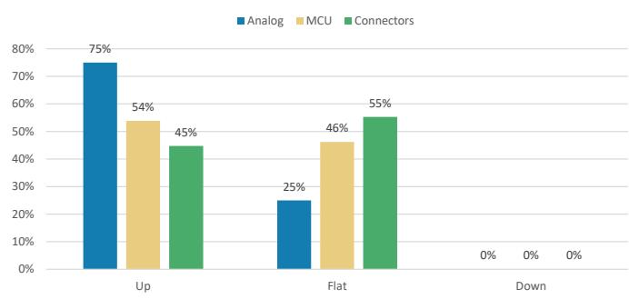  
Source: AlphaWise, MS

Exhibit 41: Respondents tracking at less than 5% y/y sales growth declined further to 20% from 24% last quarter

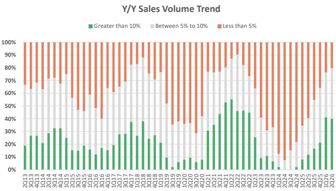  
Source: AlphaWise, MS

Exhibit 42: 3% of respondents expect a sequential decline for analog in June, down from 12% last quarter...

Analog Current Quarter Q/Q Growth Expect  
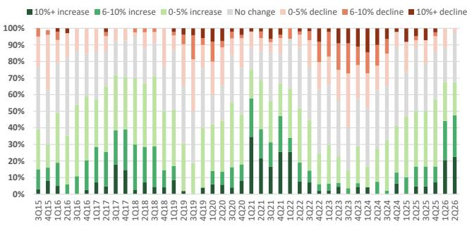  
Source: AlphaWise, MS  
Exhibit 44: No respondents expect a sequential decline for MCU...

MCU Current Quarter Q/Q Growth Expect  
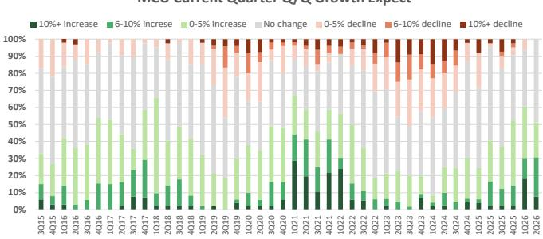  
Source: AlphaWise, MS

Exhibit 46: No respondents expect a sequential decline for connectors in June, down from 3% last quarter...

Connector Current Quarter Q/Q Growth Expect  
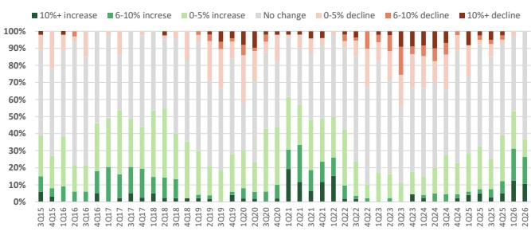  
Source: AlphaWise, MS

Exhibit 43: ...while none expect a sequential decline in the September quarter, down from 3% going into the June quarter

Analog Next Quarter Q/Q Growth Expect  
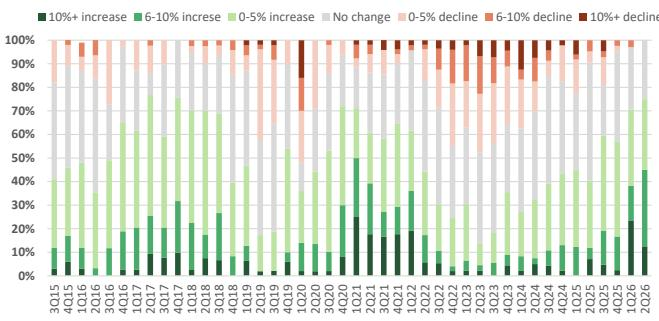  
Source: AlphaWise, MS  
Exhibit 45: ...while 54% of respondents expect sequential growth in the September quarter, down from 64% going into the June quarter

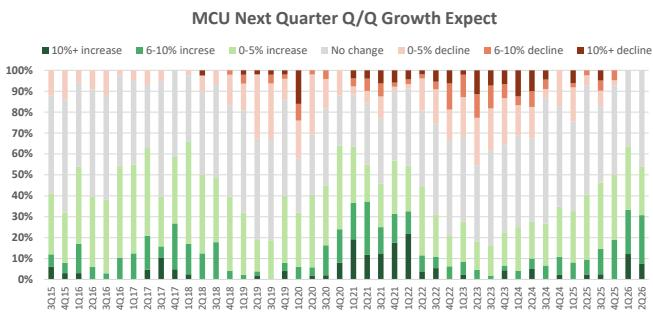  
Source: AlphaWise, MS  
Exhibit 47: ...while 45% of respondents expect sequential growth in the September quarter, down from 56% going into the June quarter

Connector Next Quarter Q/Q Growth Expect  
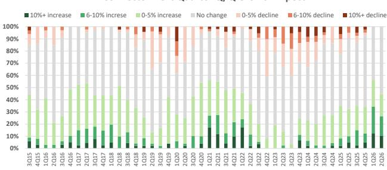  
Source: AlphaWise, MS

# Above-seasonal Analog/MCU expectations eased from 1Q, but remain elevated

Exhibit 48: 50% of respondents expect a stronger-than-seasonal September quarter for analog, down from 59% last quarter...  
Analog - Next Quarter Growth vs Expectation  
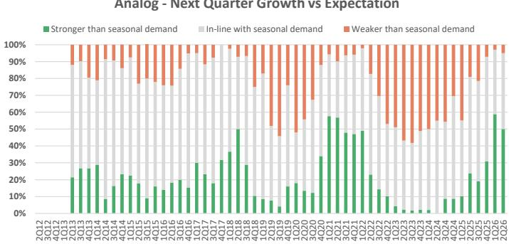  
Source: AlphaWise, MS

Exhibit 49: ... while 46% of respondents expect a stronger-than-seasonal September quarter for MCU, down from 58% last quarter...

MCU - Next Quarter Growth vs Expectation

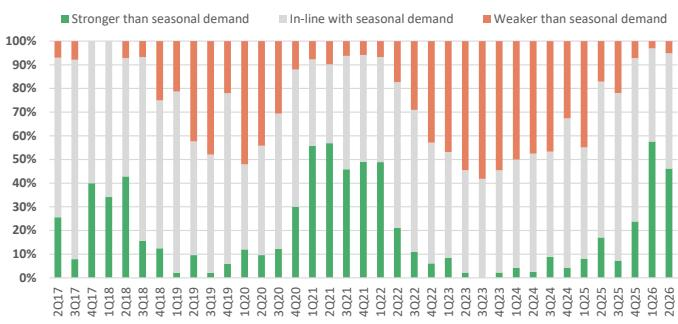  
Source: AlphaWise, MS  
Exhibit 50: ... and 37% of respondents expect a stronger-than-seasonal September quarter for connectors, up from 31% last quarter  
Connector - Next Quarter Growth vs Expectation

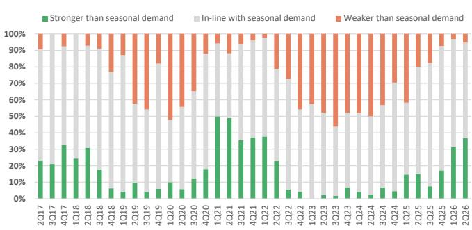  
Source: AlphaWise, MS

## End-market trends were mixed, with Industrial holding and Auto softening

Exhibit 51: 47% expect stronger-than-seasonal industrial sales, \~flat from last quarter  
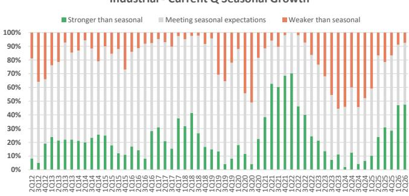  
Source: AlphaWise, MS

Exhibit 52:
