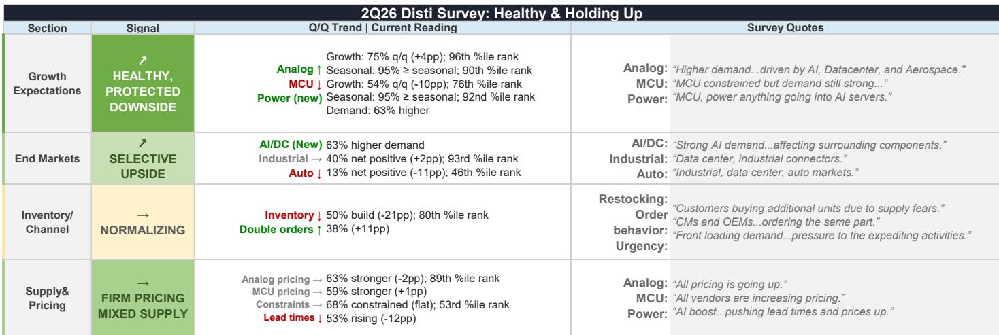

# MS：半导体分销商调查-2Q26需求维持健康

MS最新发布的2Q26北美半导体分销商调查显示，一季度出现的周期拐点信号正在延续，但改善速度有所节奏变化。这份基于AlphaWise框架的调查覆盖了模拟芯片、MCU和功率器件三大产品线，核心结论是：需求仍在扩张，但节奏从一季度的急剧加速转为更温和的持续。

调查中没有任何受访者预期模拟或MCU会出现环比下降，95%的受访者认为三季度需求将达到或超过季节性水平。工业市场维持正面，汽车则表现分化。定价信号保持强劲，没有受访者报告价格走弱。

> **KC观察：** 这份调查最有价值的信息不是“复苏还在继续”，而是“复苏的形态变了”。一季度那种急剧加速不可持续，二季度更温和的节奏反而让周期有更长的运行空间。报告特别强调，当前是需求驱动的复苏，而非大规模补库存，这意味着公司选择比押注整个板块更重要。

## 1. 模拟与MCU均已进入超需求出货阶段

截至2026年5月，模拟芯片出货量已超过终端需求2.6%，较2024年6月的底部（低于需求7.1%）累计改善9.7个百分点。MCU从更晚的底部反弹，目前超需求出货6.8%。功率器件也从2月的低于需求约1%转为5月的超需求3%。

但复苏速度明显慢于历史周期。模拟芯片在底部后的23个月内改善9.7个百分点，而2013年和2016年同期分别改善11.5和13.7个百分点。2020年疫情后的复苏则快得多。报告认为，较慢的复苏节奏意味着周期仍有进一步运行的空间，而非接近尾声。

## 2. 分销商动量在一季度跳升后自然回落

分销商动量指标——基于增加库存与减少库存的受访者比例差——在一季度大幅跳升后出现回落。模拟芯片动量从极高水平下降，MCU动量同样节奏变化。但报告强调，这并非周期逆转，而是出货量追赶库存意愿后的正常化。

历史数据显示，随着销售周期进入超需求出货阶段，远期回报通常会趋于温和。但当前模拟和MCU仅小幅超需求出货，行业整体收入仍低于此前峰值。报告认为，这意味着板块整体贝塔效应减弱，但公司选择空间反而更大。

## 3. 工业需求持续改善，汽车仍待补库周期启动

工业是除数据中心外最清晰的增长领域。超季节性预期环比基本持平于47%，多行业分销商调查中“好于预期”的比例从31%升至36%，2026财年销量增长预期从2.3%上调至2.8%。公司评论普遍将这一改善归因于真实需求而非库存积累。

汽车则表现分化。弱于季节性的回复比例从6%升至15%，尽管公司评论显示库存消化已基本完成，供应商出货接近真实需求。报告认为，工业已进入更广泛的需求复苏，而汽车尚未启动大规模补库周期。

## 4. 定价保持强劲，供应紧张仍为局部现象

定价是本次调查中较强的延续信号。模拟芯片定价强于正常的比例维持在63%，MCU为59%，均未出现走弱迹象。报告指出，分销商动量的节奏变化并未伴随定价出现变化，这使得节奏变化不那么令人担忧。

供应信号则更为分化。整体供应受限比例维持在68%，但报告交期延长的比例从65%降至53%。MCU受限比例从39%升至44%，功率器件在AI/数据中心需求拉动下交期有所延长。报告将当前状态定性为“定价坚挺、局部紧张”，而非广泛的短缺周期。

For informational purposes only. Portions may be generated,translated,summarized,or edited with AI assistance based on source materials and may contain omissions or errors. Please verify independently. This is not investment,legal,tax,accounting,or other professional advice.

For informational purposes only. Portions may be generated,translated,summarized,or edited with AI assistance based on source materials and may contain omissions or errors. Please verify independently. This is not investment,legal,tax,accounting,or other professional advice.

